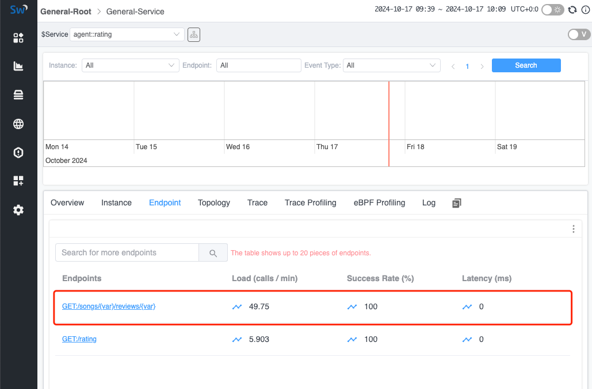

## 背景

在现代应用中，服务通常通过 RESTFul HTTP URI 提供。使用 RESTFul HTTP URI 作为唯一的资源标识符，不仅具备良好的可读性，还能让客户端和服务器更容易理解请求。然而，在可观测性领域，这种方式也带来了一些挑战：

1. **大量的端点（HTTP URI）**：浏览所有对外提供的端点变得更加困难，因此很难识别出存在问题的端点。
2. **指标收集困难**：尤其难以对类似的端点进行归类并生成可观测性指标。

现有解决方案通常采用以下应用级别的方式来解决此问题：

1. **代理检测**：在某些框架中，通常会声明规则来处理 RESTFul 请求。例如，在 Java 的 Spring Web 中可以使用 `@GET` 等注解，然后可以通过 Java Agent 将其与当前请求关联起来。
2. **OpenAPI**：应用可以关联预定义文件，使可观测性系统知晓可能使用的 URI。

这两种解决方案都与应用设置紧密耦合，这对于未知应用或者无法监控代理的应用来说是一个局限。因此，我们需要考虑是否有一种更通用的解决方案来识别 URI，并合并来自类似 URI 生成的指标，以便更好地展示数据。

## R3

R3（RESTFul 模式识别）是一个高性能的 RESTFul URI 识别工具，其灵感来自 [Drain3](https://github.com/logpai/Drain3)。它可以作为独立应用部署在可观测性服务器上，并与 SkyWalking OAP 进行通信。

R3 可以通过 gRPC 协议接收 URI 列表，并将类似的 URI 聚合为特定格式。聚合后的（格式化）URI 列表也可以通过 gRPC 协议进行查询。

### 数据交互流程


1. **OAP 接收并缓存未格式化的 URI 列表**：OAP 通过不同协议接收可观测性数据，并识别出所有未格式化的 URI。然后将这些 URI 按照所属服务暂时存储在列表中。
2. **OAP 将待格式化的 URI 发送给 R3**：OAP 定期将需要格式化的 URI 批量发送到 R3 服务。
3. **R3 接收并解析 URI 列表**：R3 异步分析接收到的 URI 相似性，并将结果存储（持久化）在本地磁盘中，以便在重启后进行恢复。
4. **OAP 查询 R3 中的格式化 URI 列表**：OAP 定期查询 R3 中检测到的格式化 URI，并将结果保存在内存中。
5. **OAP 格式化 URI**：当 OAP 接收到新的可观测性数据时，会将 URI 与从 R3 获取的格式化 URI 进行匹配。如果匹配成功，后续的指标计算将使用格式化后的 URI。

### 场景

在 R3 中，主要解决以下场景。对于识别为重复的 URI，R3 将用 `{var}` 替换变量部分以标准化 URI。

#### ID 匹配

在 RESTFul API 中，常见做法是将各种 ID 包含在 URI 路径中，这导致了大量唯一的 URI 端点。例如，以下路径将被 R3 聚合为标准化格式 `/api/users/{var}`。

* /api/users/cbf11b02ea464447b507e8852c32190a
* /api/users/5e363a4a18b7464b8cbff1a7ee4c91ca
* /api/users/44cf77fc351f4c6c9c4f1448f2f12800
* /api/users/38d3be5f9bd44f7f98906ea049694511
* /api/users/5ad14302e7924f4aa1d60e58d65b3dd2

#### 词语检测

在 RESTFul URI 中，实体的操作通常通过 HTTP 方法指定，但有时还需要在路径中添加特定名词。为此，R3 实现了词语解析：当 R3 检测到路径中的特定词语时，将不会格式化该部分。例如，以下 URI 将不会被视为相似，因此不会被合并：

* /api/sale
* /api/product_sale
* /api/ProductSale

#### 样本不足

为防止由于样本不足而导致错误判断，R3 允许在[配置文件](https://github.com/SkyAPM/R3/blob/main/servers/simple/uri_drain.ini)中配置[最小 URI 合并计数](https://github.com/SkyAPM/R3/blob/main/servers/simple/uri_drain.ini#L38)参数。

例如，当阈值为 `3` 时，以下 URI 将保持原样，不会被参数化。

* /api/fetch1
* /api/fetch2

但是以下 URI 将被参数化为 `/api/{var}`，因为样本数大于阈值。

* /api/fetch1
* /api/fetch2
* /api/fetch3

#### 版本 API

在实际场景中，常会遇到包含多个版本的 URI。R3 通过确保指定路径中包含 `v\\d+` 参数（表示版本信息）来解决这个问题，该部分将不会被参数化。例如，以下 URI 将分别解析为 `/test/v1/{var}` 和 `/test/v999/{var}`。

* /test/v1/cbf11b02ea464447b507e8852c32190a
* /test/v1/5e363a4a18b7464b8cbff1a7ee4c91ca
* /test/v1/38d3be5f9bd44f7f98906ea049694511
* /test/v999/1
* /test/v999/2
* /test/v999/3

## 演示

接下来我们快速演示如何使用 R3 格式化观察到的端点，帮助你更具体地理解它的功能。

### 部署 SkyWalking Showcase

SkyWalking Showcase 包含一整套示例服务，可以通过 SkyWalking 进行监控。更多信息请查看[官方文档](https://skywalking.apache.org/docs/skywalking-showcase/next/readme/)。

在此演示中，我们仅部署服务、最新发布的 SkyWalking OAP、R3 服务和 UI。

```shell
export FEATURE_FLAGS=java-agent-injector,single-node,elasticsearch,r3
make deploy.kubernetes
```

部署完成后，请运行以下脚本打开 SkyWalking UI：<http://localhost:8080/>。

```shell
kubectl port-forward svc/ui 8080:8080 --namespace default
```

### 触发 RESTFul 请求

在 R3 中，默认启动了定时任务以定期生成 RESTFul 流量。不过，你也可以使用以下命令手动触发此过程：

```shell
kubectl exec -n sample-services $(kubectl get pod -n sample-services --selector=app=gateway -o jsonpath='{.items[0].metadata.name}') -- /bin/bash -c 'for i in $(seq 1 200); do curl http://rating/songs/$i/reviews/$((i+1)); sleep 1; done'
```

在上述命令中，R3 将自动定位网关节点，并以 RESTFul 格式向该节点内的 rating 服务发送请求。此操作允许 R3 生成并测试模拟实际 RESTFul 请求的流量模式。

### 查看格式化 URI

一旦触发 RESTFul 请求，你可以在 UI 中查看聚合后的端点。

**注意**：由于格式化端点是异步生成的，因此一些较早的请求可能尚未被格式化。你可能需要等待一段时间，UI 才会仅显示格式化后的地址。



## 结论

在本文中，我们详细讨论了 SkyWalking 如何利用 R3 服务来格式化 RESTFul URI，并在接收后聚合相关的指标。目前，它适用于大多数 RESTFul 场景，如果需要支持更多情况，我们可以根据需求进一步扩展。