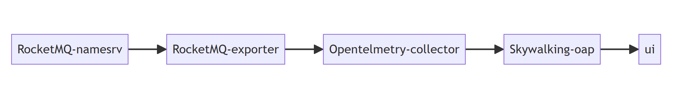
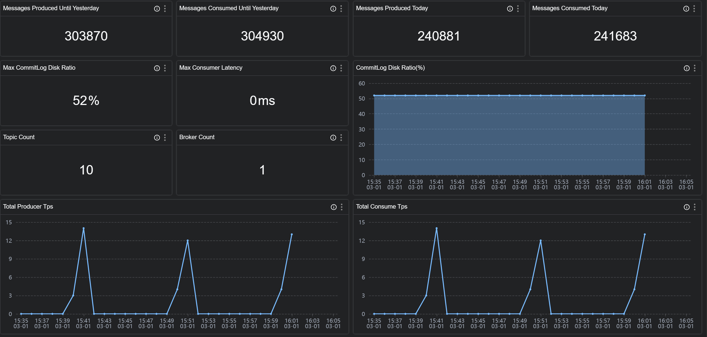
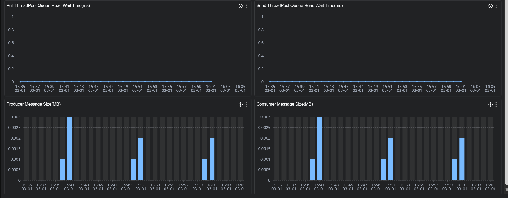
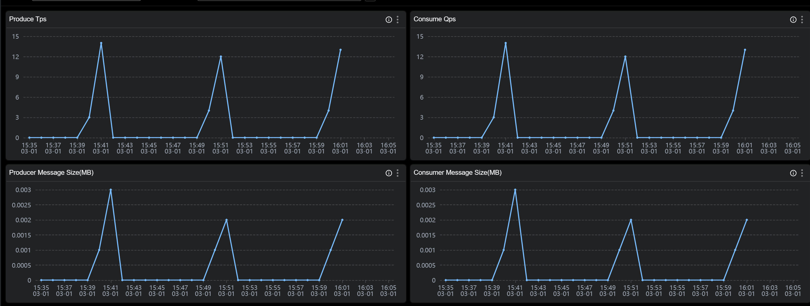
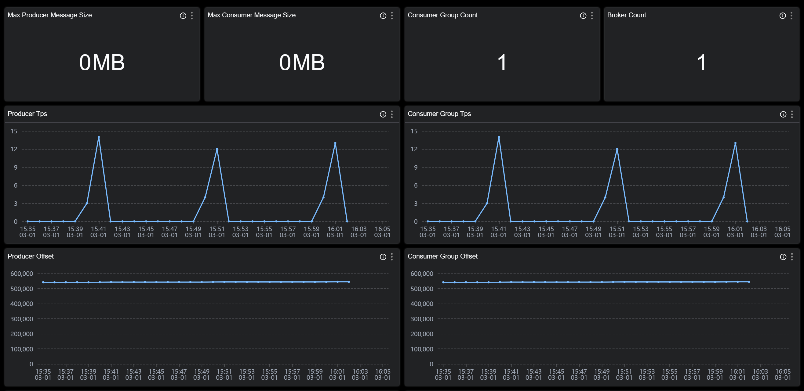
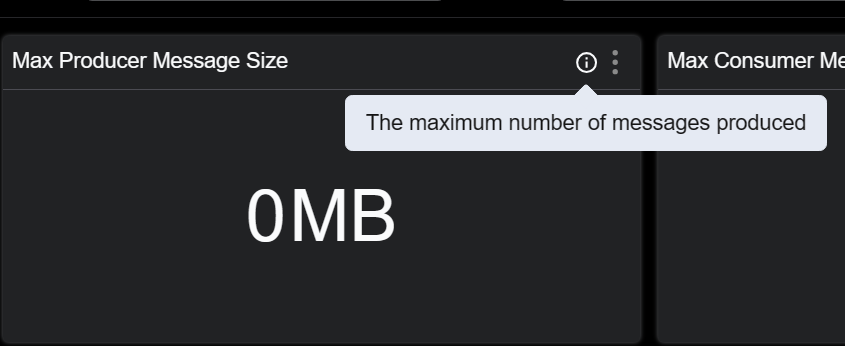
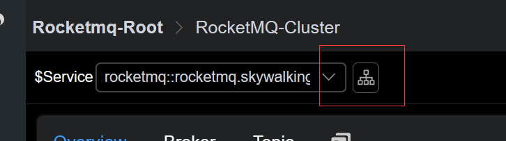
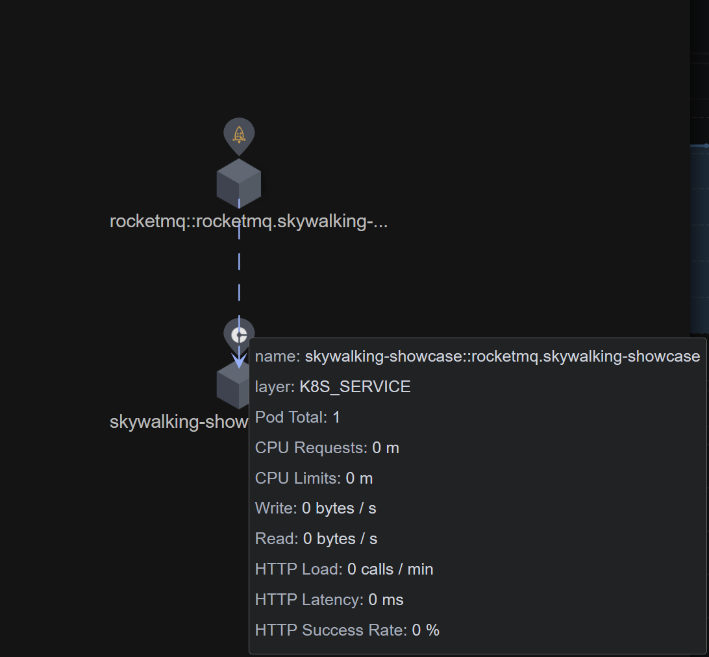

# 背景介绍
Apache RocketMQ 是一个开源的低延迟、高并发、高可用、高可靠的分布式消息中间件, 从SkyWalking OAP 10.0 版本开始， 新增了 对 RocketMQ Server的监控面板。本文将展示并介绍如何使用 Skywalking来监控RocketMQ

# 部署

## 流程
通过`RocketMQ`官方提供的`RocketMQ exporter`来采集`RocketMQ Server`数据,再通过`opentelmetry-collector`来拉取`RocketMQ exporter`并传输到`skywalking oap`服务来处理

DataFlow:


## 准备

1. [Skywalking oap服务，v10.0 +](https://github.com/apache/skywalking)
2. [RocketMQ v4.3.2 +](https://github.com/apache/rocketmq)
3. [RocketMQ exporter v0.0.2+](https://github.com/apache/rocketmq-exporter)
4. [Opentelmetry-collector v0.87+](https://github.com/open-telemetry/opentelemetry-collector-contrib)

## 启动顺序
1. 启动 `RocketMQ namesrv` 和 `broker`
2. 启动 `skywalking oap` 和 `ui`
3. 启动 `RocketMQ exporter`
4. 启动 `opentelmetry-collector`
   
具体如何启动和配置请参考以上链接中官方教程

需要注意下的是 `opentelmetry-collector` 的配置文件

`job_name: "rocketmq-monitoring"` 请不要修改,否则 skywalking 不会处理这部分数据.

`rocketmq-exporter` 替换成RocketMQ exporter 的地址.

`replacement: rocketmq-cluster` 如果想要使用下文介绍的服务分层功能，请自行定义为其他服务层级相匹配的名称。

`oap` 为 `skywalking oap` 地址，请自行替换

```
receivers:
  prometheus:
    config:
      scrape_configs:
        - job_name: "rocketmq-monitoring"
          scrape_interval: 30s
          static_configs:
            - targets: ['rocketmq-exporter:5557']
          relabel_configs:
            - source_labels: [ ]
              target_label: cluster
              replacement: rocketmq-cluster

exporters:
  otlp:
    endpoint: oap:11800
    tls:
      insecure: true

processors:
  batch:
service:
  pipelines:
    metrics:
      receivers:
        - prometheus
      processors:
        - batch
      exporters:
        - otlp

```


# 监控指标
指标分为 三个维度, cluster,broker,topic
## cluster监控


cluster 主要是站在集群的角度来统计展示,比如 

`Messages Produced Today` 今日集群产生的消息数

`Max CommitLog Disk Ratio` 展示集群中磁盘使用率最高的broker

`Total Producer Tps` 集群生产者tps


## broker 监控

broker 主要是站在节点的角度来统计展示,比如 

`Produce Tps` 节点生产者tps

`Producer Message Size(MB)`节点生产消息大小

## topic 监控


topic 主要是站在主题的角度来统计展示,比如 

`Consumer Group Count` 消费该主题的消费者组个数

`Consumer Latency(s)` 消费者组的消费延时时间

`Backlogged Messages `消费者组消费消息堆积

注意 topic 维度是整个 topic 来聚合，并不是在一个 broker 上的 topic 聚合，在 dashboard 上你也可以看到 broker 跟 topic 是平级的。


各个指标的含义可以在图标的 tip 上找到解释


更多指标可以参考[文档](https://skywalking.apache.org/docs/main/next/en/setup/backend/backend-rocketmq-monitoring/#rocketmq-monitoring)


demo 已经在 [skywalking showcase](http://demo.skywalking.apache.org/dashboard/ROCKETMQ/Service/cm9ja2V0bXE6OnJvY2tldG1xLnNreXdhbGtpbmctc2hvd2Nhc2U=.1/RocketMQ-Cluster) 上线，可以在上面看到展示效果

# 服务分层
skywalking 10 新增了重要功能`Service Hierarchy`，接收来自多种层级的服务数据，比如 java agent 上报，k8s 监控数据以及 otel 的 监控数据。 根据设置规则如果发现这些服务名称符合匹配规则，则可以将这些不同层级的服务联系起来。

如下图所示：

skywalking 采集部署在 k8s 的 RocketMQ 服务端的k8s 数据，并接收来自 otel 的 RocketMQ 服务端监控数据，根据匹配规则这些服务具有相同的服务名称，则可以在 ui 上观察到它们的联系


