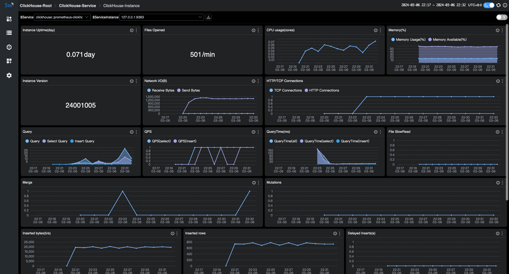

## 背景介绍

[ClickHouse](https://clickhouse.com/) 是一个开源的面向列的数据库管理系统，可以实时生成分析数据报告，因此被广泛用于在线分析处理（OLAP）。

[Apache SkyWalking](https://skywalking.apache.org/) 是一个开源的 APM 系统，为云原生架构中的分布式系统提供监控、跟踪和诊断能力。应用服务体系越来越多地将 Skywalking 作为服务或实例的基本监视组件。

ClickHouse 和 Skywalking 框架都是当下流行的服务组件，通过 Skywalking 监控您的 ClickHouse 数据库将是一个不错的选择。接下来，就来分享一下如何使用 Skywalking 监控 ClickHouse 数据库。

## 前提与配置

在开始接入监控之前，请先确认以下前提条件。

配置步骤:

1. 暴露 [Prometheus 端点](https://clickhouse.com/docs/en/operations/server-configuration-parameters/settings#prometheus)。
2. 通过 [OpenTelemetry](https://opentelemetry.io/) 拉取 ClickHouse 的指标数据。
3. 将指标数据发送到 Skywalking OAP server.

### 使用的前提

ClickHouse 的监控依赖于 ClickHouse 的内嵌 Prometheus 端点配置，配置从 v20.1.2.4 开始支持，因此之前的老版本将无法支持。

您可以检查 ClickHouse 服务的版本:

```sql
:) select version();

SELECT version()

Query id: 2d3773ca-c320-41f6-b2ac-7ebe37eddc58

┌─version()───┐
│ 24.2.1.2248 │
└─────────────┘
```

如果您的 ClickHouse 版本低于 v20.1.2.4，则需要依靠 [ClickHouse-exporter](https://github.com/ClickHouse/clickhouse_exporter) 获取数据。

### 暴露 Prometheus 端点

内嵌的 Prometheus 端点简化了数据采集流程，您只需要在 ClickHouse 的核心配置文件 config.xml 打开所需的配置即可。除了您原来的配置，您只需要参考如下修改 Prometheus 的配置。

`/etc/clickhouse-server/config.xml`:

```xml
<clickhouse> 
    ......
    <prometheus>
        <endpoint>/metrics</endpoint>
        <port>9363</port>
        <metrics>true</metrics>
        <events>true</events>
        <asynchronous_metrics>true</asynchronous_metrics>
        <errors>true</errors>
    </prometheus>
</clickhouse>
```

配置说明:

- endpoint – 通过 prometheus 服务器抓取指标的 HTTP 端点。从`/`开始。
- port – 端点的端口。
- metrics – 暴露 `system.metrics` 表中的指标。
- events – 暴露 `system.events` 表中的指标。
- asynchronous_metrics – 暴露 `system.asynchronous_metrics` 表中的当前指标值。
- errors - 按错误代码暴露自上次服务器重新启动以来发生的错误数。此信息也可以从 `system.errors` 中获得。

保存配置并重启 ClickHouse 服务。

端点数据包含1000多个指标，涵盖服务、网络、磁盘、MergeTree、错误等。想了解更多指标细节，在重启服务后，可以调用 `curl 127.0.0.1:9363/metrics` 看到具体指标的内容。

您还可以通过数据库表的数据与端点数据进行检查对比。

```sql
:) select * from system.metrics limit 10

SELECT *
FROM system.metrics
LIMIT 10

Query id: af677622-960e-4589-b2ca-0b6a40c443aa

┌─metric───────────────────────────────┬─value─┬─description─────────────────────────────────────────────────────────────────────┐
│ Query                                │     1 │ Number of executing queries                                                     │
│ Merge                                │     0 │ Number of executing background merges                                           │
│ Move                                 │     0 │ Number of currently executing moves                                             │
│ PartMutation                         │     0 │ Number of mutations (ALTER DELETE/UPDATE)                                       │
│ ReplicatedFetch                      │     0 │ Number of data parts being fetched from replica                                 │
│ ReplicatedSend                       │     0 │ Number of data parts being sent to replicas                                     │
│ ReplicatedChecks                     │     0 │ Number of data parts checking for consistency                                   │
│ BackgroundMergesAndMutationsPoolTask │     0 │ Number of active merges and mutations in an associated background pool          │
│ BackgroundMergesAndMutationsPoolSize │    64 │ Limit on number of active merges and mutations in an associated background pool │
│ BackgroundFetchesPoolTask            │     0 │ Number of active fetches in an associated background pool                       │
└──────────────────────────────────────┴───────┴─────────────────────────────────────────────────────────────────────────────────┘

:) select * from system.events limit 10;

SELECT *
FROM system.events
LIMIT 10

Query id: 32c618d0-037a-400a-92a4-59fde832e4e2

┌─event────────────────────────────┬──value─┬─description────────────────────────────────────────────────────────────────────────────────────────────────────────────────────────────────────────────────────────────────────────────────────────────────────────────────────────────────────────────────┐
│ Query                            │      7 │ Number of queries to be interpreted and potentially executed. Does not include queries that failed to parse or were rejected due to AST size limits, quota limits or limits on the number of simultaneously running queries. May include internal queries initiated by ClickHouse itself. Does not count subqueries. │
│ SelectQuery                      │      7 │ Same as Query, but only for SELECT queries.                                                                                                                                                                                                                │
│ InitialQuery                     │      7 │ Same as Query, but only counts initial queries (see is_initial_query).                                                                                                                                                                                     │
│ QueriesWithSubqueries            │     40 │ Count queries with all subqueries                                                                                                                                                                                                                          │
│ SelectQueriesWithSubqueries      │     40 │ Count SELECT queries with all subqueries                                                                                                                                                                                                                   │
│ QueryTimeMicroseconds            │ 202862 │ Total time of all queries.                                                                                                                                                                                                                                 │
│ SelectQueryTimeMicroseconds      │ 202862 │ Total time of SELECT queries.                                                                                                                                                                                                                              │
│ FileOpen                         │  40473 │ Number of files opened.                                                                                                                                                                                                                                    │
│ Seek                             │    100 │ Number of times the 'lseek' function was called.                                                                                                                                                                                                           │
│ ReadBufferFromFileDescriptorRead │  67995 │ Number of reads (read/pread) from a file descriptor. Does not include sockets.                                                                                                                                                                             │
└──────────────────────────────────┴────────┴────────────────────────────────────────────────────────────────────────────────────────────────────────────────────────────────────────────────────────────────────────────────────────────────────────────────────────────────────────────────────────────┘

```

### 启动 Opentelemetry-Collector

根据自身环境 [配置 OpenTelemetry](https://opentelemetry.io/docs/collector/quick-start/)。 您可参照下面的例子:

`otel-collector-config.yaml`:

```xml
receivers:
  prometheus:
    config:
     scrape_configs:
       - job_name: 'clickhouse-monitoring'
         scrape_interval: 15s
         static_configs:
           - targets: ['127.0.0.1:9363','127.0.0.1:9364','127.0.0.1:9365']
             labels:
               host_name: prometheus-clickhouse

processors:
  batch:
 
exporters:
  otlp:
    endpoint: 127.0.0.1:11800
    tls:
      insecure: true
service:
  pipelines:
    metrics:
      receivers:
      - prometheus
      processors:
      - batch
      exporters:
      - otlp
```

请着重关注:

- `job_name: 'clickhouse-monitoring'` 标记着来自 ClickHouse 的数据，如果自行修改，数据会被服务忽略。
- `host_name` 定义服务的名称。
- `endpoint` 指向您的 OAP 服务地址.
- ClickHouse、OpenTelemetry Collector 和 Skywalking OAP Server 之间的网络必须可访问。

如果进展顺利，几秒钟后刷新 Skywalking-ui 网页，您可以在数据库的菜单下看到 ClickHouse。

启动成功日志样例:

```log
2024-03-12T03:57:39.407Z	info	service@v0.93.0/telemetry.go:76	Setting up own telemetry...
2024-03-12T03:57:39.412Z	info	service@v0.93.0/telemetry.go:146	Serving metrics	{"address": ":8888", "level": "Basic"}
2024-03-12T03:57:39.416Z	info	service@v0.93.0/service.go:139	Starting otelcol...	{"Version": "0.93.0", "NumCPU": 4}
2024-03-12T03:57:39.416Z	info	extensions/extensions.go:34	Starting extensions...
2024-03-12T03:57:39.423Z	info	prometheusreceiver@v0.93.0/metrics_receiver.go:240	Starting discovery manager	{"kind": "receiver", "name": "prometheus", "data_type": "metrics"}
2024-03-12T03:57:59.431Z	info	prometheusreceiver@v0.93.0/metrics_receiver.go:231	Scrape job added	{"kind": "receiver", "name": "prometheus", "data_type": "metrics", "jobName": "clickhouse-monitoring"}
2024-03-12T03:57:59.431Z	info	service@v0.93.0/service.go:165	Everything is ready. Begin running and processing data.
2024-03-12T03:57:59.432Z	info	prometheusreceiver@v0.93.0/metrics_receiver.go:282	Starting scrape manager	{"kind": "receiver", "name": "prometheus", "data_type": "metrics"}
```

## ClickHouse 监控面板

### 关于面板

这个仪表盘包含服务仪表盘和实例仪表盘。

指标涵盖服务器、查询、网络、插入、副本、MergeTree、ZooKeeper 和内嵌 ClickHouse Keeper。

服务仪表盘主要展示整个集群相关的指标。


实例仪表盘主要展示单个实例相关的指标。



### 关于指标

以下是ClickHouse实例指标的一些含义，[前往了解完整的指标列表](https://github.com/apache/skywalking/blob/master/docs/en/swip/SWIP-5.md)。

| 面板名称 | 单位       | 指标含义                                                                                  | 数据源       |
| ---------------- | ---------- | ------------------------------------------------------------------------------ | ----------- |
| CpuUsage         | count      | 操作系统每秒花费的 CPU 时间（根据 ClickHouse.system.dashboard.CPU 使用率（核心数））。 | ClickHouse  |
| MemoryUsage      | percentage | 服务器分配的内存总量（字节）/操作系统内存总量。                                        | ClickHouse  |
| MemoryAvailable  | percentage | 可用于程序的内存总量（字节）/操作系统内存总量。                                        | ClickHouse  |
| Uptime           | sec        | 服务器正常运行时间（以秒为单位）。它包括在接受连接之前进行服务器初始化所花费的时间。         | ClickHouse  |
| Version          | string     | 以 base-1000 样式展示的服务器版本。                                                | ClickHouse  |
| FileOpen         | count      | 打开的文件数。                                                                   | ClickHouse  |

- ZooKeeper 的指标在 ZooKeeper 管理集群时有效。
- 内嵌ClickHouse Keeper的指标在开启内嵌 [ClickHouse Keeper](https://clickhouse.com/docs/en/guides/sre/keeper/clickhouse-keeper) 配置时有效。

## 参考文档

- [ClickHouse prometheus endpoint](https://clickhouse.com/docs/en/operations/server-configuration-parameters/settings#prometheus)
- [ClickHouse built-in observability dashboard](https://clickhouse.com/docs/en/operations/monitoring#built-in-observability-dashboard)
- [ClickHouse Keeper](https://clickhouse.com/docs/en/guides/sre/keeper/clickhouse-keeper)
