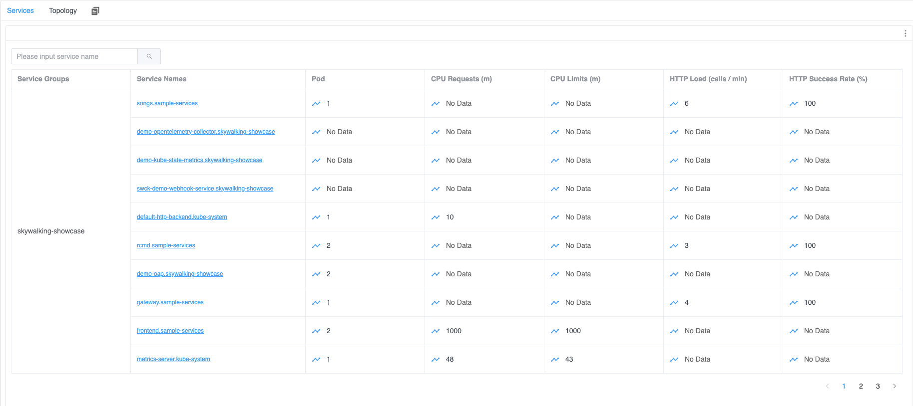
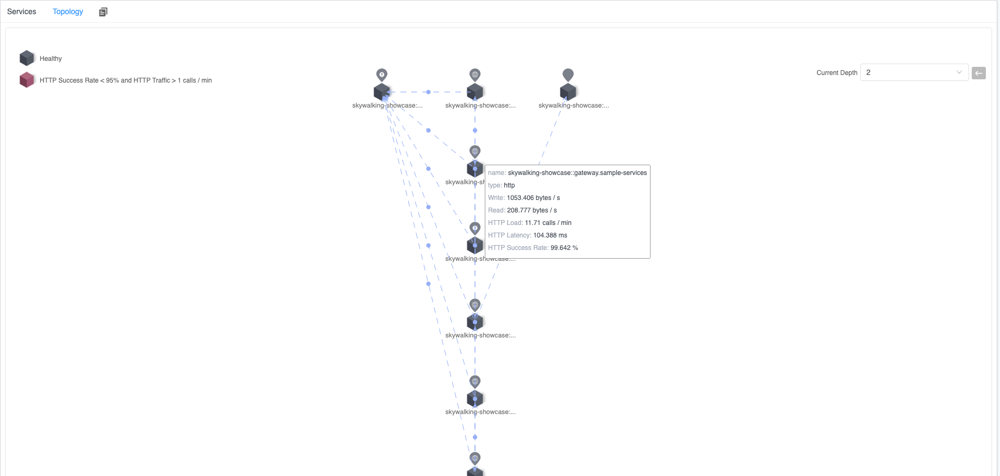
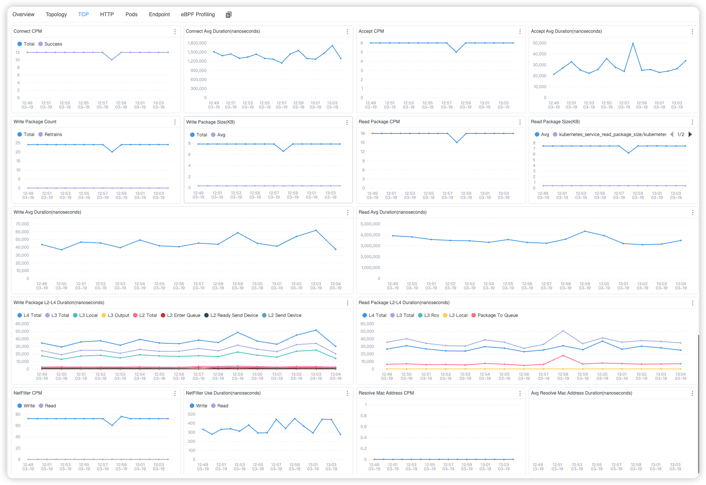
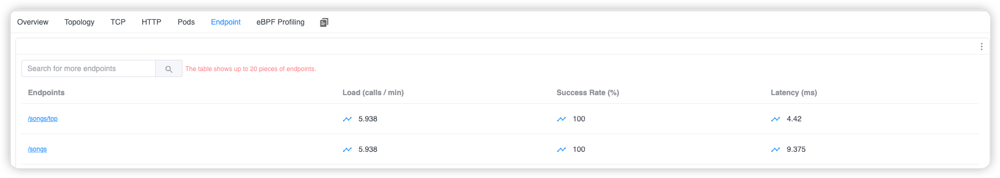

## 背景

[Apache SkyWalking](https://skywalking.apache.org/) 是一个开源的应用性能管理系统，帮助用户从各种平台收集日志、跟踪、指标和事件，并在用户界面上展示它们。

在9.7.0版本中，Apache SkyWalking 可以从多语言的探针和 Service Mesh 中收集访问日志，并生成相应的拓扑图、链路和其他数据。
但是对于Kubernetes环境，暂时无法提供对应用程序的访问日志进行采集并生成拓扑图。本文探讨了Apache SkyWalking 10.0.0版本如何采用eBPF技术来收集和存储应用访问日志，解决了这一限制。

## 为什么使用 eBPF？

为了在Kubernetes中监控网络流量，以下特性需得到支持：

1. **跨语言**: 在Kubernetes部署的应用可能使用任何编程语言编写，因此对多种语言的支持十分重要。
2. **非侵入性**: 监控网络流量时不对应用程序进行任何修改是必要的，因为直接干预Kubernetes中的应用程序是不可行的。
3. **内核指标监控**: 通常，仅通过分析用户空间级别的流量来诊断网络问题是不够的。经常需要深入分析，结合内核空间的网络流量指标。
4. **支持多种网络协议**: 应用程序可能使用不同的传输协议进行通信，这就需要支持一系列的协议。

鉴于这些要求，eBPF显现出作为一个有能力的解决方案。在下一节中，我们将深入讨论Apache SkyWalking Rover是如何解决这些方面作出更详细解释。

## 内核监控与协议分析

在之前的文章中，我们讨论了如何对不同编程语言的程序进行网络流量获取。在网络流量监控中，我们仍然会使用该技术进行流量采集。
但是由于这次监控触发方式和内核监控方面的不同特性，所以这两部分会单独进行说明。

### 内核监控

内核监控允许用户根据在内核层面的执行，洞察网络流量性能，特别是从OSI模型的第2层（数据链路层）到第4层（传输层）。

内核层的网络监控与syscall（用户空间系统调用）层在关联指标不同。虽然syscall层可以利用文件描述符来关联各种操作，但内核层的网络操作主要使用数据包作为唯一标识符。
这种差异需要映射关系，Apache SkyWalking Rover可以使用它将这两层绑定在一起，进行全面监控。

让我们深入了解数据在发送和接收模式下是如何被监控的。

#### 监控数据发送

在发送数据时，跟踪每个数据包的状态和时间对于理解每次传输的状态至关重要。在内核中，操作从第4层（L4）一直调用到第2层（L2），并且会保持与在syscall层相同的线程ID，这简化了数据的相关性分析。

SkyWalking Rover监控了几个关键的内核函数，以观察数据包传输动态，顺序从L4到L2：

1. **kprobe/tcp_sendmsg**: 记录数据包进入L4协议栈进行发送以及完成处理的时间。这个函数对于跟踪传输层对数据包的初始处理至关重要。
2. **kprobe/tcp_transmit_skb**: 记录数据包传输的总次数和每个发送的数据包的大小。这个函数有助于识别尝试发送一个数据包或一段时间内发送一批数据包的次数，这对于理解网络吞吐量和拥塞至关重要。
3. **tracepoint/tcp/tcp_retransmit_skb**: 记录是否发生数据包重传，提供网络可靠性和连接质量的见解。重传可以显著影响应用性能和用户体验。
4. **tracepoint/skb/kfree_skb**: 记录传输过程中的数据包丢失，并记录发生这种情况的原因。理解数据包丢失对于诊断网络问题和确保数据完整性至关重要。
5. **kprobe/__ip_queue_xmit**: 记录L3协议处理的开始和结束时间。这个功能对于理解IP级操作所需的时间至关重要，包括路由决策。
6. **kprobe/nf_hook_slow**: 记录在Netfilter钩子中花费的总时间和发生次数，例如 *iptables* 规则评估。这个函数对于评估防火墙规则和其他过滤机制对数据流的影响非常重要。
7. **kprobe/neigh_resolve_output**: 如果在发送网络请求之前需要解析未知的MAC地址，这个函数会记录发生的次数和在这个解析上花费的总时间。MAC地址解析时间可以影响初始数据包传输的延迟。
8. **kprobe/__dev_queue_xmit**: 记录进入L2协议栈的开始和结束时间，提供对数据链路层处理时间的见解。
9. **tracepoint/net/net_dev_start_xmit** and **tracepoint/net/net_dev_xmit**: 记录在网卡（NIC）上传输每个数据包所需的实际时间。这些功能对于理解硬件级性能和在将数据发送到物理网络时可能出现的瓶颈至关重要。

根据上述方法的拦截，Apache SkyWalking Rover可以在发送网络数据时为每个层级提供关键的执行时间和指标，从应用层（第7层）到传输层（第4层），最终到数据链路层（第2层）。

#### 监控数据接收


在接收数据时，通常关注的是数据包从网卡（NIC）到用户空间的传输时间。与发送数据的过程不同，在内核中接收数据是从数据链路层（第2层）开始，一直上升到传输层（第4层），直到应用层（第7层）检索到数据包的内容。

在SkyWalking Rover中，监控以下关键系统功能以观察这一过程，顺序从L2到L4：

1. **tracepoint/net/netif_receive_skb**: 记录网卡接收到数据包的时间。这个追踪点对于理解进入系统的传入数据的初始入口点至关重要。
2. **kprobe/ip_rcv**: 记录网络层（第3层）数据包处理的开始和结束时间。这个探针提供了IP层处理路由、转发和将数据包正确传递给应用程序所需时间的见解。
3. **kprobe/nf_hook_slow**: 记录在Netfilter钩子中花费的总时间和发生次数，与发送流量的情况相同。
4. **kprobe/tcp_v4_rcv**: 记录传输层（第4层）数据包处理的开始和结束时间。这个探针对于理解TCP操作的效率至关重要，包括连接管理、拥塞控制和数据流。
5. **tracepoint/skb/skb_copy_datagram_iovec**: 当应用层协议使用数据时，这个追踪点在第7层将数据包与syscall层的数据绑定。这种连接对于将内核对数据包的处理与用户空间应用程序的消费相关联是至关重要的。

基于上述方法，网络监控可以帮助您理解从网卡接收数据到程序使用数据的完整执行过程和执行时间。

#### 指标

通过拦截上述提到的方法，我们可以收集提供网络性能的关键指标。这些指标包括：

1. **数据包**: 数据包的大小及其传输或接收的频率。这些指标提供了对网络负载和数据在发送者与接收者之间传输效率的基本理解。
2. **连接**: 服务之间建立或接收的连接数量，以及设置这些连接所需的时间。这个指标对于分析网络内不同服务之间的通信效率和连接管理至关重要。
3. **L2-L4 事件**: 在第2层到第4层协议中关键事件上所花费的时间。这个指标揭示了网络堆栈较低层的处理效率和潜在瓶颈，这对于数据传输至关重要。

### 协议分析

在之前的文章中，我们已经讨论了解析 *HTTP/1.x* 协议。然而，对于 *HTTP/2.x*，协议的有状态性质和服务之间预先建立的连接使得网络分析变得复杂。
这种复杂性使得Apache SkyWalking Rover很难完全感知连接上下文，阻碍了协议解析操作。

将网络监控转移到守护进程模式提供了一种解决这一挑战的方法。通过全天候不断观察服务，Apache SkyWalking Rover可以在服务启动时立即开始监控。
这种立即启动允许跟踪完整的执行上下文，使得观察像 *HTTP/2.x* 这样的有状态协议变得可行。

#### 追踪

为了检测到一个进程何时启动，监控一个特定的追踪点 (**tracepoint/sched/sched_process_fork**) 是必不可少的。这追踪点使系统能够意识到进程启动事件。

鉴于需要根据某些标准（如进程的命名空间）过滤进程流量，Apache SkyWalking Rover遵循一系列步骤来确保准确和高效的监控。这些步骤包括：

1. **启动监控**: 一旦检测到进程，立即将其添加到监控白名单中。这一步确保从进程启动的那一刻起就考虑对其进行监控，不会有延迟。
2. **推送队列**: 进程的PID（进程ID）被推送到一个监控确认队列中。这个队列保存了新检测到的进程的PID，这些进程等待来自用户空间程序的进一步确认。这种异步方法对立即检测和后续处理进行分离，优化了监控工作流程。
3. **用户态程序确认**: 用户空间程序从队列中检索进程PID，并评估每个进程是否应该继续被监控。如果一个进程被认为不必要进行监控，它将被从白名单中移除。

这个过程确保了Apache SkyWalking Rover可以根据实时条件和配置动态调整其监控范围，允许既全面覆盖又有效的资源监控。

#### 限制

像 *HTTP/2.x* 这样的有状态协议的监控目前仍然面临一些限制：

1. **无法观察现有连接**: 要监控完整的请求和响应周期，需要在建立任何连接之前启动监控。这个要求意味着在监控开始之前建立的连接无法被观察到。
2. **TLS请求的挑战**: 观察TLS加密流量是复杂的，因为它依赖于异步加载uprobes（用户空间加载）进行观察。如果在成功加载这些uprobes之前发出新的请求，那么在加密之前或解密之后访问数据就变得不可能。

## 演示

接下来，让我们快速演示Kubernetes监控功能，以便更具体地了解它的功能。

### 部署 SkyWalking Showcase

SkyWalking Showcase 包含完整的示例服务，并可以使用 SkyWalking 进行监视。有关详细信息，请查看[官方文档](https://skywalking.apache.org/docs/skywalking-showcase/next/readme/)。

在此演示中，我们只部署服务、最新发布的 SkyWalking OAP，UI和Rover。

```shell
export FEATURE_FLAGS=java-agent-injector,single-node,elasticsearch,rover
make deploy.kubernetes
```

部署完成后，请运行以下脚本以打开 SkyWalking UI：http://localhost:8080/ 。

```shell
kubectl port-forward svc/ui 8080:8080 --namespace default
```

### 完成

一旦部署，Apache SkyWalking Rover在启动时会自动开始监控系统中的流量。然后，它将这些流量数据报告给SkyWalking OAP，并最终存储在数据库中。

在Kubernetes中的服务仪表板中，您可以查看被监控的Kubernetes服务列表。如果其中任何服务具有HTTP流量，这些指标信息将在列表中显示。



*图 1: Kubernetes 服务列表*

此外，在拓扑图选项卡中，您可以观察相关服务之间的拓扑关系。在每个服务节点或服务之间调用关系中，将显示相关的TCP和HTTP指标。



*图 2: Kubernetes 服务拓扑图*

当您从服务列表中选择特定服务时，您可以查看所选服务在TCP和HTTP级别的服务指标。



*图 3: Kubernetes 服务 TCP 指标*


*图 4: Kubernetes 服务 HTTP 指标*

此外，通过使用端点选项卡，您可以查看当前服务所访问的URI。



*图 5: Kubernetes 服务端点列表*

## 结论

在本文中，我详细介绍了如何利用eBPF技术对Kubernetes集群中的服务进行网络流量监控，这是Apache SkyWalking Rover中实现的一项功能。

这项功能利用了eBPF的强大功能，提供了对网络流量和服务交互的深入洞察，增强了对整个集群的可观测性。
