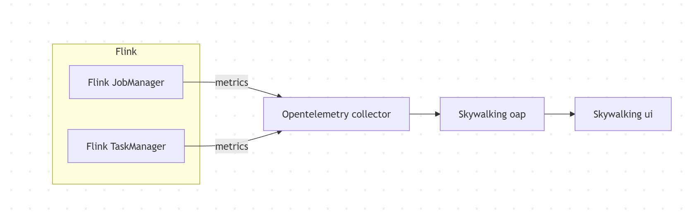
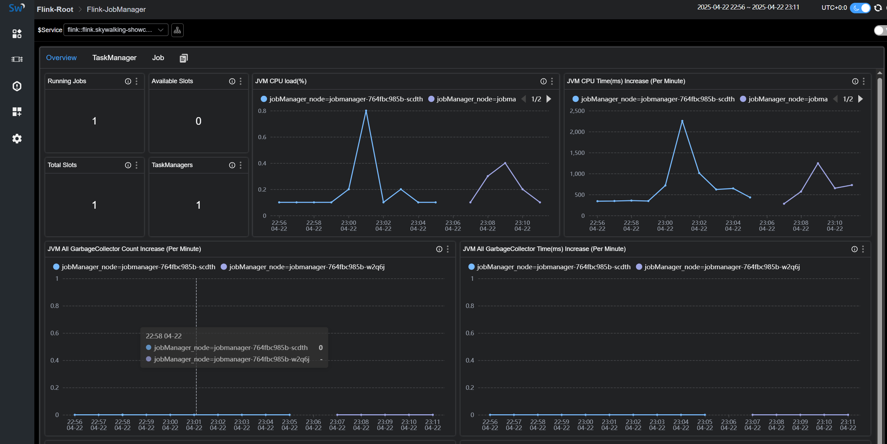
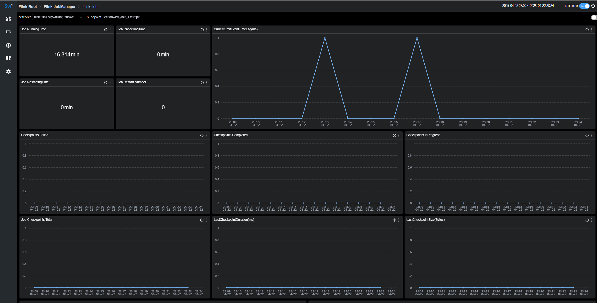
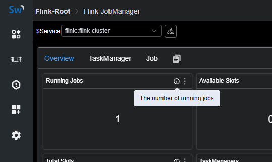

# 背景介绍
  Apache Flink 是一个框架和分布式处理引擎，用于在无边界和有边界数据流上进行有状态的计算。Flink 能在所有常见集群环境中运行，并能以内存速度和任意规模进行计算。
从SkyWalking OAP 10.3 版本开始，新增了对来自Flink的指标数据监控面板，本文将展示并介绍如何使用 SkyWalking来监控Flink。

# 部署

## 准备

1. [SkyWalking oap服务,v10.3 +](https://github.com/apache/skywalking)
2. [Flink v2.0-preview1 +](https://github.com/apache/flink)
3. [OpenTelemetry-collector v0.87+](https://github.com/open-telemetry/opentelemetry-collector-contrib)

## 启动流程
1. 启动 `jobmanager` 和 `taskmanager`
2. 启动 `skywalking oap` 和 `ui`
3. 启动 `opentelmetry-collector`
4. 启动job

## DataFlow:


## 配置   
### docker-compose
````
version: "3"

services:
  oap:
    extends:
      file: ../../script/docker-compose/base-compose.yml
      service: oap
    ports:
      - "12800:12800"
    networks:
      - e2e

  banyandb:
    extends:
      file: ../../script/docker-compose/base-compose.yml
      service: banyandb
    ports:
      - 17912

  jobmanager:
    image: flink:2.0-preview1
    environment:
      - |
        FLINK_PROPERTIES=
        jobmanager.rpc.address: jobmanager
        metrics.reporter.prom.factory.class: org.apache.flink.metrics.prometheus.PrometheusReporterFactory
        metrics.reporter.prom.port: 9260
    ports:
      - "8081:8081"
      - "9260:9260"
    command: jobmanager
    healthcheck:
      test: ["CMD", "curl", "-f", "http://localhost:8081"]
      interval: 30s
      timeout: 10s
      retries: 3
    networks:
      - e2e

  taskmanager:
    image: flink:2.0-preview1
    environment:
      - |
        FLINK_PROPERTIES=
        jobmanager.rpc.address: jobmanager
        metrics.reporter.prom.factory.class: org.apache.flink.metrics.prometheus.PrometheusReporterFactory
        metrics.reporter.prom.port: 9261
    depends_on:
      jobmanager:
        condition: service_healthy
    ports:
      - "9261:9261"
    command: taskmanager
    healthcheck:
      test: ["CMD", "curl", "-f", "http://localhost:9261/metrics"]
      interval: 30s
      timeout: 10s
      retries: 3
    networks:
      - e2e

  executeJob:
    image: flink:2.0-preview1
    depends_on:
      taskmanager:
        condition: service_healthy
    command: >
      bash -c "
      ./bin/flink run -m jobmanager:8081 examples/streaming/WindowJoin.jar"
    networks:
      - e2e

  otel-collector:
    image: otel/opentelemetry-collector:${OTEL_COLLECTOR_VERSION}
    networks:
      - e2e
    command: [ "--config=/etc/otel-collector-config.yaml" ]
    volumes:
      - ./otel-collector-config.yaml:/etc/otel-collector-config.yaml
    expose:
      - 55678
    depends_on:
      oap:
        condition: service_healthy

networks:
  e2e:
````
如果是使用`pushGateWay`模式来暴露metrics数据请[参考](https://nightlies.apache.org/flink/flink-docs-release-2.0-preview1/docs/deployment/metric_reporters/#prometheuspushgateway)。


### OpenTelemetry-collector
````
receivers:
  prometheus:
    config:
      scrape_configs:
        - job_name: "flink-jobManager-monitoring"
          scrape_interval: 30s
          static_configs:
            - targets: ['jobmanager:9260']
              labels:
                cluster: flink-cluster
          relabel_configs:
            - source_labels: [ __address__ ]
              target_label: jobManager_node
              replacement: $$1
          metric_relabel_configs:
            - source_labels: [ job_name ]
              action: replace
              target_label: flink_job_name
              replacement: $$1
            - source_labels: [ ]
              target_label: job_name
              replacement: flink-jobManager-monitoring

        - job_name: "flink-taskManager-monitoring"
          scrape_interval: 30s
          static_configs:
            - targets: [ "taskmanager:9261" ]
              labels:
                cluster: flink-cluster
          relabel_configs:
            - source_labels: [ __address__ ]
              regex: (.+)
              target_label: taskManager_node
              replacement: $$1
          metric_relabel_configs:
            - source_labels: [ job_name ]
              action: replace
              target_label: flink_job_name
              replacement: $$1
            - source_labels: [ ]
              target_label: job_name
              replacement: flink-taskManager-monitoring

exporters:
  otlp:
    endpoint: oap:11800
    tls:
      insecure: true

processors:
  batch:
service:
  pipelines:
    metrics:
      receivers:
        - prometheus
      processors:
        - batch
      exporters:
        - otlp

````
注意:  
`job_name`的值请不要修改,否则 skyWalking 不会处理这部分数据。  
`oap` 为 `skywalking oap` 地址,请自行替换。  
因为原始`flink`数据中含有`job_name`标签，而skyWalking又根据`job_name`标签来处理对应OTEL任务的数据，
为了避免冲突，使用`metric_relabel_configs`替换原始数据中`job_name`的标签为`flink_job_name`。


# 监控指标

指标分为三个维度,cluster,taskManager,job

## Cluster Metrics




`Cluster Metrics`主要是站在集群的角度统计以及jobManager的jvm相关指标展示,比如

- `Running Jobs`：正在运行的任务数量
- `TaskManagers`：taskManager数量
- `Task Managers Slots Total`：taskManager slot数量
- `Task Managers Slots Available`：taskManager可用slot数量
- `JVM CPU Load`：jobManager的jvm占用cpu的负载


## TaskManager Metrics


`TaskManager Metrics`主要是站在taskManager节点的角度来统计展示,比如 

- `JVM Memory Heap Used`：taskManager节点JVM已用内存大小。
- `JVM Memory Heap Available`：taskManager节点JVM可用内存大小。
- `NumRecordsIn`：taskManager每分钟接受的数据数量。
- `NumBytesInPerSecond`：taskManager每秒接受的Bytes数量。
- `IsBackPressured`：该taskManager节点是否处在背压。
- `IdleTimeMsPerSecond`：该taskManager节点每秒的闲置时长。

## Job Metrics




`Job Metrics`主要是站在运行任务的角度来统计展示,比如 

- `Job RunningTime`：该任务运行的时长。
- `Job Restart Number`：该任务重启次数。
- `Checkpoints Failed`：失败的checkpoints数量。
- `NumBytesInPerSecond`：该任务每秒接受的Bytes数量。


各个指标的含义可以在图标的 tip 上找到解释



# 参考文档

- [Flink Prometheus](https://nightlies.apache.org/flink/flink-docs-release-2.0-preview1/docs/deployment/metric_reporters/#prometheus)
- [SkyWalking Flink Monitoring](https://skywalking.apache.org/docs/main/next/en/setup/backend/backend-flink-monitoring/)