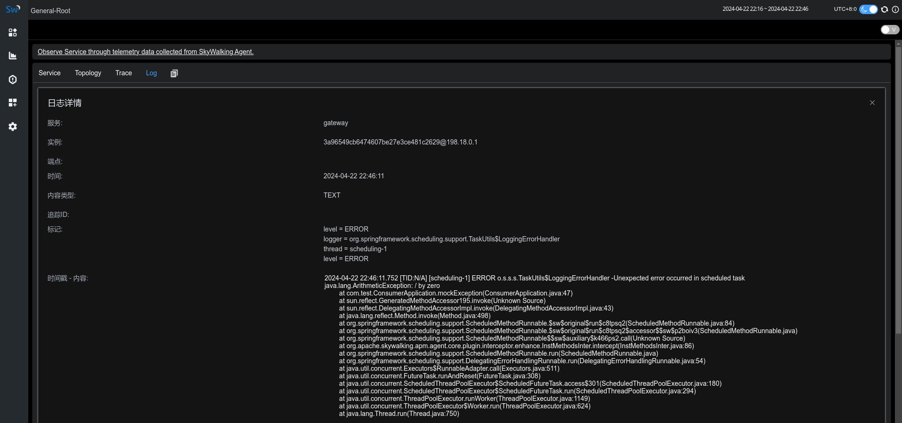
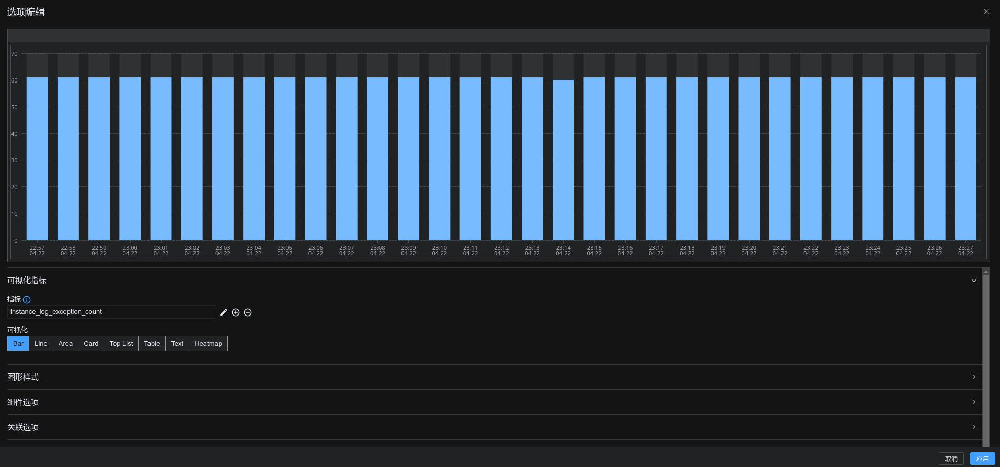
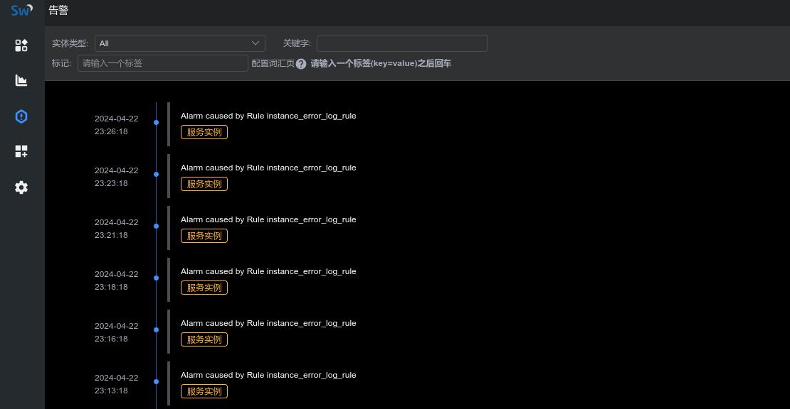

本次直播是 Apache SkyWalking 社区和纵目联合举办分享活动的第二讲，由魏翔为大家介绍 SkyWalking LAL(Log Analysis Language)，主要包含以下几部分内容：

- SkyWalking LAL(Log Analysis Language) 语法介绍
- 使用 LAL 监控服务日志异常实验
- OAP log-analyzer 模块源码讲解

[B站视频地址](https://www.bilibili.com/video/BV1Ti421C7b6)

实验中涉及到的知识点比较零散，为了方便大家复现实验结果，现将实验步骤整理如下：

# 1. 接入服务日志至SkyWalking
首先，我们启动 demo 服务，并通过一个定时任务模拟异常，并输出异常至日志中，下面的方法会每秒钟执行一次，因为除数为零，所以会产生 `java.lang.ArithmeticException: / by zero` 的异常：
```java
@Scheduled(fixedDelay = 1000)
public void mockException() throws Exception {
    int i = 1 / 0;
}
```
```text
2024-04-22 23:03:54 SW_CTX:[gateway,3a96549cb6474607be27e3ce481c2629@198.18.0.1,N/A,N/A,-1] [scheduling-1] ERROR [org.springframework.scheduling.support.TaskUtils$LoggingErrorHandler:95] - Unexpected error occurred in scheduled task
java.lang.ArithmeticException: / by zero
	at com.test.ConsumerApplication.mockException(ConsumerApplication.java:47)
	at sun.reflect.GeneratedMethodAccessor195.invoke(Unknown Source)
	at sun.reflect.DelegatingMethodAccessorImpl.invoke(DelegatingMethodAccessorImpl.java:43)
	at java.lang.reflect.Method.invoke(Method.java:498)
	at org.springframework.scheduling.support.ScheduledMethodRunnable.$sw$original$run$c8tpsq2(ScheduledMethodRunnable.java:84)
	at org.springframework.scheduling.support.ScheduledMethodRunnable.$sw$original$run$c8tpsq2$accessor$$sw$p2boiv3(ScheduledMethodRunnable.java)
	at org.springframework.scheduling.support.ScheduledMethodRunnable$$sw$auxiliary$k466ps2.call(Unknown Source)
	at org.apache.skywalking.apm.agent.core.plugin.interceptor.enhance.InstMethodsInter.intercept(InstMethodsInter.java:86)
	at org.springframework.scheduling.support.ScheduledMethodRunnable.run(ScheduledMethodRunnable.java)
```
接着，我们为该服务启动参数添加 skywalking agent 启动参数，并接入日志至 skywalking，由于我们demo使用的是logback，我们在 pom.xml 中添加以下依赖：
```
<dependency>
    <groupId>org.apache.skywalking</groupId>
    <artifactId>apm-toolkit-logback-1.x</artifactId>
    <version>${version}</version>
</dependency>
```
同时，在logback.xml中添加 skywalking-grpc appender:
```
<appender name="grpc-log" class="org.apache.skywalking.apm.toolkit.log.logback.v1.x.log.GRPCLogClientAppender">
    <encoder class="ch.qos.logback.core.encoder.LayoutWrappingEncoder">
        <layout class="org.apache.skywalking.apm.toolkit.log.logback.v1.x.mdc.TraceIdMDCPatternLogbackLayout">
            <Pattern>%d{yyyy-MM-dd HH:mm:ss.SSS} [%X{tid}] [%thread] %-5level %logger{36} -%msg%n</Pattern>
        </layout>
    </encoder>
</appender>
```
启动 SkyWalking OAP 服务，一切顺利的话，你会在 SkyWalking 日志面板中看到 demo 服务上报的日志信息：



# 2. 配置 LAL 解析上报的日志并提取指标
默认情况下，SkyWalking只会保存原始的日志数据，不做任何的处理分析，我们修改 `config/lal/default.xml`:
```yaml
rules:
  - name: default
    layer: GENERAL
    dsl: |
      filter {
        text {
          abortOnFailure false
          regexp $/(?<time>\d{4}-\d{2}-\d{2} \d{2}:\d{2}:\d{2}\.\d{3}) \[.+] \[.+] (?<level>\w+) (?<msg>.*)/$
        }

        extractor {
          tag level: parsed.level
          timestamp parsed.time as String, "yyyy-MM-dd HH:mm:ss.SSS"
          
          if (parsed.level == "ERROR") {
            metrics {
              timestamp log.timestamp as Long
              labels service: log.service, service_instance_id: log.serviceInstance
              name "log_exception_count"
              value 1
            }
          }
        }

        sink {
        }
      }
```
上面的 dsl 中，首先使用 text regex 解析器解析日志内容，分别解析出了日志的时间、日志等级等信息，大家可以根据需要自行调整 regexp 表达式（如果你的日志是json格式，你也可以尝试[json 解析器](https://skywalking.apache.org/docs/main/next/en/concepts-and-designs/lal/#json) ）。

接着 extractor 会从 regexp 解析结果中，提取出日志额外的 tag 以及 timestamp 信息，并且会检查 level，如果 level 级别为 ERROR，就会生成一个名为`log_exception_count`，值为 1 的指标，在打上 service 及 service_instance_id 标签后，会交给 skywalking meter system 接着处理。

# 3. 定义 log-mal 进一步分析 LAL 中提取的指标
上一步中，我们定义了日志的解析规则，并成功提取到了 `log_exception_count` 指标，接着我们定义指标分析规则，创建 `config/lal-mal/rules/default.yaml`:
```yaml
metricPrefix: instance
metricsRules:
  - name: log_exception_count
    exp: log_exception_count.sum(['service','service_instance_id']).downsampling(SUM).instance(['service'], ['service_instance_id'], Layer.GENERAL)
```
上面的 mal 中，我们指定 downsampling 函数为 SUM，这样可以帮助我们计算一分钟内的错误数和，由于是新创建的文件，别忘了在 `config/application.yml` 中注册该配置文件：
```
log-analyzer:
  selector: ${SW_LOG_ANALYZER:default}
  default:
    lalFiles: ${SW_LOG_LAL_FILES:envoy-als,mesh-dp,mysql-slowsql,pgsql-slowsql,redis-slowsql,k8s-service,nginx,default}
    malFiles: ${SW_LOG_MAL_FILES:"nginx,default"}
```
最后我们打开 skywalking-ui，在 dashboard 中添加指标 `instance_log_exception_count` 并验证指标结果正确性:



# 4. 配置指标告警规则
有了指标数据后，我们可以在 `config/alarm-settings.yml` 添加对应的告警规则，该规则定义如果一分钟内日志异常数量超过 5 就会发出告警信息：
```
instance_error_log_rule:
  expression: sum(instance_log_exception_count > 5) >= 1
  period: 1
  tags:
    level: WARNING
```
配置好以上规则后，我们稍等 1 分钟，便可以在告警记录面板查看到响应的告警信息：



---
*附：想参与直播的小伙伴，可以关注后续的直播安排和我们的B站直播预约*


