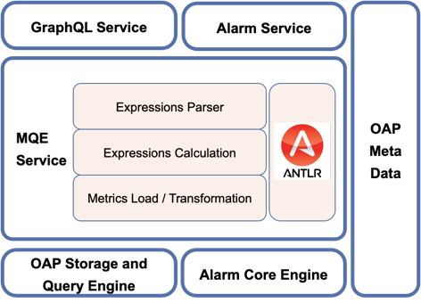

MQE是SkyWalking的核心metrics查询服务引擎，自从SkyWalking v9.5.0开始支持MQE以来，MQE展现了其强大灵活和便利性，丰富了metrics的查询方式，随后在v9.6.0 中告警规则配置也全面使用MQE，
让告警规则配置更简单并且可以设定更复杂的条件和计算。在SkyWalking v10以后，官方UI已经全面迁移至使用MQE与OAP进行交互。

本次直播由SkyWalking PMC 万凯为大家介绍 SkyWalking Metrics Query Expression(MQE)，主要包含以下几部分内容：
- 什么是MQE，它的基本原理和在SkyWalking中的架构
- MQE的基本语法结构和函数
- MQE在查询中的应用
- MQE在告警规则中的应用

[B站视频地址](https://www.bilibili.com/video/BV1XM4m1z784/)
