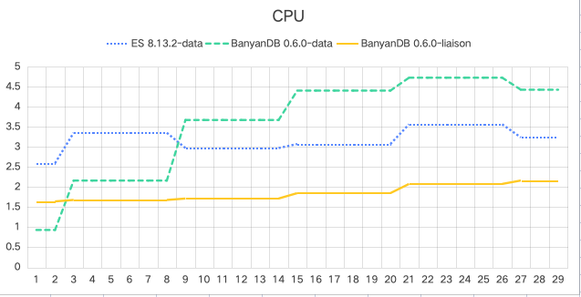

# 引言

我们很高兴地宣布 BanyanDB v0.6 的发布，这是我们数据库技术发展的一个重要里程碑。这个最新版本引入了一种开创性的基于列的文件系统，提高了处理大数据集的性能和效率。经过广泛测试，我们可以确认这个新文件系统已经准备好投入生产。BanyanDB 现已准备就绪。

在这篇博客中，我们将深入探讨新的架构和观察到的性能改进，并提供一个关于如何安装并开始使用 BanyanDB v0.6 的逐步指南。

# 理解 BanyanDB 架构

BanyanDB 设计为一个高度可扩展的多模型数据库。BanyanDB 的架构是模块化的，允许在存储和索引策略上具有灵活性，这使其成为处理复杂数据环境的理想选择。

### 主要特性：

- **多模型支持**：无缝处理各种数据类型。
- **可扩展性**：设计为可以在多个节点上水平扩展。
- **高性能**：优化了快速数据检索和高数据吞吐率。

## 数据模型

BanyanDB 是一个多模型数据库，旨在支持包括时间序列和键值数据在内的多种数据类型。这种灵活性对于需要多样化数据处理能力的现代 APM 系统至关重要。


BanyanDB 模型

### 时间序列数据：

BanyanDB 管理时间序列数据，即按时间顺序索引的数据点，通常在等间隔的时间点记录。这使其理想用于离散时间数据的序列。在 BanyanDB 中，你可以通过两种结构存储时间序列数据：

- **Stream**：这种类型的数据适合记录，如日志、追踪和事件。Stream（流）有助于管理连续生成并顺序记录的数据。
- **Measure**：专为摄取度量和概况而设计。Measure（度量）对于时间间隔的统计表示很有用。

### 键值数据：

BanyanDB 中的键值模型是属性模型的一个子集。每个属性由一个唯一的键标识，格式为`<group>/<name>/<id>`，作为检索数据的主键。这个键一旦设置就是不可改变，确保数据的一致性和完整性。

属性由几个键值对组成，称为 Tag。你可以根据 Tag 的键动态地添加、更新或删除 Tag，提供灵活性在管理和存储数据方面。例如，SkyWalking UI 模板利用这个模型有效地存储配置数据。

## BanyanDB 的集群化

BanyanDB 的架构不仅确保了高效的数据管理和高可用性，还强调了其集群环境中的可扩展性。系统包括三种不同的节点类型，每种类型都能独立扩展以满足不同的工作负载需求。

### 数据节点（Data Node）

数据节点是存储和管理所有原始时间序列数据、元数据和索引数据的核心。这些节点采用无共享架构运行，彼此之间不直接通信也不共享任何数据，增强了集群的可用性并简化了维护和扩展。这种设计优先考虑可用性，即使某些节点暂时不可用，系统仍能保持数据摄取和查询操作。

### 元数据节点（Meta Node）

元数据节点使用 etcd 实现，管理整个集群的元数据并确保系统的一致性。它们维护节点状态和数据库架构的全局视图，促进集群内的协调操作。

### 联络节点（Liaison Node）

联络节点作为通信桥梁，将查询和数据路由到适当的数据节点。它们处理安全功能，如认证和 TTL 执行，并管理分布式查询执行以优化性能。它们在维护服务可用性中发挥关键作用；只要至少有一个数据节点在运行，联络节点就可以继续服务查询。在某些数据节点不可用的情况下，联络节点会将流量重定向到剩余的健康节点，这可能导致这些节点的资源使用增加。


BanyanDB 集群

### 通信

- **元数据节点** 在集群中同步元数据。
- **数据节点** 与元数据节点互动，更新和获取元数据。
- **联络节点** 将数据路由到数据节点并协调查询过程，利用元数据节点的元数据进行有效的分发和执行。

### 可扩展性和容错性

BanyanDB 集群中的每种节点类型都可以根据部署的具体需要独立扩展：

- **扩展数据节点** 增加数据处理能力并在更重的负载下改善性能。
- **扩展元数据节点** 增强集群元数据操作的管理能力和弹性。这些节点的数量应该是奇数。
- **扩展联络节点** 改善查询处理和数据路由能力的吞吐量。

这种灵活性使 BanyanDB 能够适应需求变化，而不会损害性能或可用性。如果某些组件暂时不可用，系统设计为继续运营，优先保证可用性而非严格一致性。然而，在这种事件中，如果活动节点没有足够的资源来处理当前的工作负载，用户可能会经历数据摄取和查询处理的延迟或失败。

# 在 Kubernetes 上安装

要在 Kubernetes 上安装 BanyanDB，你可以使用我们的 Helm chart，这简化了部署过程。你可以在[我们的官方文档](https://github.com/apache/skywalking-helm/tree/v4.6.0)中找到详细的安装指南。

这个逐步指南假设你对 Kubernetes 和 Helm 有基本的了解，Helm 是 Kubernetes 的包管理器。如果你不熟悉 Helm，你可能需要在继续之前先熟悉 Helm 的基础知识。

## 先决条件

在我们开始之前，请确保你有以下内容：

1. **Kubernetes 集群**：你可以使用 Minikube 进行本地设置，或使用支持 Kubernetes 的任何云提供商，如 AWS、GCP 或 Azure。
2. **Helm 3**：确保 Helm 3 已安装并配置在你的机器上。你可以从 [Helm 的官方网站](https://helm.sh/) 下载。

## 第 1 步：配置 Helm 以使用 OCI

由于 BanyanDB Helm chart 托管为 Docker Hub 中的 OCI chart，你需要确保你的 Helm 配置为处理 OCI 工件。

```bash
helm registry login registry-1.docker.io
```

你将被提示输入你的 Docker Hub 用户名和密码。此步骤是从 Docker Hub 拉取 Helm chart 所必需的。

## 第 2 步：设置环境变量

接下来，设置 SkyWalking 发行版本、名称和命名空间的环境变量。这些变量将用于后续命令。

```bash
export SKYWALKING_RELEASE_VERSION=4.6.0
export SKYWALKING_RELEASE_NAME=skywalking
export SKYWALKING_RELEASE_NAMESPACE=default
```

## 第 3 步：使用 Helm 安装 BanyanDB+SkyWalking

```bash
helm install "${SKYWALKING_RELEASE_NAME}" \
  oci://registry-1.docker.io/apache/skywalking-helm \
  --version "${SKYWALKING_RELEASE_VERSION}" \
  -n "${SKYWALKING_RELEASE_NAMESPACE}" \
  --set oap.image.tag=10.0.1 \
  --set oap.storageType=banyandb \
  --set ui.image.tag=10.0.1 \
  --set elasticsearch.enabled=false \
  --set banyandb.enabled=true \
  --set banyandb.image.tag=0.6.1 \
  --set banyandb.standalone.enabled=false \
  --set banyandb.cluster.enabled=true \
  --set banyandb.etcd.enabled=true
```

此命令将部署 SkyWalking OAP 集群和 BanyanDB 集群到你的 Kubernetes 环境。

## 第 4 步：验证安装

检查 pod 的状态以确保它们正常运行：

```bash
kubectl get pods -l release=skywalking
```

如果一切配置正确，你应该看到以下 pod 处于`Running`或`Completed`状态。


BanyanDB 集群中的 Pod

## 第 5 步：访问 SkyWalking UI

要访问 SkyWalking UI，你可以检查服务：

```bash
kubectl get svc
```

你应该选择服务`skywalkin-skywalking-helm-ui`来访问 UI。

# 性能测试

我们针对 Elasticsearch 8.13.2 对 BanyanDB v0.6.1 进行了基准测试，SkyWalking 推荐的数据库。新的 BanyanDB 在几个关键领域表现优于 Elasticsearch，特别是在内存使用和磁盘空间方面。

## 数据生成工具

对于此测试，我们使用了一个自定义的数据生成工具，设计用来创建模拟典型实际场景的追踪和度量数据。

### 服务、实例和端点

- **Total Services**：20
- **Groups of Services**：每 3 个生成器实例运行两组，贡献总服务数。
- **Instances per Service**：每个服务有 20 个实例，所有服务共有 400 个实例。
- **Endpoints per Service**：每个服务实例托管 100 个端点。
- **Total Endpoints**：20 个服务的总端点数为 2000。

### Trace 和 Segment 生成

- **Trace Gerneration Rate**：每组服务每秒生成 1000 条 trace，有效模拟大规模微服务环境中的高负载场景。
- **Spans per Trace**：每条追踪包含五个 segement，详细描述了各种服务和实例之间的模拟交互。
- **Total Writes per Second**：2 group * 3 data-generator * 1000 trace * 5 segment = 30k segment。

我们设计的额外查询类型代表了生产环境中监控微服务架构的 SkyWalking 执行的典型读取操作。每种查询类型针对服务数据的不同方面：

### 1. **Service Dashboard Queries**

- **目的**：在过去 30 分钟内获取 5 项服务级别的度量。
- **频率**：每秒 1 次查询

### 2. **Top-N List Queries**

- **目的**：在过去 30 分钟内检索 2 个特定服务的前 5 项度量。
- **频率**：每秒 1 次查询。

### 3. **Segment List Queries**

- **目的**：在过去 30 分钟内获取按降序排列的服务段列表。
- **频率**：每秒 1 次查询。

### 4. **Trace Detail Queries**

- **目的**：从段列表检索所有追踪细节。
- **频率**：每秒 2 次查询。

## 设置

下表详细列出了集群内每个组件的规格，允许轻松比较分配给每个系统的硬件资源。这提供了对 Elasticsearch 8.13.2 和我们性能测试中使用的 BanyanDB v0.6.1 部署配置的清晰而结构化的比较。


性能测试设置

## 集群配置表

| 组件      | 系统          | 数量 | CPU 核心 | 内存 (GB) | 存储 (GB)     | 角色描述                         |
| --------- | ------------- | ---- | -------- | --------- | ------------- | -------------------------------- |
| 主节点    | Elasticsearch | 3    | 2        | 6         | N/A           | 集群协调和管理                   |
| 数据节点  | Elasticsearch | 3    | 4        | 8         | 50 (高级 RWO) | 数据存储、索引和查询处理         |
| ETCD 节点 | BanyanDB      | 3    | 2        | 4         | N/A           | 元数据和集群状态存储             |
| 数据节点  | BanyanDB      | 3    | 8        | 4         | 50 (高级 RWO) | 数据存储和处理                   |
| 联络节点  | BanyanDB      | 2    | 4        | 4         | N/A           | 协调客户端应用和数据节点间的联系 |

## 结果

在此我们整理了 Elasticsearch 8.13.2 和 BanyanDB v0.6.1 的性能测试结果，重点比较资源使用情况。结果分为两个表格以便更清晰地展示——一个详细介绍 CPU 和内存使用情况，另一个关注磁盘相关指标。

## CPU 和内存使用情况




| 系统               | 平均 CPU 使用率 (核心) | 平均内存使用量 (MB) |
| ------------------ | ---------------------- | ------------------- |
| Elasticsearch 数据 | 3.2                    | 4147                |
| BanyanDB 数据      | 3.6                    | 738                 |
| BanyanDB 联络      | 1.9                    | 62                  |

### 观察：

- **CPU 使用率**：BanyanDB 数据节点的 CPU 使用率略高，因为它们在压缩和解压数据文件时操作较多。然而，BanyanDB 联络节点的 CPU 使用明显较少。
- **内存使用率**：BanyanDB 显示出显著较低的内存使用率，数据和联络节点的内存使用量几乎比 Elasticsearch 数据节点少 5 倍，凸显其在内存利用效率方面的优势。

## 磁盘使用、IOPS 和吞吐量


磁盘使用


磁盘 IOPS & 吞吐量

| 系统               | 平均磁盘使用量 (GB) | IOPS (千) | 磁盘吞吐量 (GB/s) |
| ------------------ | ------------------- | --------- | ----------------- |
| Elasticsearch 数据 | 29.6                | 115.5     | 12.8              |
| BanyanDB 数据      | 21.6                | 21.4      | 3.3               |

### 观察：

- **磁盘空间使用**：BanyanDB 比 Elasticsearch 使用约 30% 较少的磁盘空间，这可能导致较低的存储成本。
- **IOPS 和吞吐量**：BanyanDB 的 IOPS 和磁盘吞吐量显著较低，表明对磁盘资源的压力较小。这对于降低运营成本和延长物理存储设备的使用寿命可能是有益的。

# 结论

BanyanDB v0.6 的发布标志着数据库技术的重大进步，其新的基于列的文件系统在性能和效率上，尤其是在内存使用和磁盘空间方面与 Elasticsearch 相比显示出显著的改进。BanyanDB 能够处理各种数据类型，具有可扩展的架构以及在数据检索和摄取方面的高性能，使其成为复杂数据环境的强大解决方案。灵活的集群系统的引入允许独立扩展节点类型，确保在不影响性能或可用性的情况下适应变化的需求。总体而言，BanyanDB v0.6 将自己定位为现代应用性能管理 (APM) 系统的一个经济高效且可靠的选择。