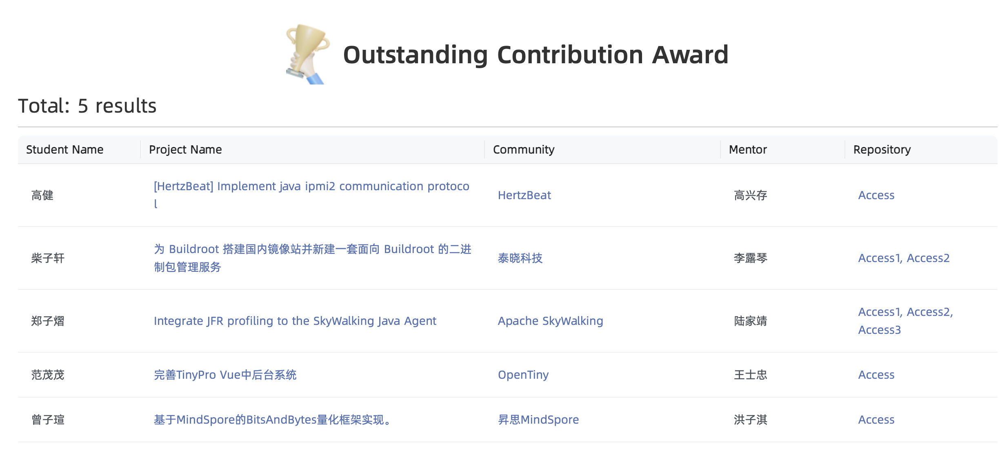

Aapche SkyWalking PMC 和 committer团队参加了"开源之夏 2024"活动，作为导师，共获得了5个官方赞助名额。最终对学生开放如下任务

* BanyanDB支持自定义插入/更新触发器
* 在SkyWalking Go的toolkit中支持完整trace, log和meter API
* 在SkyWalking Java中集成JFR性能剖析功能
* SWCK 支持注入 skywalking Python agent
* BanyanDB支持数据聚合

经过3个月的开发，上游评审，PMC成员评议，PMC Chair复议，OSPP官方委员会评审多个步骤，现公布项目参与人员与最终结果

# 通过评审项目（共3个）
## 在SkyWalking Java中集成JFR性能剖析功能
- 学生：郑子熠
- 学校：南京邮电大学 本科
- 官方文档[Profiling - Async Profiler](https://skywalking.apache.org/docs/main/next/en/setup/backend/backend-async-profiler/)详细介绍了此功能。
- 此功能将作为SkyWalking 10.2的主要新功能之一发布，预计发布时间 2025年2月（以官方Release为准）。
- 官网发布了blog - TODO 介绍此功能

2024年12月9日，郑子熠因此项目在结项优秀学生评比中，获得[**突出贡献奖**](https://summer-ospp.ac.cn/final/outstanding)。



## 在SkyWalking Go的toolkit中支持完整trace, log和meter API
- 学生：李天源
- 学校：广东东软学院 本地
- 相关Pull Requests
  - [api: add log,metric,span feat to api](https://github.com/apache/skywalking-go/pull/198)
  - [feat: toolkit span add event impl](https://github.com/apache/skywalking-go/pull/200)
  - [feat: add toolkit logging impl](https://github.com/apache/skywalking-go/pull/202)
  - [feat: support manual reporting of metrics in toolkit](https://github.com/apache/skywalking-go/pull/205)
  - [docs: add toolkit docs](https://github.com/apache/skywalking-go/pull/206)
- 相关官方文档包括
  - [Tracing APIs](https://skywalking.apache.org/docs/skywalking-go/next/en/advanced-features/manual-apis/toolkit-trace/)
  - [Logging APIs](https://skywalking.apache.org/docs/skywalking-go/next/en/advanced-features/manual-apis/toolkit-log/)
  - [Metric APIs](https://skywalking.apache.org/docs/skywalking-go/next/en/advanced-features/manual-apis/toolkit-metric/)
- 此功能将包含在SkyWalking Go Agent 0.6 release中发布，以及发布时间2025年年初（以官方Release为准）。

## BanyanDB 支持自定义插入/更新触发器
- 学生：谢李奥
- 学校：中科院软件所 硕士
- 相关官方文档包括
  - [[ospp] Adds MeasureAggregateFunctionService.Support API](https://github.com/apache/skywalking-banyandb/pull/479)
  - [[ospp] Supports measure aggregate function avg and min, and test cases.](https://github.com/apache/skywalking-banyandb/pull/521)
  - [[ospp] Implements MeasureAggregateFunctionService.Support API](https://github.com/apache/skywalking-banyandb/pull/545)
  - [Dev measure aggregate function](https://github.com/apache/skywalking-banyandb/pull/528)
- 2024年11月，在社区关于BanyanDB未来路线图的讨论决议中，服务端相关聚合功能暂时不作为BanyanDB规划功能，[[Feature] Hand over downsampling(hour/day) metric processes to BanyanDB](https://github.com/apache/skywalking/issues/12653) 已被关闭。此项目合并代码，不会发布，将在0.8 release中被移除。注，此代码移除与学生代码质量和完成度无关，系项目目标变更导致。

```
We have an agreement, this feature benefit is too limited.

# Summary of downsides for server-side aggregation

1. Removing L2 would impact the alerting. Because minute dimension eventual(aggregated) data will be lost from OAP.
2. Keeping minute dimension aggregation makes the delta data lost, and causes another extra round delta data in minute dimension flushing. 
3. Clearly, this server-side aggregation increases the server-side payload(CPU cost), but wouldn't tradeoff for IOPS.
4. The process pipeline would be more complex.
____
The only positive part is the cache of hour/day dimension metrics could be removed.
```

# 未通过评审/未启动项目（2个）
下列项目因为质量无法达到社区要求，无学生报名等原因，将被标定为失败。

- SWCK 支持注入 skywalking Python agent。 无学生申报
- BanyanDB支持数据聚合。未通过

# 结语
2024年，由于开源之夏提供的支持名额降低到5个，SkyWalking选题的难度都有显著提升。我们很高兴的看到，依然有3位学生较好的完成了相关课题。
感觉开源之夏和各位同学们对Apache SkyWalking的支持和热情参与。
