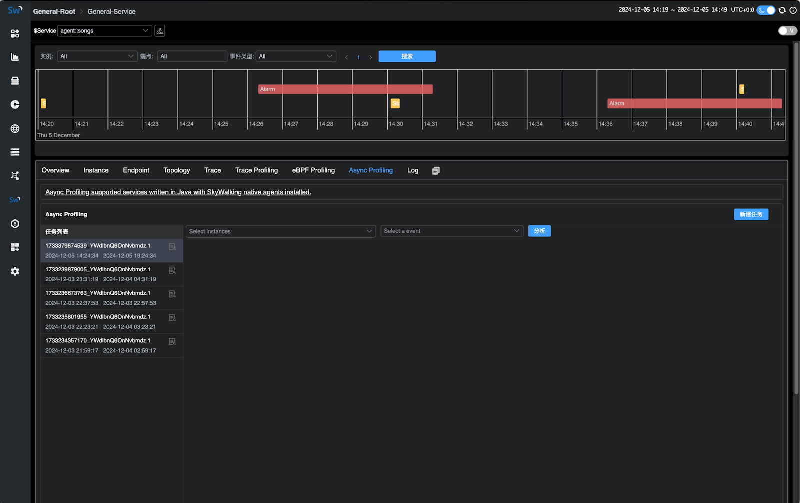
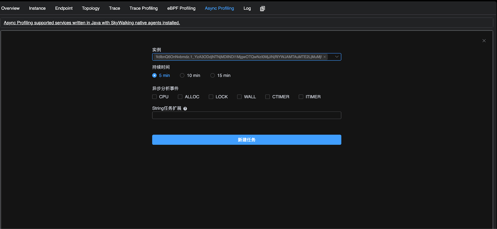
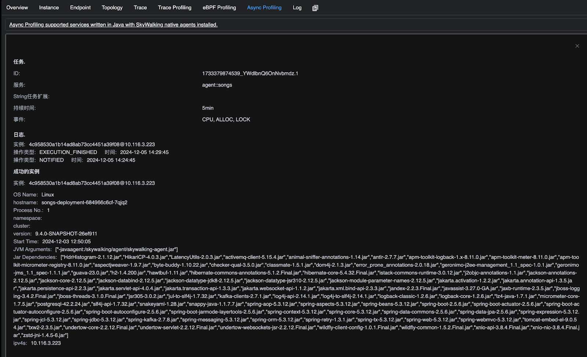
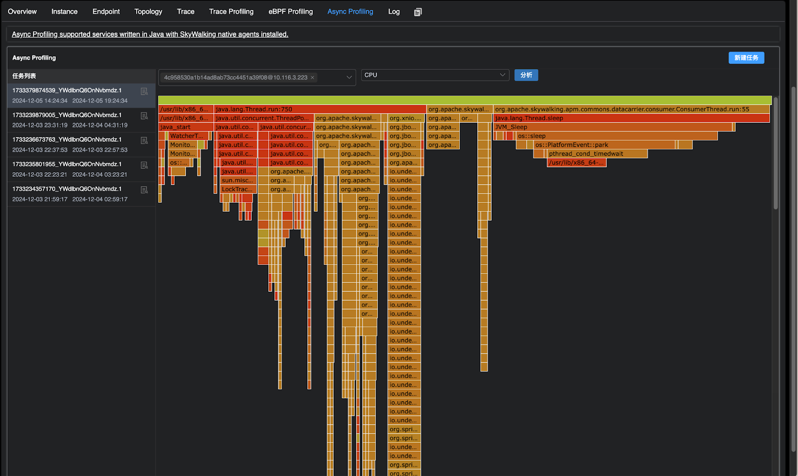

## 背景

[Apache SkyWalking](https://skywalking.apache.org/) 是一个开源的应用性能管理系统，帮助用户从各种平台收集日志、跟踪、指标和事件，并在用户界面上展示它们。在10.1.0版本中，Apache SkyWalking 可以通过 eBPF 进行 CPU 分析，eBPF 支持多种语言，但并不支持 Java。本文探讨了Apache SkyWalking 10.2.0版本如何采用 async-profiler 来收集 CPU、内存分配、锁并进行分析，解决了这一限制，同时额外提供了内存分配以及占用分析。

## 为什么使用 async-profiler？

async-profiler 是一个用于 Java 的低开销采样分析器，它不会受到[安全点偏差问题](http://psy-lob-saw.blogspot.ru/2016/02/why-most-sampling-java-profilers-are.html)的影响。它基于 HotSpot 特定的 API来收集堆栈并跟踪内存分配。该分析器可与 OpenJDK 和其他基于 HotSpot JVM 的 Java 运行时一起使用。async-profiler 同时支持官方支持 Linux、mac 平台常用的指令集架构，并且采样数据支持使用 JFR 格式存储，相比于 JDK 官方提供提供的 JFR 工具支持更低的 JDK 版本（JDK 6）。


### 一次任务的流程

1. 用户在 UI 中下发 async-profiler 任务
2. Java agent 从 OAP Server 获取任务
3. Java agent 执行任务，通过 async-profiler 进行数据采样，将采样的数据写入 JFR 文件中
4. 采样指定时间后，Java agent 上传 JFR 文件至 OAP Server
5. OAP Server 对 JFR 文件进行解析，并且记录相关实例已经完成
6. 用户通过UI选择完成任务的实例进行性能分析

## 演示

您可以在本地部署 SkyWalking Showcase 来预览此功能。在此演示中，我们仅部署服务、最新发布的 SkyWalking OAP 和 UI。

```sh
export FEATURE_FLAGS=java-agent-injector,single-node,elasticsearch
make deploy.kubernetes
```

部署完成后，请运行以下脚本以打开 SkyWalking UI：http://localhost:8080/ 。

```sh
kubectl port-forward svc/ui 8080:8080 --namespace default
```

### 使用流程

部署完成后，用户可以点击进入配置了 Java agent 的 Service 页面。进入该服务页面后，用户将能够看到 **Async Profiling** 组件，点击该组件即可访问相关功能页面并进行操作。



### 任务下发

在 Async Profiling 页面选择**新建任务**将会显示如下页面，下面是参数的使用说明：

- **实例**：可执行性能剖析的实例，支持选择多个实例同时进行分析。
- **持续时间**：任务的执行时长（默认设置为最多 20 分钟，参数较为保守，可通过 Java agent 中的 [agent.config](https://github.com/apache/skywalking-java/blob/7e200bbbb052f0e03e5b2db09e1b0a4c6cf1d71c/apm-sniffer/config/agent.config#L170) 进行配置调整）。
- **分析事件**：分析事件可以大致分为三种类型采样：
  - **CPU采样**：包含 CPU、WALL、CTIMER、ITIMER。有关四种 CPU 采样类型的区别可以参考[下文](#任务创建中不同CPU采样的区别)
  - **内存分配采样**：ALLOC
  - **锁占用采样**：LOCK
- 任务扩展参数: async-profiler 的扩展参数，具体使用说明请参考[下文](#任务创建中的扩展参数)



### 任务进度展示

点击任务详情图标后，用户可以查看**任务的状态日志、相关参数以及已失败、成功完成数据采集的实例**。成功完成采集的实例将可用于后续的性能分析。

> 值得注意的是，考虑到在容器部署中用户并未设置卷挂载时，可能会存在无法接收 JFR 文件的情况，因此 OAP 默认使用内存接收 JFR 并且解析，并且设置的可接受 JFR 文件大小比较保守（默认为30MB）。
>
> 用户可以自行在 OAP 中设置 JFR 默认大小以及先存储到文件系统再解析，以接收更大的 JFR 文件和更平滑的内存分配。
>
> 目前的 JFR 解析器在解析200MB的JFR文件大概会带来1GB左右的内存分配（**注意只是内存分配，而不是需要1GB内存才能解析**），用户可以根据这个作为参考。



### 性能分析

用户可以点击任务，选择需要进行性能分析的实例（支持选择多实例，汇总生成火焰图分析结果）。然后选择分析的 JFR 事件类型，点击 **分析** 按钮即可生成并显示相应的火焰图



## 一些细节

### 任务创建中不同CPU采样的区别

CPU采样有以下几种: CPU、WALL、CTIMER、ITIMER，本质为 async-profiler 实现的采样引擎不同，下面详细介绍不同采样的差别：

- CPU: 基于 [perf_events](https://man7.org/linux/man-pages/man2/perf_event_open.2.html)。每 N 纳秒的 CPU 时间生成一个信号，在这种情况下，通过配置 PMU 每 K CPU 周期生成一个中断来实现
- WALL: 与 CPU采样 相同，但同时会采集非 runnable 状态的线程，例如会采集正在 sleep 的线程
- ITIMER: 基于 [setitimer](https://man7.org/linux/man-pages/man2/setitimer.2.html) 系统调用，理想情况下会在进程消耗的 CPU 时间的每个给定间隔生成一个信号。
- CTIMER: 基于 [timer_create](https://man7.org/linux/man-pages/man2/timer_create.2.html) 系统调用. 它结合了 CPU和 ITIMER 的优点，但它不允许收集内核堆栈

详情可以参考 [async-profiler](https://github.com/async-profiler/async-profiler/blob/master/docs/CpuSamplingEngines.md) 官方文档

## 任务创建中的扩展参数

默认情况下，任务参数使用逗号分隔。在创建任务时，用户可以参考以下示例格式进行填写：`lock=10us,interval=10ms`。

目前官方默认支持以下参数：

| 选项            | 含义                                                         |
| --------------- | ------------------------------------------------------------ |
| chunksize=N     | JFR分chunk的大小(默认: 100 MB)                               |
| chunktime=N     | JFR分chunk的时间(默认: 1 hour)                               |
| lock[=DURATION] | 在锁分析模式下，当总锁持续时间溢出阈值时，对争用锁进行采样 (默认: 10us) |
| jstackdepth=N   | 采样时采集java最大栈深度(默认: 2048)                         |
| interval=N      | CPU采样间隔 单位ns (默认: 10'000'000, 即10 ms)               |
| alloc[=BYTES]   | 内存分配采样间隔，以字节单位                                 |

其余参数可以参考 [async-profiler](https://github.com/async-profiler/async-profiler/blob/master/src/arguments.cpp#L44) 自行实验测试

### 任务分析中采样类型与 JFR 事件对照表

| 任务采样类型              | JFR事件                                                      | 备注                                                         | 单位                                                         |
| :------------------------ | :----------------------------------------------------------- | :----------------------------------------------------------- | :----------------------------------------------------------- |
| CPU、WALL、CTIMER、ITIMER | EXECUTION\_SAMPLE                                            | 多种 **AsyncProfilerEventType** 类型都对应于 **EXECUTION_SAMPLE** 事件，主要原因在于不同类型的采样类型采用了不同的原理，并且采样的范围有所不同。 | 采样次数<br />执行时间可以通过interval计算，例如采样次数为10次，interval为10ms，则可以认为执行了100ms（默认interval为10ms） |
| LOCK                      | THREAD\_PARK、JAVA\_MONITOR\_ENTER                           | 无                                                           | ns                                                           |
| ALLOC                     | OBJECT\_ALLOCATION\_IN\_NEW\_TLAB、OBJECT\_ALLOCATION\_OUTSIDE\_TLAB | 无                                                           | byte                                                         |
| 扩展参数中添加live选项    | PROFILER\_LIVE\_OBJECT                                       | 因为不在 async-profiler 的 event 参数里面，所以实现时没有单独拿出来在 UI 的任务采样类型中选择，而是作为扩展参数使用 | byte                                                         |

### 性能开销

**在实例未接收到 async-profiler 任务时，不会产生性能开销；仅在启动 async-profiler 性能分析后，才会引入相应的性能损耗。** 性能损耗的具体程度会根据配置的参数有所不同。使用默认参数时，性能损耗大约在 0.3% 到 10% 之间。更多详细信息可参考 [issue](https://github.com/async-profiler/async-profiler/issues/14)。

