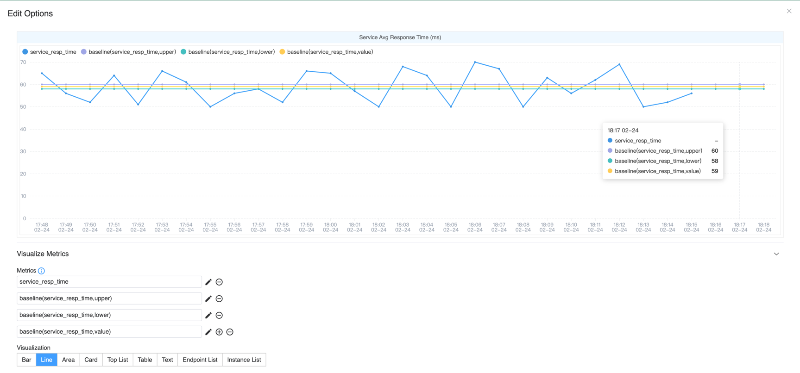

## Background

[Apache SkyWalking](https://skywalking.apache.org/) 是一个开源的应用性能监控（APM）系统，可从业务应用程序中收集各种数据，包括 指标、日志和分布式追踪信息，并通过UI进行可视化展示。

此外，SkyWalking允许用户在配置文件中为特定指标设置阈值规则，以实现告警。当某个服务的指标值在指定时间内超过预设阈值时，系统会触发告警。

然而，在实际场景中，不同时间段的访问流量和调用模式存在较大差异。例如，在电商系统中，凌晨的购买人数远少于白天，导致系统的各项指标在不同时段内波动范围不同。因此，单纯依赖静态阈值进行告警，很难保证准确性。

因此，基于历史数据动态生成每个时段的阈值变得至关重要。

## SkyAPM SkyPredictor

基于上述场景，我们开发了[SkyAPM SkyPredictor](https://github.com/SkyAPM/SkyPredictor/)项目来解决这一问题。
SkyPredictor 会定期从SkyWalking采集数据并生成动态基线，而SkyWalking则可查询SkyPredictor，获取最近一段时间的预测指标值，从而实现更精准、更自适应的告警机制。

注意：SkyWalking 并不强依赖 SkyPredictor 服务。
如果未配置 SkyPredictor，SkyWalking不会查询预测值，也不会导致系统故障。
另外，你也可以使用自定义AI引擎来构建自己的预测系统，只需按照官方文档实现相应协议即可：
https://skywalking.apache.org/docs/main/next/en/setup/ai-pipeline/metrics-baseline-integration/

### 系统架构


如上图所示，该系统包含两个主要部分：

1. **数据采集与预测**： SkyPredictor通过访问SkyWalking OAP中的HTTP服务来查询历史指标数据。
然后，对这些数据进行处理，生成未来一段时间的 动态预测值。
2. **基线查询与告警**： OAP会定期向SkyPredictor查询预测的动态基线。 然后使用**MQE**计算当前指标值与预测结果的偏差。 如果偏差超过设定的阈值，则触发告警。

### 数据采集

SkyPredictor通过以下三个API进行数据查询：

1. [**Status API**](https://skywalking.apache.org/docs/main/next/en/status/query_ttl_setup/): 获取OAP存储的历史数据TTL（存活时间），用于确定可用的历史数据时间范围，以便导出所有历史指标。
2. [**Metadata API**](https://skywalking.apache.org/docs/main/next/en/api/query-protocol/#v2-apis): 从OAP中查询指定Layer下的所有服务列表，获取哪些服务正在生成数据。
3. [**MQE API**](https://skywalking.apache.org/docs/main/next/en/api/metrics-query-expression/): 遍历所需计算的指标和所有服务，获取每个服务在这些指标上的历史数据值。

这些API共同作用，使SkyPredictor能够收集历史指标数据，并计算未来告警的动态基线。

### 预测

当SkyPredictor服务从OAP采集到数据后，它会使用[开源Prophet库](https://github.com/facebook/prophet)进行预测。预测流程包括以下步骤：

1. **数据准备**: 将采集到的指标数据按**服务+指标名称**拆分为多个[DataFrame](https://pandas.pydata.org/docs/reference/api/pandas.DataFrame.html)。
2. **数据时长检查**: 如果 DataFrame 的数据量**少于2天（可配置）**，则跳过预测，以避免数据不足导致预测不准确。
3. **预测计算**: 使用 Prophet 预测**未来 24 小时（可配置）中每个小时**的指标值。
4. **存储结果**: 将预测结果**存储在本地文件**，以供外部查询使用。

#### 预测值与范围

SkyPredictor 服务支持计算以下两种类型的值：
1. **预测值**: 根据历史数据计算下一个小时的预期指标值。
2. **预测范围**: 计算下一个小时可能的**最大值和最小值**，表示该指标的**预期波动范围**。

这些预测值可用于建立动态基线，使告警系统能够识别自然波动并准确检测异常。

### 基线 MQE 与告警结合

在 OAP 中，可以直接使用 MQE 进行预测值查询，以获取未来一段时间的预测数据。

由于 SkyWalking 告警系统 已支持通过 MQE 表达式进行告警验证，因此用户可以直接在告警配置文件中使用 MQE 表达式配置动态阈值告警。

详细信息请参考[官方文档](https://skywalking.apache.org/docs/main/next/en/api/metrics-query-expression/#baseline-operation)。

### 数据采集对预测精度的影响

Predictor 服务支持两种不同的数据采集与预测粒度，每种方式在准确性和资源消耗方面各有取舍。

1. 分钟级别采集: 采集分钟级别的指标数据。
   1. 适用于波动较大的指标，可捕捉更精细的细节。
   2. 资源消耗较高（OAP、数据库 CPU 负载、Predictor CPU 与内存消耗较大）。
   3. 适用于基于当前值进行告警配置。
2. 小时级别采集: 采集小时级别的指标数据。
   1. 相较于分钟级别，消耗更少的资源。
   2. 数据量较小，计算与存储成本更低。
   3. 适用于基于预测范围进行告警配置。

| 采集粒度  | 数据波动  | 数据量 | 当前值预测准确性 | 预测范围准确性 | 适用场景                   |
|-------|-------|-----|----------|---------|------------------------|
| 分钟级别  | 波动较大  | 大   | 不太准确     | 更准确     | 适用于 高波动指标，建议使用 范围告警规则  |
| 小时级别  | 波动较小  | 小   | 更准确      | 相对准确    | 适用于 稳定指标，建议使用 当前值告警规则  |


如何选择合适的采集粒度？
**高波动指标（如瞬时流量、短周期变化的指标）**：建议使用分钟级别采集，并配置范围告警以提高准确性。
**稳定指标（如长期稳定的延迟、均衡负载）**：建议使用小时级别采集，并基于当前值进行告警，提高计算效率。

默认情况下，Predictor 采用小时级别采集。

### OAP 与 Predictor 的调度与缓存

SkyWalking OAP 和 SkyAPM Predictor 都实现了缓存策略，以防止过度执行，优化资源使用。

Predictor 默认每天在 00:10、08:10 和 16:10 运行一次，预测未来 24 小时的指标数据，并将预测结果存储在本地。
每 8 小时更新一次预测数据，以在资源消耗和实时准确性之间取得平衡。执行时间选择在整点 10 分钟后，而不是 00:00、08:00 等整点，目的是确保
历史数据已经完整写入数据库，避免因数据未及时同步而导致查询异常。

OAP 会在需要时向 Predictor 发送查询请求，获取单个服务所有需要预测的指标，查询范围覆盖当前时间的**前后 24 小时**。为了提高查询效率，OAP 会**将查询结果缓存 1 小时**，防止短时间内重复查询 SkyPredictor，减少系统负载。

这些机制保证了预测数据的实时性和准确性，同时降低了不必要的计算和资源消耗，确保 SkyWalking 在高效运行的同时能够提供准确的动态基线预测。

## Demo

在本节中，我将演示如何在 Kubernetes 集群中部署 SkyWalking 集群以及 SkyPredictor 服务，以预览某个指标的预测值。通过这个实践示例，你可以更直观地了解如何有效使用这些组件。

### 部署 SkyWalking Showcase

SkyWalking Showcase 提供了一整套示例服务，并可以通过 SkyWalking 进行监控。详细信息请参考[官方文档](https://skywalking.apache.org/docs/skywalking-showcase/next/readme/)。

在本次演示中，我们仅部署 SkyPredictor 服务、SkyWalking OAP 和 UI，以便展示预测功能的应用。

```shell
export FEATURE_FLAGS=single-node,banyandb,baseline
make deploy.kubernetes
```

### 导入历史数据

由于新部署的集群不包含历史数据，我编写了一个 Python 脚本来模拟数据。这使得 SkyPredictor 服务能够导入数据，从而可以生成未来一段时间的基线预测值。

在导入数据之前，需要先在 Kubernetes 集群中开放 OAP 服务的 11800 端口。可以使用 `kubectl` 执行以下命令来完成端口转发：

```shell
kubectl port-forward -n skywalking-showcase   service/demo-oap 11800:11800
```

接下来，你可以使用以下命令下载并运行示例脚本：

```shell
# clone and get into the demo repository
git clone https://github.com/mrproliu/SkyPredictorDemo && cd SkyPredictorDemo
# installing dependencies
make install
# import data(7 days)
python3 -m client.generate localhost:11800 7
```

最终, 你可以在命令行中看到: **Metrics send success!**.

### 执行预测任务

由于 SkyPredictor 服务是基于 cron 调度运行的，因此在导入数据后，它不会立即执行预测。为了强制触发数据采集和预测，你可以手动删除 SkyPredictor Pod，让 Kubernetes 自动重启它，从而立即执行预测任务：

```shell
kubectl delete pod -n skywalking-showcase $(kubectl get pods -n skywalking-showcase --no-headers -o custom-columns=":metadata.name" | grep "skywalking-predictor")
```

当 Predictor Pod 重新启动后，你可以检查其日志，以确认预测过程是否已经完成。

```
Predicted for e2e-test-dest-service of service_xxx to xxxx-xx-xx xx:xx:xx.
```

### View in SkyWalking UI

当预测过程完成后，你可以在 SkyWalking UI 中配置指标组件来可视化预测值。

首先，运行以下命令，将 UI 服务端口转发到本地：

```shell
kubectl port-forward svc/demo-ui 8080:80 --namespace skywalking-showcase
```

然后，你可以访问该页面，查看之前使用 Python 脚本生成的服务流量数据：
http://localhost:8080/dashboard/MESH/Service/ZTJlLXRlc3QtZGVzdC1zZXJ2aWNl.1/Mesh-Service

要显示预测值，请编辑 Service Avg Resp Time Widget，并添加以下 MQE 表达式：

```
# The maximum predicted response time.
baseline(service_resp_time, upper)
# The predicted response time.
baseline(service_resp_time, value)
# The minimum predicted response time.
baseline(service_resp_time, lower)
```

最后，你可以在组件中看到预测值的可视化展示。



由于默认的数据采集粒度为小时级，并且该指标存在较大的波动，因此预测值基于小时级平均数据而非分钟级数据进行计算。此方法能够平滑波动，提供更稳定的监控基线。

现在，你应该可以在 UI 中看到预测的响应时间与实际值并排展示，这将帮助你更直观地分析趋势，并配置动态告警阈值，提升告警的准确性。

## 结论

SkyAPM SkyPredictor 通过动态基线取代静态阈值，提高了告警的准确性。它采集历史指标数据，利用 Prophet 预测未来值，并支持分钟级或小时级数据采集，以提供更精确的预测。通过将预测结果集成到 SkyWalking UI，用户可以优化告警配置，并提升系统可观测性。

借助动态阈值，SkyWalking 能够自适应流量模式，更有效地检测异常，减少误报，并提升系统的可观测能力。
