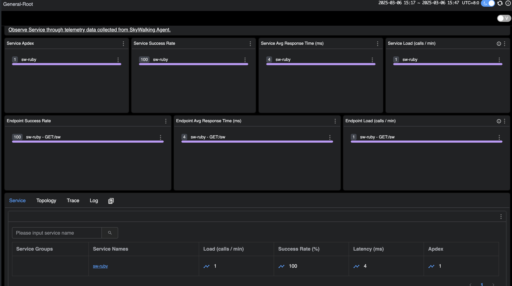
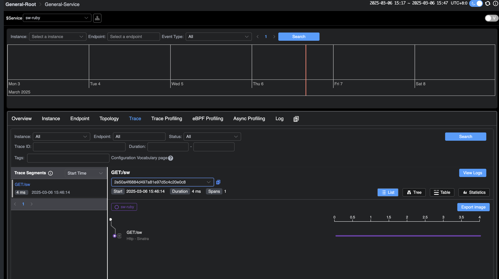

## 背景

Ruby 是一种动态、面向对象的编程语言，它的语法简洁优雅，支持多种编程范式，包括面向对象、函数式和元编程。其中依靠强大的元编程能力，Ruby
允许在运行时修改类和对象的行为。
SkyWalking 提供了 [Ruby gem](https://rubygems.org/gems/skywalking)，方便 Ruby 项目集成, 该 gem 支持许多开箱即用的框架
和 gem。

本文基于 skywalking-ruby-v0.1，我们将指导你如何快速将 skywalking-ruby 项目集成到 Ruby 项目中，并以 redis-rb 为例，简要地介绍
SkyWalking Ruby 对插件自动探针的实现原理。

演示部分包括以下步骤：

1. **部署 SkyWalking**：这涉及设置 SkyWalking 后端和 UI 程序，使你能够看到最终效果。
2. **为不同 Ruby 项目集成 skywalking**：这里介绍了不同的 Ruby 项目如何集成 skywalking。
3. **应用部署**：你将导出环境变量并部署应用程序，以促进你的服务与 SkyWalking 后端之间的通信。
4. **在 SkyWalking UI 上可视化**：最后，你将发送请求并在 SkyWalking UI 中观察效果。

## 部署 SkyWalking

请从官方 SkyWalking 网站下载 [SkyWalking APM 程序](https://skywalking.apache.org/downloads/#SkyWalkingAPM)
。然后执行以下两个命令来启动服务:

```bash
# 启动 OAP 后端
> bin/oapService.sh
# 启动 UI
> bin/webappService.sh
```

接下来，你可以访问地址 `http://localhost:8080/` 。此时，由于尚未部署任何应用程序，因此你将看不到任何数据。

## 为不同 Ruby 项目集成 SkyWalking

推荐使用 [Bundler](https://bundler.io/) 来安装和管理 skywalking 的依赖。只需在 Gemfile 中声明，然后运行 bundle install
即可完成安装。

```bash
# Gemfile
source "https://rubygems.org"

gem "skywalking"
```

### 在 Rails 项目中集成

对于 Rails 项目，推荐使用以下命令自动生成配置文件：

```bash
bundle exec rails generate skywalking:start
```

该命令会在 `config/initializers` 目录下自动生成 `skywalking.rb` 文件，你可以在其中配置启动参数。

### 在 Sinatra 项目中集成

对于 Sinatra 项目，你需要手动在应用启动时调用 Skywalking.start。例如：

```ruby
require 'sinatra'
require 'skywalking'

Skywalking.start

get '/sw' do
  "Hello SkyWalking!"
end
```

在 Gemfile 中，将 skywalking 放在 sinatra 之后，并在初始化时使用 Bundler.require，或者在 sinatra gem 加载后
调用 require 'skywalking'。注意，skywalking gem 需要位于其他 gem（如 redis、elasticsearch）之后。

## 应用部署

在开始部署应用程序之前，你可以通过环境变量更改 SkyWalking
中当前应用程序的服务名称。你还可以更改其配置，例如服务器端的地址。有关详细信息，请[参阅文档](https://skywalking.apache.org/docs/skywalking-ruby/next/en/setup/quick-start/#configuration) 。

在这里，我们将当前服务的名称更改为 `sw-ruby`。

接下来，你可以启动应用程序，这里以 sinatra 作为示例：

```bash
export SW_AGENT_SERVICE_NAME=sw-ruby

ruby sinatra.rb
```

## 在 SkyWalking UI 上可视化

现在，向应用程序发送请求并在 SkyWalking UI 中观察结果。

几秒钟后，重新访问 `http://localhost:8080` 的 SkyWalking UI。能够在主页上看到部署的 `demo` 服务。



此外，在追踪页面上，可以看到刚刚发送的请求。



## 插件实现机制

要了解 Ruby Agent 对插件自动探针的实现机制，首先要了解 Ruby 中祖先链的概念。祖先链是一个有序的列表，在 Ruby
中，每个类或模块都有一个祖先链，
它包含了一个类或模块的所有父类以及 mixin 模块（通过 include、prepend 或 extend 混入的模块）。
Ruby 在查找方法时，会按照祖先链的顺序依次查找，直到找到目标方法或抛出 NoMethodError。

```ruby
class User
end
```

我们定义了一个 User 类，那么它的祖先链是如下图：


接下来用 `prepend` 方法混入一个模块：

```ruby
module Dapper
  def brave
    "Hello from brave"
  end
end

class User
  prepend Dapper
end

p User.new.brave # => "Hello from brave"
```

`prepend` 会在上图 1 处进行插入，Ruby 首先在 Dapper 模块中查找 brave 方法，找到并调用，如果 Dapper 中没有 brave 方法，
Ruby 会继续查找 User 类。 如果 User 类中也没有，Ruby 会继续查找 Object，依此类推。

根据这样的机制，简单介绍下我们如何对 [redis-rb](https://github.com/redis-rb/redis-client) 进行方法插桩，下面代码是要进行插桩的目标方法：

```ruby
# lib/redis/client.rb
class Redis
  class Client < ::RedisClient
    def call_v(command, &block)
     super(command, &block)
    rescue ::RedisClient::Error => error
     Client.translate_error!(error)
    end
  end
end
```

下面是进行插桩的核心代码：

```ruby
module Skywalking
  module Plugins
    class Redis5 < PluginsManager::SWPlugin
      module Redis5Intercept
        def call_v(args, &block)
          operation = args[0] rescue "UNKNOWN"
          return super if operation == :auth

          Tracing::ContextManager.new_exit_span(
            operation: "Redis/#{operation.upcase}"
          ) do |span|
            # 省略对 span 的处理 
            super(args, &block) # 调用原方法
          end
        end
      end

      def install
        ::Redis::Client.prepend Redis5Intercept
      end
    end
  end
end
```

这里我们定义了一个 Redis5Intercept 模块，并将其作为 `::Redis::Client` 的前置模块，根据 Ruby 方法查找机制，
当 `Redis::Client` 的 `call_v` 方法被调用时，Ruby 会首先会执行 `Redis5Intercept` 中的 `call_v` 方法，这里祖先链的顺序如下：

```markdown
Redis5Intercept -> Redis::Client -> ...（其他父类和模块）
```

同时在 `Redis5Intercept` 中的 `call_v` 方法中，`super(args, &block)` 会沿着祖先链找到下一个同名方法，
在这里也就是 `Redis::Client` 中的原始 `call_v` 方法，同时传递原始的参数和代码块。

## 总结

本文讲述了 Skywalking Ruby 在 Ruby 项目中的集成方法，并简要介绍了 SkyWalking Ruby 对插件自动探针的实现机制。

目前 Ruby 探针处于早期的开发阶段，未来我们将继续扩展 SkyWalking Ruby 的功能，添加更多插件支持。所以，请继续关注！