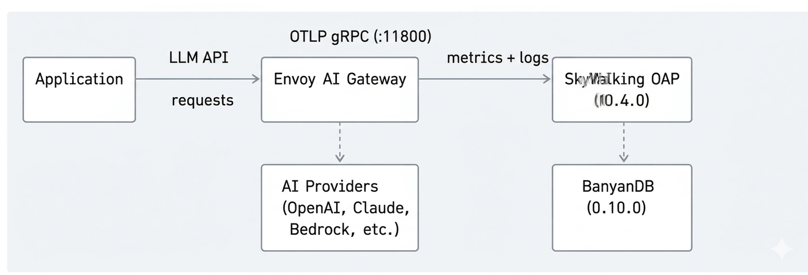
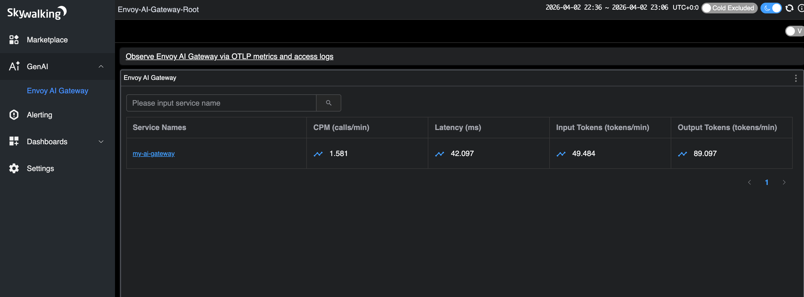
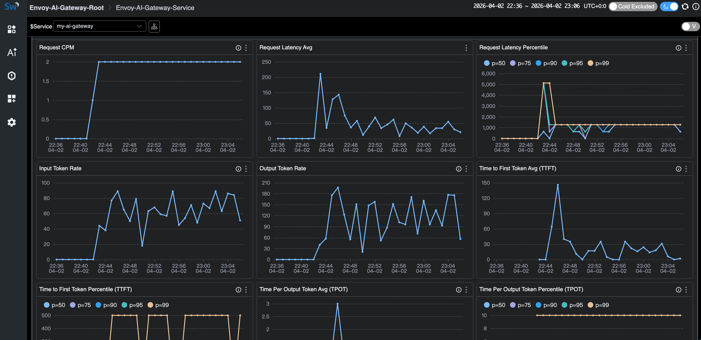
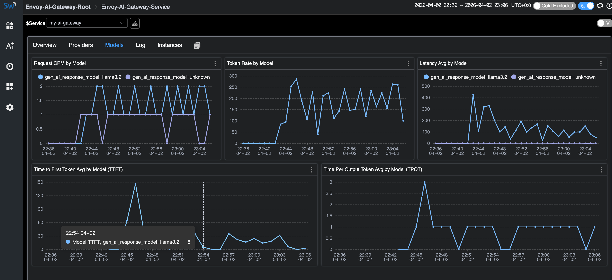
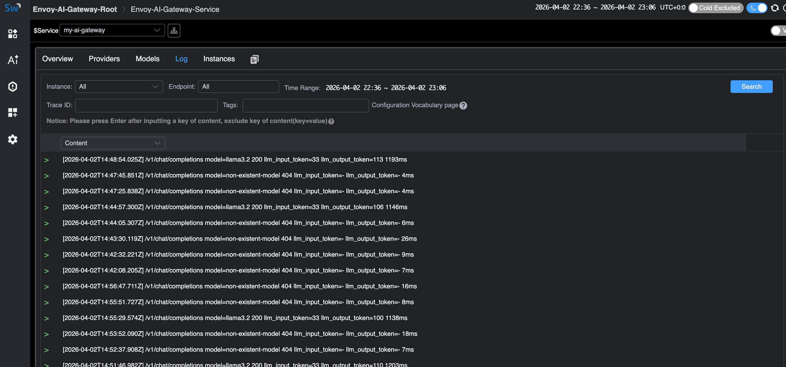

## 问题：LLM 流量缺乏统一观测

LLM 流量正在成为生产基础设施中不可忽视的一部分。团队同时在调用 OpenAI、Anthropic、AWS Bedrock、Azure OpenAI、Google Gemini——往往还不止一个提供商。但大多数组织对这些流量缺乏统一的可见性：

- **Token 费用失控**，却不知道哪个团队、哪个模型、哪个提供商在烧钱。一个配置不当的 prompt 模板就可能在无人察觉的情况下烧掉几千美元。
- **提供商故障引发连锁反应。** OpenAI 出问题的那一小时，你的应用也跟着挂——而你既没有故障切换的可见性，也无法自动切换提供商。
- **缺乏统一指标。** 延迟、首 Token 耗时（TTFT）、每 Token 输出耗时（TPOT）、Token 用量、错误率——每个提供商的报告方式都不一样，有些甚至不提供。没有一个统一的面板能做对比。

这和十年前微服务面临的可观测性困境如出一辙。当时的解法是服务网格和内置遥测的 API 网关。对 AI 工作负载来说，答案就是 AI 网关。

## 为什么选择 AI 网关

[Envoy AI Gateway](https://aigateway.envoyproxy.io/) 是一个开源 AI 网关，构建在 [Envoy Proxy](https://www.envoyproxy.io/) 和 [Envoy Gateway](https://gateway.envoyproxy.io/) 之上。底层就是云原生世界里已经广泛部署的 Envoy，天然具备基础设施级的稳定性和性能。

核心能力：

- **多提供商路由** —— 支持 16+ AI 提供商（OpenAI、Anthropic、AWS Bedrock、Azure OpenAI、Google Gemini、Mistral、Cohere、DeepSeek 等），统一 API 接入。
- **基于 Token 的限流** —— 按 Token 消耗限流，而不只是按请求数。
- **提供商故障切换** —— 某个提供商宕机或响应慢时自动切换。
- **模型虚拟化** —— 抽象模型名称，让应用与具体提供商解耦。
- **两层架构** —— 参考架构包含一个集中入口网关（Tier 1）负责认证和全局路由，以及每集群网关（Tier 2）负责推理优化。
- **CNCF 生态原生** —— 运行在 Kubernetes 上，兼容现有的 Envoy Filter、WASM 插件和标准 Kubernetes Gateway API 资源。

Envoy AI Gateway 原生支持通过 OTLP 发送 GenAI 指标和访问日志，遵循 [OpenTelemetry GenAI 语义约定](https://opentelemetry.io/docs/specs/semconv/gen-ai/)，可以直接接入任何兼容 OpenTelemetry 的后端。

从 SkyWalking 10.4.0 开始，OAP 原生接收和分析 Envoy AI Gateway 的 OTLP 指标和访问日志——中间不需要部署 OpenTelemetry Collector。

## 数据流

AI Gateway 通过 OTLP gRPC 直接将遥测数据推送到 SkyWalking：



1. **应用** 通过 Envoy AI Gateway 发送 LLM API 请求。
2. **Envoy AI Gateway** 将请求路由到 AI 提供商（或 Ollama 这样的本地模型），同时记录 GenAI 指标（Token 用量、延迟、TTFT、TPOT）和访问日志。
3. 网关通过 **OTLP gRPC** 直接将指标和日志推送到 **SkyWalking OAP** 的 11800 端口。
4. SkyWalking OAP 用 MAL 规则解析指标、用 LAL 规则解析访问日志，然后统一存储到 **BanyanDB**。

不需要 OpenTelemetry Collector。SkyWalking OAP 内置的 OTLP 接收器可以直接处理所有数据。

## 本地体验

这个 Demo 使用 [Ollama](https://ollama.com/) 作为本地 LLM 后端，不需要任何 API Key 就能跑起来。[Envoy AI Gateway CLI](https://github.com/envoyproxy/ai-gateway/tree/main/cmd/aigw)（`aigw`）提供独立运行模式，不依赖 Kubernetes，非常适合本地测试。

### 前置条件

- Docker 和 Docker Compose
- 主机上已安装 [Ollama](https://ollama.com/)

### 第一步：启动 Ollama

让 Ollama 监听所有网络接口，以便 Docker 容器能访问到：

```bash
OLLAMA_HOST=0.0.0.0 ollama serve
```

拉取一个小模型用于测试：

```bash
ollama pull llama3.2:1b
```

### 第二步：启动服务栈

创建 `docker-compose.yaml`：

```yaml
services:
  banyandb:
    image: apache/skywalking-banyandb:0.10.0
    container_name: banyandb
    ports:
      - "17912:17912"
    command: standalone --stream-root-path /tmp/stream-data --measure-root-path /tmp/measure-data
    healthcheck:
      test: ["CMD-SHELL", "wget -qO- http://localhost:17913/api/healthz || exit 1"]
      interval: 5s
      timeout: 3s
      retries: 10

  oap:
    image: apache/skywalking-oap-server:10.4.0
    container_name: oap
    depends_on:
      banyandb:
        condition: service_healthy
    ports:
      - "11800:11800"
      - "12800:12800"
    environment:
      SW_STORAGE: banyandb
      SW_STORAGE_BANYANDB_TARGETS: banyandb:17912
    healthcheck:
      test: ["CMD-SHELL", "bash -c 'echo > /dev/tcp/localhost/12800' || exit 1"]
      interval: 10s
      timeout: 5s
      retries: 30
      start_period: 60s

  ui:
    image: apache/skywalking-ui:10.4.0
    container_name: ui
    depends_on:
      oap:
        condition: service_healthy
    ports:
      - "8080:8080"
    environment:
      SW_OAP_ADDRESS: http://oap:12800

  aigw:
    image: envoyproxy/ai-gateway-cli:latest
    container_name: aigw
    depends_on:
      oap:
        condition: service_healthy
    environment:
      - OPENAI_BASE_URL=http://host.docker.internal:11434/v1
      - OPENAI_API_KEY=unused
      - OTEL_SERVICE_NAME=my-ai-gateway
      - OTEL_EXPORTER_OTLP_ENDPOINT=http://oap:11800
      - OTEL_EXPORTER_OTLP_PROTOCOL=grpc
      - OTEL_METRICS_EXPORTER=otlp
      - OTEL_LOGS_EXPORTER=otlp
      - OTEL_METRIC_EXPORT_INTERVAL=5000
      - OTEL_RESOURCE_ATTRIBUTES=job_name=envoy-ai-gateway,service.instance.id=aigw-1,service.layer=ENVOY_AI_GATEWAY
    ports:
      - "1975:1975"
    extra_hosts:
      - "host.docker.internal:host-gateway"
    command: ["run"]
```

启动所有服务：

```bash
docker compose up -d
```

等待所有服务变为健康状态（BanyanDB 先启动，然后是 OAP，最后是 UI 和 AI Gateway）：

```bash
docker compose ps
```

`aigw` 服务的关键 OTLP 配置：

| 环境变量 | 值 | 用途 |
|---------|-------|---------|
| `OTEL_SERVICE_NAME` | `my-ai-gateway` | SkyWalking 中的服务名 |
| `OTEL_EXPORTER_OTLP_ENDPOINT` | `http://oap:11800` | SkyWalking OAP gRPC 端点 |
| `OTEL_EXPORTER_OTLP_PROTOCOL` | `grpc` | OTLP 传输协议 |
| `OTEL_METRICS_EXPORTER` | `otlp` | 启用指标推送 |
| `OTEL_LOGS_EXPORTER` | `otlp` | 启用访问日志推送 |

`OTEL_RESOURCE_ATTRIBUTES` 必须包含：
- `job_name=envoy-ai-gateway` —— MAL/LAL 规则的路由标签
- `service.instance.id=<id>` —— 实例标识
- `service.layer=ENVOY_AI_GATEWAY` —— 将日志路由到 AI Gateway LAL 规则

MAL 和 LAL 规则在 SkyWalking OAP 中默认启用，不需要额外配置。

### 第三步：运行 Demo 应用

创建一个简单的 Python 应用，通过 AI Gateway 发送请求（`app.py`）。
它混合了普通请求、流式请求（用于产生 TTFT/TPOT 指标）和错误请求（不存在的模型 → HTTP 404，始终会被 LAL 采样策略捕获）：

```python
import time, random, requests

GATEWAY = "http://localhost:1975"
HEADERS = {"Authorization": "Bearer unused", "Content-Type": "application/json"}

questions = [
    "What is Apache SkyWalking? Answer in one sentence.",
    "What is Envoy Proxy used for? Answer in one sentence.",
    "What are the benefits of an AI gateway? Answer in two sentences.",
    "Explain observability in three sentences.",
]

def chat(model, question, stream=False):
    resp = requests.post(
        f"{GATEWAY}/v1/chat/completions",
        json={"model": model, "messages": [{"role": "user", "content": question}], "stream": stream},
        headers=HEADERS, timeout=60, stream=stream,
    )
    if stream:
        chunks = []
        for line in resp.iter_lines():
            if line:
                chunks.append(line.decode())
        return resp.status_code, f"[streamed {len(chunks)} chunks]"
    return resp.status_code, resp.json()

while True:
    r = random.random()
    if r < 0.2:
        # Error request: non-existent model triggers 404
        status, body = chat("non-existent-model", "hello")
        print(f"[error] model=non-existent-model status={status}")
    elif r < 0.5:
        # Streaming request — generates TTFT and TPOT metrics
        q = random.choice(questions)
        status, info = chat("llama3.2:1b", q, stream=True)
        print(f"[stream] status={status} {info}")
    else:
        # Normal non-streaming request
        q = random.choice(questions)
        status, body = chat("llama3.2:1b", q)
        answer = body.get("choices", [{}])[0].get("message", {}).get("content", "")[:80]
        tokens = body.get("usage", {})
        print(f"[ok] status={status} tokens={tokens} answer={answer}...")
    time.sleep(random.randint(20, 30))
```

运行：

```bash
pip install requests
python app.py
```

应用通过 1975 端口与 AI Gateway 通信，AI Gateway 再路由到 Ollama。每次请求都会产生 GenAI 指标（Token 用量、延迟、TTFT、TPOT）和访问日志，由网关通过 OTLP 推送到 SkyWalking。

错误请求（不存在的模型 → HTTP 404）始终会被访问日志采样策略捕获，所以在 SkyWalking 的日志视图中一定能看到。

### 第四步：在 SkyWalking UI 中查看

打开 [http://localhost:8080](http://localhost:8080)，选择 **GenAI > Envoy AI Gateway** 菜单。

服务列表显示 `my-ai-gateway`，可以一览 CPM、延迟和 Token 速率：



点击进入服务详情，查看完整仪表盘——请求 CPM、延迟（平均值 + 百分位数）、输入/输出 Token 速率、TTFT 和 TPOT：



**Providers** 标签页按 AI 提供商维度展示指标：


**Models** 标签页展示每个模型的指标，包括 TTFT 和 TPOT（仅流式请求）。注意 `unknown` 模型条目——这些就是使用不存在模型的错误请求：



**Log** 标签页展示访问日志。采样策略会丢弃正常的成功响应，但始终保留错误（HTTP 404）和高 Token 消耗的请求：



### 清理

```bash
docker compose down
```

## Kubernetes 生产部署

生产环境中，Envoy AI Gateway 作为完整的 Kubernetes 控制器运行，以 Envoy Gateway 作为控制面。详见 [Envoy AI Gateway 入门指南](https://aigateway.envoyproxy.io/docs/getting-started/)。

OTLP 配置方式相同——在 AI Gateway 的 External Processor 上设置 `OTEL_*` 环境变量，指向 SkyWalking OAP 的 gRPC 端口（11800）。详见 [SkyWalking Envoy AI Gateway 监控文档](https://skywalking.apache.org/docs/main/next/en/setup/backend/backend-envoy-ai-gateway-monitoring/)。

## 不用 AI 网关也能做 GenAI 可观测

并非所有场景都需要 AI 网关。如果你的应用直接调用 LLM 提供商，SkyWalking 10.4.0 也提供了基于 [Virtual GenAI](https://skywalking.apache.org/docs/main/next/en/setup/service-agent/virtual-genai/) 层的 GenAI 可观测方案。

任何接入了 SkyWalking、OpenTelemetry 或 Zipkin 探针的应用都能使用这个功能。只要 Trace 中携带 `gen_ai.*` 标签（遵循 [OpenTelemetry GenAI 语义约定](https://opentelemetry.io/docs/specs/semconv/gen-ai/)），SkyWalking 就能从客户端视角推导出每提供商、每模型的指标：延迟、Token 用量、成功率和预估费用。

对于 Java 应用，SkyWalking Java Agent（9.7+）内置了 Spring AI 插件，自动为 13+ 提供商（OpenAI、Anthropic、AWS Bedrock、Google GenAI、DeepSeek、Mistral 等）的调用注入正确的 `gen_ai.*` Span 标签——不需要改代码。

这与上面介绍的 Envoy AI Gateway 监控是不同的使用场景：

- **Envoy AI Gateway 层**：基础设施级可观测——网关视角，覆盖所有流量。适合负责集中 AI 路由的平台团队。
- **Virtual GenAI 层**：应用级可观测——每个应用自己看到的 LLM 调用情况。适合没有集中网关的团队，或者需要按应用维度跟踪费用的场景。

## 参考资料

- [Envoy AI Gateway](https://aigateway.envoyproxy.io/) —— 项目官网和文档
- [Envoy AI Gateway CLI](https://github.com/envoyproxy/ai-gateway/tree/main/cmd/aigw) —— 本地开发用的独立运行模式
- [SkyWalking Envoy AI Gateway 监控](https://skywalking.apache.org/docs/main/next/en/setup/backend/backend-envoy-ai-gateway-monitoring/) —— OAP 配置文档
- [SkyWalking Virtual GenAI](https://skywalking.apache.org/docs/main/next/en/setup/service-agent/virtual-genai/) —— 客户端侧 GenAI 可观测
- [OpenTelemetry GenAI 语义约定](https://opentelemetry.io/docs/specs/semconv/gen-ai/) —— 两个项目共同遵循的指标/属性标准
