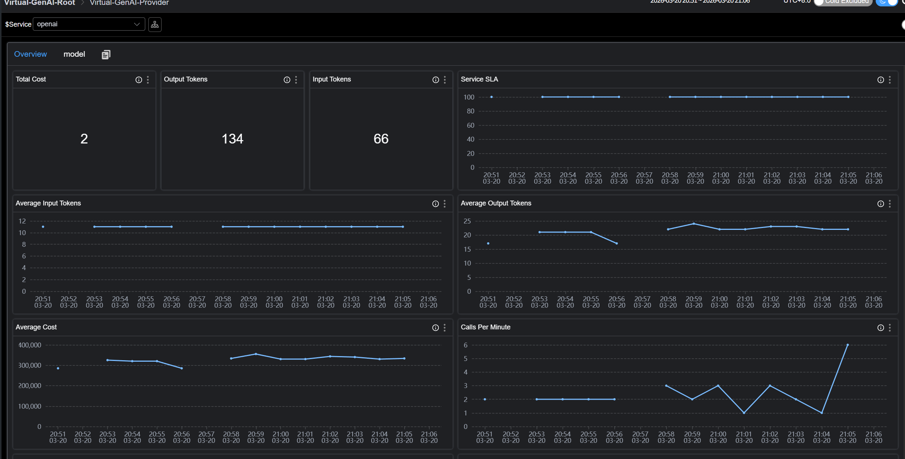
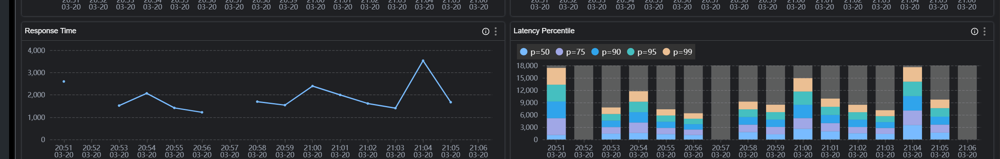
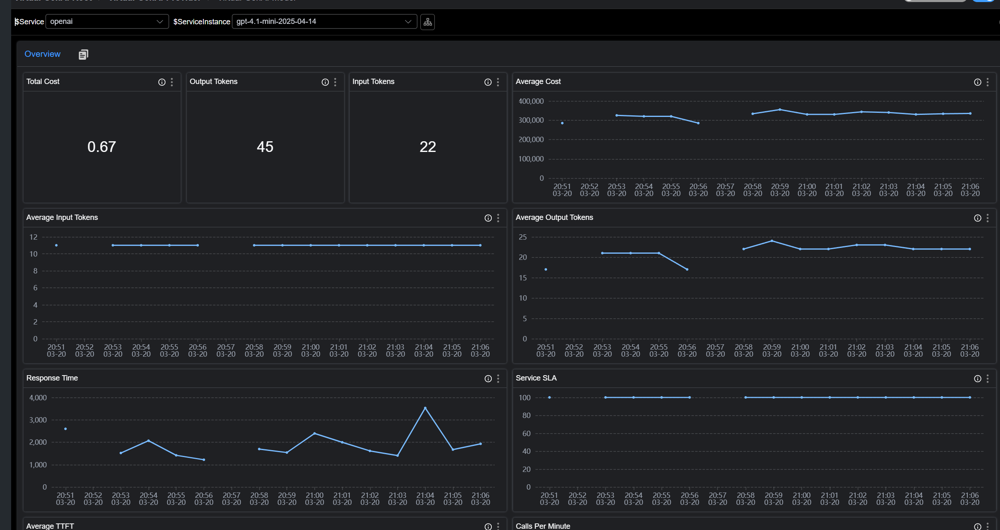
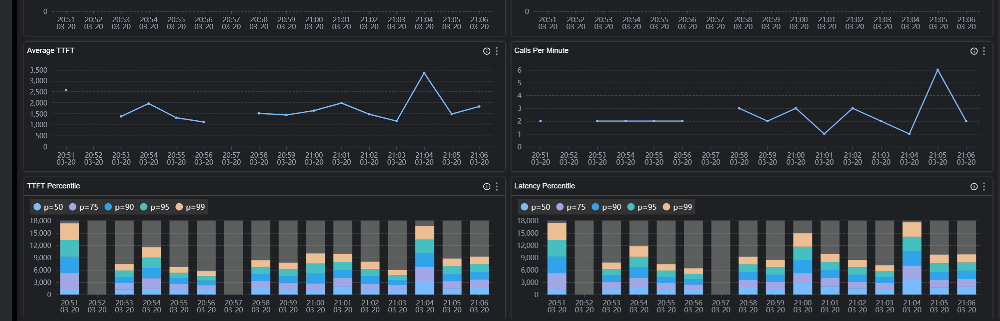
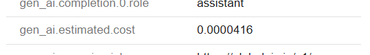

# 问题：当应用开始“吞噬”大模型，监控却留下了盲区
随着生成式 AI（GenAI）在企业业务中的深度渗透，开发者正面临一个尴尬的局面：我们在应用中通过`Spring AI`或`OpenAI SDK`快速集成了强大的大模型能力，但对于这些调用的实际表现却几乎一无所知。


1. **成本与性能的“黑盒”：昂贵的模型真的更具性价比吗？**  
面对高昂的大模型账单，我们往往只知道把钱交给了某个`Provider`，却算不清这笔账在应用内部的“投入产出比”。
盲目的选型升级：为了追求更好的体验，你可能将业务默认切换到了成本更高的旗舰模型。但在具体的业务场景下，花费数倍的 Token 成本，它真的能在真实请求中带来更低的延迟和更快的 TTFT(Time to First Token) 吗？
缺乏真实的评估基准：脱离了真实的业务请求，单纯看官网的 Benchmark 意义不大，你需要知道在实际的 Prompt 长度和并发压力下，同一`Provider`下的哪个模型能在“Token/Cost 消耗”与“响应速度”之间达到完美的平衡。如果没有应用侧的数据支撑，你根本无从判断哪款模型才是当前业务的最优解。


2. **消失的“黄金超时时间”**  
很多团队在代码里给 LLM 调用设置超时（Timeout）时，往往是拍脑袋决定（比如 30s 或 60s）。  
设太短：长文本生成或模型高峰期时，请求会被频繁强行中断，导致业务失败率飙升。  
设太长：如果下游供应商出现故障（卡死），大量的请求会堆积在应用内存中，阻塞执行线程，最终导致整个 Java 应用甚至微服务集群的瘫痪。
只有真正掌握了预估的整体调用延迟（P99/P95 Latency），你才能基于数据而非直觉，为不同模型设置最合理的超时策略。


3. **被忽视的体验杀手：TTFT**  
在 GenAI 场景下，用户对“快”的感知并不完全取决于整个对话结束的总耗时，而取决于**“第一行字什么时候跳出来”**。
一个总耗时 10 秒但 TTFT 仅 500ms 的流式响应，给用户的观感是“秒回”。
一个总耗时 5 秒但 TTFT 需要 4s 的非流式响应，给用户的观感却是“卡死”。
如果你的观测系统只能看到总耗时，你就会漏掉最核心的 UX 指标，无法解释为什么用户反馈“AI 很慢”即便总耗时看起来还行。


**SkyWalking 10.4：应用视角的“数字仪表盘”**  
Apache SkyWalking 自 10.4 版本引入的 Virtual GenAI 能力，正是为了解决应用层侧的这种“观测真空”。它不依赖任何外部网关，直接通过应用侧探针（如 Java Agent）在客户端视角采集最真实的数据。  
- 精准的延迟分布（Latency Percentiles）：通过 P50、P90、P99 等多维指标，帮你勾勒出 LLM 调用的真实波动曲线，为设置“动态超时时间”提供科学依据。  
- 核心 UX 指标——TTFT 监控：原生支持流式（Streaming）调用的首字延迟统计。通过对比不同 Provider 或不同模型的 TTFT，你可以优化提示词（Prompt）策略或切换更快的模型，确保用户体验始终在线。  
- 多维度的模型“画像”分析：在 Provider 和 Model 两个维度上，将 Token 消耗、预估成本与性能指标深度对齐。这让你不再看供应商全网的“理想平均数”，而是看清你的应用在调用特定模型时的真实表现，从而在复杂的模型生态中选出最具性价比的选型方案。

# 虚拟 GenAI 观测

> **虚拟 GenAI** 代表了由探针插件检测到的生成式 AI 服务节点。GenAI 操作的性能指标均基于 **GenAI 客户端视角**。

例如，Java 探针中的 **Spring AI 插件**可以检测一次对话补全（Chat Completion）请求的响应延迟。随后，SkyWalking 将在仪表盘中展示：
* **流量与成功率** (CPM & SLA)
* **响应延迟** (Latency & TTFT)
* **Token 消耗** (Input/Output)
* **预估成本** (Estimated Cost)

如图：







# 原理

当 SkyWalking Java Agent 或 OTLP 探针拦截到主流 AI 框架（如 Spring AI、OpenAI SDK 等）的调用时，将Trace 数据上报至 SkyWalking OAP。
OAP会基于这些 Trace 自动完成数据的聚合与计算。最终会生成 Provider（服务商）与 Model（模型）两个维度的各类性能指标，并直接渲染填充至内置的 Virtual-GenAI 仪表盘中。

# 安装配置
## 要求
### 版本要求
● SkyWalking Java Agent: >= 9.7
● SkyWalking Oap: >= 10.4

### 语义规范与兼容性
SkyWalking 虚拟 GenAI 遵循` OpenTelemetry GenAI` 语义规范。OAP 将根据以下标准识别 GenAI 相关 Span：

#### SkyWalking Java Agent
* 上报的 Span 必须为 Exit 类型，其 SpanLayer 属性需设定为 GENAI,包含`gen_ai.response.model` 标签。

#### 输出OTLP / Zipkin格式数据的探针
* 上报的 Span 中包含 `gen_ai.response.model` 标签。

具体可以参考e2e配置  
[SkyWalking Java Agent上报数据](https://github.com/apache/skywalking/blob/master/test/e2e-v2/cases/virtual-genai/docker-compose.yml)  
[探针上报OTLP格式数据](https://github.com/apache/skywalking/blob/master/test/e2e-v2/cases/otlp-virtual-genai/docker-compose.yml)  
[探针上报Zipkin格式数据](https://github.com/apache/skywalking/blob/master/test/e2e-v2/cases/zipkin-virtual-genai/docker-compose.yml)  

# GenAI 预估成本配置
## 概览
SkyWalking 提供了一个内置的[GenAI计费配置文件](https://github.com/apache/skywalking/blob/master/oap-server/server-starter/src/main/resources/gen-ai-config.yml)

该配置定义了SkyWalking 如何将 Trace 数据中的模型名称映射到对应的供应商，并估算每次 LLM 调用的 Token 成本。估算成本将与 Trace 和指标数据一起显示在 SkyWalking UI 中，帮助用户直观了解 GenAI 使用带来的 预估费用影响。
重要提示: 此文件中的定价仅用于成本估算，不得视为实际账单或发票金额。建议用户定期从供应商官方定价页面核实最新费率。

## 配置结构
### Top 字段

| 字段 | 类型 | 描述 |
| :--- | :--- | :--- |
| `last-updated` | `date` | 定价数据的最后更新日期。所有价格均基于该日期前各厂商官网公布的公开计费标准。 |
| `providers` | `list` | GenAI 厂商定义列表。每个厂商条目下包含匹配规则（matching rules）以及具体的模型计费信息（model pricing）。 |

### provider 定义
`providers` 下的每个条目定义一个 GenAI 供应商：
```yaml
providers:
- provider: <provider-name>
  prefix-match:
    - <prefix-1>
    - <prefix-2>
  models:
    - name: <model-name>
      aliases: [<alias-1>, <alias-2>]
      input-estimated-cost-per-m: <cost>
      output-estimated-cost-per-m: <cost>
```

| 字段 (Field) | 类型 (Type) | 必填 (Required) | 描述 (Description) |
| :--- | :--- | :--- | :--- |
| `provider` | `string` | 是 | 供应商标识（如 `openai`, `anthropic`, `gemini`）。在 SkyWalking 中作为虚拟 GenAI 服务名显示。 |
| `prefix-match` | `list[string]` | 是 | 用于将模型名称匹配到该供应商的前缀列表。如果 Trace 数据中的模型名以其中任一前缀开头，则会被映射到该供应商。 |
| `models` | `list[model]` | 否 | 包含定价信息的模型定义列表。如果省略，系统仍能识别供应商，但不会进行成本估算。 |

### model 定义
`models` 下的每个条目定义特定模型的定价：

| 字段 (Field) | 类型 (Type) | 必填 (Required) | 描述 (Description) |
| :--- | :--- | :--- | :--- |
| `name` | `string` | 是 | 用于匹配的标准模型名称。 |
| `aliases` | `list[string]` | 否 | 应解析为同一计费条目的备选名称。当供应商使用不同的命名习惯时非常有用（参见“模型别名”部分）。 |
| `input-estimated-cost-per-m` | `float` | 否 | 每 1,000,000（一百万）输入（Prompt）Token 的预估成本。默认单位为 USD。 |
| `output-estimated-cost-per-m` | `float` | 否 | 每 1,000,000（一百万）输出（Completion）Token 的预估成本。默认单位为 USD。 |

## 模型匹配机制
### 供应商级前缀匹配
当 SkyWalking 接收到包含 GenAI 调用的 Trace 时，会按照以下优先级顺序来确定供应商（Provider）：
* `gen_ai.provider.name` 标签：首先检索此标签。它是`OpenTelemetry`最新的语义规范。
* `gen_ai.system` 标签：如果缺少上述标签，系统将回退到此旧版（Legacy）标签。注意：此标签仅在处理 OTLP 或 Zipkin 协议的数据时会被解析，主要用于兼容旧版的 Python 自动仪表化等库。
* 前缀匹配 (Prefix Matching)：若上述两个标签均不存在，`SkyWalking` 会读取 `gen-ai-config.yml` 中定义的 prefix-match 规则，通过匹配 模型名称 (Model Name) 来尝试识别供应商。

```yaml
- provider: openai
  prefix-match:
    - gpt
```
任何以 gpt 开头的模型名称（如 gpt-4o, gpt-4.1-mini, gpt-5-nano）都会被映射到 openai 供应商。
一个供应商可以拥有多个前缀：
```yaml
- provider: tencent
  prefix-match:
    - hunyuan
    - Tencent
```

### 模型级最长前缀匹配 (Model-Level Longest-Prefix Matching)
一旦确定了供应商，SkyWalking 会使用基于前缀树 (Trie) 的最长前缀匹配算法来查找最佳的模型计费条目。这至关重要，因为 LLM 供应商在 API 响应中返回的模型名称通常包含版本号或时间戳，与配置中的基础模型名称有所不同。
示例： 假设 OpenAI 的配置条目如下：
```yaml
models:
- name: gpt-4o
  input-estimated-cost-per-m: 2.5
  output-estimated-cost-per-m: 10.0
- name: gpt-4o-mini
  input-estimated-cost-per-m: 0.15
  output-estimated-cost-per-m: 0.6
```
其匹配行为如下表所示：

| Trace 中的模型名称 | 匹配的配置条目 | 原因 |
| :--- | :--- | :--- |
| `gpt-4o` | `gpt-4o` | 完全匹配 |
| `gpt-4o-2024-08-06` | `gpt-4o` | 最长前缀为 `gpt-4o` |
| `gpt-4o-mini` | `gpt-4o-mini` | 完全匹配（比 `gpt-4o` 更长的前缀优先） |
| `gpt-4o-mini-2024-07-18` | `gpt-4o-mini` | 最长前缀为 `gpt-4o-mini` |

  
这种机制确保了 API 返回的带有版本的模型名称能够被正确映射到相应的价格档位，而无需在配置文件中维护精确的全名。

### 模型别名 (Model Aliases)
部分供应商在 API 响应和官方文档中会使用不同的命名规范。例如，Anthropic 的模型在 Trace 中可能显示为 claude-4-sonnet 或 claude-sonnet-4。通过 aliases 字段，可以让单个计费条目同时支持这两种配置：
```yaml
- name: claude-4-sonnet
  aliases: [claude-sonnet-4]
  input-estimated-cost-per-m: 3.0
  output-estimated-cost-per-m: 15.0
```

在这种配置下，`claude-4-sonnet` 和 `claude-sonnet-4`（以及任何带有版本的变体，如 `claude-sonnet-4-20250514`）都会解析为同一个计费条目。  
**注意**： 别名同样参与最长前缀匹配。因此，`claude-sonnet-4-20250514` 会匹配到别名 `claude-sonnet-4`，进而解析到 `claude-4-sonnet` 的定价信息。

## 自定义配置
添加新供应商 (Adding a New Provider)
要添加默认配置中未包含的供应商：
```yaml
providers:
# ... 现有供应商 ...

- provider: ollama
  prefix-match:
    - mymodel
  models:
    - name: mymodel-large
      input-estimated-cost-per-m: 1.0
      output-estimated-cost-per-m: 5.0
    - name: mymodel-small
      input-estimated-cost-per-m: 0.1
      output-estimated-cost-per-m: 0.5
```

针对OTLP/zipkin的数据，新增了单独的estimated tag, 可以在UI上看到这次GenAI调用消耗的cost。  


#   主要指标
## 1. Provider Level (服务商维度)

| 指标 ID | 描述 | 含义 |
| :--- | :--- | :--- |
| `gen_ai_provider_cpm` | Calls Per Minute | 每分钟请求数 (吞吐量) |
| `gen_ai_provider_sla` | Success Rate | 请求成功率 |
| `gen_ai_provider_resp_time` | Avg Response Time | 平均响应耗时 |
| `gen_ai_provider_latency_percentile` | Latency Percentiles | 响应耗时百分位数 (P50, P75, P90, P95, P99) |
| `gen_ai_provider_input_tokens_sum/avg` | Input Token Usage | 输入 Token 的总和及平均值 |
| `gen_ai_provider_output_tokens_sum/avg` | Output Token Usage | 输出 Token 的总和及平均值 |
| `gen_ai_provider_total_estimated_cost/avg` | Estimated Cost | 预估总成本及次均成本 |

## 2. Model Level (模型维度)

| 指标 ID | 描述 | 含义                             |
| :--- | :--- |:-------------------------------|
| `gen_ai_model_call_cpm` | Calls Per Minute | 该特定模型的每分钟请求数                   |
| `gen_ai_model_sla` | Success Rate | 模型请求成功率                        |
| `gen_ai_model_latency_avg/percentile` | Latency | 模型响应耗时的平均值及百分位数                |
| `gen_ai_model_ttft_avg/percentile` | TTFT | 首个token响应时间 (仅限流式传输 Streaming) |
| `gen_ai_model_input_tokens_sum/avg` | Input Token Usage | 该模型的输入 Token 消耗详情              |
| `gen_ai_model_output_tokens_sum/avg` | Output Token Usage | 该模型的输出 Token 消耗详情              |
| `gen_ai_model_total_estimated_cost/avg` | Estimated Cost | 该模型的预估总成本及次均成本                 |

## 建议使用场景
* 性能评估：利用 响应延迟（Latency） 和 首字响应时间（TTFT） 指标，分析模型推理效率及终端用户交互体验。
* Token 监控：实时监控 输入（Input）与输出（Output）Token 的消耗，用于分析不同业务场景下的资源占用情况。
* 成本预警：支持基于 预估成本（Cost） 或 Token 消耗量 配置告警阈值，及时发现异常调用，防止成本超支。

