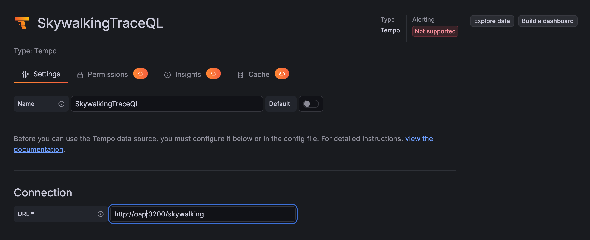
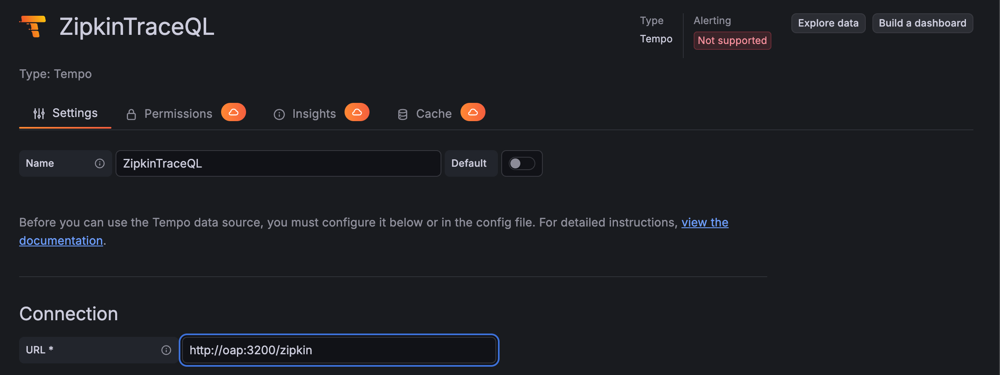
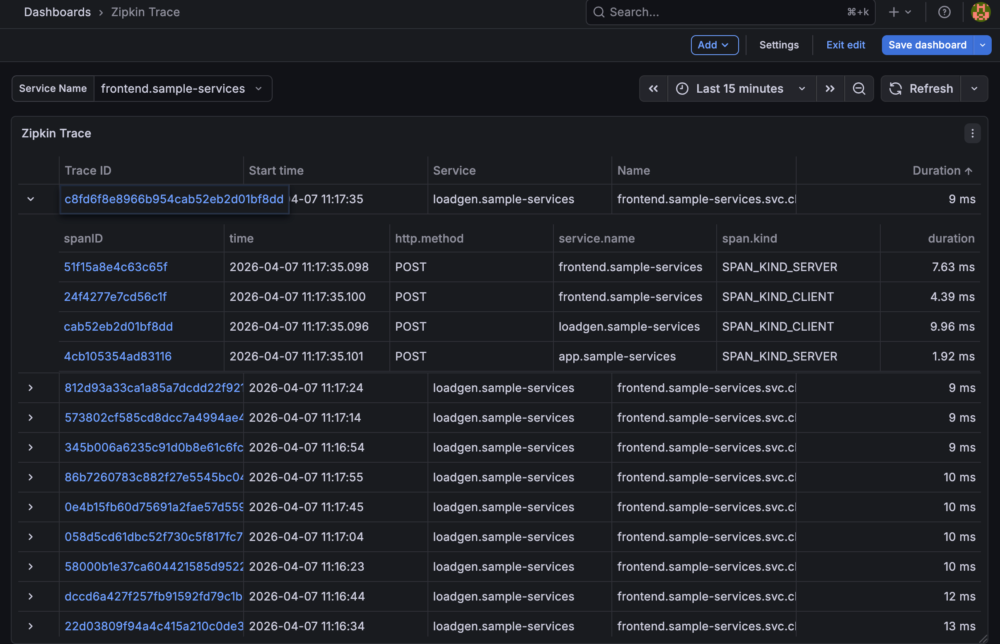
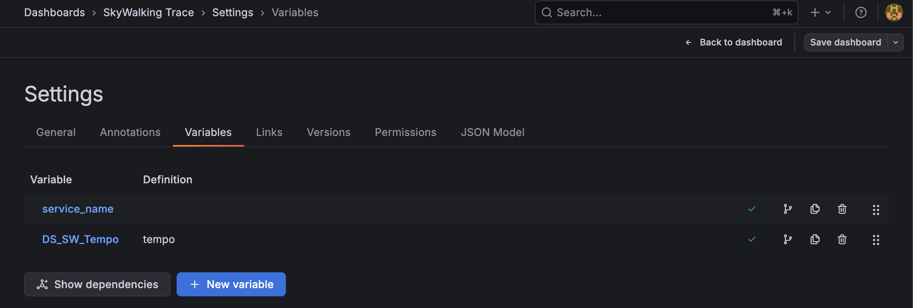
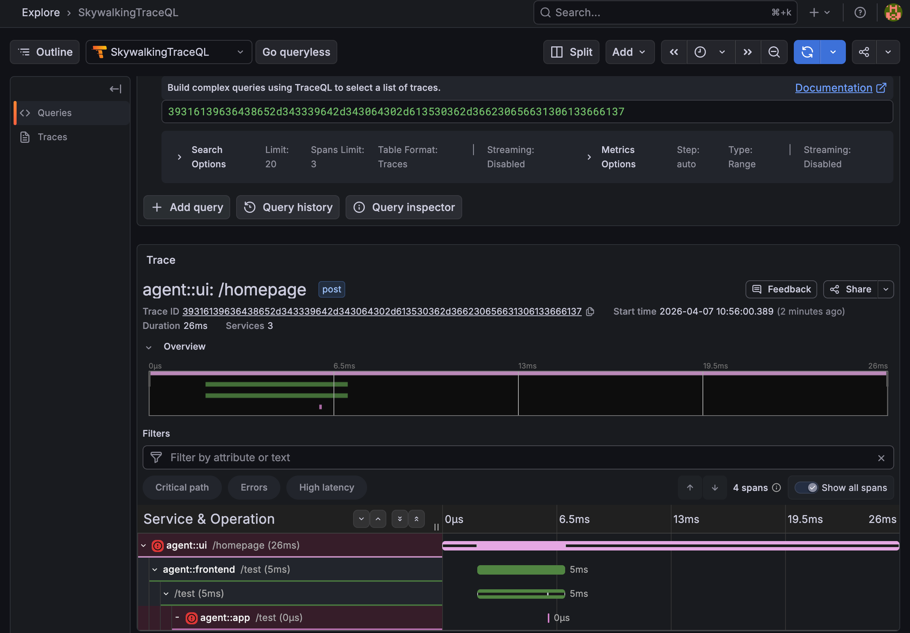

# 使用 TraceQL 查询 SkyWalking 和 Zipkin 链路追踪数据并在 Grafana 中可视化

Apache SkyWalking 在 **10.4.0** 版本中引入了 **TraceQL** 支持，实现了
[Grafana Tempo 的 HTTP 查询 API](https://grafana.com/docs/tempo/v2.10.x/api_docs/)，使
Grafana 无需任何额外插件即可查询和可视化 SkyWalking 中存储的链路追踪数据。
这意味着你现在可以使用熟悉的 Grafana Tempo 数据源来搜索、过滤和深入分析
**SkyWalking 原生链路追踪**和 **Zipkin 兼容链路追踪** —— 所有数据都由现有的 SkyWalking OAP 服务器提供。

## 架构概览

```
┌────────────────────┐         Tempo HTTP API           ┌─────────────────────────────┐
│                    │  ──── /skywalking/api/search ──► │  SkyWalking Native Backend  │
│      Grafana       │                                  │  (Query Traces V2 API)      │
│  (Tempo Data Src)  │                                  ├─────────────────────────────┤
│                    │  ──── /zipkin/api/search ──────► │  Zipkin-Compatible Backend  │
└────────────────────┘                                  └──────────┬──────────────────┘
                                                                   │
                                                        ┌──────────▼──────────────────┐
                                                        │    SkyWalking OAP Server    │
                                                        │  ┌───────────────────────┐  │
                                                        │  │   TraceQL Service     │  │
                                                        │  │  (port 3200)          │  │
                                                        │  └───────────────────────┘  │
                                                        │  ┌───────────────────────┐  │
                                                        │  │  Storage (BanyanDB /  │  │
                                                        │  │  Elasticsearch / …)   │  │
                                                        │  └───────────────────────┘  │
                                                        └─────────────────────────────┘
```

TraceQL Service 位于 OAP 服务器内部，在端口 `3200`（默认）上暴露 Tempo 兼容的 HTTP API。
它将链路追踪数据从原生格式转换为
[Tempo 的格式](https://github.com/grafana/tempo/blob/main/pkg/tempopb/tempo.proto)，
其中链路追踪详情部分（`Trace` 消息）复用了 OTLP `Trace` 定义。

## 支持的 TraceQL 特性与限制

TraceQL 是一种功能丰富的查询语言，但 SkyWalking 目前实现了一个实用的子集。
以下特性**已支持**：

| Feature              | Examples                                               |
|----------------------|--------------------------------------------------------|
| Spanset filter       | `{resource.service.name="frontend"}`                   |
| Resource attributes  | `resource.service.name`                                |
| Span attributes      | `span.http.method`, `span.http.status_code`            |
| Intrinsic fields     | `duration`, `name`, `status`                           |
| Comparison operators | `=`, `>`, `>=`, `<`, `<=`                              |
| Compound conditions  | `{resource.service.name="frontend" && duration>100ms}` |
| Duration units       | `us`/`µs`, `ms`, `s`, `m`, `h`                         |

以下特性**暂不支持**：

- Spanset logical operations (`{...} AND {...}`, `{...} OR {...}`)
- Pipeline operations (`|` operator)
- Aggregate functions (`count()`, `avg()`, `max()`, `min()`, `sum()`)
- Regular expression matching (`=~`, `!~`)
- `event` and `link` scopes
- `kind` intrinsic field
- Streaming mode (must be disabled in the Grafana Tempo data source settings)

> **重要提示**：TraceQL 中的 SkyWalking 原生链路追踪支持基于
> [Query Traces V2 API](https://skywalking.apache.org/docs/main/next/en/api/query-protocol/#trace-v2)。
> 目前只有 **BanyanDB** 存储实现了该 API。其他存储后端
> （如 Elasticsearch、MySQL、PostgreSQL）不支持通过 TraceQL 查询 SkyWalking 原生链路追踪数据。
> Zipkin 兼容链路追踪**不受**此限制。

## Trace 格式转换

由于 Tempo 格式的链路追踪详情部分复用了
[OTLP Trace](https://opentelemetry.io/docs/reference/specification/protocol/) 定义，
以下转换描述使用 OTLP 字段名称（如 span kind、status code）。

### SkyWalking 原生链路追踪

#### Trace ID 编码

SkyWalking 原生 trace ID 是任意字符串（例如
`2a2e04e8d1114b14925c04a6321ca26c.38.17739924187687539`），而 Grafana Tempo 要求
纯十六进制编码的 trace ID。TraceQL Service 将原始 trace ID 的每个 UTF-8 字节编码为两个小写十六进制字符：

```
原始值:  2a2e04e8d1114b14925c04a6321ca26c.38.17739924187687539
编码后:  32613265303465386431313134623134393235633034613633323163613236632e33382e3137373339393234313837363837353339
```

编码后的十六进制 trace ID 会出现在所有 API 响应和 Grafana 中。当你在 Grafana 中点击
trace ID 时，TraceQL Service 会自动将其解码回原始的 SkyWalking trace ID 进行内部查询。

#### Span Kind 映射

| SkyWalking Span Type | OTLP Span Kind       |
|----------------------|----------------------|
| `Entry`              | `SPAN_KIND_SERVER`   |
| `Exit`               | `SPAN_KIND_CLIENT`   |
| `Local`              | `SPAN_KIND_INTERNAL` |

#### 状态映射

| SkyWalking `isError` | OTLP Status Code    |
|----------------------|---------------------|
| `true`               | `STATUS_CODE_ERROR` |
| `false`              | `STATUS_CODE_OK`    |

#### SpanAttachedEvents
SkyWalking [SpanAttachedEvents](https://skywalking.apache.org/docs/main/next/en/concepts-and-designs/event/) 被转换为 OTLP span events，
其中 `tags` 映射为字符串属性，`summary` 映射为数值属性（序列化为字符串）。

### Zipkin 链路追踪

#### Span Kind 映射

| Zipkin Span Kind | OTLP Span Kind       |
|------------------|----------------------|
| `CLIENT`         | `SPAN_KIND_CLIENT`   |
| `SERVER`         | `SPAN_KIND_SERVER`   |
| `PRODUCER`       | `SPAN_KIND_PRODUCER` |
| `CONSUMER`       | `SPAN_KIND_CONSUMER` |

#### 状态映射
1. 如果存在 `otel.status_code` 标签，则直接使用。
2. 否则，如果 `error` 标签等于 `true`，则状态为 `STATUS_CODE_ERROR`。
3. 如果以上标签都不存在，则状态默认为 `STATUS_CODE_UNSET`。

#### Endpoint 与 Annotation 映射
Zipkin endpoint 字段被映射为 OTLP 属性（例如 `localEndpoint.ipv4` → `net.host.ip`），
Zipkin annotations 被转换为 OTLP span events。

完整的转换详情请参阅 [TraceQL Service 文档](https://skywalking.apache.org/docs/main/next/en/api/traceql-service/)。

## 如何启用 TraceQL

### 步骤 1：启用 TraceQL 模块

默认情况下，TraceQL 模块是**禁用的**（`selector: ${SW_TRACEQL:-}`）。要启用它，将 selector
设置为 `default`：

```yaml
# 在 application.yml 中
traceQL:
  selector: ${SW_TRACEQL:default}
  default:
    enableDatasourceSkywalking: ${SW_TRACEQL_ENABLE_DATASOURCE_SKYWALKING:true}
    enableDatasourceZipkin: ${SW_TRACEQL_ENABLE_DATASOURCE_ZIPKIN:true}
```

或通过环境变量设置：

```bash
export SW_TRACEQL=default
export SW_TRACEQL_ENABLE_DATASOURCE_SKYWALKING=true
export SW_TRACEQL_ENABLE_DATASOURCE_ZIPKIN=true
```

### 步骤 2：启用 Zipkin 接收器（仅用于 Zipkin 链路追踪）

如果你需要查询 Zipkin 链路追踪数据，还需要启用 Zipkin 接收器，以便 SkyWalking 能够接收
Zipkin 链路追踪数据：

```yaml
# 在 application.yml 中
receiver-zipkin:
  selector: ${SW_RECEIVER_ZIPKIN:default}
  default:
    searchableTracesTags: ${SW_ZIPKIN_SEARCHABLE_TAG_KEYS:http.method}
    sampleRate: ${SW_ZIPKIN_SAMPLE_RATE:10000}
    restHost: ${SW_RECEIVER_ZIPKIN_REST_HOST:0.0.0.0}
    restPort: ${SW_RECEIVER_ZIPKIN_REST_PORT:9411}
```

或通过环境变量设置：

```bash
export SW_RECEIVER_ZIPKIN=default
```

### 完整配置参考

所有配置选项及其默认值的完整列表，请参阅
[TraceQL Service 文档的配置章节](https://skywalking.apache.org/docs/main/next/en/api/traceql-service/#configuration)。

## 配置 Grafana Tempo 数据源

> **前提条件**：需要 Grafana **12 或更高版本**。

每个链路追踪后端（SkyWalking 原生 / Zipkin）需要在 Grafana 中配置各自独立的 Tempo 数据源，
因为它们分别在不同的上下文路径下提供服务。

### 上下文路径

两个后端在同一端口上使用不同的上下文路径提供服务：

| Backend           | Default Context Path | Env Variable                              | Full Default URL                    |
|-------------------|----------------------|-------------------------------------------|-------------------------------------|
| SkyWalking native | `/skywalking`        | `SW_TRACEQL_REST_CONTEXT_PATH_SKYWALKING` | `http://<oap-host>:3200/skywalking` |
| Zipkin            | `/zipkin`            | `SW_TRACEQL_REST_CONTEXT_PATH_ZIPKIN`     | `http://<oap-host>:3200/zipkin`     |

### 配置 SkyWalking 数据源

1. 在 Grafana 中，前往 **Configuration → Data Sources → Add data source**。
2. 选择 **Tempo**。
3. 将 URL 设置为 `http://<oap-host>:3200/skywalking`。
4. **禁用 Streaming 选项**（SkyWalking 不支持流式模式）。


5. 保存并测试数据源。



### 配置 Zipkin 数据源

与上述步骤相同，但将 URL 设置为 `http://<oap-host>:3200/zipkin`。



## 配置链路追踪列表结果标签

在 Grafana 中搜索链路追踪时，链路追踪列表面板会显示每条追踪的摘要信息。
`tracesListResultTags` 配置控制**哪些 span 标签会包含在搜索结果中**并作为列显示在追踪列表中。

| Env Variable                                    | Default Value                                                                                  | Purpose                          |
|-------------------------------------------------|------------------------------------------------------------------------------------------------|----------------------------------|
| `SW_TRACEQL_ZIPKIN_TRACES_LIST_RESULT_TAGS`     | `http.method,error`                                                                            | Tags shown for Zipkin traces     |
| `SW_TRACEQL_SKYWALKING_TRACES_LIST_RESULT_TAGS` | `http.method,http.status_code,rpc.status_code,db.type,db.instance,mq.queue,mq.topic,mq.broker` | Tags shown for SkyWalking traces |

注意，无论此设置如何，`service.name` 和 `span.kind` **始终包含**在结果中。

这些标签在 Grafana Tempo 链路追踪搜索结果中显示为属性列，方便快速识别和分组追踪数据：

**SkyWalking 原生追踪列表：**


**Zipkin 追踪列表：**



你可以根据应用程序的埋点情况自定义这些标签。例如，如果你的服务大量使用消息队列，
可以在列表中添加 `mq.destination` 或 `messaging.system`。

## 在 Grafana 中构建链路追踪仪表板

### SkyWalking 原生追踪仪表板

#### 步骤 1：探索并保存

1. 前往 Grafana 的 **Explore** 页面。
2. 选择你为 SkyWalking 配置的 Tempo 数据源（例如 `SkyWalkingTraceQL`）。
3. 运行一个测试查询，然后点击 **Add to dashboard** 并保存为 `SkyWalking Trace`。


#### 步骤 2：配置变量

添加仪表板变量，以便用户可以动态过滤追踪数据（例如按服务名称过滤）：



#### 步骤 3：添加追踪面板

1. 选择 **Table** 图表（或编辑你保存的面板）。
2. 将 **Query type** 设置为 `Search`。
3. 将 **Service Name** 查询条件设置为变量 `$Service`。
4. 根据需要添加其他查询条件（如 duration、span name、tags）。
5. 测试并保存。


#### 步骤 4：查看追踪详情

点击追踪面板中的任意 trace ID，即可跳转到 Explore 页面，查看完整的追踪瀑布图，
包含所有 span、标签和事件：



### Zipkin 追踪仪表板

Zipkin 追踪的设置与 SkyWalking 原生追踪完全相同 —— 只需使用你配置的 Zipkin Tempo 数据源
（例如 `ZipkinTraceQL`）。

**Zipkin 追踪详情视图：**


## 总结

通过 SkyWalking 10.4.0 中的 TraceQL 支持，你现在可以利用 Grafana 强大的 Tempo 数据源
来查询和可视化 SkyWalking 原生链路追踪和 Zipkin 兼容链路追踪数据。
需要记住的要点：

1. **启用 TraceQL 模块**：设置 `SW_TRACEQL=default` 并启用所需的后端。
2. **在 Grafana 中配置独立的 Tempo 数据源**：为每个后端分别配置（`/skywalking` 和 `/zipkin`）。
3. **禁用 Streaming 选项**：在 Grafana Tempo 数据源设置中关闭流式模式。
4. **自定义结果标签**：通过 `SW_TRACEQL_SKYWALKING_TRACES_LIST_RESULT_TAGS` 和 `SW_TRACEQL_ZIPKIN_TRACES_LIST_RESULT_TAGS` 控制搜索结果中显示的内容。
5. **SkyWalking 原生追踪查询需要 BanyanDB** 存储（Zipkin 追踪支持所有存储后端）。

完整的 API 参考和转换详情，请参阅
[TraceQL Service 文档](https://skywalking.apache.org/docs/main/next/en/api/traceql-service/)。
Grafana 集成详情，请参阅
[使用 Grafana 作为 UI](https://skywalking.apache.org/docs/main/next/en/setup/backend/ui-grafana/#use-grafana-as-the-ui)。
