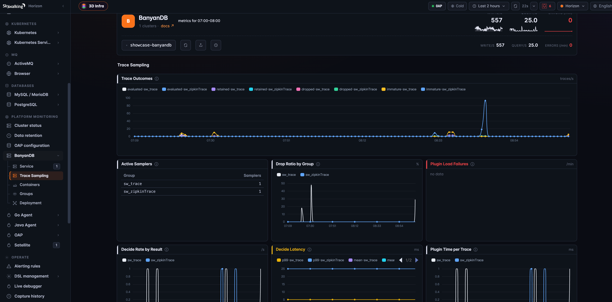

# 在存储引擎内部实现 Trace 尾部采样

*译自英文原文：[Trace Tail Sampling Inside the Storage Engine with SkyWalking 11 and BanyanDB 0.11](/blog/2026-09-07-banyandb-trace-tail-sampling/)。*

Apache SkyWalking **11.0.0** 与 BanyanDB **0.11.0** 带来了 Trace 尾部采样（tail sampling）。与 SkyWalking
以往的所有采样机制不同，它发生在 Trace **落盘之后**：BanyanDB 数据节点在 compaction 自己的文件时，对每条
Trace 做整体判定，不满足规则的 Trace 不会被写入合并后的输出。这个决定看到的是一条完整的、端到端的 Trace，
而它释放的空间，是原本已经花掉的空间。

这篇文章会说明为什么采样决定要挪进存储引擎、哪些 Trace 会被保留、如何开启，以及如何确认它在正常工作。

## 过早决定的问题

Trace 是可观测性平台中最昂贵的数据。指标可以聚合，Trace 不能。一个请求经过十个服务，就会留下十个 Segment
和几十个 Span，而其中绝大多数描述的都是一次很快、成功、并且永远不会有人去看的请求。

SkyWalking 已经有两种方式来削减这条数据流，但它们都在写入**之前**做决定：

- **Agent 侧采样**在根 Span 处决定，此时下游还什么都没发生。10% 的随机采样在丢掉 90% 噪音的同时，也丢掉了
  90% 的错误。
- **服务端采样**在 OAP 中（`trace-sampling-policy-settings.yml`）增加了采样率、错误 Segment 强制保留和慢
  Segment 阈值。这是实实在在的改进，但它以 **Segment** 为单位工作——也就是一个服务实例产生的那一段 Trace——
  因为 OAP 收到的就是这个粒度。[文档](https://skywalking.apache.org/docs/main/latest/en/setup/backend/trace-sampling/)
  对后果说得很直白：你会得到错误和慢的 Segment，"但不保证你能拿到完整的 Trace"。

两者的局限是一样的：在接收时刻，没有人见过完整的 Trace。而真正决定一条 Trace 是否值得保留的问题——这个
请求*端到端*慢不慢、其中*任何地方*有没有出错、有没有碰到某个数据库或队列——只有在所有 Span 都到齐之后才能回答。

传统的尾部采样用一层缓冲来回答这些问题：一个 collector 把所有在途 Trace 的所有 Span 都放在内存里，等待一个
决策窗口，并且要求同一条 Trace 的全部 Span 路由到同一个实例。这能工作，但它引入了一层随在途流量伸缩的有状态
组件，而且依然是在存储之前决定，凡是被放过去的数据，在 TTL 到期之前都不会再被回收。

## 为什么存储引擎是合适的位置

BanyanDB 按 `trace_id` 分组并排序存储 Span。和大多数现代数据库一样，它采用 LSM（log-structured merge tree，
日志结构合并树）布局：新数据写入小的不可变文件，后台的 **compaction** 定期把许多小文件重写成更少的大文件。
重写发生时，一条 Trace 的全部 Span 会一起经过它。

采样器就运行在这里。Compaction 本来就要读取并重写这些 Span，尾部采样只是在其中加了一个判定。通过的 Trace
照常重写；没通过的 Trace 不再重写，旧文件删除后，它占用的空间就回收了。

```
 SkyWalking agents  ─┐
 Zipkin / Istio     ─┼──► OAP ──► BanyanDB ──► traces stored in the Hot stage
 OpenTelemetry      ─┘                                        │
                                            routine compaction of the stored data
                                                              │
                    ┌─────────────────────────────────────────┴───────────────────────────┐
                    │ trace still inside the grace window ──► untouched, judged later     │
                    │ mature trace ──► sampler rules      ──► keep: rewritten as usual    │
                    │                                     ──► drop: not rewritten, freed  │
                    └─────────────────────────────────────────────────────────────────────┘
                                                              │
                           optional FINALIZE sweep re-checks settled data so every trace is judged
                                           Warm and Cold stages are never touched
```

这样做带来的好处：

- **判定覆盖整条 Trace。** 所有 Segment 或 Span 被一起看到，作为一个整体保留或丢弃。不会出现半条 Trace。
- **没有额外的组件。** OAP 和存储之间没有任何东西在内存里攒 Span。
- **空间是真正回收的**，而不是被标记为待删除。被丢弃的 Trace 永远不会再被重写。
- **Trace 在被判定前始终可查。** 宽限期会让每条 Trace 在别人可能还在看它的这段时间里保持完整。

## 判定在什么时候发生

采样器可以在两个事件上运行，按存储 group 选择：

- **`PIPELINE_EVENT_MERGE`**，默认值，在日常 compaction 中运行。它是尽力而为的：只有当一条 Trace 周围的数据
  恰好被 compaction 时它才会被判定，所以一个安静的分片里可能有一些 Trace 直到过期都没被评估过。
- **`PIPELINE_EVENT_FINALIZE`** 增加了一个周期性的后台扫描，处理已经稳定下来的数据，让每条 Trace 最终都会被
  判定，不再依赖 compaction 的活跃程度。它会带来一些额外的后台 I/O，并且必须显式指定；事件列表为空时只有
  MERGE 生效。

只有 **Hot** 阶段会被采样。一条 Trace 一旦迁移到 Warm 或 Cold 存储，就会保留到该阶段的 TTL 结束。

## 哪些 Trace 会被保留

BanyanDB 自带两个采样器，分别对应 SkyWalking 写入的两种 Trace 模型。`sw-trace-sampler.so` 处理 SkyWalking
Agent 上报的原生 Segment。`zipkin-trace-sampler.so` 处理 Zipkin Span——来自 Istio 和 Envoy 服务网格的 Trace，
以及 OpenTelemetry 的 Trace 也都落在这里，因为 OAP 在接收 OTLP Trace 时会把它转换成 Zipkin 格式。两个采样器
运行同一套规则，只是读取输入的位置不同。

规则之间是**或**的关系：第一条命中的规则保留这条 Trace，一条规则都没命中的 Trace 被丢弃。

1. **时长。** Trace 的端到端时长达到 `durationThresholdMs`。
2. **错误。** 设置了 `keepErrors`，且 Trace 带有错误。
3. **标签规则。** 任意一条 `keepTagRules` 匹配到某个可检索标签。
4. **健康抽样。** 对剩下的 Trace 保留固定比例，`healthySampleRate`。

### 时长是端到端的

```
duration = max(span start + span duration) − min(span start)   over the whole trace
keep     if duration ≥ durationThresholdMs
```

这正是按 Segment 采样永远表达不了的东西。三个串联的 400 ms 调用，没有任何一个 Span 超过 400 ms，但端到端
时长是 1.2 s，所以 1000 ms 的阈值会保留这条 Trace。

### 健康抽样是稳定的

抽样通过对 Trace ID 做哈希来选择，而不是掷骰子。一条 Trace 在其生命周期里可能被评估不止一次，如果每次都随机
抽取，它每次都会多一次被丢弃的机会。用哈希的话，保留下来的部分是一个固定的 Trace 子集：`0.1` 每次保留的都是
同样的那 10%。它是一个统计意义上的比例，不是配额，也不会在服务之间做平衡。"永远保留支付服务"必须写成标签规则。

### 标签规则只匹配可检索标签

OAP 把一条 Trace 的所有可检索标签存成一个 `key=value` 条目列表，标签规则就是对这个列表做匹配，可以写成
`{tagKey, exists|equals|in|regex}` 对象，也可以写成能放进环境变量的紧凑形式 `key=value,key=~regex,key`。
规则必须指向探针真正产生的标签；指向 `service_id` 这类存储列的规则永远不可能匹配，采样器会在加载时直接拒绝它，
而不是让它默默地永不生效。

| 输入 | `sw-trace-sampler` | `zipkin-trace-sampler` |
|---|---|---|
| 可检索标签 | `tags` | `query` |
| 错误信号 | `is_error` 列 | `query` 中的 `error` 标签 |
| 时长单位 | 毫秒 | 微秒，自动归一化 |

`durationThresholdMs` 在两种模型上都是毫秒。

## 一个完整的例子

假设 pipeline 以默认配置开启，再加一条标签规则：保留端到端超过 500 ms 的 Trace、保留错误、保留所有碰到
PostgreSQL 的 Trace，其余保留 10%。

```sh
SW_STORAGE_BANYANDB_TRACE_PIPELINE_ENABLED=true
SW_STORAGE_BANYANDB_TRACE_SAMPLER_KEEP_TAG_RULES='db.type=PostgreSQL'
```

10:00 有五个请求进入系统。SkyWalking Agent 上报它们的 Segment，OAP 写入 BanyanDB，五条 Trace 立刻出现在
UI 里，和不开采样时一模一样：

```
trace  segment                      start          latency  is_error  searchable tags
T1     POST /order   (gateway)      10:00:00.000    40 ms
T1     order-consumer (Kafka)       10:00:00.600   380 ms
T1     notify-consumer (Kafka)      10:00:01.000   150 ms
T2     POST /login   (gateway)      10:00:01.000    45 ms
T2     auth-svc                     10:00:01.005    38 ms   true
T3     GET /songs    (gateway)      10:00:02.000    30 ms
T3     songs-svc                    10:00:02.004    24 ms             db.type=PostgreSQL
T4     GET /health   (gateway)      10:00:03.000     3 ms
T5     GET /health   (gateway)      10:00:04.000     4 ms
```

接下来的 30 分钟里它们不会有任何变化，这就是宽限期。之后，BanyanDB 下一次 compaction 存放这些 Trace 的
文件时，采样器看到每条完整的 Trace，并按顺序应用规则：

| Trace | 采样器看到的 | 判定 |
|---|---|---|
| **T1** | 单看每个 Segment 都不慢，但整条 Trace 从 `10:00:00.000` 持续到 `10:00:01.150`：端到端 **1,150 ms** | **保留**，规则 1（时长） |
| **T2** | `auth-svc` Segment 的 `is_error = true` | **保留**，规则 2（错误） |
| **T3** | 又快又健康，但带有 `db.type=PostgreSQL` | **保留**，规则 3（标签规则） |
| **T4** | 快、健康、没有匹配的标签。Trace ID 的哈希落在 `0.07`，低于 `0.1` | **保留**，规则 4（健康抽样） |
| **T5** | 快、健康、没有匹配的标签。Trace ID 的哈希落在 `0.63` | **丢弃** |

T1 到 T4 照常重写进 compaction 后的文件。T5 没有，旧文件删除后它的空间就回收了。之后再去 UI 查询，你会看到
四条完整的 Trace，而 T5 完全不存在——不是残缺的一半，而是完全不存在。

其中两条值得再看一眼，因为它们正是接收时采样会弄错的场景：

- **T1** 是一条经过 Kafka 的异步下单流程。每个 Segment 都不到 400 ms，所以服务端 500 ms 的慢 Segment 阈值
  永远不会触发，这个请求只能靠采样率的运气活下来。而整体来看，它明显是慢的。
- **T2** 也会被服务端的 `forceSampleErrorSegment` 选项保留，但只保留 `auth-svc` 这个 Segment。它的网关
  Segment 没有错误，要受采样率约束，所以到达 UI 的那条 Trace 可能缺了引发失败的那个请求。尾部采样要么两个
  Segment 都保留，要么都不留。

## 默认安全

删除已存储的数据是数据库唯一不能出错的事，所以每一条路径都偏向保留。

- **宽限期保护新鲜的 Trace。** 比 merge 宽限期更年轻的数据不会被碰。OAP 明确配置为 **30 分钟**；如果用 `-1`
  把决定权交回数据节点，节点自身的默认值是两小时。
- **绝不出现半删除的 Trace。** 如果一条 Trace 的任何部分可能存在于当前 compaction 看不到的数据里，这条 Trace
  会被保留，下次再判。
- **插件问题不会删数据。** 加载失败的采样器让 group 保持不过滤；崩溃、报错或超时的采样器被绕过；无法评估的
  规则保留 Trace。
- **配置是严格的。** 每个选项都是一条保留规则，一个被默默忽略的拼写错误可能丢掉整个 group。未知的键和空配置
  会被直接拒绝。
- **内存有上限。** 如果单次 compaction 要丢弃的 Trace 超过了它的内存预算，它会停止丢弃，保留其余的。

## 如何开启

尾部采样在所有地方**默认关闭**，只在 OAP 里开启不会有任何效果。它只在数据节点能加载采样器插件**并且** group
的 pipeline 已启用时生效。不满足条件时它是惰性的，而不是坏的：不支持插件的节点忽略这段配置，加载不了插件的
节点保留一切。

### 1. 运行支持插件的 BanyanDB 数据节点

采样器是 Go 插件，而 Go 只能把插件加载进用完全相同工具链构建的二进制里。默认的 BanyanDB 镜像无法承载插件，
所以 BanyanDB 额外发布了两个从同一提交一起构建的镜像：

| 镜像 tag | 内容 | 角色 |
|---|---|---|
| `<tag>` / `<tag>-slim` | 默认服务端 | **不**承载插件 |
| `<tag>-plugins` | 支持插件的服务端，`/plugins` 目录为**空** | 宿主 |
| `<tag>-plugins-carrier` | 位于 `/plugins` 下的采样器 `.so` 文件 | 挂载进宿主 |

carrier 必须始终和宿主使用**相同的 tag**。两个镜像会随 `main` 分支的每次提交推送为
`ghcr.io/apache/skywalking-banyandb:<commit>-plugins` 和 `<commit>-plugins-carrier`；0.11.0 发布对应的提交是
`3b83e18fb0481d02e44eaa5df137fcf7b000754b`。你也可以从该 tag 的代码自行构建：

```sh
BINARYTYPE=plugins make -C banyand docker       # 宿主镜像
make -C banyand docker.plugins-carrier          # carrier 镜像
```

只有**数据节点**承载插件。最通用的投递方式是用一个 init 容器把 carrier 复制到共享卷里；在 Kubernetes 1.31+
上可以用 OCI image volume 直接挂载。两种示例都在 BanyanDB 仓库的 `examples/kubernetes/plugins/` 目录下。
节选如下：

```yaml
spec:
  initContainers:
    - name: install-firstparty-plugins
      image: <registry>/skywalking-banyandb:<tag>-plugins-carrier
      command: ["sh", "-c", "cp /plugins/*.so /out/"]
      volumeMounts:
        - { name: plugins, mountPath: /out }
  containers:
    - name: banyandb-data
      image: <registry>/skywalking-banyandb:<tag>-plugins
      args:
        - data
        - -trace-pipeline-native-plugin-enabled=true
        - -trace-pipeline-trusted-plugin-dir=/plugins
      volumeMounts:
        - { name: plugins, mountPath: /plugins }
  volumes:
    - name: plugins
      emptyDir: {}
```

这两个参数就是全部的开关：一个启用插件承载，另一个指定唯一允许加载插件的目录。

### 2. 在 OAP 中启用 pipeline

`bydb.yml` 中的 `trace` 和 `zipkinTrace` 两个 group 带有一个 `pipeline` 块，OAP 会把它推送到 BanyanDB 的
group 上。原生 Trace group 的默认配置是：

```yaml
storage:
  banyandb:
    trace:
      pipeline:
        enabled: ${SW_STORAGE_BANYANDB_TRACE_PIPELINE_ENABLED:false}
        # PIPELINE_EVENT_MERGE 和/或 PIPELINE_EVENT_FINALIZE，逗号分隔。
        enabledEvents: ${SW_STORAGE_BANYANDB_TRACE_PIPELINE_ENABLED_EVENTS:PIPELINE_EVENT_MERGE}
        # 只有正值会覆盖数据节点的设置；-1 表示沿用节点默认值。
        mergeGraceSeconds: ${SW_STORAGE_BANYANDB_TRACE_PIPELINE_MERGE_GRACE_SECONDS:1800}
        finalizeGraceSeconds: ${SW_STORAGE_BANYANDB_TRACE_PIPELINE_FINALIZE_GRACE_SECONDS:-1}
        plugins:
          - name: sw-trace-sampler
            path: ${SW_STORAGE_BANYANDB_TRACE_SAMPLER_SO:sw-trace-sampler.so}
            abiVersion: 1
            config:
              durationThresholdMs: ${SW_STORAGE_BANYANDB_TRACE_SAMPLER_DURATION_THRESHOLD_MS:500}
              keepErrors: ${SW_STORAGE_BANYANDB_TRACE_SAMPLER_KEEP_ERRORS:true}
              healthySampleRate: ${SW_STORAGE_BANYANDB_TRACE_SAMPLER_HEALTHY_SAMPLE_RATE:0.1}
              keepTagRules: ${SW_STORAGE_BANYANDB_TRACE_SAMPLER_KEEP_TAG_RULES:[]}
```

所以开启它最少只需要一个环境变量，一套典型的策略也不过再加几个：

```sh
SW_STORAGE_BANYANDB_TRACE_PIPELINE_ENABLED=true
SW_STORAGE_BANYANDB_TRACE_PIPELINE_ENABLED_EVENTS=PIPELINE_EVENT_MERGE,PIPELINE_EVENT_FINALIZE
SW_STORAGE_BANYANDB_TRACE_SAMPLER_DURATION_THRESHOLD_MS=1000
SW_STORAGE_BANYANDB_TRACE_SAMPLER_HEALTHY_SAMPLE_RATE=0.05
SW_STORAGE_BANYANDB_TRACE_SAMPLER_KEEP_TAG_RULES='db.type=PostgreSQL,mq.queue=queue-songs-ping'
```

插件的 `config` 会原样透传，OAP 不解释其中的键。正因如此，带有自定义选项的第三方采样器也可以从同一个配置块
接进来。

需要注意，服务端采样和尾部采样是**相互独立的两道闸**。同时开启会让丢弃率相乘，而接收侧的那道闸仍然会按
Segment 把 Trace 拆开。如果存储能负担在宽限期内保留全部数据，只用尾部采样会得到更干净的结果。

### 3. 确认它真的在过滤

打开 SkyWalking UI 中 **BanyanDB** 下的 **Trace Sampling** 页面。**Active Samplers** 表格里你启用的每个 group
都必须显示大于零的数量，**Plugin Load Failures** 必须为空。数量为零意味着什么都没在过滤，不管 `bydb.yml` 里
写了什么。如果没有部署自监控的 collector，同样的两个数字也可以在数据节点自己的指标端点（端口 `2121`）上找到：
`banyandb_trace_pipeline_sampler_active_count{group}` 和 `banyandb_trace_pipeline_sampler_load_failed`。
[调试指南](https://skywalking.apache.org/docs/skywalking-banyandb/latest/operation/plugins-debugging/)
逐项列出了"什么都没被采样"的排查清单。

## Zipkin Trace

所有不是来自 SkyWalking Agent 的数据都以 Zipkin Span 的形式存储：来自
[Zipkin 探针的服务](https://skywalking.apache.org/docs/main/latest/en/setup/backend/zipkin-trace/)、
来自 Istio 和 Envoy 服务网格，以及来自
[OpenTelemetry 探针](https://skywalking.apache.org/docs/main/latest/en/setup/backend/otlp-trace/)的 Trace——
OAP 在接收时会把后者转换成 Zipkin 格式。它们全部经过同一套规则，由 `zipkin-trace-sampler.so` 处理，配置在
`zipkinTrace` group 下，使用自己的 `SW_STORAGE_BANYANDB_ZIPKIN_TRACE_*` 变量，默认阈值 1000 ms。有两点
不同，都源于数据模型而非采样器本身。

Zipkin 没有错误列，所以 `keepErrors` 会查找 Zipkin 约定的 `error` Span 标签。只通过 5xx 的
`http.status_code` 或 `otel.status_code` 来表示失败的探针不会写 `error` 标签，这类 Trace 需要一条显式的规则：

```sh
SW_STORAGE_BANYANDB_ZIPKIN_TRACE_SAMPLER_KEEP_TAG_RULES='http.status_code=~5\d\d'
```

另外，OAP 会丢弃值超过 256 个字符的可检索标签，所以携带一长串异常信息的 `error` 标签对 `keepErrors` 来说是
不可见的。像上面那条状态码正则这样针对短值标签的规则，才是可靠的兜底。

## 观察它的运行

SkyWalking 监控 BanyanDB 的方式和监控其他一切一样。部署好
[BanyanDB 自监控](https://skywalking.apache.org/docs/main/next/en/banyandb/dashboards-banyandb/)——由一个
OpenTelemetry Collector 抓取集群指标并转发给 OAP——之后，UI 中的 **BanyanDB** 层会多出一个 **Trace Sampling**
页面，把整条 pipeline 和集群的写入、查询速率放在一起：



这些面板回答的正是你真正关心的问题：

- **Active Samplers** 列出每个 group 加载了多少个采样器。`sw_trace` 和 `sw_zipkinTrace` 都是 `1` 说明两条
  pipeline 都在运行；`0` 说明这个 group 没有任何过滤。
- **Trace Outcomes** 按 group 显示评估、保留、丢弃以及*未成熟*的 Trace 数量。未成熟指采样器看到了它，但它还在
  宽限期内，因此被原样放过。
- **Drop Ratio by Group** 是被评估的 Trace 中真正被移除的比例，是调整 `healthySampleRate` 或时长阈值时要盯
  的数字。
- **Plugin Load Failures** 应该一直为空。这里有任何数据都意味着某个插件被拒绝了，对应的 group 正在不过滤地
  运行。
- **Decide Rate**、**Decide Latency** 和 **Plugin Time per Trace** 显示采样器给数据节点带来的开销。

因为这些指标由 OAP 自己采集，你还能在不离开 SkyWalking 的情况下，把采样器*提议*的结果和存储*实际提交*的结果
放在一起看。这个页面背后的规则随 OAP **11.1.0** 发布，目前已在 `main` 分支上；BanyanDB 自监控的其余部分在
11.0.0 中已经可用。

如果你更习惯 Grafana，BanyanDB 也提供了一个直接从集群读取同样指标的
[看板](https://github.com/apache/skywalking-banyandb/blob/v0.11.0/docs/operation/grafana-fodc-trace-plugin.json)。

在运行过滤的那些 compaction 期间，数据节点会多消耗一些 CPU，因为采样器读取的标签列需要解码。换来的是被丢弃的
Trace 永远不会再被重写，它们的空间会回来。

## 编写你自己的采样器

内置采样器覆盖了常见的时长、错误、标签和概率规则。如果你需要它们表达不了的东西，比如"超过 30% 的子 Span 出错
就保留"，或者由 Trace 之外的数据驱动的策略，可以自己写一个。采样器是一个导出构造函数并实现一个接口的 Go 插件：

```go
var  ABIVersion = sdk.ABIVersion
func NewSampler(config []byte) (sdk.Sampler, error)   // config 是你在 bydb.yml 里写的 JSON

type Sampler interface {
    Kind() Kind
    Project() Projection                        // 声明你需要哪些标签列
    Decide(batch *TraceBatch) (Verdict, error)  // 对批次中每条 Trace 给出保留/丢弃
    Close() error
}
```

每条 Trace 到达时带着它的 ID、你声明需要的标签列，以及可选的 Span 内容；你返回一个保留掩码。多个采样器可以
串成链，每一个都只看到上一个保留下来的 Trace。SDK 附带一个离线测试工具包，无需数据库就能用手工构造的 Trace
运行你的 `Decide`；第三方 `.so` 文件挂载在 `/plugins/thirdparty`，与官方 carrier 并列。
[开发指南](https://skywalking.apache.org/docs/skywalking-banyandb/latest/operation/plugins-development/)
覆盖了完整流程，包括工具链要求。

## 局限与后续

- **跨越存储 segment 边界的超长 Trace** 会按 segment 分别判定。segment 以天为单位、Trace 以秒计时，这一点
  不会有影响。
- **只开 MERGE 是尽力而为。** 如果需要每条 Trace 都被评估，请加上 FINALIZE。
- **Zipkin 的错误检测依赖标签约定**，并有上文提到的截断问题。
- **按阶段保留已经设计但尚未可用。** 计划是让一个 group 在 Hot 阶段多留一些，随着数据老化到 Warm 和 Cold
  逐步少留。在 0.11.0 中，一个 pipeline 作用于整个 group。

存储引擎内部的尾部采样，把过去在 Agent 或接收侧盲做的取舍，变成了看着完整 Trace 做的决定。有价值的 Trace
留下来，空间回收回来，而这套机制在任何不确定的时候，默认选择保留数据。

## 延伸阅读

- [Trace Tail Sampling](https://skywalking.apache.org/docs/main/latest/en/banyandb/tail-sampling/)——SkyWalking 文档中关于 Trace 如何被判定的说明
- [BanyanDB 存储配置](https://skywalking.apache.org/docs/main/latest/en/setup/backend/storages/banyandb/)——`pipeline` 块与全部 `SW_STORAGE_BANYANDB_*` 覆盖项
- [服务端 Trace 采样](https://skywalking.apache.org/docs/main/latest/en/setup/backend/trace-sampling/)——接收侧的采样机制，用于对比
- [BanyanDB 自监控看板](https://skywalking.apache.org/docs/main/next/en/banyandb/dashboards-banyandb/)——Trace Sampling 页面以及指标如何到达 OAP
- [采样器插件：打包与部署](https://skywalking.apache.org/docs/skywalking-banyandb/latest/operation/plugins/)——镜像、挂载与 Kubernetes 示例
- [采样器插件：调试](https://skywalking.apache.org/docs/skywalking-banyandb/latest/operation/plugins-debugging/)——"什么都没被采样"的排查手册
- [官方采样器配置参考](https://github.com/apache/skywalking-banyandb/blob/v0.11.0/plugins/README.md)
- [Post-trace pipeline 设计文档](https://github.com/apache/skywalking-banyandb/blob/v0.11.0/docs/design/post-trace-pipeline.md)——完整的技术规格，供深入了解
