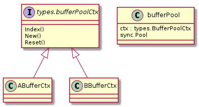
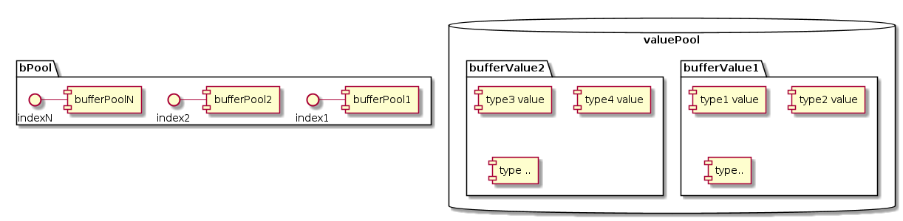

本文的内容基于 MOSN v0.9.0，commit id 1609ae14。

MOSN 在内存管理复用方面有 `内存对象注册/管理` 和 `ByteBuffer/IOBuffer 复用` 两部分内容。MOSN 最新的 master 分支用了 mod 管理依赖，
发现后一部分也迁移到了 vendor 目录下，可单独使用。下面就分这两部分来讲述 MOSN 的内存复用机制。

## 机制

简述一下两部分内容的机制，具体实现原理会在后面带上源码解析。

### 1. 内存对象注册/管理

MOSN 在 go `sync` 包外，对 `sync.Pool` 对象进行了进一步封装，增加了管理和易用性。

MOSN 的 buffer 包提供了注册函数和统一的接口。将实现了接口的不同类型的 buffer 对象注册到 buffer 包，
在用到的时候通过 buffer 包导出的方法进行初始化和管理，增强了内存对象的管理。

而易用性方面，MOSN 封装了 `bufferValue` 对象，管理上面初始化出来的对象，并且将 bufferValue 对象也进行了池化管理。在这之上，封装出方法 
`NewBufferPoolContext` 和 `PoolContext`，使内部根据 context 传值的场景更加易用。MOSN 里面在不同协程协作（比如连接被协程1 accept 后，
交由 worker 协程2 进行 IO）的过程，会将必要参数使用内部实现的 `context with value` 机制进行传递，
其中 buffer 传递的方法就是通过上述封装的方法进行传递的。

### 2. ByteBuffer/IOBuffer 复用

为了提高 byte 数组的复用率，MOSN 封装出了对齐64字节的 byte buffer pool 管理，以及在其之上的 IO buffer pool 管理包，内部需要用到的时候可以直接调用。

之前这部分代码是放在 pkg 下的，在最新的 master 迁移到了 vendor 下，不依赖 pkg 包下任何的其他包。这种情况下如果开发者自己
的项目有这部分需求，其实也可以直接使用 MOSN 写好的包，不用重复造轮子。

## 源码解析

### 1. 内存对象注册/管理

#### 注册管理

这是 bufferPool 相关的简单类图。



MOSN 定义了 `bufferPoolCtx` 接口，使用 buffer 包需要将实现了这个接口的对象，比如图中的 ABufferCtx、BBufferCtx，通过 `RegisterBuffer` 方法注册到 buffer 包。

其中 `Index()` 方法返回注册时写入的 index 值；`New()` 方法是用来初始化待缓存对象的；而 `Reest()` 方法是将内存对象放回 pool 前的重置逻辑。

[https://github.com/mosn/mosn/blob/1609ae1441/pkg/buffer/buffer.go#L70](https://github.com/mosn/mosn/blob/1609ae1441/pkg/buffer/buffer.go#L70)
```go
RegisterBuffer(poolCtx types.BufferPoolCtx) {
	...
	bPool[i].ctx = poolCtx
	setIndex(poolCtx, int(i))
	...
```

注册过程大致是将传入的对象保存在全局变量 bPool 中，并给它分配一个全局唯一标记。

注册后的结构图大概是这样的：



bPool 全局变量保存着已注册的 ctx, 在需要获取对象时找到对应的 pool，调用 ctx.New()，或 sync.Pool.Get()；
在需要 give 对象时，先调用 ctx.Reset() 方法对复用对象进行重置，然后调用 sync.Pool.Put()，至此实现了对 sync.Pool 的封装管理和扩展。

[https://github.com/mosn/mosn/blob/1609ae1441/pkg/buffer/buffer.go#L91](https://github.com/mosn/mosn/blob/1609ae1441/pkg/buffer/buffer.go#L91)
```go
// Take returns a buffer from buffer pool
func (p *bufferPool) take() (value interface{}) {
	value = p.Get()
	if value == nil {
		value = p.ctx.New()
	}
	return
}

// Give returns a buffer to buffer pool
func (p *bufferPool) give(value interface{}) {
	p.ctx.Reset(value)
	p.Put(value)
}
```

#### 易用性

然后是结构图右边的 valuePool 部分。`valuePool` 是 `bufferValue` 对象的 sync.Pool。我们先来看 valuePool 的结构：

[http://github.com/mosn/mosn/blob/1609ae1441/pkg/buffer/buffer.go#L105](https://github.com/mosn/mosn/blob/1609ae1441/pkg/buffer/buffer.go#L105)
```go
// bufferValue is buffer pool's Value
type bufferValue struct {
	value    [maxBufferPool]interface{}
	transmit [maxBufferPool]interface{}
}
```

其中 `value/transmit` 域用来保存从注册表初始化出来的内存对象的指针（transmit 域保存着从其他 context 复制过来的内存对象）。
全局变量 `vPool` 保存了 bufferValue 的 sync.Pool，即 bufferValue 本身也是可以复用的。

这里为什么要一个 transmit 域和复制功能呢？可以从使用到的地方看到，在接收到 upstream response 的时候，因为还没解析 stream，
goroutine 还不能知道对应的 downstream request 和其 context 的 bufferValue，这时需要分配一个 bufferValue  保存解析 stream 的信息，
等能够关联上的时候再拷贝到 transmit 域，等释放的时候统一释放。

[https://github.com/mosn/mosn/blob/1609ae1441/pkg/stream/http2/stream.go#L652](https://github.com/mosn/mosn/blob/1609ae1441/pkg/stream/http2/stream.go#L652)
```go

func (conn *clientStreamConnection) handleFrame(ctx context.Context, i interface{}, err error) {
	...
	mbuffer.TransmitBufferPoolContext(stream.ctx, ctx)

```

回到易用性的介绍，在使用时，通过 `NewBufferPoolContext` 方法新建一个 bufferValue：

[https://github.com/mosn/mosn/blob/1609ae1441/pkg/buffer/buffer.go#L112](https://github.com/mosn/mosn/blob/1609ae1441/pkg/buffer/buffer.go#L112)

```go
// NewBufferPoolContext returns a context with bufferValue
func NewBufferPoolContext(ctx context.Context) context.Context {
	return mosnctx.WithValue(ctx, types.ContextKeyBufferPoolCtx, newBufferValue())
}


// newBufferValue returns bufferValue
func newBufferValue() (value *bufferValue) {
	// 从 vPool 里 get 复用的 bufferValue
	v := vPool.Get()
	if v == nil {
		value = new(bufferValue)
	} else {
		value = v.(*bufferValue)
	}
	return
}
```

获取内存对象时，调用 `PoolContext` 方法获取 bufferValue 对象，传入注册表对象调用其 `Find` 方法，Find 方法会根据注册表对象获取对应的 pool，并且初始化一个内存对象放在 value 域里。

[https://github.com/mosn/mosn/blob/1609ae1441/pkg/buffer/buffer.go#L182](https://github.com/mosn/mosn/blob/1609ae1441/pkg/buffer/buffer.go#L182)

```go
PoolContext(ctx context.Context) *bufferValue {
	if ctx != nil {
		if val := mosnctx.Get(ctx, types.ContextKeyBufferPoolCtx); val != nil {
			return val.(*bufferValue)
		}
	}
	return newBufferValue()
}
```

[https://github.com/mosn/mosn/blob/1609ae1441/pkg/buffer/buffer.go#L138](https://github.com/mosn/mosn/blob/1609ae1441/pkg/buffer/buffer.go#L138)
```go
(bv *bufferValue) Find(poolCtx types.BufferPoolCtx, x interface{}) interface{} {
	i := poolCtx.Index()
	if i <= 0 || i > int(index) {
		panic("buffer should call buffer.RegisterBuffer()")
	}
	if bv.value[i] != nil {
		return bv.value[i]
	}
	return bv.Take(poolCtx)
}

// Take returns buffer from buffer pools
func (bv *bufferValue) Take(poolCtx types.BufferPoolCtx) (value interface{}) {
	i := poolCtx.Index() // 获取全局唯一标记
	value = bPool[i].take() // 调用注册表获取对象
	bv.value[i] = value // 放入 value
	return
}
```

使用完毕，只需调用 bufferValue 的 `Give` 方法，该方法会将其下管理的内存对象都归还到对应的 Pool 去，并且将自己归还到 vPool。

[https://github.com/mosn/mosn/blob/1609ae1441/pkg/buffer/buffer.go#L158](https://github.com/mosn/mosn/blob/1609ae1441/pkg/buffer/buffer.go#L158)
```go
// Give returns buffer to buffer pools
func (bv *bufferValue) Give() {
	if index <= 0 {
		return
	}
	// first index is 1
	// 归还 value & transmit
	for i := 1; i <= int(index); i++ {
		value := bv.value[i]
		if value != nil {
			bPool[i].give(value)
		}
		value = bv.transmit[i]
		if value != nil {
			bPool[i].give(value)
		}
	}
	bv.value = nullBufferValue
	bv.transmit = nullBufferValue

	// Give bufferValue to Pool
	// 归还自己
	vPool.Put(bv)
}
```

#### 使用场景

上述的方法会在哪里用到呢？

MOSN 的请求处理是交给不同的 goroutine 来进行的，而请求上下文信息，如 host、header、body 等信息通过 context 来在不同的协程之间传递。
而内存复用 bufferValue 与 context 进行绑定，意味着在请求处理期间不同的协程都可以通过 context 获取到请求上下文信息。
所以，bufferValue 在请求 accept 时申请，在请求处理结束时释放。

[https://github.com/mosn/mosn/blob/1609ae1441/pkg/stream/http/stream.go#L338](https://github.com/mosn/mosn/blob/1609ae1441/pkg/stream/http/stream.go#L338)
```go
func newServerStreamConnection(ctx context.Context, connection api.Connection,
	...

	// init first context
	// Next 方法会调用上文的 NewBufferPoolContext 方法
	ssc.contextManager.Next()
    ...
```

使用完毕，清理 downstream 时清理 bufferValue：

[https://github.com/mosn/mosn/blob/1609ae1441/pkg/proxy/downstream.go#L1325](https://github.com/mosn/mosn/blob/1609ae1441/pkg/proxy/downstream.go#L1325)
```go
func (s *downStream) giveStream() {
	...
	// Give buffers to bufferPool
	if ctx := mbuffer.PoolContext(s.context); ctx != nil {
		ctx.Give()
	}
}
```

小结：MOSN 的 buffer 包保存了待复用的内存对象的注册表（bPool对象），用来对待复用对象的初始化和管理；另外，MOSN 定义了统一管理待缓存对象的结构：bufferValue，统一保存通过注册表初始化出来的对象。

### 2. ByteBufer/IOBuffer 复用

#### ByteBuffer

先来看相关的结构体：

```go
// byteBufferPool is []byte pools
type byteBufferPool struct {
	minShift int
	minSize  int
	maxSize  int

	pool []*bufferSlot
}

type bufferSlot struct {
	defaultSize int
	pool        sync.Pool
}
```
每个 slot 对应一种尺寸的 byteBuffer 的 pool，以及 `defaultSize` 域保存着尺寸。`byteBufferPool` 对象的 `pool` 域保存着多个 slot。

再来看操作方法 `GetBytes` `PutBytes`，具体逻辑主要是操作 `take` 和 `give` 方法。这两个方法后面会分析。

[https://github.com/mosn/mosn/blob/1609ae1441/vendor/mosn.io/pkg/buffer/bytebuffer_pool.go#L28](https://github.com/mosn/mosn/blob/1609ae1441/vendor/mosn.io/pkg/buffer/bytebuffer_pool.go#L28)

[https://github.com/mosn/mosn/blob/1609ae1441/vendor/mosn.io/pkg/buffer/bytebuffer_pool.go#L145](https://github.com/mosn/mosn/blob/1609ae1441/vendor/mosn.io/pkg/buffer/bytebuffer_pool.go#L145)

```go
...
// global bbPool
var bbPool *byteBufferPool
...

// GetBytes returns *[]byte from byteBufferPool
func GetBytes(size int) *[]byte {
	return bbPool.take(size)
}

// PutBytes Put *[]byte to byteBufferPool
func PutBytes(buf *[]byte) {
	bbPool.give(buf)
}
...

```

为了提高复用率，当申请一个非 64 字节对齐尺寸的 byte buffer 时（如 200），MOSN 实际上会从 slot 2，即 defaultSize = 256 的 slot 返回对象，并返回切片 len = 200 的 byte 切片。

初始化时，将 64、128、256... 以此类推的尺寸的 byte slot 初始化到 byteBufferPool 的 pool 域内：

[https://github.com/mosn/mosn/blob/1609ae1441/vendor/mosn.io/pkg/buffer/bytebuffer_pool.go#L49](https://github.com/mosn/mosn/blob/1609ae1441/vendor/mosn.io/pkg/buffer/bytebuffer_pool.go#L49)
```go
// newByteBufferPool returns byteBufferPool
func newByteBufferPool() *byteBufferPool {
	p := &byteBufferPool{
		minShift: minShift,
		minSize:  1 << minShift,
		maxSize:  1 << maxShift,
	}
	for i := 0; i <= maxShift-minShift; i++ {
		slab := &bufferSlot{
			// 通过左移算出 defaultSize = 64/128/256...等等
			defaultSize: 1 << (uint)(i+minShift),
		}
		// 依次append
		p.pool = append(p.pool, slab)
	}

	return p
}
```

使用时，根据尺寸算出对应的 slot，从对应的 slot 返回该尺寸的 byte 数组：

[https://github.com/mosn/mosn/blob/1609ae1441/vendor/mosn.io/pkg/buffer/bytebuffer_pool.go#L65](https://github.com/mosn/mosn/blob/1609ae1441/vendor/mosn.io/pkg/buffer/bytebuffer_pool.go#L65)
```go
func (p *byteBufferPool) slot(size int) int {
	// 比如要获取 200 size 的 buffer
	if size > p.maxSize {
		return errSlot
	}
	slot := 0
	shift := 0
	if size > p.minSize {
		// size - 199
		// 位: 1100 0111,经过 8 次右移会<=0
		size--
		for size > 0 {
			size = size >> 1
			shift++
		}
		// slot = 8 - 6 = 2, 该 slot 的 defaultSize = 256
		slot = shift - p.minShift
	}

	return slot
}
```
[https://github.com/mosn/mosn/blob/1609ae1441/vendor/mosn.io/pkg/buffer/bytebuffer_pool.go#L87](https://github.com/mosn/mosn/blob/1609ae1441/vendor/mosn.io/pkg/buffer/bytebuffer_pool.go#L87)
```go
// take returns *[]byte from byteBufferPool
func (p *byteBufferPool) take(size int) *[]byte {
	slot := p.slot(size)
	if slot == errSlot {
		b := newBytes(size)
		return &b
	}
	// slot = 2, 
	v := p.pool[slot].pool.Get()
	if v == nil {
		// 如果 slot get 方法没有返回, new 一个
		b := newBytes(p.pool[slot].defaultSize)
		b = b[0:size]
		return &b
	}
	b := v.(*[]byte)
	// 调整切片长度为请求的 size
	*b = (*b)[0:size]
	return b
}
```

byte 数组使用完毕时，对应的就是将 byte 数组放回对应的 slot 里，这里比较好理解，各位可以自行看源码：

[https://github.com/mosn/mosn/blob/1609ae1441/vendor/mosn.io/pkg/buffer/bytebuffer_pool.go#L106](https://github.com/mosn/mosn/blob/1609ae1441/vendor/mosn.io/pkg/buffer/bytebuffer_pool.go#L106)

这两处使用切片指针，主要考虑操作 sync.Pool 的 `Get`、`Put` 方法时避免参数拷贝问题。

#### IOBuffer

IOBuffer 及 IO buffer pool 就比较好理解了，主要是定义了与 IO 相关的接口，然后实现方法是基于上文 byte buffer 的使用方法的封装，即 read 是从 byte buffer 里读取、write 是将数据 copy 进 byte buffer。
有了上文的基础，这里大家可以根据源码去看具体的实现，并不难。

[https://github.com/mosn/mosn/blob/1609ae1441/vendor/mosn.io/pkg/buffer/types.go#L34](https://github.com/mosn/mosn/blob/1609ae1441/vendor/mosn.io/pkg/buffer/types.go#L34)

IO 相关的接口：

```go
type IoBuffer interface {
	Read(p []byte) (n int, err error)

	ReadOnce(r io.Reader) (n int64, err error)

	Write(p []byte) (n int, err error)

	WriteString(s string) (n int, err error)

	WriteTo(w io.Writer) (n int64, err error)
	...

}
```

## 总结

本文根据 MOSN 的源码分析了 MOSN 对内存复用的设计和用法，其基于 sync.Pool 之上封装了一层自己的注册管理逻辑，增强了管理能力、易用性和复用性。

---

参考资料:

- [MOSN 源码](https://github.com/mosn/mosn)
