本文的内容基于 [MOSN v0.10.0](https://github.com/mosn/mosn)。

在连接管理中我们主要介绍 MOSN 实现连接池的功能，连接池是上下游 MOSN 之间进行长连接复用以提高转发效率与降低时延的关键，MOSN 连接池提供基于 HTTP1, HTTP2, SOFARPC, XProtocol 协议的连接池。

而“健康检查”是一种实时检测上游服务器是否正确提供服务的机制，一般分为“主动健康检查”和“被动健康检查”。主动健康检查由健康检查模块主动发起，通过周期性的发送健康检查数据包对服务器进行健康检查；被动健康检查则是在转发业务数据报文时发现上游服务器无法正确的提供服务，而被动摘除的手段。

MOSN 当前只支持主动健康检查，支持的协议包括 SOFARPC 以及 HTTP2，它是 Cluster 的一个模块，可通过配置决定是否开启对 Cluster 中的 Host 进行健康检查，以及配置健康检查时使用的参数。

通过主动健康检查，MOSN 可以及时摘除不健康的机器，从而为连接管理提供有效的 `Upstream`，提高建连的成功率。同时基于健康检查模块还可以做连接的保活，从而维持长连接。

## MOSN 连接管理

HTTP/1.0 默认使用短连接，即客户端和服务器每进行一次 HTTP 操作建立一次连接，任务结束中断连接。HTTP/1.1 起默认使用长连接用以保持连接特性。使用长连接的 HTTP 协议需在响应头添加 `Connection:keep-alive`。HTTP/1.0 虽然能够维持长连接，但是单条连接同一时间只能处理一个请求/响应，意味着如果同时收到4个请求需要建立4条 TCP 连接，连接的成本相对来说比较高昂；HTTP/2 引入 Stream/Frame 的概念，支持分帧多路复用能力，在逻辑上区分出成对的请求 Stream 和响应 Stream，从而单条连接并发处理多个请求/响应，解决 HTTP/1.0 连接数与并发数成正比的问题。

HTTP/1.1 不支持多路复用，使用经典的 Ping-Pong 模式：在请求发送之后必须独占当前连接等待服务器端给出这个请求的应答然后才能释放连接。因此 HTTP/1.1 下并发多个请求就必须采用多连接，为了提升性能通常使用长连接+连接池的设计。MOSN 长连接多路复用处理流程：

* MOSN 从 downstream 接收一个请求 request，依据报文扩展多路复用接口 `GetRequestId` 获取到请求在这条连接上的身份标识并且记录到关联映射中待用；
* 请求经过 MOSN 的路由、负载均衡处理，选择一个 upstream，同时在这条连接上新建一个请求流，并调用文扩展多路复用接口 `SetRequestId` 封装新的身份标识，并记录到关联映射中与 downstream 信息组合；
* MOSN 从 upstream 接收一个响应 response，依据报文扩展多路复用接口 `GetRequestId` 获取到请求在这条连接上的身份标识。此时可以从上下游关联映射表中，根据 upstream 信息找到对应的 downstream 信息；
* 依据 downstream request 的信息，调用文扩展多路复用接口 `SetRequestId` 设置响应的 requestId，并回复给 downstream。

MOSN 在 `Proxy` 下游 Request 时，会根据 `Upstream` Host 地址以及与 `Upstream` Host 的应用层协议获取对应的长连接，之后在长连接上封装对应协议的 Stream, 并转发数据，从而避免每次与 `Upstream` 新建连接带来的握手开销以提高转发性能、降低时延。在创建 Stream 的时候，连接池还提供熔断保护功能，将 Stream 创建的数量约束在一个阈值以下。当前 MOSN 支持的连接池包括：SOFARPC、HTTP1、HTTP2、XProocol 等应用层协议的连接池.

* MOSN 的 `Proxy` 模块在 `Downstream` 收到 Request 的时候，在经过路由、负载均衡等模块处理获取到 `Upstream` Host 以及对应的转发协议时，会去 Cluster Manager 获取连接池 ，如果连接池不存在则创建并加入缓存，之后在长连接上创建 Stream，并发送数据。

如下图所示为连接池工作的示意图：

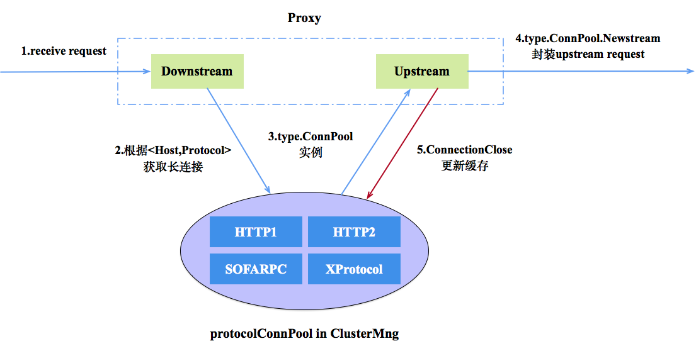

### 接口描述

连接池接口

- `Protocol()` 用于返回当前连接池对应的协议；
- `NewStream()` 用于在当前连接池上创建 Stream；
- `Close()` 用于关闭长连接中的 TCP 套接字。

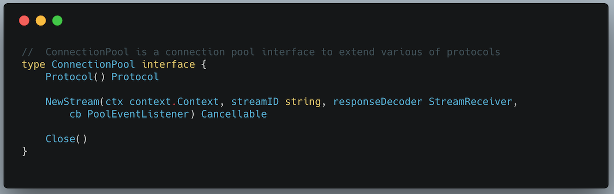

连接池事件监听的接口

- `OnFailure` 用于创建 Stream 失败时的回调，用于 reset stream 相关工作；
- `OnReady` 是连接池准备就绪，Stream 创建成功时的回调，用于 Stream 发送数据。

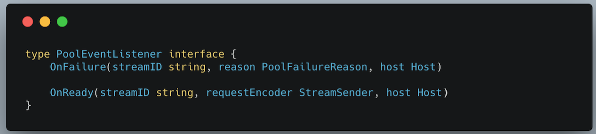

### 数据结构

- `ConnNewPoolFactories` 为不同协议创建对应连接池的工厂类，HTTP1、SOFARPC、 HTTP2、XProtocol 等协议分别调用注册函数 `RegisterNewPoolFactory` ，注册自己的创建方法。
- 类 `clusterManager` 中的 `protocolConnPool` 为全局连接池的实现，其类型为二级 `sync.Map`，其中第一级 Map 的 key 为协议类型，第二级 Map 的 key 为 Host 地址，value 为 `ConnectionPool`。
- 类 `upstreamRequest` 中维护 `connPool` 是 `connPool` 的使用者，用来创建连接。

### 连接池使用

#### 初始化连接池

`clusterManager` 在查询本地连接池时，如果对应协议和 Host 的连接池不存在，则调用对应协议的工厂方法创建连接池，如果存在的话，则直接返回连接池。

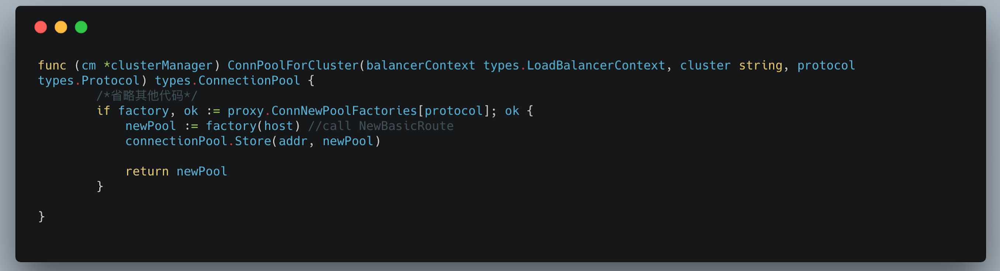

#### 获取连接池

`downstream` 在收到下游的 request 并往上游转发时，会根据协议和挑选的 `upstream` 地址选择连接池并赋值给 `upstream` 的 `connPool`。

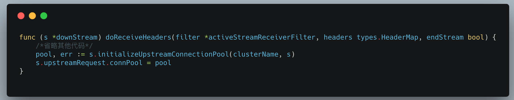

#### 使用连接池

`upstreamRequest` 在往上游转发数据时，会调用 `connPool` 对应的 `Newstream` 方法封装 stream 并发送。

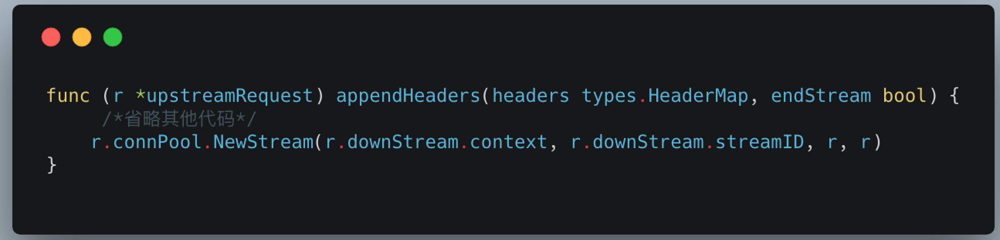

## MOSN 健康检查

MOSN 的健康检查是一种主动健康检查机制，他是 Cluster 内在的一个模块。当前支持的健康检查功能包括：

1. 健康检查支持可配置，配置包括健康检查使用的协议、健康检查报文发送间隔、超时时间、更新阈值等；
2. 提供健康检查接口，允许不同健康检查协议的扩展；
3. 提供基于健康检查结果的 callback 机制，允许自定义对健康检查结果的处理方式；
4. 基于周期性的健康检查，可实现心跳机制，用于长连接的保活。

如下为当前健康检查工作的示意图：

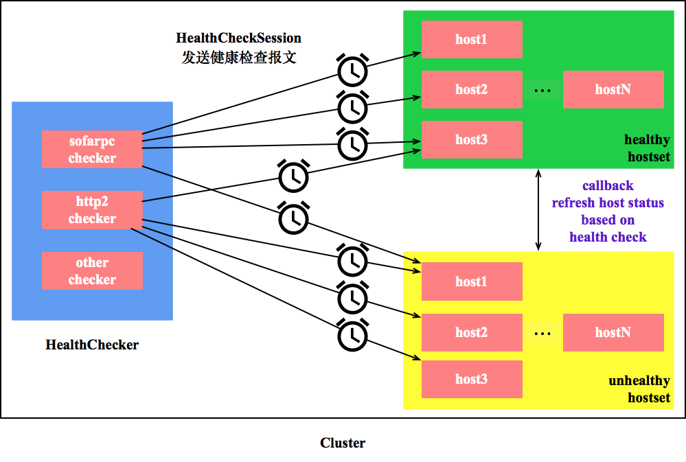

Cluster 的 `HealthChecker` 模块在开启的情况下，会根据配置的协议创建基于 SOFARPC， HTTP2 或者其他协议的健康检查；健康检查模块会与 Cluster 中的所有 Host - 创建 `HealthCheckSession`，在 `Session` 上周期性发送健康检查报文，并开启定时器，如果 Response 在规定时间内未达/到达则判断健康检查失败/成功，健康检查失败/成功次数到一定阈值后 Callback 模块会更新机器的健康状态。

### 健康检查配置

对 Cluster 的健康检查支持的配置包括：
* 发起健康检查的应用层协议，如果子协议存在，还支持配子协议
* 健康检查报文的超时时间
* 发起健康检查报文的间隔
* 更新 Host 状态的阈值
* 健康检查的路径和对应的 Service 信息

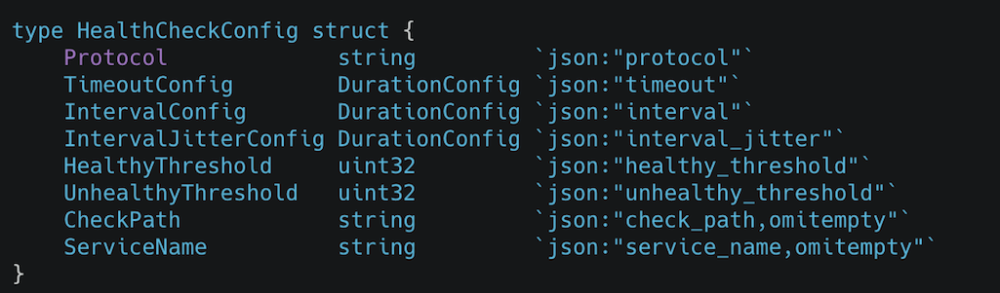

### 接口描述

`HealthChecker` 接口用来控制对整个 Cluster 进行健康检查，其中：

- Start/Stop 开启/关闭 对 Cluster 的健康检查，会开启 Host 的健康检查 Session;
- `AddHostCheckCompleteCb` 用来设置对健康检查结果的回调，关于 cb 的定义在下面会介绍;
- `OnClusterMemberUpdate` 是在外部 Cluster 的 Hosts 发生变化时，例如主机上下线等，来更新健康检查的范围。

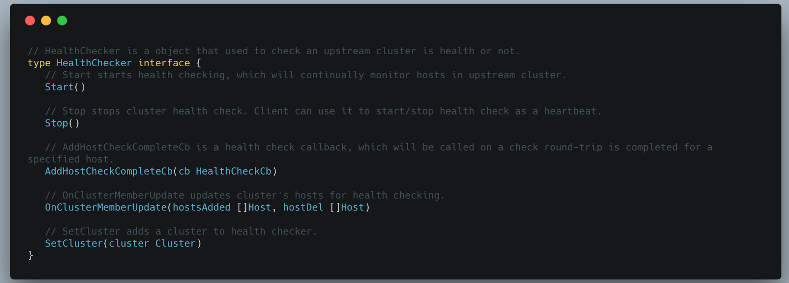

`HealthCheckCb` 是基于健康检查结果对 Host 状态进行更新的回调函数，发生在健康检查的结果对 Host 的状态产生影响之后，如果健康检查失败，则会将 Host 置为 Unhealty，否则置为 Healthy。

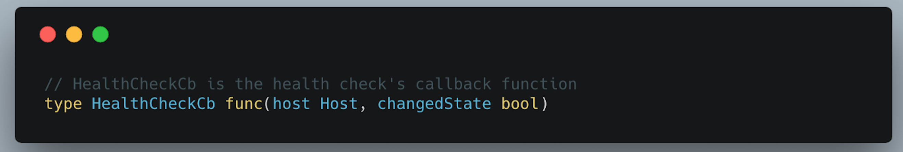

`HealthCheckSession` 是健康检查模块与每个 Host 建立的用于健康检查的 session，在这个 session 上可以发送健康检查数据包并处理 response。

- Start/Stop 开启/停止 对 Host 的健康检查；
- SetUnhealthy 为健康检查失败达到一定阈值之后将 Host 的状态设置为 Unhealthy。

### 数据结构

- Cluster 中的 `healthChecker` 在 Cluster 创建的时候基于配置进行初始化，如果配置支持健康检查，则开启。
- `healthChecker` 是实现 Cluster 健康检查的类，其中包含对所有的 Host 的进行健康检查的 `healthCheckSessions`。在实现基于不同的协议的健康检查时，会继承这个类，并重写一些方法。
- `healthCheckSesion` 是对 Host 健康检查的 session，其中包含两个定时器，以及对应的健康状态更新阈值。在实现基于不同的协议的健康检查时，会继承这个类，并重写一些方法。

### 工作流程

下图是健康检查的工作时序图，包括 从Cluster 创建健康检查器开始，到对每个 Host 创建健康检查的 Session，到对 Host 发送健康检查数据包，到处理 Host 的响应，到更新 Host 的状态。

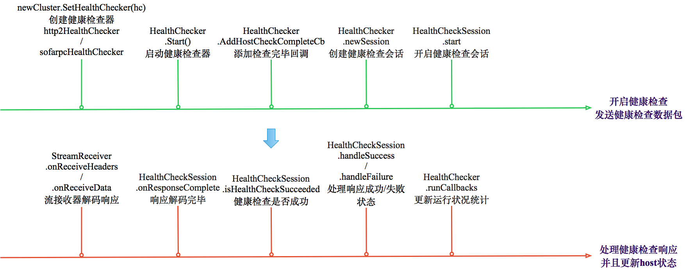

## 总结

本文根据 MOSN 的源码分析 MOSN 对连接池的设计与实现，其基于 `upstreamRequest` 往上游转发数据调用 `connPool` 对应的 `Newstream` 方法发送 Stream。
