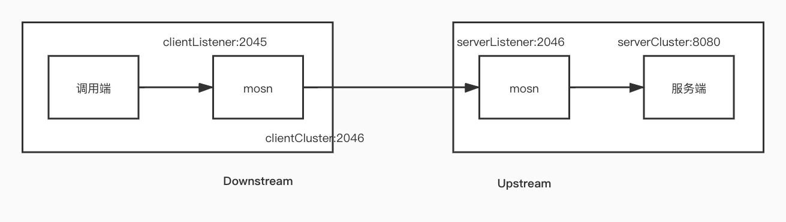
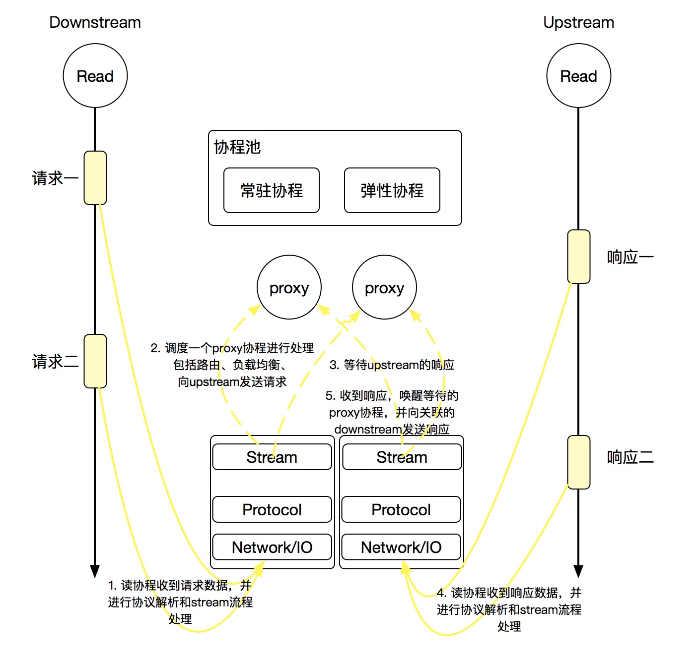

## 基本概念



MOSN 中的概念比较多，以`sofarpc-sample`下面的`config.json`为例，结合上图依次看下：

1. Downstream：调用端的数据流向统称。
2. Upstream：服务端的数据流向统称。
3. clientListener：用于接收调用端（业务进程）请求数据的监听端口。
4. serverListener：作为服务端流量代理，用于接收调用端的请求
5. clientCluster：服务提供者的地址列表，实际应用中这块数据应该来自于注册中心。
6. serverCluster：真正提供服务的业务进程，也就是说一个MOSN可以代理多个服务端进程。

## 流程概述



这是官方提供的一张流程图，已经很清晰了，这里简要说明一下：

1. MOSN 无论是收到调用端（Downstream）发来的请求还是服务端（Upstream）发来的响应，都需要通过网络层，然后根据指定协议解码request跟response，最后交给stream层处理（当然这中间会有各式各样的过滤器链可以进行扩展，后面跟着源码会说）。
2. 由于 MOSN 夹在调用端跟服务端中间，分别跟调用端、服务端都会建立连接，因此在stream层采用的是`同步阻塞`的方式，也就是说调用端的请求转发出去以后对应的协程就会挂起，在收到服务端发来的响应以后再唤醒该等待协程，而关联请求跟响应的关键就是 requestID。

明白了大致流程以后，下面就通过源码来分析一下整个过程。

## 源码分析

为了便于理解，这里从下往上看，也就是先从网络层接收数据的逻辑开始，一步一步来分析 MOSN 是怎么做编解码，怎么转发请求。

### 发起请求

MOSN 对于网络层的操作，无论是调用端还是服务端，都封装在`eventloop.go`文件中，每当连接建立以后，MOSN 都会开启两个协程分别处理该连接上的读写操作，分别对应`startReadLoop`跟`startWriteLoop`两个方法。

当调用端（业务进程）发起请求时，根据`clientListener`指定的地址跟 MOSN 建立连接，然后发起调用。MOSN 在建立连接以后，会等待请求数据的到达，这部分逻辑就在`startReadLoop `中：

```go
func (c *connection) startReadLoop() {
	var transferTime time.Time
	for {
        //省略部分逻辑...
		select {
		case <-c.internalStopChan:
			return
		case <-c.readEnabledChan:
		default:
			if c.readEnabled { //readEnabled 默认为true
				//真正的读取数据逻辑在这里
				err := c.doRead()
				if err != nil {
					//读取失败进行处理
				}
			} else {
				select {
				case <-c.readEnabledChan:
				case <-time.After(100 * time.Millisecond):
				}
			}
		}
	}
}
```

逻辑比较直观，就是一个死循环不断的读取该连接上面的数据。
下面看一下关键的`doRead()`方法：

```go
func (c *connection) doRead() (err error) {
    //为该连接创建一个buffer来保存读入的数据
	if c.readBuffer == nil {
		c.readBuffer = buffer.GetIoBuffer(DefaultBufferReadCapacity)
	}

	var bytesRead int64

	//从连接中读取数据，返回实际读取到的字节数，rawConnection对应的就是原始连接
	bytesRead, err = c.readBuffer.ReadOnce(c.rawConnection)
	if err != nil {
	      //错误处理
	}

	//没有读取到数据，也没有报错
	if bytesRead == 0 && err == nil {
		err = io.EOF
	}

	//进行读取字节函数的回调，可以进行数据统计
	for _, cb := range c.bytesReadCallbacks {
		cb(uint64(bytesRead))
	}

	//通知上层读取到了新的数据
	c.onRead()
	return
}
```

上面的`ReadOnce `方法比较简单，就不单独列出来了，其实就是在该连接上设置一个超时时间进行读取，并把读取到的数据放入buffer中，结合最外层的死循环，不难理解这个不断尝试读取数据的模型。

下面重点看一下回调方法`onRead() `

```go
func (c *connection) onRead() {
	//不再可读，这里可能跟热升级有关？
	if !c.readEnabled {
		return
	}
	//没有需要处理的数据
	if c.readBuffer.Len() == 0 {
		return
	}

	//filterManager过滤器管理者，把读取到的数据交给过滤器链路进行处理
	c.filterManager.OnRead()
}

//上述OnRead方法实现
func (fm *filterManager) OnRead() {
	fm.onContinueReading(nil)
}

func (fm *filterManager) onContinueReading(filter *activeReadFilter) {
	var index int
	var uf *activeReadFilter

	if filter != nil {
		index = filter.index + 1
	}

	//这里可以清楚的看到网络层读取到数据以后，通过filterManager把数据交给整个过滤器链路处理
	for ; index < len(fm.upstreamFilters); index++ {
		uf = fm.upstreamFilters[index]
		uf.index = index
        //针对还没有初始化的过滤器回调其初始化方法OnNewConnection
		if !uf.initialized {
			uf.initialized = true
			status := uf.filter.OnNewConnection()
			if status == api.Stop {
				return
			}
		}

		//取出该连接中刚才读取到的数据
		buf := fm.conn.GetReadBuffer()
		if buf != nil && buf.Len() > 0 {
			//通知过滤器进行处理
			status := uf.filter.OnData(buf)
			if status == api.Stop {
				return
			}
		}
	}
}
```

在`sofarpc-sample`中，这个过滤器对应的实现就在`proxy.go`文件中，一起来看下具体实现：

```go
func (p *proxy) OnData(buf buffer.IoBuffer) api.FilterStatus {
    //针对使用的协议类型初始化serverStreamConn
	if p.serverStreamConn == nil {
		var prot string
		if conn, ok := p.readCallbacks.Connection().RawConn().(*mtls.TLSConn); ok {
			prot = conn.ConnectionState().NegotiatedProtocol
		}
		protocol, err := stream.SelectStreamFactoryProtocol(p.context, prot, buf.Bytes())
		if err == stream.EAGAIN {
			return api.Stop
		} else if err == stream.FAILED {
			var size int
			if buf.Len() > 10 {
				size = 10
			} else {
				size = buf.Len()
			}
			log.DefaultLogger.Errorf("[proxy] Protocol Auto error magic :%v", buf.Bytes()[:size])
			p.readCallbacks.Connection().Close(api.NoFlush, api.OnReadErrClose)
			return api.Stop
		}
		log.DefaultLogger.Debugf("[proxy] Protoctol Auto: %v", protocol)
		p.serverStreamConn = stream.CreateServerStreamConnection(p.context, protocol, p.readCallbacks.Connection(), p)
	}
	//把数据分发到对应协议的的解码器，在这里当然就是sofa协议解析器
	p.serverStreamConn.Dispatch(buf)
    //结合上面过滤器链路的调用逻辑看，返回Stop表示处理完成，不会再继续调用剩余的过滤器
	return api.Stop
}
```

由于我们是以`sofarcp-sample`为例进行分析，所以上述的`Dispatch()`方法自然落在了`pkg/stream/sofarpc/stream.go`文件中，一起来看一下：

```go
func (conn *streamConnection) Dispatch(buf types.IoBuffer) {
	for {
		// 1. pre alloc stream-level ctx with bufferCtx
		ctx := conn.contextManager.Get()

		// 2. decode process
		// 针对读取到的数据，按照协议类型进行解码
		cmd, err := conn.codecEngine.Decode(ctx, buf)
		// No enough data
		//如果没有报错且没有解析成功，那就说明当前收到的数据不够解码，推出循环，等待更多数据到来
		if cmd == nil && err == nil {
			break
		}
		if err != nil {
			//错误处理
		}

		// Do handle staff. Error would also be passed to this function.
		//解码成功以后，开始处理该请求
		//注意不能并行对数据进行解码，不然数据都乱了，解码之后可以引入多线程提高吞吐量
		conn.handleCommand(ctx, cmd, err)
		if err != nil {
			break
		}
		conn.contextManager.Next()
	}
}
```

上述解码过程的具体实现就不单独列出来了，根据协议规范处理字节即可。

下面重点看一下解码成功后的后续处理，继续`handleCommand`方法：

```go
func (conn *streamConnection) handleCommand(ctx context.Context, model interface{}, err error) {
	if err != nil {
		conn.handleError(ctx, model, err)
		return
	}
    //类型校验
	cmd, ok := model.(sofarpc.SofaRpcCmd)
	if !ok {
		conn.handleError(ctx, model, ErrNotSofarpcCmd)
		return
	}
    //根据数据类型创建对应的stream
	stream := conn.processStream(ctx, cmd)

	//处理该stream的后续工作
	if stream != nil {
		timeoutInt := cmd.GetTimeout()
		timeout := strconv.Itoa(timeoutInt) // timeout, ms
		cmd.Set(types.HeaderGlobalTimeout, timeout)

		//转发数据的逻辑封装在这里
		stream.receiver.OnReceive(stream.ctx, cmd, cmd.Data(), nil)
	}
}

//这里是区分请求跟响应的关键部分，关系到数据流向
func (conn *streamConnection) processStream(ctx context.Context, cmd sofarpc.SofaRpcCmd) *stream {
	switch cmd.CommandType() {
	case sofarpc.REQUEST, sofarpc.REQUEST_ONEWAY:
		var span types.Span
		if trace.IsEnabled() {
			// try build trace span
			tracer := trace.Tracer(protocol.SofaRPC)
			if tracer != nil {
				span = tracer.Start(ctx, cmd, time.Now())
			}
		}
        //请求处理
		return conn.onNewStreamDetect(ctx, cmd, span)
	case sofarpc.RESPONSE:
        //响应处理
		return conn.onStreamRecv(ctx, cmd)
	}
	return nil
}
```

上述stream的处理逻辑，是我认为整个数据流处理中最复杂的部分，首先这里出现了分歧，根据当前的数据是request还是response进行不同的处理，顺着我们的思路，现在还在请求转发阶段，因此我们先来看下请求处理：

```go
func (conn *streamConnection) onNewStreamDetect(ctx context.Context, cmd sofarpc.SofaRpcCmd, span types.Span) *stream {
	//每个请求新建一个stream
	buffers := sofaBuffersByContext(ctx)
	stream := &buffers.server
        //保存requestID，后面要用来关联请求及响应
	stream.id = cmd.RequestID()
	stream.ctx = mosnctx.WithValue(ctx, types.ContextKeyStreamID, stream.id)
	stream.ctx = mosnctx.WithValue(ctx, types.ContextSubProtocol, cmd.ProtocolCode())
	stream.ctx = conn.contextManager.InjectTrace(stream.ctx, span)
	//数据流向
	stream.direction = ServerStream
	stream.sc = conn
    //根据请求类型进行处理
	if cmd.CommandType() == sofarpc.REQUEST_ONEWAY {
		stream.receiver = conn.serverStreamConnectionEventListener.NewStreamDetect(stream.ctx, nil, span)
	} else {
		//为该stream创建一个用于处理收到响应以后的对象
		stream.receiver = conn.serverStreamConnectionEventListener.NewStreamDetect(stream.ctx, stream, span)
	}

	return stream
}

//receiver的具体实现
func (p *proxy) NewStreamDetect(ctx context.Context, responseSender types.StreamSender, span types.Span) types.StreamReceiveListener {
	//再次是一个新的stream
	stream := newActiveStream(ctx, p, responseSender, span)

	if value := mosnctx.Get(p.context, types.ContextKeyStreamFilterChainFactories); value != nil {
		ff := value.(*atomic.Value)
		ffs, ok := ff.Load().([]api.StreamFilterChainFactory)
		if ok {
			for _, f := range ffs {
				f.CreateFilterChain(p.context, stream)
			}
		}
	}

	p.asMux.Lock()
	stream.element = p.activeSteams.PushBack(stream)
	p.asMux.Unlock()

	return stream
}

//真正receiver的创建过程
func newActiveStream(ctx context.Context, proxy *proxy, responseSender types.StreamSender, span types.Span) *downStream {
	if span != nil && trace.IsEnabled() {
		ctx = mosnctx.WithValue(ctx, types.ContextKeyActiveSpan, span)
		ctx = mosnctx.WithValue(ctx, types.ContextKeyTraceSpanKey, &trace.SpanKey{TraceId: span.TraceId(), SpanId: span.SpanId()})
	}

	//从对象池中选一个
	proxyBuffers := proxyBuffersByContext(ctx)

	stream := &proxyBuffers.stream
	stream.ID = atomic.AddUint32(&currProxyID, 1)
	stream.proxy = proxy
	stream.requestInfo = &proxyBuffers.info
	stream.requestInfo.SetStartTime()
	stream.requestInfo.SetDownstreamLocalAddress(proxy.readCallbacks.Connection().LocalAddr())
	stream.requestInfo.SetDownstreamRemoteAddress(proxy.readCallbacks.Connection().RemoteAddr())
	stream.context = ctx
	stream.reuseBuffer = 1
	stream.notify = make(chan struct{}, 1)
    //省略部分数据
	if responseSender == nil || reflect.ValueOf(responseSender).IsNil() {
		stream.oneway = true
	} else {
		stream.responseSender = responseSender
		stream.responseSender.GetStream().AddEventListener(stream)
	}
	return stream
}
```

整个stream的构建过程代码多且复杂，但其实总的来说就是针对每个请求创建了两个stream对象，一个用于封装请求逻辑，一个用于封装收到响应以后的处理逻辑。

接下来需要回到`handleCommand`方法，当stream创建好之后，会直接调用其receiver的`OnReceive`方法，由于现在还是处理请求，所以对应的是`downstream.go`中的实现：

注意：每个请求数据都分为了header，body，trailers三部分。

```go
func (s *downStream) OnReceive(ctx context.Context, headers types.HeaderMap, data types.IoBuffer, trailers types.HeaderMap) {
	//head body trailer
	s.downstreamReqHeaders = headers
	if data != nil {
		s.downstreamReqDataBuf = data.Clone()
		data.Drain(data.Len())
	}
	s.downstreamReqTrailers = trailers

	id := s.ID
	//把给任务丢给协程池进行处理即可
	pool.ScheduleAuto(func() {
		defer func() {
			if r := recover(); r != nil {
				if id == s.ID {
					s.delete()
				}
			}
		}()

		//一旦该协程被CPU调度到以后，就开始继续执行发送请求的逻辑：
		phase := types.InitPhase
		for i := 0; i < 10; i++ {
			s.cleanNotify()
            //真正的处理逻辑在这里
			phase = s.receive(ctx, id, phase)
			switch phase {
			case types.End:
				return
			case types.MatchRoute:
			case types.Retry:
			case types.UpFilter:
			}
		}
	})
}
```

`receive`方法的逻辑我觉得很有意思，总体来说在请求转发阶段，依次需要经过`DownFilter` -> `MatchRoute` -> `DownFilterAfterRoute` -> `DownRecvHeader ` -> `DownRecvData` -> `DownRecvTrailer`  -> `WaitNofity`这么几个阶段，从字面意思可以知道`MatchRoute`就是构建路由信息，也就是转发给哪个服务，而`WaitNofity`则是转发成功以后，等待被响应数据唤醒。

下面就依次来看一下：

```go
func (s *downStream) receive(ctx context.Context, id uint32, phase types.Phase) types.Phase {
	for i := 0; i <= int(types.End-types.InitPhase); i++ {
		switch phase {
		// init phase
		case types.InitPhase:
			phase++
			// downstream filter before route
		case types.DownFilter:
			s.runReceiveFilters(phase, s.downstreamReqHeaders, s.downstreamReqDataBuf, s.downstreamReqTrailers)
            //有错误就退出
			if p, err := s.processError(id); err != nil {
				return p
			}
			phase++
			// match route
		case types.MatchRoute:
            //生成服务提供者的地址列表以及路由规则
			s.matchRoute()
			if p, err := s.processError(id); err != nil {
				return p
			}
			phase++

			// downstream filter after route
		case types.DownFilterAfterRoute:
			s.runReceiveFilters(phase, s.downstreamReqHeaders, s.downstreamReqDataBuf, s.downstreamReqTrailers)

			if p, err := s.processError(id); err != nil {
				return p
			}
			phase++

			// downstream receive header
		case types.DownRecvHeader:
            //这里开始依次发送数据
			if s.downstreamReqHeaders != nil {
				s.receiveHeaders(s.downstreamReqDataBuf == nil && s.downstreamReqTrailers == nil)

				if p, err := s.processError(id); err != nil {
					return p
				}
			}
			phase++

			// downstream receive data
		case types.DownRecvData:
			if s.downstreamReqDataBuf != nil {
				s.downstreamReqDataBuf.Count(1)
				s.receiveData(s.downstreamReqTrailers == nil)

				if p, err := s.processError(id); err != nil {
					return p
				}
			}
			phase++

			// downstream receive trailer
		case types.DownRecvTrailer:
			if s.downstreamReqTrailers != nil {
				s.receiveTrailers()

				if p, err := s.processError(id); err != nil {
					return p
				}
			}
			phase++
		case types.WaitNofity:
			//这里阻塞等待返回及结果
			if p, err := s.waitNotify(id); err != nil {
				return p
			}
			phase++
		}
	}
	return types.End
}
```

真正的发送数据逻辑是在`receiveHeaders`、`receiveData `、`receiveTrailers `这三个方法里，当然每次请求不一定都需要有这三部分的数据，这里我们以`receiveHeaders`方法为例来进行说明：

```go
func (s *downStream) receiveHeaders(endStream bool) {
	s.downstreamRecvDone = endStream
    //省略部分逻辑。。。

    //这里的的clusterName就对应上面的"clientCluster"
	clusterName := s.route.RouteRule().ClusterName()
	s.cluster = s.snapshot.ClusterInfo()
	s.requestInfo.SetRouteEntry(s.route.RouteRule())

	//初始化连接池
	pool, err := s.initializeUpstreamConnectionPool(s)
	if err != nil {
		//错误处理
	}

	parseProxyTimeout(&s.timeout, s.route, s.downstreamReqHeaders)
	prot := s.getUpstreamProtocol()

	s.retryState = newRetryState(s.route.RouteRule().Policy().RetryPolicy(), s.downstreamReqHeaders, s.cluster, prot)

	//构建对应的upstream请求
	proxyBuffers := proxyBuffersByContext(s.context)
	s.upstreamRequest = &proxyBuffers.request
	s.upstreamRequest.downStream = s
	s.upstreamRequest.proxy = s.proxy
	s.upstreamRequest.protocol = prot
	s.upstreamRequest.connPool = pool
	s.route.RouteRule().FinalizeRequestHeaders(s.downstreamReqHeaders, s.requestInfo)

	//这里发送数据
	s.upstreamRequest.appendHeaders(endStream)

	//这里开启超时计时器
	if endStream {
		s.onUpstreamRequestSent()
	}
}

//
func (r *upstreamRequest) appendHeaders(endStream bool) {
	if r.downStream.processDone() {
		return
	}
	r.sendComplete = endStream
	if r.downStream.oneway {
		r.connPool.NewStream(r.downStream.context, nil, r)
	} else {
		r.connPool.NewStream(r.downStream.context, r, r)
	}
}

//
func (p *connPool) NewStream(ctx context.Context, responseDecoder types.StreamReceiveListener, listener types.PoolEventListener) {
	subProtocol := getSubProtocol(ctx)
    //从连接池中获取连接
	client, _ := p.activeClients.Load(subProtocol)
	if client == nil {
		listener.OnFailure(types.ConnectionFailure, p.host)
		return
	}

	activeClient := client.(*activeClient)
	if atomic.LoadUint32(&activeClient.state) != Connected {
		listener.OnFailure(types.ConnectionFailure, p.host)
		return
	}

	if !p.host.ClusterInfo().ResourceManager().Requests().CanCreate() {
		listener.OnFailure(types.Overflow, p.host)
		p.host.HostStats().UpstreamRequestPendingOverflow.Inc(1)
		p.host.ClusterInfo().Stats().UpstreamRequestPendingOverflow.Inc(1)
	} else {
		atomic.AddUint64(&activeClient.totalStream, 1)
		p.host.HostStats().UpstreamRequestTotal.Inc(1)
		p.host.ClusterInfo().Stats().UpstreamRequestTotal.Inc(1)

		var streamEncoder types.StreamSender
		// oneway
		if responseDecoder == nil {
			streamEncoder = activeClient.client.NewStream(ctx, nil)
		} else {
            //这里会把streamId对应的stream保存起来
			streamEncoder = activeClient.client.NewStream(ctx, responseDecoder)
			streamEncoder.GetStream().AddEventListener(activeClient)
		}
        //发送数据
		listener.OnReady(streamEncoder, p.host)
	}
	return
}

//
func (c *client) NewStream(context context.Context, respReceiver types.StreamReceiveListener) types.StreamSender {
	// oneway
	if respReceiver == nil {
		return c.ClientStreamConnection.NewStream(context, nil)
	}
	wrapper := &clientStreamReceiverWrapper{
		streamReceiver: respReceiver,
	}
	streamSender := c.ClientStreamConnection.NewStream(context, wrapper)
	wrapper.stream = streamSender.GetStream()
	return streamSender
}

//
func (conn *streamConnection) NewStream(ctx context.Context, receiver types.StreamReceiveListener) types.StreamSender {
	buffers := sofaBuffersByContext(ctx)
	stream := &buffers.client
	stream.id = atomic.AddUint64(&conn.currStreamID, 1)
	stream.ctx = mosnctx.WithValue(ctx, types.ContextKeyStreamID, stream.id)
	stream.direction = ClientStream
	stream.sc = conn
	stream.receiver = receiver
	//oneway的请求不需要处理结果
	if stream.receiver != nil {
		conn.mutex.Lock()
		//按照id放进map
		conn.streams[stream.id] = stream
		conn.mutex.Unlock()
	}
	return stream
}

//
func (r *upstreamRequest) OnReady(sender types.StreamSender, host types.Host) {
	r.requestSender = sender
	r.host = host
	r.requestSender.GetStream().AddEventListener(r)
	r.startTime = time.Now()

	endStream := r.sendComplete && !r.dataSent && !r.trailerSent
    //发送数据
	r.requestSender.AppendHeaders(r.downStream.context, r.convertHeader(r.downStream.downstreamReqHeaders), endStream)

	r.downStream.requestInfo.OnUpstreamHostSelected(host)
	r.downStream.requestInfo.SetUpstreamLocalAddress(host.AddressString())

}

//
func (s *stream) AppendHeaders(ctx context.Context, headers types.HeaderMap, endStream bool) error {
	cmd, ok := headers.(sofarpc.SofaRpcCmd)
	var err error、
	switch s.direction {
	case ClientStream:
		s.sendCmd = cmd
	case ServerStream:
		switch cmd.CommandType() {
		case sofarpc.RESPONSE:
			s.sendCmd = cmd
		case sofarpc.REQUEST, sofarpc.REQUEST_ONEWAY:
			//服务端发给调用端的数据
			s.sendCmd, err = s.buildHijackResp(cmd)
		}
	}
	if endStream {
		s.endStream()
	}
	return err
}

//
func (s *stream) endStream() {
	if s.sendCmd != nil {
		s.sendCmd.SetRequestID(s.id)
		s.sendCmd.Del(types.HeaderGlobalTimeout)

		//编码
		buf, err := s.sc.codecEngine.Encode(s.ctx, s.sendCmd)
		if err != nil {
        //...
		}

		//这里相当于是上面的编码只编码的头部，如果有body那就一起发送？
		if dataBuf := s.sendCmd.Data(); dataBuf != nil {
			err = s.sc.conn.Write(buf, dataBuf)
		} else {
			err = s.sc.conn.Write(buf)
		}
		//错误处理
		if err != nil {
		}
	}
}
```
网络层的write：

```go
func (c *connection) Write(buffers ...buffer.IoBuffer) (err error) {
    //同样经过过滤器
	fs := c.filterManager.OnWrite(buffers)

	if fs == api.Stop {
		return nil
	}

	if !UseNetpollMode {
		if c.useWriteLoop {
			c.writeBufferChan <- &buffers
		} else {
			err = c.writeDirectly(&buffers)
		}
	} else {
		//netpoll模式写
	}

	return
}
```

在对应的`eventloop.go`中的`startWriteLoop`方法：

```go
func (c *connection) startWriteLoop() {
	var err error
	for {
		select {
		case <-c.internalStopChan:
			return
		case <-c.transferChan:
			needTransfer = true
			return
		case buf, ok := <-c.writeBufferChan:
			if !ok {
				return
			}
			c.appendBuffer(buf)
            c.rawConnection.SetWriteDeadline(time.Now().Add(types.DefaultConnWriteTimeout))
			_, err = c.doWrite()
		}

		if err != nil {
			//错误处理
		}
	}
}
```


请求数据发出去以后当前协程就阻塞了，看下`waitNotify`方法的实现：

```go
func (s *downStream) waitNotify(id uint32) (phase types.Phase, err error) {
	if s.ID != id {
		return types.End, types.ErrExit
	}
	//阻塞等待
	select {
	case <-s.notify:
	}
	return s.processError(id)
}
```

经过上面的几个步骤，请求被成功转发出去，并且对应的stream在阻塞等待响应。

### 结果响应

接下来我们再回头看看收到响应时候的处理过程，由于网络层的处理逻辑都是一样的，所以我们从前面出现分歧的地方开始看，也就是`processStream`方法，当收到的数据类型是`RESPONSE`时，它会调用`onStreamRecv`，一起来看下：

```go
func (conn *streamConnection) onStreamRecv(ctx context.Context, cmd sofarpc.SofaRpcCmd) *stream {
	requestID := cmd.RequestID()
	conn.mutex.Lock()
	defer conn.mutex.Unlock()
	
	//通过requestID找到对应的阻塞的stream
	if stream, ok := conn.streams[requestID]; ok {
		delete(conn.streams, requestID)
		buffer.TransmitBufferPoolContext(stream.ctx, ctx)
		return stream
	}
	return nil
}
```

该stream同样会走到`handleCommand`方法中的`OnReceive`，如下：

```go
func (w *clientStreamReceiverWrapper) OnReceive(ctx context.Context, headers types.HeaderMap, data types.IoBuffer, trailers types.HeaderMap) {
	w.stream.DestroyStream()
	w.streamReceiver.OnReceive(ctx, headers, data, trailers)
}

func (r *upstreamRequest) OnReceive(ctx context.Context, headers types.HeaderMap, data types.IoBuffer, trailers types.HeaderMap) {
	if r.downStream.processDone() || r.setupRetry {
		return
	}
	r.endStream()
	if code, err := protocol.MappingHeaderStatusCode(r.protocol, headers); err == nil {
		r.downStream.requestInfo.SetResponseCode(code)
	}
	r.downStream.requestInfo.SetResponseReceivedDuration(time.Now())
	r.downStream.downstreamRespHeaders = headers
	if data != nil {
		r.downStream.downstreamRespDataBuf = data.Clone()
		data.Drain(data.Len())
	}
	r.downStream.downstreamRespTrailers = trailers
	//唤醒downstream
	r.downStream.sendNotify()
}
```

逻辑很简单，就是把根据requestID匹配到的stream唤醒，下面来看一下唤醒以后的处理逻辑，
这里需要回到前面阻塞的`receive`方法中，唤醒以后会从之前阻塞的地方开始继续执行，如下：

```go
func (s *downStream) receive(ctx context.Context, id uint32, phase types.Phase) types.Phase {
	for i := 0; i <= int(types.End-types.InitPhase); i++ {
		switch phase {
		case types.WaitNofity:
			//从这里醒来
			if p, err := s.waitNotify(id); err != nil {
				return p
			}
			phase++
		case types.UpFilter:
			s.runAppendFilters(phase, s.downstreamRespHeaders, s.downstreamRespDataBuf, s.downstreamRespTrailers)
			if p, err := s.processError(id); err != nil {
				return p
			}
			if s.upstreamRequest == nil {
				fakeUpstreamRequest := &upstreamRequest{
					downStream: s,
				}
				s.upstreamRequest = fakeUpstreamRequest
			}
			phase++
		case types.UpRecvHeader:
			//同样是在这里返回响应结果
			if s.downstreamRespHeaders != nil {
				s.upstreamRequest.receiveHeaders(s.downstreamRespDataBuf == nil && s.downstreamRespTrailers == nil)
				if p, err := s.processError(id); err != nil {
					return p
				}
			}
			phase++
		case types.UpRecvData:
			if s.downstreamRespDataBuf != nil {
				s.upstreamRequest.receiveData(s.downstreamRespTrailers == nil)
				if p, err := s.processError(id); err != nil {
					return p
				}
			}
			phase++
		case types.UpRecvTrailer:
			if s.downstreamRespTrailers != nil {
				s.upstreamRequest.receiveTrailers()
				if p, err := s.processError(id); err != nil {
					return p
				}
			}
			phase++
		case types.End:
			return types.End
		default:
			return types.End
		}
	}

	log.Proxy.Errorf(s.context, "[proxy] [downstream] unexpected phase cycle time")
	return types.End
}
```

上面的receiveXXX方法会把响应数据转发给业务进程，之前分析过了，这里就不再赘述。

## 协程池

前面在请求处理过程中提到了会把请求任务交给一个协程池去处理，这里就简单看一下 MOSN 中协程池的实现原理：
```go
type workerPool struct {
	work chan func()
	sem  chan struct{}
}
func NewWorkerPool(size int) WorkerPool {
	return &workerPool{
		work: make(chan func()),
		sem:  make(chan struct{}, size),
	}
}
```
初始化过程很简单，协程池的默认大小为`poolSize := runtime.NumCPU() * 256`，接下来看一下调度方法的实现：
```go
func (p *workerPool) ScheduleAuto(task func()) {
	select {
	case p.work <- task:
		return
	default:
	}
	select {
	case p.work <- task:
	case p.sem <- struct{}{}:
		go p.spawnWorker(task)
	default:
		//如果有多余的任务，则会临时创建协程执行
		utils.GoWithRecover(func() {
			task()
		}, nil)
	}
}
//额外创建出来的协程在执行完任务以后会自动退出
func GoWithRecover(handler func(), recoverHandler func(r interface{})) {
	go func() {
		//省略defer方法...
		handler()
	}()
}
func (p *workerPool) spawnWorker(task func()) {
	defer func() {
		if r := recover(); r != nil {
			log.DefaultLogger.Errorf("[syncpool] panic %v\n%s", p, string(debug.Stack()))
		}
		//整个函数退出时，协程数量减1，后面可以再创建出来
		//这里正常情况下下面的死循环是不会退出的，也就是说基础协程一旦创建就不会被回收
		<-p.sem
	}()
	for {
		//执行任务
		task()
		//如果还有任务等待执行，则循环执行任务，否则等待
		task = <-p.work
	}
}
```

## 总结

MOSN 对于数据的处理及转发这块非常复杂，主要是概念很多，尤其是stream部分，对象之间互相引用，错综复杂，考虑到篇幅原因，本文只说明了流程，其他比如路由策略的细节等需要通过其他文章进行分析。