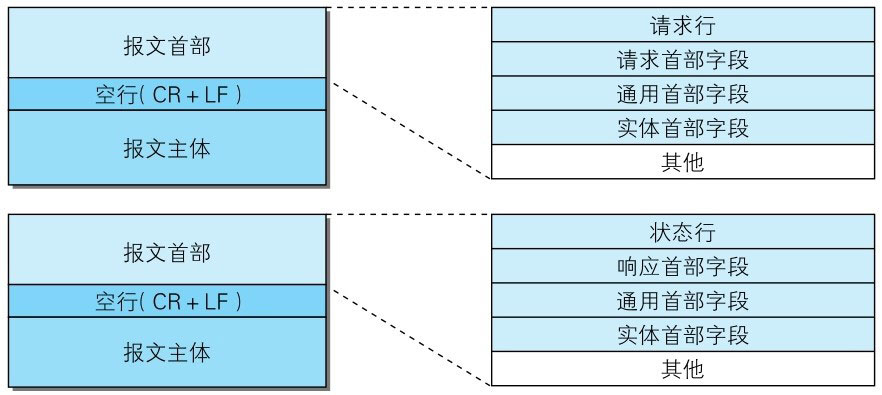
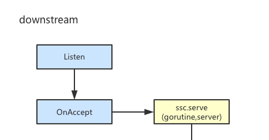
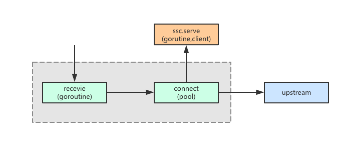

本文的目的是分析 MOSN 源码中的 HTTP 系能力，内容基于 MOSN 0.9.0

## 概述

HTTP 是互联网界最常用的一种协议之一，MOSN 也提供了对其强大的支持。

## MOSN HTTP 报文组成



上图是[图解 HTTP](https://book.douban.com/subject/25863515/) 中关于 HTTP 报文报文的介绍。MOSN 对于 HTTP 报文的处理并没有使用go 官网 `net/http`中的结构也没有独立设计一套相关结构 而是复用了业界开源的[fasthttp](https://github.com/valyala/fasthttp) 的结构。

```go
type stream struct {
	str.BaseStream

	id               uint64
	readDisableCount int32
	ctx              context.Context
    // 请求报文
	request  *fasthttp.Request
    // 响应报文
	response *fasthttp.Response

	receiver types.StreamReceiveListener
}
```

## MOSN HTTP 处理流程


上图是HTTP请求在MOSN中的流动过程，下面将具体讲解。

### 流程注册

```go
func init() {
	str.Register(protocol.HTTP1, &streamConnFactory{})
}
```

在 `pkg/stream/http` 包加载过程中将包含 HTTP 对于MOSN上下游连接的处理逻辑的结构体值注册到统一的stream处理工厂。

### 捕获请求



由上图可知，MOSN捕捉到一个请求之后会开启一个goroutine读取连接中的数据，也就是
 `serverStreamConnection.serve` 函数。

```go
func (conn *serverStreamConnection) serve() {
	for {
		// 1. pre alloc stream-level ctx with bufferCtx
		ctx := conn.contextManager.Get()
		// 通过sync.Pool 实现实现内存复用
		buffers := httpBuffersByContext(ctx)
		request := &buffers.serverRequest

		// 2. blocking read using fasthttp.Request.Read
		err := request.ReadLimitBody(conn.br, defaultMaxRequestBodySize)
		if err == nil {
			// 3. 'Expect: 100-continue' request handling.
			// See http://www.w3.org/Protocols/rfc2616/rfc2616-sec8.html for details.
			if request.MayContinue() {
				// Send 'HTTP/1.1 100 Continue' response.
				conn.conn.Write(buffer.NewIoBufferBytes(strResponseContinue))

				// read request body
				err = request.ContinueReadBody(conn.br, defaultMaxRequestBodySize)

				// remove 'Expect' header, so it would not be sent to the upstream
				request.Header.Del("Expect")
			}
		}
		// 读取错误的处理
		if err != nil {
			// "read timeout with nothing read" is the error of returned by fasthttp v1.2.0
			// if connection closed with nothing read.
			if err != errConnClose && err != io.EOF && err.Error() != "read timeout with nothing read" {
				// write error response
				conn.conn.Write(buffer.NewIoBufferBytes(strErrorResponse))

				// close connection with flush
				conn.conn.Close(api.FlushWrite, api.LocalClose)
			}
			return
		}

		// 数据读取结束
		id := protocol.GenerateID()
		s := &buffers.serverStream

		// 4. request processing
		s.stream = stream{
			id:       id,
			ctx:      mosnctx.WithValue(ctx, types.ContextKeyStreamID, id),
			request:  request,
			response: &buffers.serverResponse,
		}
		s.connection = conn
		s.responseDoneChan = make(chan bool, 1)
		s.header = mosnhttp.RequestHeader{&s.request.Header, nil}

		var span types.Span
		if trace.IsEnabled() {
			tracer := trace.Tracer(protocol.HTTP1)
			if tracer != nil {
				span = tracer.Start(ctx, s.header, time.Now())
			}
		}
		// 上下文 中注入链式追踪信息
		s.stream.ctx = s.connection.contextManager.InjectTrace(ctx, span)

		if log.Proxy.GetLogLevel() >= log.DEBUG {
			log.Proxy.Debugf(s.stream.ctx, "[stream] [http] new stream detect, requestId = %v", s.stream.id)
		}

		s.receiver = conn.serverStreamConnListener.NewStreamDetect(s.stream.ctx, s, span)

		conn.mutex.Lock()
		conn.stream = s
		conn.mutex.Unlock()

		if atomic.LoadInt32(&s.readDisableCount) <= 0 {
			s.handleRequest()
		}

		// 5. wait for proxy done
		select {
		case <-s.responseDoneChan:
		case <-conn.connClosed:
			return
		}

		conn.contextManager.Next()
	}
}
```

由以上代码可以得知，因为不能判断连接是长连接还是短连接，所以MOSN调用方不主动关闭连接，MOSN也不会主动关闭，除非出现错误。

### 转发请求



由上图可知，MOSN在捕获请求之后，开启一个goroutine 创建对upstream的连接，并且通过这个连接和upstream进行数据交互，与此同时开启另外一个goroutine对这个连接进行监控用来处理连接返回数据。其主要处理逻辑在downStream.receive中。

```go
for i := 0; i <= int(types.End-types.InitPhase); i++ {
		fmt.Println("yu",i,s.downstreamReqTrailers == nil,phase,int(types.End-types.InitPhase),types.WaitNofity)
		switch phase {
		// init phase
		case types.InitPhase:
			phase++

			// downstream filter before route
		case types.DownFilter:
			if log.Proxy.GetLogLevel() >= log.DEBUG {
				log.Proxy.Debugf(s.context, "[proxy] [downstream] enter phase %d, proxyId = %d  ", phase, id)
			}
			s.runReceiveFilters(phase, s.downstreamReqHeaders, s.downstreamReqDataBuf, s.downstreamReqTrailers)

			if p, err := s.processError(id); err != nil {
				return p
			}
			phase++

			// match route
		case types.MatchRoute:
			if log.Proxy.GetLogLevel() >= log.DEBUG {
				log.Proxy.Debugf(s.context, "[proxy] [downstream] enter phase %d, proxyId = %d  ", phase, id)
			}
			s.matchRoute()
			if p, err := s.processError(id); err != nil {
				return p
			}
			phase++

			// downstream filter after route
		case types.DownFilterAfterRoute:
			if log.Proxy.GetLogLevel() >= log.DEBUG {
				log.Proxy.Debugf(s.context, "[proxy] [downstream] enter phase %d, proxyId = %d  ", phase, id)
			}
			s.runReceiveFilters(phase, s.downstreamReqHeaders, s.downstreamReqDataBuf, s.downstreamReqTrailers)

			if p, err := s.processError(id); err != nil {
				return p
			}
			phase++

			// downstream receive header
		case types.DownRecvHeader:
			if s.downstreamReqHeaders != nil {
				if log.Proxy.GetLogLevel() >= log.DEBUG {
					log.Proxy.Debugf(s.context, "[proxy] [downstream] enter phase %d, proxyId = %d  ", phase, id)
				}
				s.receiveHeaders(s.downstreamReqDataBuf == nil && s.downstreamReqTrailers == nil)

				if p, err := s.processError(id); err != nil {
					return p
				}
			}
			phase++

			// downstream receive data
		case types.DownRecvData:
			if s.downstreamReqDataBuf != nil {
				if log.Proxy.GetLogLevel() >= log.DEBUG {
					log.Proxy.Debugf(s.context, "[proxy] [downstream] enter phase %d, proxyId = %d  ", phase, id)
				}
				s.downstreamReqDataBuf.Count(1)

				s.receiveData(s.downstreamReqTrailers == nil)

				if p, err := s.processError(id); err != nil {
					return p
				}
			}
			phase++

			// downstream receive trailer
		case types.DownRecvTrailer:
			if s.downstreamReqTrailers != nil {
				if log.Proxy.GetLogLevel() >= log.DEBUG {
					log.Proxy.Debugf(s.context, "[proxy] [downstream] enter phase %d, proxyId = %d  ", phase, id)
				}
				s.receiveTrailers()

				if p, err := s.processError(id); err != nil {
					return p
				}
			}
			phase++

			// downstream oneway
		case types.Oneway:
			if s.oneway {
				if log.Proxy.GetLogLevel() >= log.DEBUG {
					log.Proxy.Debugf(s.context, "[proxy] [downstream] enter phase %d, proxyId = %d  ", phase, id)
				}
				s.cleanStream()

				// downstreamCleaned has set, return types.End
				if p, err := s.processError(id); err != nil {
					return p
				}
			}

			// no oneway, skip types.Retry
			phase = types.WaitNofity

			// retry request
		case types.Retry:
			if log.Proxy.GetLogLevel() >= log.DEBUG {
				log.Proxy.Debugf(s.context, "[proxy] [downstream] enter phase %d, proxyId = %d  ", phase, id)
			}

			if s.downstreamReqDataBuf != nil {
				s.downstreamReqDataBuf.Count(1)
			}
			s.doRetry()
			if p, err := s.processError(id); err != nil {
				return p
			}
			phase++

			// wait for upstreamRequest or reset
		case types.WaitNofity:
			if log.Proxy.GetLogLevel() >= log.DEBUG {
				log.Proxy.Debugf(s.context, "[proxy] [downstream] enter phase %d, proxyId = %d  ", phase, id)
			}
			if p, err := s.waitNotify(id); err != nil {
				return p
			}

			if log.Proxy.GetLogLevel() >= log.DEBUG {
				log.Proxy.Debugf(s.context, "[proxy] [downstream] OnReceive send downstream response %+v", s.downstreamRespHeaders)
			}

			phase++

			// upstream filter
		case types.UpFilter:
			if log.Proxy.GetLogLevel() >= log.DEBUG {
				log.Proxy.Debugf(s.context, "[proxy] [downstream] enter phase %d, proxyId = %d  ", phase, id)
			}
			s.runAppendFilters(phase, s.downstreamRespHeaders, s.downstreamRespDataBuf, s.downstreamRespTrailers)

			if p, err := s.processError(id); err != nil {
				return p
			}

			// maybe direct response
			if s.upstreamRequest == nil {
				fakeUpstreamRequest := &upstreamRequest{
					downStream: s,
				}

				s.upstreamRequest = fakeUpstreamRequest
			}

			phase++

			// upstream receive header
		case types.UpRecvHeader:
			// send downstream response
			if s.downstreamRespHeaders != nil {
				if log.Proxy.GetLogLevel() >= log.DEBUG {
					log.Proxy.Debugf(s.context, "[proxy] [downstream] enter phase %d, proxyId = %d  ", phase, id)
				}
				s.upstreamRequest.receiveHeaders(s.downstreamRespDataBuf == nil && s.downstreamRespTrailers == nil)

				if p, err := s.processError(id); err != nil {
					return p
				}
			}
			phase++

			// upstream receive data
		case types.UpRecvData:
			if s.downstreamRespDataBuf != nil {
				if log.Proxy.GetLogLevel() >= log.DEBUG {
					log.Proxy.Debugf(s.context, "[proxy] [downstream] enter phase %d, proxyId = %d  ", phase, id)
				}
				s.upstreamRequest.receiveData(s.downstreamRespTrailers == nil)

				if p, err := s.processError(id); err != nil {
					return p
				}
			}
			phase++

			// upstream receive triler
		case types.UpRecvTrailer:
			if s.downstreamRespTrailers != nil {
				if log.Proxy.GetLogLevel() >= log.DEBUG {
					log.Proxy.Debugf(s.context, "[proxy] [downstream] enter phase %d, proxyId = %d  ", phase, id)
				}
				s.upstreamRequest.receiveTrailers()

				if p, err := s.processError(id); err != nil {
					return p
				}
			}
			phase++

			// process end
		case types.End:
			return types.End

		default:
			log.Proxy.Errorf(s.context, "[proxy] [downstream] unexpected phase: %d", phase)
			return types.End
		}
	}

	log.Proxy.Errorf(s.context, "[proxy] [downstream] unexpected phase cycle time")
	return types.End
}

```
这个函数是处理转发逻辑的核心函数规定在处理的各个阶段需要做的事情。比如在`case types.UpRecvHeader`的时候进行连接创建以及对下游数据的初步读取。

## 其他

### 连接复用

在MOSN处理 HTTP 请求的过程中我们可以很明显的看到，针对可能频繁使用的连接，MOSN实现了一套复用机制。

```go
type connPool struct {
	MaxConn int

	host types.Host

	statReport bool

	clientMux        sync.Mutex
	availableClients []*activeClient // available clients
	totalClientCount uint64          // total clients
}
func (p *connPool) getAvailableClient(ctx context.Context) (*activeClient, types.PoolFailureReason) {
	p.clientMux.Lock()
	defer p.clientMux.Unlock()

	n := len(p.availableClients)
	// no available client
	if n == 0 {
		// max conns is 0 means no limit
		maxConns := p.host.ClusterInfo().ResourceManager().Connections().Max()
		if maxConns == 0 || p.totalClientCount < maxConns {
			ac, reason := newActiveClient(ctx, p)
			if ac != nil && reason == "" {
				p.totalClientCount++
			}
			return ac, reason
		} else {
			p.host.HostStats().UpstreamRequestPendingOverflow.Inc(1)
			p.host.ClusterInfo().Stats().UpstreamRequestPendingOverflow.Inc(1)
			return nil, types.Overflow
		}
	} else {
		n--
		c := p.availableClients[n]
		p.availableClients[n] = nil
		p.availableClients = p.availableClients[:n]
		return c, ""
	}
}
```

由上述代码可知，MOSN 维护了一个有效长连接的栈，当栈中还有有效连接则从栈顶取出有效的长连接，如果不存在则新建一个tcp长连接。MOSN通过这种方式维护了连接池来实现高效的连接复用。
### 内存复用
HTTP 的处理过程中会频繁的申请空间来解析 HTTP 报文，为了减少频繁的内存申请，常规的做法是内存复用，MOSN也不例外，其基于sync.pool 设计了内存复用模块。

```go
func httpBuffersByContext(context context.Context) *httpBuffers {
	ctx := buffer.PoolContext(context)
	return ctx.Find(&ins, nil).(*httpBuffers)
}
```

## 总结

本文简单的分析了MOSN中对于HTTP请求的处理过程，其中优化方式主要如下：

1. tcp 黏包：使用fasthttp 的request和response来解析报文。
2. 实现连接复用：连接池。
3. 实现内存复用：sync.pool。
