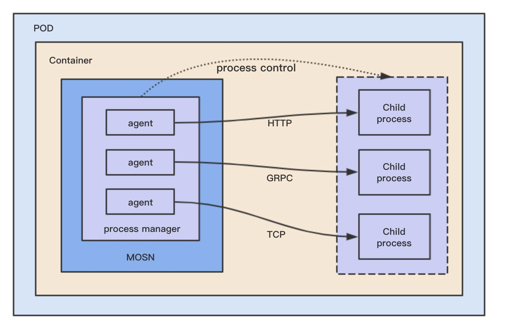

## 概述
Plugin 机制是 MOSN 提供的一种方式，可以让 MOSN 和一个独立的进程进行交互，这个进程可以用任何语言开发，只要满足 gRPC 的 proto 定义。



为什么我们支持这个功能，跟我们遇到的一些业务场景有关：

* 比如 log 打印，在 io 卡顿的时候会影响 Go Runtime 的调度，导致请求延迟。我们需要把 log 独立成进程做隔离。
* 我们会有一些异构语言的扩展，比如 streamfilter 的实际逻辑是一个 Java 语言实现的。
* 我们需要快速更新一些业务逻辑，但不能频繁的去更新 MOSN 的代码。
* 作为类似 Supervisor 的管理工具，管理一些其他进程。

总结下来就是隔离性，支持异构语言扩展，模块化，进程管理等场景，大家也可以看看还有哪些场景可以用到。

## 使用方法
`examples/codes/plugin/pluginfilter/`提供了一个使用示例，通过 streamfilter 把数据传递给一个独立进程处理并反馈。  
我们这儿简单看下`pkg/plugin/example/`：
#### client
```go
	client, err := plugin.Register("plugin-server", nil)
	if err != nil {
		fmt.Println(err)
		return
	}
	response, err := client.Call(&proto.Request{
		Body: []byte("hello"),
	}, time.Second)
}
```
* 通过 `plugin.Register`注册一个 plugin，name 需要和编译的二进制名字一样，然后函数会去启动这个程序，这个程序就是下面的 server 代码。
* 调用 `client.Call` 发送请求给 server 进程，然后收到响应并处理。

#### server
```go
type filter struct{}

func (s *filter) Call(request *proto.Request) (*proto.Response, error) {
	if string(request.GetBody()) != "hello" {
		return nil, errors.New("request body error")
	}

	response := new(proto.Response)
	response.Body = []byte("world")
	response.Status = 1
	return response, nil
}

func main() {
	plugin.Serve(&filter{})
}
```
* 首先实现 `plugin.Service`接口，`Call` 函数将接收 client 的请求，处理之后返回响应。
* main函数执行`plugin.Serve`，运行服务监听 client 的请求。

#### 运行
执行如下命令：
```bash
$ go build -o plugin-client client/plugin.go
$ go build -o plugin-server server/plugin.go
$ ./plugin-client  2> /tmp/1
success! response body: world
```

## 初始化
MOSN 的 plugin 底层使用了`github.com/hashicorp/go-plugin`库，该库是 HashiCorp 公司提供的一个成熟的扩展系统，可以方便的扩展自己的插件机制。

先看一下配置文件：
```json
	"plugin": {
		"log_base": "/home/admin/mosn/logs/"
	}
```
* `log_base` plugin 传递给扩展进程的日志目录

在看一下 proto 定义，Request 和 Resonse 定义了几个通用的数据结构，在使用的时候可以选择使用，比如打印 log 就需要使用 Request 的 boy 字段。Call 方法就是我们需要实现的，来进行请求的发送和处理处理。
```proto
syntax = "proto3";
package proto;

message Request {
	map<string, string> header=1;
	map<string, string> trailer=2;
	bytes body = 3;
	string type = 4;
}

message Response {
	map<string, string> header=1;
	map<string, string> trailer=2;
	bytes body = 3;
	int32 status = 4;
}

service Plugin {
	rpc Call(Request) returns (Response);
}
```

`Client`管理 client 的整个生命周期，用户使用该结构体发送请求。
```go
// Client is a plugin client, It's primarily used to call request.
type Client struct {
	pclient  *plugin.Client
	config   *Config
	name     string
	fullName string
	service  *client
	enable   bool
	on       bool

	sync.Mutex
}
```

`Config`初始化 Client 的时候使用，`MaxProcs`表示独立进程的 GOMAXPROCS 配置，`Args`表示独立进程的启动参数。
```go
type Config struct {
	MaxProcs int
	Args     []string
}
```

## 启动
`Register`用于 client 端注册  plugin，参数`name`表示 server 的二进制名字，文件路径同于 client 的二进制路径。返回的 Client 用于管理整个 agent-client 的生命周期。
```go
// Register called by plugin client and start up the plugin main process.
func Register(name string, config *Config) (*Client, error) {
	pluginLock.Lock()
	defer pluginLock.Unlock()

	if c, ok := pluginFactories[name]; ok {
		return c, nil
	}
	c, err := newClient(name, config)
	if err != nil {
		return nil, err
	}
	pluginFactories[name] = c

	return c, nil
}
```
`newClient`生成 Client，其中最重要的是`Check`方法，用于启动 server。

*   首先把`GOMAXPROCS`和日志路径通过环境变量传递给server进程。
*  `plugin.NewClient`开启 plugin 框架之后， `pclient.Client()`启动 server 子进程。
*   `rpcClient.Dispense("MOSN_SERVICE")` 返回真正的实例 client。

client 的整个启动过程就完成了，主要就是启动了 server 子进程，然后初始化了 client GRPC 的实例，用于请求发送和接收。
```go
func (c *Client) Check() error {
	.
	.
	cmd := exec.Command(c.fullName, c.config.Args...)

	procs := 1
	if c.config != nil && c.config.MaxProcs >= 0 && c.config.MaxProcs <= 4 {
		procs = c.config.MaxProcs
	}
	cmd.Env = append(cmd.Env, fmt.Sprintf("MOSN_PROCS=%d", procs))
	cmd.Env = append(cmd.Env, fmt.Sprintf("MOSN_LOGBASE=%s", pluginLogBase))

	pclient := plugin.NewClient(&plugin.ClientConfig{
		HandshakeConfig: Handshake,
		Plugins:         PluginMap,
		Cmd:             cmd,
		AllowedProtocols: []plugin.Protocol{
			plugin.ProtocolGRPC},
	})

	rpcClient, err := pclient.Client()
	if err != nil {
		return err
	}

	raw, err := rpcClient.Dispense("MOSN_SERVICE")
 .
 .
}
```

接下来是 server，server 端的代码也可以用其他语言实现，只要满足一定的规范，下面看看 Go 的实现：

* 首先执行`checkParentAlive()`主要是检查父进程(也就是 client )是否退出，如果退出了，自己也需要退出。
* 然后读取环境变量，来设置`GOMAXPROCS`。
* 最后调用`plugin.Serve`启动 GRPC Server 服务接收处理请求。

```go
// Serve is a function used to serve a plugin. This should be ran on the plugin's main process.
func Serve(service Service) {
	checkParentAlive()

	p := os.Getenv("MOSN_PROCS")
	if procs, err := strconv.Atoi(p); err == nil {
		runtime.GOMAXPROCS(procs)
	}

	plugin.Serve(&plugin.ServeConfig{
		HandshakeConfig: Handshake,
		Plugins: map[string]plugin.Plugin{
			"MOSN_SERVICE": &Plugin{Impl: service},
		},
		GRPCServer: plugin.DefaultGRPCServer,
	})
}
```
server 最主要的就是实现`Service`接口，用于处理请求，之前的 exmple 就有一个简单的实现。
```go
// Service is a service that Implemented by plugin main process
type Service interface {
	Call(request *proto.Request) (*proto.Response, error)
}
```
## 执行
client 只需要执行`Call`函数就可以发送和接收请求，实现会先通过`Check()`来检查 server 是否健康，如果不健康会先启动 server，然后调用真正的实现。
```go
// Call invokes the function synchronously.
func (c *Client) Call(request *proto.Request, timeout time.Duration) (*proto.Response, error) {
	if err := c.Check(); err != nil {
		return nil, err
	}
	return c.service.Call(request, timeout)
}
```

首先设置 timeout 请求超时时间，然后在调用 GRPC 的接口发送请求。
```go
func (c *client) Call(request *proto.Request, timeout time.Duration) (*proto.Response, error) {
	var ctx context.Context
	var cancel context.CancelFunc
	if timeout > 0 {
		ctx, cancel = context.WithTimeout(context.Background(), timeout)
		defer cancel()
	} else {
		ctx = context.Background()
	}
	response, err := c.PluginClient.Call(ctx, request)
	return response, err
}
```
在 server 端会直接执行我们实现的 Call 接口。
```go
func (s *server) Call(ctx context.Context, req *proto.Request) (*proto.Response, error) {
	return s.Impl.Call(req)
}
```

## 管理
MOSN 提供了 HTTP 接口来查看 plugin 的运行状态，以及开启关闭 Plugin。
```bash
Usage:
/plugin?status=all
/plugin?status=pluginname
/plugin?enable=pluginname
/plugin?disable=pluginname
```
在 disable 之后，server 就会被关闭，并且不会再启动，主要为了防止 server 有问题的时候可以关闭掉。

## 总结
寄托于开源社区，我们方便的搭建了自己的扩展机制，MOSN 也把自己的想法反馈给社区，共同进步。

拥抱开源，反哺开源。
