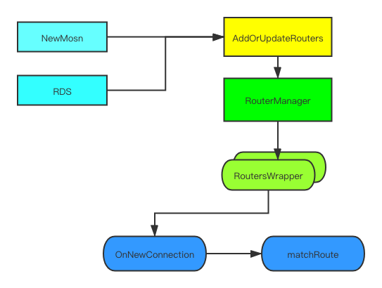

本文基于的内容是 MOSN v0.12.0。

MOSN 的路由能力目前仍然处于不断更新完善的阶段，详细的配置介绍可以参考 MOSN 配置文档中的路由部分。本文将主要从三个方面来介绍 MOSN 的路由功能：

- 针对路由模块的配置解析
-  路由模块是如何运行的
-  动态路由的实现

### 配置解析逻辑

路由的配置要在 MOSN 中生效，包含两个部分：

- proxy 的配置中，指定路由的名字`router_config_name`，说明 proxy 需要引用对应名字的路由。
- 路由的配置，包含路由的名字以及其他路由配置。

其中路由的配置可以配置在两个地方，一个是通过`connection_manager`进行配置，这个方式是历史遗留配置，作为兼容性保留的内容，不推荐使用这种方式；另一个是通过`routers`进行配置。如果两处配置包含同名的路由配置，会以`routers`中的配置为准。代码如下：

```Go
func NewMosn(c *v2.MOSNConfig) *Mosn {
     ... // 省略
     for _, serverConfig := range c.Servers {
         ... // 省略
         for idx, _ := range serverConfig.Listeners {
             lc := configmanager.ParseListenerConfig(&serverConfig.Listeners[idx], inheritListeners)
             // deprecated: keep compatible for route config in listener's connection_manager
             deprecatedRouter, err := configmanager.ParseRouterConfiguration(&lc.FilterChains[0])
             if err != nil {
                 log.StartLogger.Fatalf("[mosn] [NewMosn] compatible router: %v", err)
             }
             if deprecatedRouter.RouterConfigName != "" {
                 m.routerManager.AddOrUpdateRouters(deprecatedRouter)
             }
             ... // 省略
         }
         // Add Router Config
         for _, routerConfig := range serverConfig.Routers {
             if routerConfig.RouterConfigName != "" {
                 m.routerManager.AddOrUpdateRouters(routerConfig)
             }
         }
     }
     ... // 省略
 }
```

根据代码，可以看到在解析配置时，会先解析 Listener 中的路由配置（已废弃字段，兼容逻辑），随后单独解析 Routers 配置。配置解析完成以后，都是通过`AddOrUpdateRouters`使配置生效，所以后解析的 Routers 配置如果与 Listener 中的配置同名，则会通过 Update 覆盖掉 Listener 中的配置。由此我们也可以看到不同的 Listener、不同的 Proxy，如果引用了相同名字的路由，则对应的是同一份路由规则。

### 路由模块运行

当前的路由能力，是与`proxy`进行绑定的。为了说明路由的逻辑，我们先来看一下在`proxy` 模式下的 MOSN，收到一个请求后，是如何处理的。

首先在 MOSN 的 Listener 新建一个连接的时候，通过`OnNewConnection`创建`NetworkFilters`，而`proxy`就是其中一个，因此一个连接对应一个`proxy`。在`proxy`创建的时候会基于配置获取对应的路由信息`routersWrapper`，所以在连接创建以后，在此连接上的请求会使用哪个路由配置就已经决定了。

```Go
func (al *activeListener) OnNewConnection(ctx context.Context, conn api.Connection) {
    filterManager := conn.FilterManager()
    for _, nfcf := range al.networkFiltersFactories {
        nfcf.CreateFilterChain(ctx, filterManager)
    }
    ... // 省略
}
func NewProxy(ctx context.Context, config *v2.Proxy) Proxy {
    ... // 省略
    if routersWrapper := router.GetRoutersMangerInstance().GetRouterWrapperByName(proxy.config.RouterConfigName); routersWrapper != nil {
        proxy.routersWrapper = routersWrapper
    }
    ... // 省略
}
```

```Go
func NewProxy(ctx context.Context, config *v2.Proxy) Proxy {
    ... // 省略
    if routersWrapper := router.GetRoutersMangerInstance().GetRouterWrapperByName(proxy.config.RouterConfigName); routersWrapper != nil {
        proxy.routersWrapper = routersWrapper
    }
    ... // 省略
}
```

在连接创建以后，开始处理请求。每次收到一个请求，经过协议解析以后，最终会走到`proxy`中`downStream`的`OnReceive`方法。在`OnReceive`中，经过一系列处理，可能会走到路由匹配阶段`matchRoute`。MOSN 通过`routersWrapper`获取到当前运行时的`routers`，随后执行路由匹配逻辑，完成路由匹配。

```Go
func (s *downStream) matchRoute() {
    if s.proxy.routersWrapper == nil || s.proxy.routersWrapper.GetRouters() == nil {
        s.requestInfo.SetResponseFlag(api.NoRouteFound)
        s.sendHijackReply(types.RouterUnavailableCode, headers)
        return
    }
    routers := s.proxy.routersWrapper.GetRouters()
    ... // 省略
}

```

### 动态路由

MOSN 在路由模块中，设计了动态更新的接口，可以让 MOSN 在运行时动态更新路由的配置。经过前面的分析，我们可以看到 MOSN 配置解析时，也时通过动态更新的接口让路由配置生效的。除了配置解析以外，MOSN 默认可以通过 xDS 完成路由的动态更新，也可以通过扩展调用动态更新的接口完成动态路由配置更新。

路由动态更新主要提供了三个接口。

```Go
func (rm *routersManagerImpl) AddOrUpdateRouters(routerConfig *v2.RouterConfiguration) error {}
func (rm *routersManagerImpl) AddRoute(routerConfigName, domain string, route *v2.Router) error {}
func (rm *routersManagerImpl) RemoveAllRoutes(routerConfigName, domain string) error {}
```

默认情况下，都是使用`AddOrUpdateRouters`，使用一个完整的路由配置，对路由进行更新。`AddRoute`和`RemoveAllRoutes`是在特殊情况下，用于特定的路由配置追加 / 删除路由匹配规则使用的。

动态路由更新还涉及到一个问题就是更新以后需要动态生效。从之前的路由运行逻辑分析中，我们知道 MOSN 在连接建立的时候，就通过`GetRouterWrapperByName`完成了路由选择，为了让路由配置更新对存量连接也可以生效，`AddOrUpdateRouters`的逻辑进行了针对性处理。

```Go
// 省略了日志部分
func (rm *routersManagerImpl) AddOrUpdateRouters(routerConfig *v2.RouterConfiguration) error {
    if routerConfig == nil {
        return ErrNilRouterConfig
    }
    if v, ok := rm.routersWrapperMap.Load(routerConfig.RouterConfigName); ok {
        rw, ok := v.(*RoutersWrapper)
        if !ok {
            return ErrUnexpected
        }
        routers, err := NewRouters(routerConfig)
        if err != nil {
            return err
        }
        rw.mux.Lock()
        rw.routers = routers
        rw.routersConfig = routerConfig
        rw.mux.Unlock()
    } else {
        routers, _ := NewRouters(routerConfig)
        rm.routersWrapperMap.Store(routerConfig.RouterConfigName, &RoutersWrapper{
            routers:       routers,
            routersConfig: routerConfig,
        })
    }
    // update admin stored config for admin api dump
    store.SetRouter(routerConfig.RouterConfigName, *routerConfig)
}
func (rm *routersManagerImpl) GetRouterWrapperByName(routerConfigName string) types.RouterWrapper {
    if v, ok := rm.routersWrapperMap.Load(routerConfigName); ok {
        rw, ok := v.(*RoutersWrapper)
        if !ok {
            return nil
        }
        return rw
    }
}
```

当一个路由配置是新增的时候，MOSN 会忽略掉`NewRouters`的错误，即允许路由配置解析失败，此时的目的是为了让`GetRouterWrapperByName`能返回一个`RoutersWrapper`。但是如果是路由配置更新，则不会忽略`NewRouters`的错误，必须是有效的配置才能完成更新。
在之后的运行过程中，如果存在路由配置更新，更新的是`RoutersWrapper`中的`routers`，存量连接中的`RoutersWrapper`也可以获取到最新的`routers`，实现路由规则的动态生效。

### 总结


