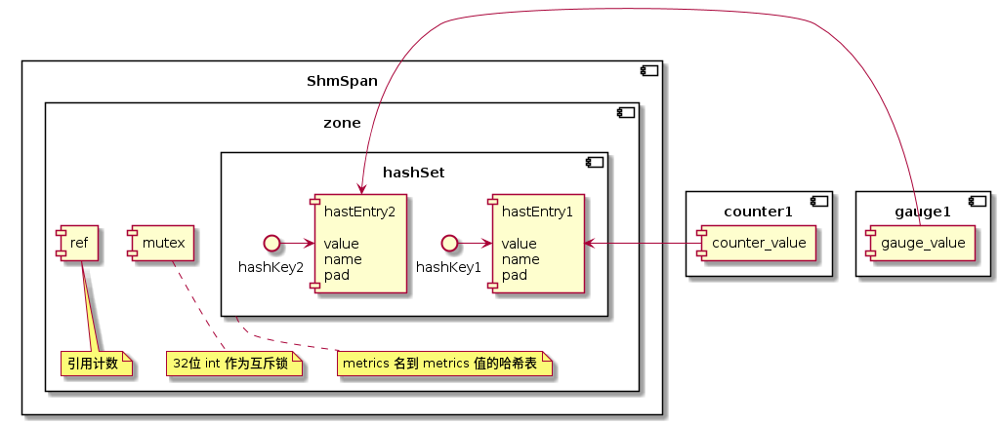

本文记录了对 MOSN 的源码研究 - MOSN 的共享内存模型。

本文的内容基于 MOSN v0.9.0，commit id [b2a239f5](https://github.com/mosn/mosn/tree/b2a239f5)。

## 机制

MOSN 用共享内存来存储 metrics 信息。MOSN 用 mmap 将文件映射到内存，在内存数组之上封装了一层关于 metrics 的存取逻辑，实现了 [go-metrics](https://github.com/rcrowley/go-metrics) 
包的关于 metrics 的接口，通过这种方式组装出了一种基于共享内存的 metrics 实现供 MOSN 使用。

## 创建共享内存：Mmap

操作共享内存的方法主要在 `pkg/shm/shm.go` 文件下：

```go
func Alloc(name string, size int) (*ShmSpan, error) {
	...
	return NewShmSpan(name, data), nil
}

func Free(span *ShmSpan) error {
	Clear(span.name)
	return syscall.Munmap(span.origin)
}

func Clear(name string) error {
	return os.Remove(path(name))
}
```

都是围绕着 `ShmSpan` 结构体的几个操作方法。再来看 `ShmSpan` 结构体：

```go
type ShmSpan struct {
	origin []byte // mmap 返回的数组
	name   string // span 名, 创建时指定

	data   uintptr // 保存 mmap 内存段的首指针
	offset int // span 已经使用的字节长度
	size   int // span 大小
}
```

`Alloc` 方法按照给定的 `name` 参数，在配置文件的目录下创建文件，并执行 `sync.Mmap`，其文件尺寸即 `size` 参数大小。Mmap 过后，将信息保存在 ShmSpan结构内返回。

代码逻辑比较简单，大家可以自行阅读：[https://github.com/mosn/mosn/blob/b2a239f5/pkg/shm/shm.go#L28](https://github.com/mosn/mosn/blob/b2a239f5/pkg/shm/shm.go#L28)

由此看出，一个 ShmSpan 可以看做是一个共享内存块。

下面我们将会分析共享内存块在 MOSN 里的使用场景：metrics。

## 操作共享内存：配置

在分析如何通过共享内存存取 metrics 之前，首先看这相关的功能是如何配置的。

[https://github.com/mosn/mosn/blob/b2a239f5/pkg/mosn/starter.go#L318](https://github.com/mosn/mosn/blob/b2a239f5/pkg/mosn/starter.go#L318)
```go
func initializeMetrics(config v2.MetricsConfig) {
	// init shm zone
	if config.ShmZone != "" && config.ShmSize > 0 {
		shm.InitDefaultMetricsZone(config.ShmZone, int(config.ShmSize), store.GetMosnState() != store.Active_Reconfiguring)
        ...

```

从这里看出，通过读取配置文件的 `ShmZone` 和 `ShmSize` 来初始化共享内存，即配置文件的以下两个字段是控制着共享内存的文件名和大小的：
```json
{
  ...
  "metrics": {
    ...
    "shm_zone": "文件名",
    "shm_size": "共享内存文件大小"
  },
  ...
}
```

## 操作共享内存：metrics

metrics 相关的逻辑在 `pkg/metrics` 包下。

上文说的 ShmSpan 是保存共享内存信息的结构体，而要理解 MOSN metrics 对共享内存的使用，还要先理解 MOSN 封装的几个结构体：`zone`、`hashSet` 和 `hashEntry`。

```go
type zone struct {
	span *shm.ShmSpan

	
	ref   *uint32

	set *hashSet // mutex + ref = 64bit, so atomic ops has no problem
}
...
type hashSet struct {
	entry []hashEntry
	meta  *meta
	slots []uint32
}
...
type hashEntry struct {
	metricsEntry
	next uint32

	// Prevents false sharing on widespread platforms with
	// 128 mod (cache line size) = 0 .
	pad [128 - unsafe.Sizeof(metricsEntry{})%128 - 4]byte
}
```

这几个结构体与 `ShmSpan` 的关系大致是这样的：



`ShmSpan` 是共享内存块，而 `zone`、`hashSet` 和 `hashEntry` 对 `ShmSpan` 进行了划分：

- `hashSet` 封装出了 metrics name 映射到 metrics value 的哈希表
- `hashEntry` 是哈希表的值，也是 metrics 值的保存的共享内存空间
- `zone` 对 `ShmSpan` 进行了划分，划分出了一个 `int32` 值作为互斥锁；一个 `int32` 值作为 `zone` 的引用计数；也划分出了一片空间保存 `hashSet`

以上步骤做好后，创建一个 metrics 就可以通过创建对应的哈希 key value，拿到对应的共享内存地址，存取 metrics 信息。

> ***实现小细节***
> 
> 1. hashEntry 内部有一个 `pad` 字段，其作用是保持 hashEntry 结构体大小是 128 的倍数，避免 false sharing
> 2. 结构体内的字段顺序和大小是调整过的，比如 `hashEntry.value`、`zone.set`，目的是满足原子操作的内存对齐

下面是源码步骤，大家可以自行跟踪调试：

***1) 创建 zone：***

[https://github.com/mosn/mosn/blob/b2a239f5/pkg/metrics/shm/zone.go#L81](https://github.com/mosn/mosn/blob/b2a239f5/pkg/metrics/shm/zone.go#L81)

```go
func newSharedMetrics(name string, size int) (*zone, error) {
	alignedSize := align(size, pageSize)

    // 申请 ShmSpan
	span, err := shm.Alloc(name, alignedSize)
	if err != nil {
		return nil, err
	}
	// 1. mutex and ref
	// 从 span 里取 4 个字节做互斥锁
	mutex, err := span.Alloc(4)
	if err != nil {
		return nil, err
	}

    // 从 span 里取 4 个字节做引用计数
	ref, err := span.Alloc(4)
	if err != nil {
		return nil, err
	}

	zone := &zone{
		span:  span,
		mutex: (*uint32)(unsafe.Pointer(mutex)),
		ref:   (*uint32)(unsafe.Pointer(ref)),
	}

	// 2. hashSet
	// 划分哈希表过程

	// assuming that 100 entries with 50 slots, so the ratio of occupied memory is
	// entries:slots  = 100 x 128 : 50 x 4 = 64 : 1
	// so assuming slots memory size is N, total allocated memory size is M, then we have:
	// M - 1024 < 65N + 28 <= M

    // 计算 slot 的数量和内存占用大小
	slotsNum := (alignedSize - 28) / (65 * 4)
	slotsSize := slotsNum * 4
	// 计算 entry 数量和内存占用大小
	entryNum := slotsNum * 2
	entrySize := slotsSize * 64
	
	// 哈希表内存大小 = entry 内存占用 + 20 字节 + slot 内存占用大小
	hashSegSize := entrySize + 20 + slotsSize
	hashSegment, err := span.Alloc(hashSegSize)
	if err != nil {
		return nil, err
	}

	// if zones's ref > 0, no need to initialize hashset's value
	// 初始化哈希表结构
	set, err := newHashSet(hashSegment, hashSegSize, entryNum, slotsNum, atomic.LoadUint32(zone.ref) == 0)
	if err != nil {
		return nil, err
	}
	zone.set = set

	// add ref
	atomic.AddUint32(zone.ref, 1)

	return zone, nil
}
```

这里可以大致说一下哈希表初始化的算法：首先 `alignedSize` 表示 4k 对齐后的 `ShmSpan` 大小，前 8 个字节被分配为互斥锁和引用计数，
另外 20 个字节被分配为哈希表的 `meta` 结构体，

[https://github.com/mosn/mosn/blob/b2a239f5/pkg/metrics/shm/hashset.go#L54](https://github.com/mosn/mosn/blob/b2a239f5/pkg/metrics/shm/hashset.go#L54)
```go
type hashSet struct {
	entry []hashEntry
	meta  *meta
	slots []uint32
}

...


type meta struct {
	cap       uint32
	size      uint32
	freeIndex uint32

	slotsNum uint32
	bytesNum uint32
}

```

所以真正能被分配为哈希表信息储存的空间 = 总空间 - 8 字节 - 20 字节。那能分配多少个哈希表信息呢？要看看 MOSN 的哈希表组织形式：`entry` 最开始首尾相连，后面会被组织成一个一个的 slot 链表供哈希碰撞时遍历查询。
所以 slot 和 entry 的比例控制着哈希表查找的性能：entry 比 slot 作为比例的话，比例**越高**意味着更容易碰撞，链表越长，查找性能下降；相反比例**越低**链表越短，查找性能越高，但是有越多 slot 闲置，空间会浪费。

从注释看，MOSN 将比例写死为 `2：1`。假设 `100 个 entry + 50 个 slot`，其内存比等于 `100 * 128（entry 内存占用）：50 * 4` = `64：1`，即一份 `2：1` 的 entry+slot 需要用到`（64 + 1）* 4` 个字节。

所以，如果按照 2：1 来分配的话，一共可以分配的份数 = `哈希表信息储存空间 / 每一份空间占用 = (总空间 - 8 - 20) / (64 + 1) * 4` 份。由此就可以算出 entry 和 slot 可以分配多少份了。

***2) 创建指标：***


[https://github.com/mosn/mosn/blob/b2a239f5/pkg/metrics/shm/counter.go#L56](https://github.com/mosn/mosn/blob/b2a239f5/pkg/metrics/shm/counter.go#L56)
```go
func NewShmCounterFunc(name string) func() gometrics.Counter {
	return func() gometrics.Counter {
		if defaultZone != nil {
			if entry, err := defaultZone.alloc(name); err == nil {
			...
```

[https://github.com/mosn/mosn/blob/b2a239f5/pkg/metrics/shm/zone.go#L166](https://github.com/mosn/mosn/blob/b2a239f5/pkg/metrics/shm/zone.go#L166)
```go
func (z *zone) alloc(name string) (*hashEntry, error) {
	z.lock()
	defer z.unlock()

	entry, create := z.set.Alloc(name)
	...
```

[https://github.com/mosn/mosn/blob/b2a239f5/pkg/metrics/shm/hashset.go#L135](https://github.com/mosn/mosn/blob/b2a239f5/pkg/metrics/shm/hashset.go#L135)
```go
func (s *hashSet) Alloc(name string) (*hashEntry, bool) {
	// 1. search existed slots and entries
	// 计算 hash 值作为 slot index
	h := hash(name)
	slot := h % s.meta.slotsNum

	// name convert if length exceeded
	if len(name) > maxNameLength {
		// if name is longer than max length, use hash_string as leading character
		// and the remaining maxNameLength - len(hash_string) bytes follows
		hStr := strconv.Itoa(int(h))
		name = hStr + name[len(hStr)+len(name)-maxNameLength:]
	}

	nameBytes := []byte(name)

    // 查找链表找到对应的 entry
	var entry *hashEntry
	for index := s.slots[slot]; index != sentinel; {
		entry = &s.entry[index]

		if entry.equalName(nameBytes) {
			return entry, false
		}

		index = entry.next
	}

	// 2. create new entry
	// 如果找不到, 创建新的 entry
	if s.meta.size >= s.meta.cap {
		return nil, false
	}

    // 创建新的 entry 从 hashset 的 meta 信息里拿 next free index
	newIndex := s.meta.freeIndex
	newEntry := &s.entry[newIndex]
	newEntry.assignName(nameBytes)
	newEntry.ref = 1

	if entry == nil {
		// 所以是链表头,保存 index 到 slot
		s.slots[slot] = newIndex
	} else {
		// 否则保存在上一个 entry 的 next 字段内
		entry.next = newIndex
	}

	s.meta.size++
	// 设置 next free index
	s.meta.freeIndex = newEntry.next
	// 设置队尾
	newEntry.next = sentinel

	return newEntry, true
}
```

***3) 用 Entry 保存 metrics 值***

[https://github.com/mosn/mosn/blob/b2a239f5/pkg/metrics/shm/counter.go#L56](https://github.com/mosn/mosn/blob/b2a239f5/pkg/metrics/shm/counter.go#L56)
```go
func NewShmCounterFunc(name string) func() gometrics.Counter {
	return func() gometrics.Counter {
		if defaultZone != nil {
			if entry, err := defaultZone.alloc(name); err == nil {
			    return ShmCounter(unsafe.Pointer(&entry.value))
			}
			...
```

可以看出，entry 的 `value` 是真正被用作记录 metrics 值的地方，它是一个 64 位的空间。

## 为什么使用共享内存保存 metrics

看到这里你可能会问，为什么要这么辛苦封装共享内存来保存 metrics 值？为什么不直接使用堆空间来做呢？

其实在源码里也有答案：

[https://github.com/mosn/mosn/blob/b2a239f5/pkg/mosn/starter.go#L318](https://github.com/mosn/mosn/blob/b2a239f5/pkg/mosn/starter.go#L318)
```go
func initializeMetrics(config v2.MetricsConfig) {
	// init shm zone
	if config.ShmZone != "" && config.ShmSize > 0 {
		shm.InitDefaultMetricsZone(config.ShmZone, int(config.ShmSize), store.GetMosnState() != store.Active_Reconfiguring)
        ...
```

[https://github.com/mosn/mosn/blob/b2a239f5/pkg/metrics/shm/zone.go#L58](https://github.com/mosn/mosn/blob/b2a239f5/pkg/metrics/shm/zone.go#L58)
```go
func createMetricsZone(name string, size int, clear bool) *zone {
	if clear {
		shm.Clear(name)
	}
    ...
```
如果 `clear` 为真，共享内存就会被清除，那么什么时候为假呢？当 `store.GetMosnState()` 方法返回 `store.Active_Reconfigureing` 的时候。即，当 MOSN reconfig 重启的时候，
已经保存的 metrics 是会被保留的。

而且从这里可以看出：

[https://github.com/mosn/mosn/blob/b2a239f5/pkg/metrics/shm/zone.go#L124](https://github.com/mosn/mosn/blob/b2a239f5/pkg/metrics/shm/zone.go#L124)
```go
func newSharedMetrics(name string, size int) (*zone, error) {
    ...
	set, err := newHashSet(hashSegment, hashSegSize, entryNum, slotsNum, atomic.LoadUint32(zone.ref) == 0)
	...
```

[https://github.com/mosn/mosn/blob/b2a239f5/pkg/metrics/shm/hashset.go#L78](https://github.com/mosn/mosn/blob/b2a239f5/pkg/metrics/shm/hashset.go#L78)
```go
func newHashSet(segment uintptr, bytesNum, cap, slotsNum int, init bool) (*hashSet, error) {
	set := &hashSet{}
	...
```

当 `zone.ref` 引用计数不为 0 的时候，哈希表里面的信息也是会被保留的。

再来看 `zone.mutex` 互斥锁的使用：

[https://github.com/mosn/mosn/blob/b2a239f5/pkg/metrics/shm/zone.go#L136](https://github.com/mosn/mosn/blob/b2a239f5/pkg/metrics/shm/zone.go#L136)
```go
func (z *zone) lock() {
	times := 0

	// 5ms spin interval, 5 times burst
	for {
		if atomic.CompareAndSwapUint32(z.mutex, 0, pid) {
			return
		}
	...
```

是通过设置进程 ID 来获取锁的，由此能看出 MOSN 的用意：**这个以文件作为 mmap 的共享内存是可以被多个 MOSN 进程共用的**。

例如 MOSN 支持跨容器热重启的场景，基于内存共享的 metrics 可以保证热重启过程中不出现指标抖动而造成监控异常。
而且这个文件可以看作是一种文件格式，在任何时候都可以被持久化保存和提取分析使用的。

当你不需要这个功能时，可以关闭内存共享 metrics 的配置即可，MOSN 会 fallback 到 go-metrics 的实现，该实现就是通过堆分配内存保存 metrics 信息。

## 总结

本文通过分析 MOSN 源码，简述了 MOSN 的共享内存模型，分析了 MOSN 创建共享内存、配置 metrics 和 metrics 对共享内存块的使用。

最后，**不鼓励在 Go 里面使用共享内存，除非你有明确的使用场景**，例如 MOSN 热升级场景下的 metrics 共享。

---

参考资料:

- [MOSN 源码](https://github.com/mosn/mosn)

