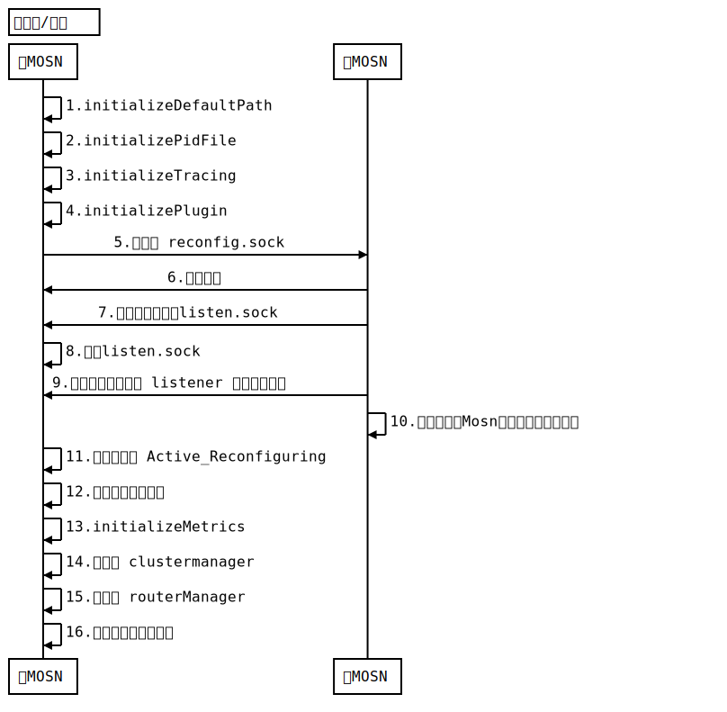
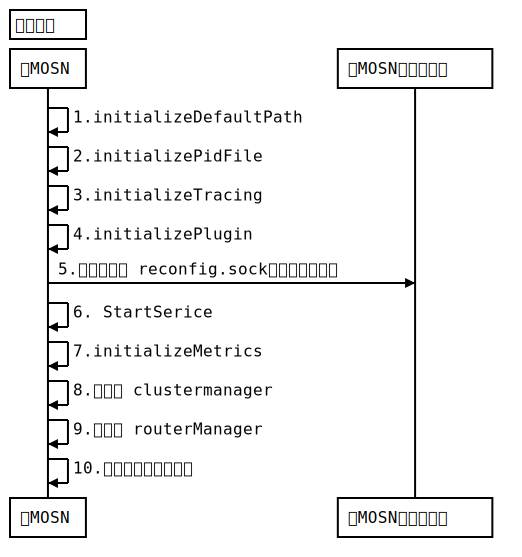
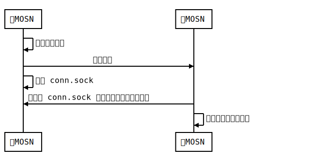

本文的目的是分析 MOSN 的启动流程。基于 mosn 版本 v0.4.0，commit 为: dc35c8fc95435a47e6393db1c79dd9f60f7eb898

## MOSN 简介

MOSN 是一款使用 Go 语言开发的网络代理软件，作为云原生的网络数据平面，旨在为服务提供多协议，模块化，智能化，安全的代理能力。

MOSN 在基于 Kubernetes 的 service mesh 中通常扮演数据平面的角色，它作为 sidecar 注入到集群的 Pod 中，接管在 Pod 之间的网络连接。

## MOSN 启动流程

我们先找到程序的入口，很多 go 的项目都将 程序入口写在 `cmd` 文件夹中，然后具体的实现写在 `pkg` 中。MOSN 项目也正好如此。在 `cmd/mosn/main/mosn.go` 
中有我们要的 `main` 函数，提供了 `start`, `stop` 和 `reload` 命令。其中 `stop` 和 `reload` 还未做实现。

```go
//commands
app.Commands = []cli.Command{
	cmdStart,
	cmdStop,
	cmdReload,
}
```

在 `cmd/mosn/main/control.go` 中，有　`mosn start` 执行的代码部分。`mosn start` 当前有5个参数：

- `config, c`: 提供配置文件的路径，默认值是 `configs/mosn_config.json`
- `service-cluster, s`: xdsclient 的初始化参数：服务集群名称，这里的集群是 MOSN 连接到的一组逻辑上相似的上游主机 
- `service-node, n`: xdsclient 的初始化参数：服务集群中的节点
- `service-meta, sm`: xdsclient 的初始化参数：元数据
- `feature-gates, f`: feature-gates 是 MOSN 的特性开关，当前有三个特性： `XdsMtlsEnable`, `PayLoadLimitEnable` 和 `MultiTenantMode`。

最终可以在 `pkg/mosn/starter.go` 中找到启动方法：

```go
// Start mosn project
// step1. NewMosn
// step2. Start Mosn
func Start(c *v2.MOSNConfig) {
	//log.StartLogger.Infof("[mosn] [start] start by config : %+v", c)
	Mosn := NewMosn(c)
	Mosn.Start()
	Mosn.wg.Wait()
}
```

启动方法很简单，`Mosn := NewMosn(c)` 实例化了一个 `Mosn` 实例。`Mosn.Start()` 开始运行。 下面主要就 `NewMosn(c)` 和 `Start()` 方法做分析。

### MOSN 的初始化

在进入到具体初始化之前，我们先看 MOSN 的结构：

```go
type Mosn struct {
	servers        []server.Server
	clustermanager types.ClusterManager
	routerManager  types.RouterManager
	config         *v2.MOSNConfig
	adminServer    admin.Server
	xdsClient      *xds.Client
	wg             sync.WaitGroup
	// for smooth upgrade. reconfigure
	inheritListeners []net.Listener
	reconfigure      net.Conn
}
```

`servers` 是一个数组，`server.Server` 是接口类型。但是目前的代码逻辑中只会有一个 server。

`clustermanager` 顾名思义就是集群管理器。 `types.ClusterManager` 也是接口类型。这里的 `cluster` 指得是 MOSN 连接到的一组逻辑上相似的上游主机。MOSN 通过服务发现来发现集群中的成员，并通过主动运行状况检查来确定集群成员的健康状况。MOSN 如何将请求路由到集群成员由负载均衡策略确定。

`routerManager` 是路由管理器，MOSN 根据路由规则来对请求进行代理。

`adminServer` 是一个服务，可以通过 http 请求获取 MOSN 的配置、状态等等

`xdsClient` 是 xds 协议的客户端。关于 xds, Envoy 通过查询文件或管理服务器来动态发现资源。概括地讲，对应的发现服务及其相应的 API 被称作 xDS。mosn 也使用 xDS，这样就可以兼容 istio。

`inheritListeners` 和 `reconfigure` 都是为了实现 MOSN 的平滑升级和重启。

这里我们也要注意到 `inheritListeners` 和 `reconfigure` 参数，MOSN 在启动时分为两种情况：

- `普通启动`流程：这种情况下是 MOSN 作为 sidecar 第一次在 Pod 中启动，不需要考虑长连接转移等情况。
- `热升级/重启`流程：在 MOSN 已经作为 sidecar 运行的情况下，如果此时要做 MOSN 的升级/重启，则必须要考虑当前 MOSN 上已有的长连接，如果直接断开连接重启，肯定会对业务有影响。所以 MOSN 在升级/重启时，会进行比较复杂的长连接转移的工作。

在了解以上内容的前提下，现在我们开始具体分析。

NewMosn函数在63行左右，一上来就开始初始化各种配置。比如日志，进程id路径，unix socket 路径，trace的开关（SOFATracer）以及日志插件等等。这里的代码比较简单，就不具体分析每个方法了。

```go
initializeDefaultPath(configmanager.GetConfigPath())
initializePidFile(c.Pid)
initializeTracing(c.Tracing)
initializePlugin(c.Plugin.LogBase)
```

下面大概在 70 行左右，主要开始做listener的转移。

注意：为了贴出来的代码可以简单，我删除了一些错误处理和日志的语句。并在代码中添加了注释帮助理解

```go
//get inherit fds
inheritListeners, reconfigure, err := server.GetInheritListeners()
if reconfigure != nil {
	// set Mosn Active_Reconfiguring
	store.SetMosnState(store.Active_Reconfiguring)
	// parse MOSNConfig again
	c = configmanager.Load(configmanager.GetConfigPath())
} else {
	// start init services
	if err := store.StartService(nil); err != nil {
		log.StartLogger.Fatalf("[mosn] [NewMosn] start service failed: %v,  exit", err)
	}
}
```

这段代码的第一行调用了 `GetInheritListeners()` 来获取要继承过来的监听器。 `reconfigure` 这个返回值是新旧 MOSN 在 `listen.sock` 上的连接，如果为空代表了 MOSN 为`普通启动`，反之为`热升级/重启`。下面开始分析 `GetInheritListeners()`。在 `GetInheritListeners()` 中调用了 `isReconfigure()` 方法。

```go
func isReconfigure() bool {
	var unixConn net.Conn
	var err error
	unixConn, err = net.DialTimeout("unix", types.ReconfigureDomainSocket, 1*time.Second)
	defer unixConn.Close()

	uc := unixConn.(*net.UnixConn)
	buf := make([]byte, 1)
	n, _ := uc.Read(buf)
	if n != 1 {
		return false
	}
	return true
}
```

这里通过连接 unix socket `reconfig.sock`，判断能否读取到数据。旧 MOSN 会监听 `reconfig.sock`，在有连接进来时发送数据。

```go
l, err := net.Listen("unix", types.ReconfigureDomainSocket)
defer l.Close()
ul := l.(*net.UnixListener)
for {
	uc, err := ul.AcceptUnix()
	_, err = uc.Write([]byte{0})
	uc.Close()
	reconfigure(false)
}
```

如果能读到，说明已经有一个旧的 MOSN 启动并监听了 `reconfig.sock`，那么本次启动就是`热升级/重启`了。同时向 `reconfig.sock` 发起连接，会使得旧的 MOSN 尝试向 `listen.sock` 发送要转移的 listener 数组。这个逻辑在上面的 `reconfigure(false)` 方法中调用 `sendInheritListeners()` 实现。为了保证旧的 MOSN 可以连上新的 MOSN，这里还重试了10次，并且每次等待1s。也就是说，新 MOSN 在接下来 10s 内可以监听 `listen.sock` 即可。

```go
// retry 10 time
for i := 0; i < 10; i++ {
	unixConn, err = net.DialTimeout("unix", types.TransferListenDomainSocket, 1*time.Second)
	if err == nil {
		break
	}
	time.Sleep(1 * time.Second)
}
```

同时，该连接在旧 MOSN 中保持10分钟后，或者读到了代表要退出的数据，旧 MOSN 就会自动退出。如果是确定了是升级或重启，那么 `GetInheritListeners()` 还会继续执行以下的代码：

```go
// unlink 系统调用比较特殊。关于它的描述中有一点：如果这个文件是一个 unix socket，它会被移除，但是打开它的进程可以继续使用它。也就是说新旧 mosn 都会在这个地址监听。
syscall.Unlink(types.TransferListenDomainSocket)

// 监听
l, err := net.Listen("unix", types.TransferListenDomainSocket)
defer l.Close()

ul := l.(*net.UnixListener)
ul.SetDeadline(time.Now().Add(time.Second * 10))
uc, err := ul.AcceptUnix()

buf := make([]byte, 1)
oob := make([]byte, 1024)
_, oobn, _, _, err := uc.ReadMsgUnix(buf, oob)

scms, err := unix.ParseSocketControlMessage(oob[0:oobn])

if len(scms) != 1 {
	log.StartLogger.Errorf("[server] expected 1 SocketControlMessage; got scms = %#v", scms)
	return nil, nil, err
}

// 解析从另一个进程传来的socket控制消息：打开的文件描述符的整型数组
gotFds, err := unix.ParseUnixRights(&scms[0])

listeners := make([]net.Listener, len(gotFds))

// 这个循环中将文件描述符转换成了listener
for i := 0; i < len(gotFds); i++ {
	fd := uintptr(gotFds[i])
	file := os.NewFile(fd, "")

	defer file.Close()

	fileListener, err := net.FileListener(file)

	if listener, ok := fileListener.(*net.TCPListener); ok {
		listeners[i] = listener
	} else {
		return nil, nil, errors.New("not a tcp listener")
	}
}

return listeners, uc, nil
```

上面的代码中新的 MOSN 监听了 `listen.sock`，这样就能获取到旧 MOSN 的所有 listener。当然，如果本次启动是`普通启动`，那么获取的 `inheritListeners` 就是 nil。然后根据本次启动是`普通启动`还是`热升级/重启`：

- 如果是普通启动，则直接调用 `StartService`。需要注意在后面的执行流程中，还会再一次调用 `StartService`。
- 如果是`热升级/重启`，设置当前状态为 `Active_Reconfiguring`，然后重新加载配置文件，注意在此时并没有调用 `StartService`。

因为后面还会有`StartService`的调用，因此 `StartService` 的逻辑在后面分析，以便理解在不同地方调用的逻辑。

88 行的 `initializeMetrics(c.Metrics)` 初始化了监控指标，使用了 `go-metrics`。这里不做分析。

90 行开始是 Mosn 实例的初始化。它传入了上面的 `inheritListeners` 和 `reconfigure` 变量。

```go
m := &Mosn{
	config:           c,
	wg:               sync.WaitGroup{},
	inheritListeners: inheritListeners,
	reconfigure:      reconfigure,
}
```

123 行开始是 `clustermanager` 的初始化，它会根据是否是 Xds 模式来选择不同的初始化方式。如果是 Xds, 则先用空配置初始化，集群信息会在之后通过 Xds 来获取，否则的话就用配置文件来初始化。

```go
//cluster manager filter
cmf := &clusterManagerFilter{}

// parse cluster all in one
clusters, clusterMap := configmanager.ParseClusterConfig(c.ClusterManager.Clusters)
// create cluster manager
if mode == v2.Xds {
	m.clustermanager = cluster.NewClusterManagerSingleton(nil, nil)
} else {
	m.clustermanager = cluster.NewClusterManagerSingleton(clusters, clusterMap)
}
```

136 行是路由管理器的初始化

```go
// initialize the routerManager
m.routerManager = router.NewRouterManager()
```

138 行开始就是对配置中的 servers 进行解析，我们可以根据上面的一处判断得知，当前 MOSN 只会有一个 server，这里的 for 循环应该是为了之后功能扩展准备的。

```go
srvNum := len(c.Servers)
if srvNum == 0 {
	log.StartLogger.Fatalf("[mosn] [NewMosn] no server found")
} else if srvNum > 1 {
	log.StartLogger.Fatalf("[mosn] [NewMosn] multiple server not supported yet, got %d", srvNum)
}
```

for 循环的代码，具体执行的逻辑我用注释写在了代码上。
```go
for _, serverConfig := range c.Servers {
	//1. server config prepare
	//server config
	c := configmanager.ParseServerConfig(&serverConfig)

	// new server config
	sc := server.NewConfig(c)

	// init default log
	server.InitDefaultLogger(sc)

	var srv server.Server
	if mode == v2.Xds {
	    // xds 模式下，server 的配置是在上面创建的
		srv = server.NewServer(sc, cmf, m.clustermanager)
	} else {
	    // 这里的server配置是从文件中读取的， 可以看 configs 下配置文件来帮助理解
		//initialize server instance
		srv = server.NewServer(sc, cmf, m.clustermanager)

		//add listener
		if serverConfig.Listeners == nil || len(serverConfig.Listeners) == 0 {
			log.StartLogger.Fatalf("[mosn] [NewMosn] no listener found")
		}

		for idx, _ := range serverConfig.Listeners {
			// parse ListenerConfig， 这里面会解析 listeners 的配置，并且和 inheritListeners 中的 listener 比对，如果是同一个连接(端口号相同，ip配置相同)，就继承过来
			lc := configmanager.ParseListenerConfig(&serverConfig.Listeners[idx], inheritListeners)

			// parse routers from connection_manager filter and add it the routerManager
			if routerConfig := configmanager.ParseRouterConfiguration(&lc.FilterChains[0]); routerConfig.RouterConfigName != "" {
				m.routerManager.AddOrUpdateRouters(routerConfig)
			}

			var nfcf []api.NetworkFilterChainFactory
			var sfcf []api.StreamFilterChainFactory

			// Note: as we use fasthttp and net/http2.0, the IO we created in mosn should be disabled
			// network filters
			if !lc.UseOriginalDst {
				// network and stream filters
				nfcf = configmanager.GetNetworkFilters(&lc.FilterChains[0])
				sfcf = configmanager.GetStreamFilters(lc.StreamFilters)
			}

			_, err := srv.AddListener(lc, nfcf, sfcf)
			if err != nil {
				log.StartLogger.Fatalf("[mosn] [NewMosn] AddListener error:%s", err.Error())
			}
		}
	}
	m.servers = append(m.servers, srv)
}
```

上面就是 MOSN 初始化的分析。主要做了下列的工作：

- 初始化配置文件路径，日志，进程id路径，unix socket 路径，trace的开关（SOFATracer）以及日志插件。
- 通过 `server.GetInheritListeners()` 来判断启动模式（`普通启动`或`热升级/重启`），并在`热升级/重启`的情况下继承旧 MOSN 的监听器文件描述符。
- 如果是`热升级/重启`，则设置 Mosn 状态为 `Active_Reconfiguring`;如果是`普通启动`，则直接调用 `StartService()`，关于 `StartService` 会在之后分析。
- 初始化指标服务。
- 根据是否是 Xds 模式初始化配置。
  - xds 模式下，使用 nil 来初始化 clustermanager, 非 Xds 模式下(也就是File, Mix模式) ，从配置文件中初始化 clustermanager
  - xds 模式下，使用默认配置来实例化 routerManager, 非 Xds 模式下，初始化 routerManager，并从配置文件中读取路由配置更新
  - xds 模式下，使用默认配置来实例化 server，非 Xds 模式下，还要从配置文件中读取 listener 并添加。

这里也用时序图来展示`热升级/重启`的初始化流程:



如果是`普通启动`，则6,7,8,9,10,11,12是没有的，并且在第5步后会调用`StartService`。为了便于对比，这里仍然用时序图来展示：




### MOSN 的启动

MOSN 启动逻辑实现在 Mosn 的 `Start()` 方法中，代码如下

```go
func (m *Mosn) Start() {
	m.wg.Add(1)
	// Start XDS if configured
	m.xdsClient = &xds.Client{}
	utils.GoWithRecover(func() {
		m.xdsClient.Start(m.config)
	}, nil)
	// start mosn feature
	featuregate.StartInit()
	// TODO: remove it
	//parse service registry info
	configmanager.ParseServiceRegistry(m.config.ServiceRegistry)

	// beforestart starts transfer connection and non-proxy listeners
	m.beforeStart()

	// start mosn server
	for _, srv := range m.servers {
		utils.GoWithRecover(func() {
			srv.Start()
		}, nil)
	}
}
```

我们从代码中可以知道，`Start()` 方法主要做了以下的工作：

- 启动 xdsClient, xdsClient 负责从 pilot 周期地拉取 listeners/clusters/clusterloadassignment 配置。这个特性使得用户可以通过 crd 来动态的改变 service mesh 中的策略。

- 开始执行所有注册在 featuregate中 feature 的初始化函数。在 `pkg/featuregate/mosn_features.go` 文件中的 `init()` 方法中，可以看到 `XdsMtlsEnable`、`PayLoadLimitEnabl	e` 和 `MultiTenantMode` 的注册。

- 解析服务注册信息

- MOSN 启动前的准备工作。详细解析见下面的小章节 2.2.1

- 正式启动 MOSN 的服务。详细解析见下面的小章节 2.2.2 


#### beforeStart(): MOSN 启动前的最后一步

beforeStart 中主要做了以下的几个工作：

1. 构造 adminServer，将 admin server 加入到全局的 services 中
2. 根据 MOSN 的状态是否是 `Active_Reconfiguring`
   - 如果是`热升级/重启`，调用 `store.`StartService(m.inheritListeners)，继承 listener 直接启动。通知旧 MOSN 退出，并从旧 MOSN 中转移长连接。
   - 如果是`普通启动`，`store.StartService(nil)` 会先监听 listener在启动。
3. 关闭遗留的 listener，也就是在第 2 步中没有使用的 lisenter
4. 开启 dump config 
5. 监听 reconfig.sock，这样就可以接收下一次的平滑升级或重启

这里我们先思考一下 `store.StartService` 的调用逻辑，因为在前文提到，初始化 MOSN 的时候，如果是`普通启动`，则会调用一次 `store.StartService`。而`热升级/重启`则不会调用。而后面无论何种情况都会调用`store.StartService`，是否多此一举呢？通过注释可以发现，前面是 `start init services`，后面是 `start other services`，同时 `service` 的结构如下：

```go
type service struct {
	start bool
	*http.Server
	name string
	init func()
	exit func()
}
```

这里想表达的逻辑应该是，如果是普通启动，那么有一些具有 init 变量的服务需要提前启动。在 `StartService` 中也可以验证这个想法：

```go
if s.init != nil {
	s.init()
}
```

但是在整个项目中我只找到了三处 service，没有符合条件的。这里可能是为了之后的功能扩展使用的。三处 service 如下所示：

- store.AddService(s, "pprof", nil, nil)
- store.AddService(srv, "Mosn Admin Server", nil, nil)
- store.AddService(srv, "prometheus", nil, nil)

因为`普通启动`时只有`store.StartService(nil)`， 因此我们这里接着分析在`热升级/重启`时的长连接转移逻辑。在初始化 MOSN 部分，新的 MOSN 实例已经继承过来 listener 了，为了实现平滑的升级或重启，还需要把旧 MOSN 上的连接也转移过来。在 2.1 小章节中说到，`GetInheritListeners()` 方法通过监听 `listen.sock`，继承了旧 MOSN 中的 listener。在这里我们通过继承过来的 listener 在新 MOSN 中启动服务。

```
// start other services
if err := store.StartService(m.inheritListeners); err != nil {
	log.StartLogger.Fatalf("[mosn] [NewMosn] start service failed: %v,  exit", err)
}
```

同时新 MOSN 实例拥有了一个叫做 reconfigure（不要被名字误导了，它是新旧 MOSN 在 listen.sock 上的连接） 的连接。该连接会在旧 MOSN 中保持10分钟或者读到了代表要退出的数据。在 beforeStart 中，就是使用了 reconfigure 来在新 MOSN 即将启动之际，通知旧的 MOSN 退出。可以看 `pkg/mosn/starter.go` 的 202 行左右。下面一小段代码中，向 reconfigure 连接写入了一个 0 来通知旧 Mosn 退出。

```
// notify old mosn to transfer connection
if _, err := m.reconfigure.Write([]byte{0}); err != nil {
	log.StartLogger.Fatalf("[mosn] [NewMosn] graceful failed, exit")
}

m.reconfigure.Close()
```

旧的 MOSN 在读到上面的 0 后，会执行以下逻辑

1. 停止服务，也就是关闭数据平面
2. 等待3s，这是为了新的 MOSN 启动
3. 停止 accept，这时候就不会有新的连接到旧的 MOSN 上了
4. 等待已有连接完成逻辑。默认是 30s
5. 退出

代码在 `pkg/server/reconfigure.go` 的 87 行左右：

```go
// Wait new mosn parse configuration
notify.SetReadDeadline(time.Now().Add(10 * time.Minute))
n, err = notify.Read(buf[:])
if n != 1 {
	log.DefaultLogger.Alertf(types.ErrorKeyReconfigure, "new mosn start failed")
	return
}

// stop other services
store.StopService()

// Wait for new mosn start
time.Sleep(3 * time.Second)

// Stop accepting requests
StopAccept()

// Wait for all connections to be finished
WaitConnectionsDone(GracefulTimeout)

log.DefaultLogger.Infof("[server] [reconfigure] process %d gracefully shutdown", os.Getpid())

keeper.ExecuteShutdownCallbacks("")

// Stop the old server, all the connections have been closed and the new one is running
os.Exit(0)
```

这个时候，我们再回来看长连接的转移。新 MOSN 在通知之后，会立即启动 TransferServer，也就是转移长连接的服务。

```go
// transfer old mosn connections
utils.GoWithRecover(func() {
	network.TransferServer(m.servers[0].Handler())
}, nil)
```

旧 MOSN 会通过 `conn.sock` 来发送长连接的文件描述符给新 MOSN。具体调用的方法是`pkg/network/transfer.go`中的`transferRead` 和 `transferWrite` 方法。关于长连接转移的细节非常复杂，MOSN 官网上提供了详细的文档，很值得学习：[MOSN 平滑升级原理解析](/docs/concept/smooth-upgrade/)

下面我们用时序图来展示一下长连接的转移过程：



#### Start(): MOSN 正式启动

经过上面复杂的启动过程，MOSN 正式启动就很简单了。

```go
for _, srv := range m.servers {
	utils.GoWithRecover(func() {
		srv.Start()
	}, nil)
}
```

对于当前来说，只有一个 server，这个 server 是在 NewMosn 中初始化的。

```go
server := &server{
	serverName: config.ServerName,
	stopChan:   make(chan struct{}),
	handler:    NewHandler(cmFilter, clMng),
}
```

Start 方法如下：

```go
func (srv *server) Start() {
	// TODO: handle main thread panic @wugou

	srv.handler.StartListeners(nil)

	for {
		select {
		case <-srv.stopChan:
			return
		}
	}
}
```

## 基本术语参考

下面基本术语的解释来自于这篇文章：[Envoy 中的基本术语](https://jimmysong.io/istio-handbook/data-plane/envoy-terminology.html)

- Host：能够进行网络通信的实体（在手机或服务器等上的应用程序）。在 Envoy 中主机是指逻辑网络应用程序。只要每台主机都可以独立寻址，一块物理硬件上就运行多个主机。

- Downstream：下游（downstream）主机连接到 Envoy，发送请求并或获得响应。

- Upstream：上游（upstream）主机获取来自 Envoy 的链接请求和响应。

- Cluster: 集群（cluster）是 Envoy 连接到的一组逻辑上相似的上游主机。Envoy 通过服务发现发现集群中的成员。Envoy 可以通过主动运行状况检查来确定集群成员的健康状况。Envoy 如何将请求路由到集群成员由负载均衡策略确定。

- Mesh：一组互相协调以提供一致网络拓扑的主机。Envoy mesh 是指一组 Envoy 代理，它们构成了由多种不同服务和应用程序平台组成的分布式系统的消息传递基础。

- 运行时配置：与 Envoy 一起部署的带外实时配置系统。可以在无需重启 Envoy 或 更改 Envoy 主配置的情况下，通过更改设置来影响操作。

- Listener: 监听器（listener）是可以由下游客户端连接的命名网络位置（例如，端口、unix域套接字等）。Envoy 公开一个或多个下游主机连接的侦听器。一般是每台主机运行一个 Envoy，使用单进程运行，但是每个进程中可以启动任意数量的 Listener（监听器），目前只监听 TCP，每个监听器都独立配置一定数量的（L3/L4）网络过滤器。Listenter 也可以通过 Listener Discovery Service（LDS）动态获取。

- Listener filter：Listener 使用 listener filter（监听器过滤器）来操作链接的元数据。它的作用是在不更改 Envoy 的核心功能的情况下添加更多的集成功能。Listener filter 的 API 相对简单，因为这些过滤器最终是在新接受的套接字上运行。在链中可以互相衔接以支持更复杂的场景，例如调用速率限制。Envoy 已经包含了多个监听器过滤器。

- Http Route Table：HTTP 的路由规则，例如请求的域名，Path 符合什么规则，转发给哪个 Cluster。

- Health checking：健康检查会与SDS服务发现配合使用。但是，即使使用其他服务发现方式，也有相应需要进行主动健康检查的情况。详见 health checking。

## 参考资料

- [Envoy 中的基本术语](https://jimmysong.io/istio-handbook/data-plane/envoy-terminology.html)
- [Service Mesh 架构反思：数据平面和控制平面的界线该如何划定？](https://skyao.io/post/201804-servicemesh-architecture-introspection/)
- [深入解读 Service Mesh 背后的技术细节](https://www.cnblogs.com/163yun/p/8962278.html)
- [使用 Istio 打造微服务（第1部分）](https://www.servicemesher.com/blog/back-to-microservices-with-istio-p1/)
- [蚂蚁集团 Service Mesh 新型网络代理的思考与实践](https://www.servicemesher.com/blog/microservice-with-service-mesh-at-ant-financial/)
- [MOSN 平滑升级原理解析](/docs/concept/smooth-upgrade/)
