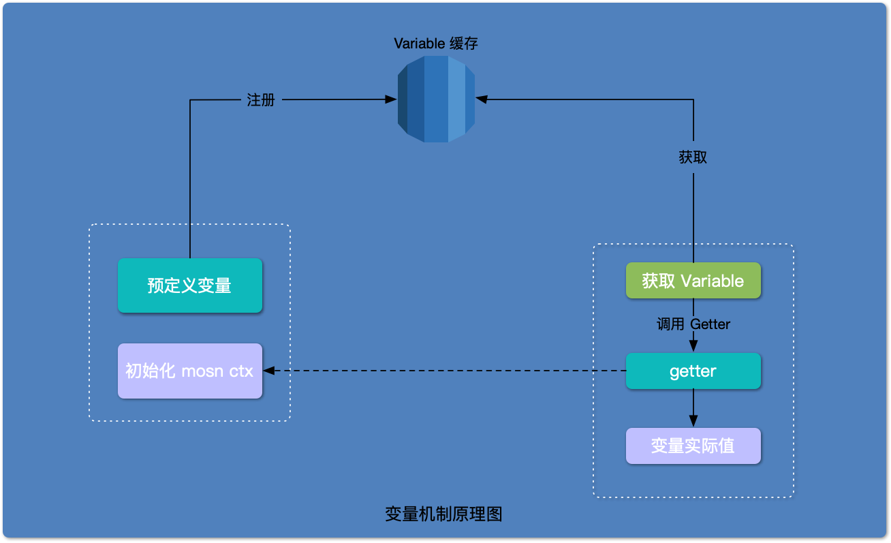

本文的目的是分析 MOSN 源码中的`变量机制`。

## 什么是变量机制

我们通过一个单元测试来理解`什么是变量机制`，完整代码清参考[这里](https://github.com/mosn/mosn/blob/1609ae144136039508dda6d0c5d03c1f732cb107/pkg/log/accesslog_test.go#L69):

```golang
// DefaultAccessLogFormat provides a pre-defined format
const DefaultAccessLogFormat = "%start_time% %request_received_duration% %response_received_duration% %bytes_sent%" + " " +
    "%bytes_received% %protocol% %response_code% %duration% %response_flag% %response_code% %upstream_local_address%" + " " +
    "%downstream_local_address% %downstream_remote_address% %upstream_host%"

func TestAccessLog(t *testing.T) {
    registerTestVarDefs()

    format := types.DefaultAccessLogFormat
    logName := "/tmp/mosn_bench/benchmark_access.log"
    os.Remove(logName)
    accessLog, err := NewAccessLog(logName, format)
    ...
    ctx := prepareLocalIpv6Ctx()
    accessLog.Log(ctx, nil, nil, nil)
    ...
}
```

执行这个单元测试，并查看日志内容：

```bash
go test mosn.io/mosn/pkg/log -run ^TestAccessLog$
ok      mosn.io/mosn/pkg/log    2.867s
cat /tmp/mosn_bench/benchmark_access.log
2020/02/16 21:26:26.078 2.543µs 2.000004307s 2048 2048  0 24.471µs false 0 127.0.0.1:23456 [2001:db8::68]:12200 127.0.0.1:53242 -
```

请留意 `accessLog.Log` 打印出来的日志，可以发现 `DefaultAccessLogFormat` 中的变量, 都被替换成了实际的值。比如：`%start_time%` 被替换成 `2020/02/16 21:26:26.078`, `%request_received_duration%` 被替换成 `2.543µs`。

`变量机制`允许用户在配置中使用预定义的变量，而非确定值；变量将在请求处理过程中被替换成其对应的实际值。

## 变量机制的原理

<div align="center">
    
</div>
<br/>

请留意上面的`变量机制原理图`，它分为 3 部分；最上边的是`Variable 缓存`，左边虚线框的是`初始化阶段`，而右边虚线是`对变量的使用`。

### Variable 缓存

`Variable 缓存` 是一组 Variable 的 key-value 对，key 是变量的名字，value 是 `Variable 接口`；以 map 的形式存在于内存中。Variable 接口含有`变量的名字`，`变量值的获取方式`, `变量值的设置方式` 等属性。

### 初始化阶段

在初始化阶段中，首先定义好各变量的 `Variable`（预定义变量）；然后注册到 `Variable 缓存中`。另外，还需初始化 `mosn ctx`，`mosn ctx` 是一个 `context.Context`，里面含有变量实际值的相关信息；在后续获取变量的实际值时会用到它。

### 对变量的使用

在请求处理的过程中，根据`变量名`去缓存中获取相应的 `Variable`。然后调用 Variable 的 `Getter` 方法，得到`变量的获取方式 getter`。最后调用 `getter` 函数，`getter` 函数会根据 `mosn ctx` 生成变量的实际值。

可以看出，`变量机制` 用到了 `生产者-消费者模式`。`生产者` 负责定义变量对应的 `Variable`，并注册到 `Variable 缓存`中。而这些 `Variable` 会在请求处理过程中被消费，生成变量的实际值。

了解完变量机制的原理后，我们继续围绕[什么是变量机制](#什么是变量机制)中的单元测试，深入探讨它背后的实现逻辑。

## 注册变量

该单元测试通过函数 `registerTestVarDefs` 进行变量的注册，代码片段如下，完整代码清参考[这里](https://github.com/mosn/mosn/blob/1609ae144136039508dda6d0c5d03c1f732cb107/pkg/log/accesslog_test.go#L509):

```golang
var (
    builtinVariables = []variable.Variable{
        variable.NewBasicVariable(varStartTime, nil, startTimeGetter, nil, 0),
        variable.NewBasicVariable(varRequestReceivedDuration, nil, receivedDurationGetter, nil, 0),
        ...
    }

    prefixVariables = []variable.Variable{
        variable.NewBasicVariable(reqHeaderPrefix, nil, requestHeaderMapGetter, nil, 0),
        variable.NewBasicVariable(respHeaderPrefix, nil, responseHeaderMapGetter, nil, 0),
    }
)

func registerTestVarDefs() {
    // register built-in variables
    for idx := range builtinVariables {
        variable.RegisterVariable(builtinVariables[idx])
    }

    // register prefix variables, like header_xxx/arg_xxx/cookie_xxx
    for idx := range prefixVariables {
        variable.RegisterPrefixVariable(prefixVariables[idx].Name(), prefixVariables[idx])
    }
}
```

- 通过 `variable.NewBasicVariable` 初始化各种 `variable.Variable` 的定义，再利用 `variable.RegisterVariable` 或 `RegisterPrefixVariable` 函数进行注册

接口 `variable.Variable` 的定义如下, 完整代码清参考[这里](https://github.com/mosn/mosn/blob/1609ae144136039508dda6d0c5d03c1f732cb107/pkg/variable/types.go#L43)：

```golang
type Variable interface {
	// variable name
	Name() string
	// variable data, which is useful for getter/setter
	Data() interface{}
	// variable flags
	Flags() uint32
	// value getter
	Getter() GetterFunc
	// value setter
	Setter() SetterFunc
}
```

- Name: 获取变量名
- Data: 获取变量的实际值
- Flags: 是否需要缓存的标志
- Getter: 获取变量值的函数
- Setter: 设置变量值的函数

再来看函数 `variable.RegisterVariable`, 完整代码清参考[这里](https://github.com/mosn/mosn/blob/1609ae144136039508dda6d0c5d03c1f732cb107/pkg/variable/factory.go#L75)：

```golang
var (
    // global scope
    mux              sync.RWMutex
    variables        = make(map[string]Variable, 32) // all built-in variable definitions
    indexedVariables = make([]Variable, 0, 32)       // indexed variables
    ...
)

func RegisterVariable(variable Variable) error {
    mux.Lock()
    defer mux.Unlock()

    name := variable.Name()

    // check conflict
    if _, ok := variables[name]; ok {
        return errors.New(errVariableDuplicated + name)
    }

    // register
    variables[name] = variable

    // check index
    if indexer, ok := variable.(Indexer); ok {
        index := len(indexedVariables)
        indexer.SetIndex(uint32(index))

        indexedVariables = append(indexedVariables, variable)
    }
    return nil
}
```

- 定义全局变量 `variables` 和 `indexedVariables`
- 由于使用了全局变量，为了防止竞态条件，使用了互斥锁
- 检查变量是否已经存在，如果已存在，返回错误；否则，变量正常注册到缓存 `variables` 中
- 将 `variables` 转化成 `Indexer`, 设置 index，并注册到缓存 `indexedVariables` 中

> RegisterPrefixVariable 函数的功能和 RegisterVariable 大同小异，RegisterVariable 根据变量名注册，而 RegisterPrefixVariable 通过变量名的前缀注册。

变量注册大致的过程是：在代码初始化的时候，实例化所有定义好的变量（主要含有`变量名`，`变量的获取方式 getter`），并通过函数 `RegisterVariable` 或 `RegisterPrefixVariable` 注册到缓存（全局变量）中。

## 获取变量

获取变量的原来则需要分析函数 `NewAccessLog`，完整代码清参考[这里](https://github.com/mosn/mosn/blob/1609ae144136039508dda6d0c5d03c1f732cb107/pkg/log/accesslog.go#L79)：

```golang
func NewAccessLog(output string, format string) (api.AccessLog, error) {
    ...
    entries, err := parseFormat(format)
    if err != nil {
        return nil, err
    }

    l := &accesslog{
        output:  output,
        entries: entries,
        logger:  lg,
    }
    ...
}
```

- 解析字符串 `format`, 创建想要的变量，记录到变量条目 `entries` 里
- 将变量条目 `entries` 赋给结构体 `accesslog`

再来分析解析 `format` 的函数 `parseFormat`, 完整代码清参考[这里](https://github.com/mosn/mosn/blob/1609ae144136039508dda6d0c5d03c1f732cb107/pkg/log/accesslog.go#L129)：

```golang
func parseFormat(format string) ([]*logEntry, error) {
    ...
    for pos, ch := range format {
        switch ch {
        case '%':
            // check previous character, '\' means it is escaped
            if pos > 0 && format[pos-1] == '\\' {
                continue
            }
            // parse entry
            if pos > lastMark {
                if varDef {
                    // empty variable definition: %%
                    if pos == lastMark+1 {
                        return nil, ErrEmptyVarDef
                    }
                    // var def ends, add variable
                    varEntry, err := variable.AddVariable(format[lastMark+1 : pos])
                    if err != nil {
                        return nil, err
                    }
                    entries = append(entries, &logEntry{variable: varEntry})
                } else {
                    // ignore empty text
                    if pos > lastMark+1 {
                        // var def begin, add text
                        textEntry := format[lastMark+1 : pos]
                        entries = append(entries, &logEntry{text: textEntry})
                    }
                }
                lastMark = pos
            }
            ...
        }
    }
    ...
}
```

- 根据标识符 `%` 截取变量名
- 利用函数 `variable.AddVariable` 检查该变量名是否已经注册过了，并返回对应的变量
- 所有变量记录到切片 entries 中，一并返回

接下来分析函数 `variable.AddVariable`，完整代码清参考[这里](https://github.com/mosn/mosn/blob/1609ae144136039508dda6d0c5d03c1f732cb107/pkg/variable/factory.go#L47)：

```golang
func AddVariable(name string) (Variable, error) {
    mux.Lock()
    defer mux.Unlock()

    // find built-in variables
    if variable, ok := variables[name]; ok {
        return variable, nil
    }

    // check prefix variables
    for prefix, variable := range prefixVariables {
        if strings.HasPrefix(name, prefix) {
            return variable, nil
            ...
        }
    }

    return nil, errors.New(errUndefinedVariable + name)
}

```

- 如果能在注册了变量的缓存 `variables` 找到 name 对应的变量，则直接返回变量
- 如果能在注册了变量的缓存 `prefixVariables` 找到变量名前缀是 name 的变量，则返回变量
- 没有找到想要的变量，则返回错误，改错误可以在程序启动的时候被发现

获取变量大致的流程是：`format` 解析中解析出变量名，然后去注册了变量的缓存 `variables` 或 `prefixVariables` 中获取相应的变量。

## 变量生效

本小节将会分析方法 `accessLog.Log` 的逻辑，从而了解变量生效的过程，完整代码清参考[这里](https://github.com/mosn/mosn/blob/1609ae144136039508dda6d0c5d03c1f732cb107/pkg/log/accesslog.go#L105)：

```golang
func (l *accesslog) Log(ctx context.Context, reqHeaders api.HeaderMap, respHeaders api.HeaderMap, requestInfo api.RequestInfo) {
    // return directly
    if l.logger.Disable() {
        return
    }

    buf := buffer.GetIoBuffer(AccessLogLen)
    for idx := range l.entries {
        l.entries[idx].log(ctx, buf)
    }
    buf.WriteString("\n")
    l.logger.Print(buf, true)
}
```

- 一些日志的处理逻辑
- 遍历变量条目 `entries`，执行 `l.entries[idx].log`，获取变量对应的实际值

再来分析方法 `l.entries[idx].log`, 完整代码清参考[这里](https://github.com/mosn/mosn/blob/1609ae144136039508dda6d0c5d03c1f732cb107/pkg/log/accesslog.go#L65)：

```golang
func (le *logEntry) log(ctx context.Context, buf buffer.IoBuffer) {
    if le.text != "" {
        buf.WriteString(le.text)
    } else {
        value, err := variable.GetVariableValue(ctx, le.variable.Name())
        if err != nil {
            buf.WriteString(variable.ValueNotFound)
        } else {
            buf.WriteString(value)
        }
    }
}
```

- 主要是利用函数 `variable.GetVariableValue` 获取变量的实际值
- 将获取到的实际值写到 `buf` 里

接着分析函数 `variable.GetVariableValue`，完整代码清参考[这里](https://github.com/mosn/mosn/blob/1609ae144136039508dda6d0c5d03c1f732cb107/pkg/variable/api.go#L28)：

```golang
func GetVariableValue(ctx context.Context, name string) (string, error) {
    // 1. find built-in variables
    if variable, ok := variables[name]; ok {
        // 1.1 check indexed value
        if indexer, ok := variable.(Indexer); ok {
            return getFlushedVariableValue(ctx, indexer.GetIndex())
        }

        // 1.2 use variable.Getter() to get value
        getter := variable.Getter()
        if getter == nil {
            return "", errors.New(errGetterNotFound + name)
        }
        return getter(ctx, nil, variable.Data())
    }

    // 2. find prefix variables
    for prefix, variable := range prefixVariables {
        if strings.HasPrefix(name, prefix) {
            getter := variable.Getter()
            if getter == nil {
                return "", errors.New(errGetterNotFound + name)
            }
            return getter(ctx, nil, name)
        }
    }

    return "", errors.New(errUndefinedVariable + name)
}
```

- 根据变量名，重新从缓存 `variables` 中获取相应的变量 `variable`
- 调用变量的 `Getter` 方法，获取函数 `getter(GetterFunc)`，一个获取变量实际值的方法
- 执行 getter 函数，得到变量的实际值

接下来分析类型是 `GetterFunc` 的函数，以 `startTimeGetter` 为例，完整代码清参考[这里](https://github.com/mosn/mosn/blob/1609ae144136039508dda6d0c5d03c1f732cb107/pkg/log/accesslog_test.go#L523)：

```golang
// StartTimeGetter
// get request's arriving time
func startTimeGetter(ctx context.Context, value *variable.IndexedValue, data interface{}) (string, error) {
	info := ctx.Value(requestInfoKey).(api.RequestInfo)

	return info.StartTime().Format("2006/01/02 15:04:05.000"), nil
}
```

- 调用 `ctx.Value`, 根据 `requestInfoKey` 从 `ctx` 中获取相应的对象
- 该对象已经事先在[这里](https://github.com/mosn/mosn/blob/1609ae144136039508dda6d0c5d03c1f732cb107/pkg/log/accesslog_test.go#L64)，通过 `ctx` 的 `WithValue` 设置到了 `ctx` 里
- 转化成接口 `api.RequestInfo`，改接口有获取 `StartTime` 的能力
- 获取 `StartTime` 并格式化

变量生效大致的流程是：遍历已获取的变量条目 `entries`, 根据变量名获取缓存中的变量，调用变量中的 `getter` 方法, 获取相应的变量值。

## 总结

`变量机制` 的实现是比较面向对象的，首先定义了结构体 `Variable`, 主要记录了变量名和获取对应变量值的实现`GetterFunc`；`GetterFunc` 定义好了获取变量值的函数定义，每个变量都得实现自己的 `getter`（`面向接口编程`）。 然后在代码初始化的时候把所有变量都实例化，并注册到作为缓存的全局变量 `variables` 中 （`表驱动法`）; 最后，更加变量名去缓存 `variables` 获取相应的实现，获取变量的实际值。

另外，很好地利用了 `golang` 特有的 `context` 贯穿了整个流程。
