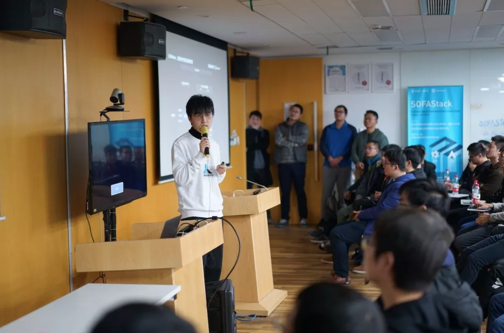
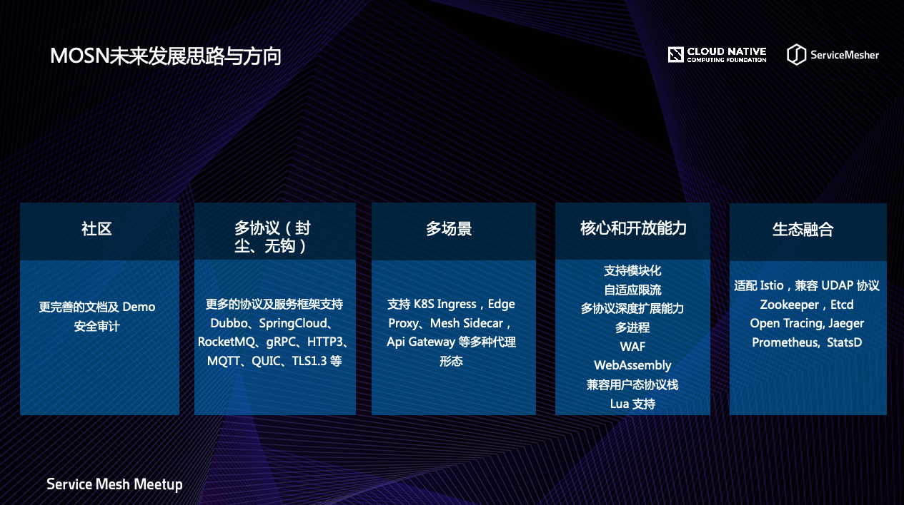

2019 年 12 月 28 日，杭州，在第 9 届 Service Mesh Meetup 上，MOSN 开源负责人肖涵（涵畅）宣布，MOSN 从 SOFAStack 社区中迁移出来，成立独立的 Github 组织 <https://github.com/mosn>，并作为独立项目运营，并开启 MOSN 开源社区。

同时公布了 MOSN 的 Roadmap，开启新的域名 [mosn.io](https://mosn.io)。

