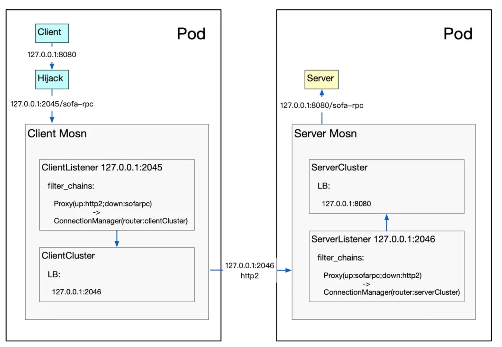
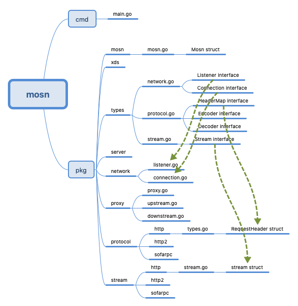
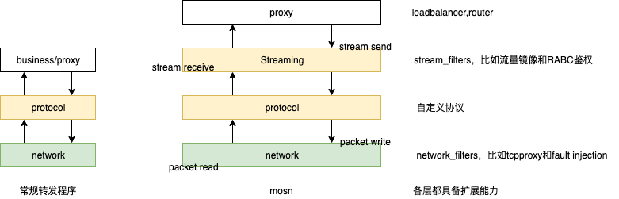
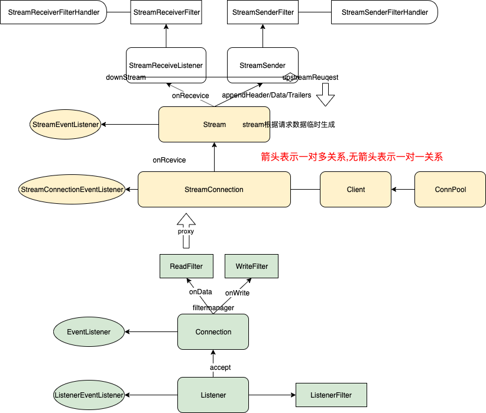
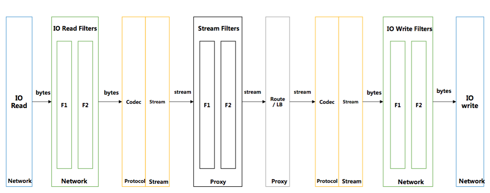
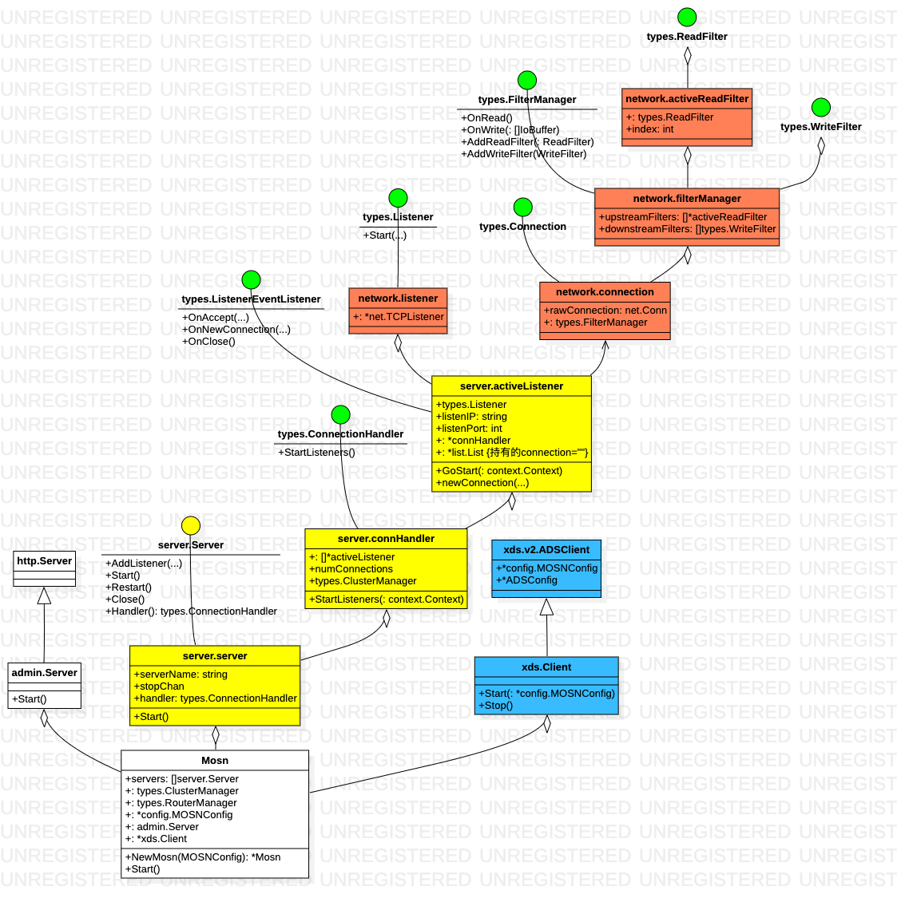
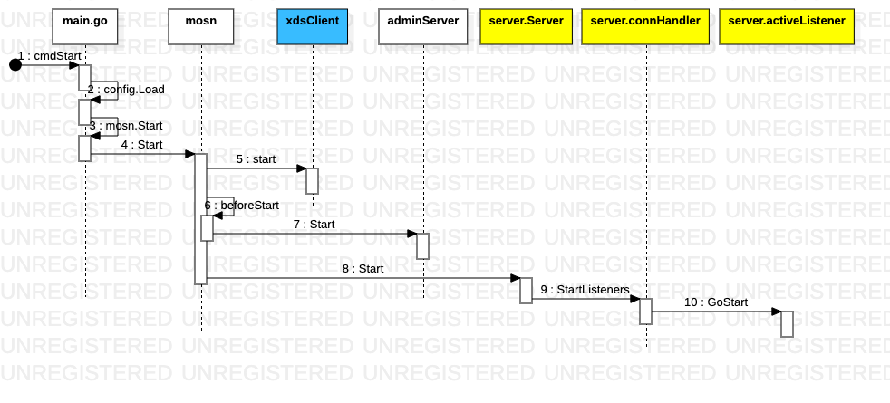
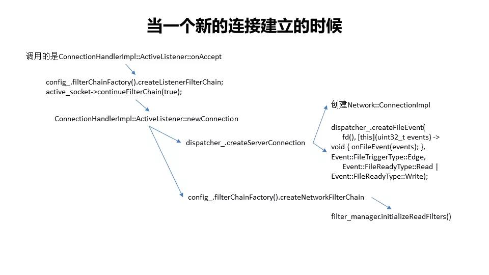
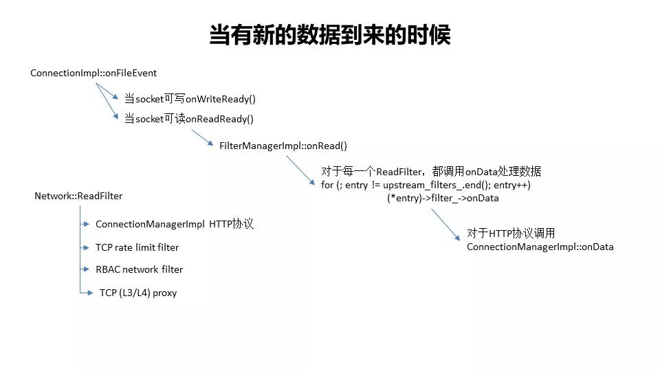
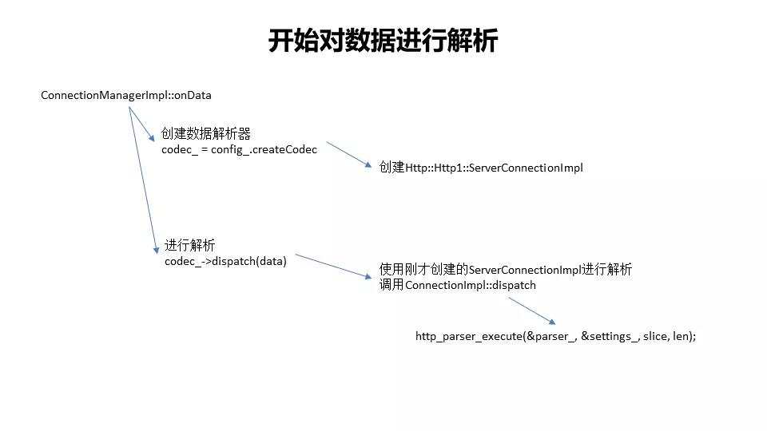

## 前言

MOSN是基于Go开发的sidecar，用于service mesh中的数据面代理，建议先看下[一个sidecar的自我修养](http://qiankunli.github.io/2020/01/14/self_cultivation_of_sidecar.html) 对sidecar 的基本概念、原理有所了解。

## 手感

[使用 MOSN 作为 HTTP 代理](https://github.com/mosn/mosn/tree/master/examples/cn_readme/http-sample)。

通过设置 log level 为debug，代码中加更多日志来辅助分析代码。**本文主要以http-example 为例来分析**。

### 基本使用

[MOSN源码解析—配置详解](https://juejin.im/post/5c62344f6fb9a049c232e821)。

```bash
mosn
    examples
        codes
            http-example
                // mosn start -c config.json 即可启动mosn
                config.json
                // golang 实现的一个简单的http server，直接go run server.go 即可启动
                server.go     
```


  

使用`http://localhost:8080` 和 `http://localhost:2345` 都可以拿到数据。


### 配置理解

对应config.json 的内容如下。

```json
{
    "servers": [
        {
            "default_log_path": "stdout", 
            "listeners": [
                {
                    "name": "serverListener", 
                    "address": "127.0.0.1:2046", 
                    "bind_port": true, 
                    "log_path": "stdout", 
                    "filter_chains": [
                        {}
                    ]
                }, 
                {
                    "name": "clientListener", 
                    "address": "127.0.0.1:2045", 
                    "bind_port": true, 
                    "log_path": "stdout", 
                    "filter_chains": [
                        {}
                    ]
                }
            ]
        }
    ], 
    "cluster_manager": {}, 
    "admin": {}
}
```

单拎出来 admin 部分， MOSN 监听34901 端口。

    "admin": {
      "address": {
        "socket_address": {
          "address": "0.0.0.0",
          "port_value": 34901
        }
      }
    }


访问`http://localhost:34901/`的返回结果。

```bash
support apis:
/api/v1/update_loglevel
/api/v1/enable_log
/api/v1/disbale_log
/api/v1/states
/api/v1/config_dump
/api/v1/stats
```

## 代码结构



几乎所有的 interface 定义在 `pkg/types` 中，MOSN 基于四层架构实现（见下文），每一个 layer 在 types 中有一个 go 文件，在`pkg` 下有一个专门的文件夹。

## 分层架构



一般的服务端编程，二级制数据经过协议解析为协议对应的model（比如HttpServletRequest） 进而交给上层业务方处理，对于 MOSN：

1. 协议上数据统一划分为 `header/data/Trailers` 三个部分，转发也是以这三个子部分为基本单位。
2. 借鉴了http2 的stream 的理念（所以Stream interface 上有一个方法是`ID()`），Stream 可以理解为一个子Connection，Stream 之间可以并行请求和响应，通过StreamId关联，用来实现在一个Connection 之上的“多路复用”。PS：为了连接数量与请求数量解耦。

代码的组织（`pkg/stream`，`pkg/protocol`，`pkg/proxy`）  跟上述架构是一致的。



1. `pkg/types/connection.go` Connection.
2. `pkg/types/stream.go` StreamConnection is a connection runs multiple streams.
3. `pkg/types/stream.go` Stream is a generic protocol stream
4. 一堆listener 和filter 比较好理解：Method in listener will be called on event occur, but not effect the control flow.Filters are called on event occurs, it also returns a status to effect control flow. Currently 2 states are used: Continue to let it go, Stop to stop the control flow.
5. protocol 和 stream 两个layer 因和协议有关，不同协议之间实现差异很大，层次不是很清晰。
6. 跨层次调用/数据传输通过跨层次struct 的“组合”来实现。也有一些特别的，比如http net/io 和 stream 分别启动goroutine read/write loop，通过共享数据来变相的实现跨层调用。

[MOSN的核心概念解析](https://mosn.iodocs/concept/core-concept/)。



1. MOSN 在 IO 层读取数据，通过 read filter 将数据发送到 Protocol 层进行 Decode。
2. Decode 出来的数据，根据不同的协议，**回调到 stream 层**，进行 stream 的创建和封装。
3. stream 创建完毕后，会回调到 Proxy 层做路由和转发，Proxy 层会关联上下游（upstream,downstream）间的转发关系。
4. Proxy 挑选到后端后，会根据后端使用的协议，将数据发送到对应协议的 Protocol 层，对数据重新做 Encode。
5. Encode 后的数据会经过 write filter 并最终使用 IO 的 write 发送出去。

一个请求可能会触发多次读取操作，因此单个请求可能会多次调用插件的onData 函数。

## 连接管理

该图主要说的连接管理部分。



1. 不同颜色表示所处的 package 不同。
2. 因为MOSN主要是的用途是“代理”， 所以笔者一开始一直在找代理如何实现，但其实呢，MOSN 首先是一个tcp server，像tomcat一样，MOSN 主要分为连接管理和业务处理两个部分。
3. 业务处理的入口就是filterManager， 主要由`filterManager.onRead` 和 `filterManager.onWrite` 来实现。filterManager 聚合ReadFilter 链和WriterFilter链，构成对数据的处理。



Envoy 对应逻辑 [深入解读Service Mesh的数据面Envoy](https://sq.163yun.com/blog/article/213361303062011904)。




## 数据处理

一些细节：

1. [SOFAMesh中的多协议通用解决方案x-protocol介绍系列(1)-DNS通用寻址方案](https://skyao.io/post/201809-xprotocol-common-address-solution/)

    iptables在劫持流量时，除了将请求转发到localhost的Sidecar处外，还额外的在请求报文的TCP options 中将 ClusterIP 保存为 original dest。在 Sidecar （Istio默认是Envoy）中，从请求报文 TCP options 的 original dest 处获取 ClusterIP。

2. [SOFAMesh中的多协议通用解决方案x-protocol介绍系列(2)-快速解码转发](https://skyao.io/post/201809-xprotocol-rapid-decode-forward/)

    1. 转发请求时，由于涉及到负载均衡，我们需要将请求发送给多个服务器端实例。因此，有一个非常明确的要求：就是必须以单个请求为单位进行转发。即单个请求必须完整的转发给某台服务器端实例，负载均衡需要以请求为单位，不能将一个请求的多个报文包分别转发到不同的服务器端实例。所以，拆包是请求转发的必备基础。
    2. 多路复用的关键参数：RequestId。RequestId用来关联request和对应的response，请求报文中携带一个唯一的id值，应答报文中原值返回，以便在处理response时可以找到对应的request。当然在不同协议中，这个参数的名字可能不同（如streamid等）。严格说，RequestId对于请求转发是可选的，也有很多通讯协议不提供支持，比如经典的HTTP1.1就没有支持。但是如果有这个参数，则可以实现多路复用，从而可以大幅度提高TCP连接的使用效率，避免出现大量连接。稍微新一点的通讯协议，基本都会原生支持这个特性，比如SOFARPC，Dubbo，HSF，还有HTTP/2就直接內建了多路复用的支持。

我们可以总结到，对于Sidecar，要正确转发请求：

1. 必须获取到destination信息，得到转发的目的地，才能进行服务发现类的寻址。
2. 必须要能够正确的拆包，然后以请求为单位进行转发，这是负载均衡的基础。
3. 可选的RequestId，这是开启多路复用的基础。

[深入解读Service Mesh的数据面Envoy](https://sq.163yun.com/blog/article/213361303062011904)下文以Envoy 实现做一下类比用来辅助理解MOSN 相关代码的理念：



对于每一个Filter，都调用onData函数，咱们上面解析过，其中HTTP对应的ReadFilter是ConnectionManagerImpl，因而调用`ConnectionManagerImpl::onData`函数。ConnectionManager 是协议插件的处理入口，**同时也负责对整个处理过程的流程编排**。



### 数据“上传”

一次http1协议请求的处理过程。


绿色部分表示另起一个协程。

### 转发流程

Downstream stream, as a controller to handle downstream and upstream proxy flow `downStream.OnReceive` 逻辑。

```go
func (s *downStream) OnReceive(ctx context.Context,..., data types.IoBuffer, ...) {
    ...
    pool.ScheduleAuto(func() {
        phase := types.InitPhase
        for i := 0; i < 10; i++ {
            s.cleanNotify()
            phase = s.receive(ctx, id, phase)
            switch phase {
            case types.End:
                return
            case types.MatchRoute:
                log.Proxy.Debugf(s.context, "[proxy] [downstream] redo match route %+v", s)
            case types.Retry:
                log.Proxy.Debugf(s.context, "[proxy] [downstream] retry %+v", s)
            case types.UpFilter:
                log.Proxy.Debugf(s.context, "[proxy] [downstream] directResponse %+v", s)
            }
        }
    }
}
```

`downStream.receive` 会根据当前所处的phase 进行对应的处理。


```go
func (s *downStream) receive(ctx context.Context, id uint32, phase types.Phase) types.Phase {
    for i := 0; i <= int(types.End-types.InitPhase); i++ {
        switch phase {
        // init phase
        case types.InitPhase:
            phase++
        // downstream filter before route
        case types.DownFilter:
            s.runReceiveFilters(phase, s.downstreamReqHeaders, s.downstreamReqDataBuf, s.downstreamReqTrailers)
            phase++
        // match route
        case types.MatchRoute:
            s.matchRoute()
            phase++
        // downstream filter after route
        case types.DownFilterAfterRoute:
            s.runReceiveFilters(phase, s.downstreamReqHeaders, s.downstreamReqDataBuf, s.downstreamReqTrailers)
            phase++
        // downstream receive header
        case types.DownRecvHeader:
            //check not null
            s.receiveHeaders(s.downstreamReqDataBuf == nil && s.downstreamReqTrailers == nil)
            phase++
        // downstream receive data
        case types.DownRecvData:
            //check not null
            s.receiveData(s.downstreamReqTrailers == nil)
            phase++
        // downstream receive trailer
        case types.DownRecvTrailer:
            // check not null
            s.receiveTrailers()
            phase++
        // downstream oneway
        case types.Oneway:
            ...
        case types.Retry:
            ...
        case types.WaitNofity:
            ...
        // upstream filter
        case types.UpFilter:
            s.runAppendFilters(phase, s.downstreamRespHeaders, s.downstreamRespDataBuf, s.downstreamRespTrailers)
            // maybe direct response
            phase++
        // upstream receive header
        case types.UpRecvHeader:
            // send downstream response
            // check not null
            s.upstreamRequest.receiveHeaders(s.downstreamRespDataBuf == nil && s.downstreamRespTrailers == nil)
            phase++
        // upstream receive data
        case types.UpRecvData:
            // check not null
            s.upstreamRequest.receiveData(s.downstreamRespTrailers == nil)
            phase++
        // upstream receive triler
        case types.UpRecvTrailer:
            //check not null
            s.upstreamRequest.receiveTrailers()
            phase++
        // process end
        case types.End:
            return types.End
        default:
            return types.End
        }
    }
    return types.End
}
```

`pkg/types/proxy.go` 有phase 的定义。

|phase|对应方法|执行逻辑（部分）|
|---|---|---|
|InitPhase|||
|DownFilter|runReceiveFilters|
|MatchRoute|matchRoute|
|DownFilterAfterRoute|runReceiveFilters||
|DownRecvHeader|receiveHeaders|==> upstreamRequest.appendHeaders|
|DownRecvData|receiveData|==> upstreamRequest.appendData|
|DownRecvTrailer|receiveTrailers|==> upstreamRequest.appendTrailers()|
|Oneway/Retry/WaitNofity||
|UpFilter|runAppendFilters|
|UpRecvHeader|upstreamRequest.receiveHeaders|==> downStream.onUpstreamData|
|UpRecvData|upstreamRequest.receiveData|==> downStream.onUpstreamData|
|UpRecvTrailer|upstreamRequest.receiveTrailers|==> downStream.onUpstreamTrailers|
|End||

上述流程才像是一个 proxy 层的活儿，请求转发到 upstream，从upstream 拿到响应， 再转回给downStream。

## 与control plan 的交互

`pkg/xds/v2/adssubscriber.go` 启动发送线程和接收线程

```go
func (adsClient *ADSClient) Start() {
    adsClient.StreamClient = adsClient.AdsConfig.GetStreamClient()
    utils.GoWithRecover(func() {
        adsClient.sendThread()
    }, nil)
    utils.GoWithRecover(func() {
        adsClient.receiveThread()
    }, nil)
}
```

定时发送请求。

```go
func (adsClient *ADSClient) sendThread() {
    refreshDelay := adsClient.AdsConfig.RefreshDelay
    t1 := time.NewTimer(*refreshDelay)
    for {
        select {
        ...
        case <-t1.C:
            err := adsClient.reqClusters(adsClient.StreamClient)
            if err != nil {
                log.DefaultLogger.Infof("[xds] [ads client] send thread request cds fail!auto retry next period")
                adsClient.reconnect()
            }
            t1.Reset(*refreshDelay)
        }
    }
}
```

接收响应。

```go
func (adsClient *ADSClient) receiveThread() {
    for {
        select {
    
        default:
            adsClient.StreamClientMutex.RLock()
            sc := adsClient.StreamClient
            adsClient.StreamClientMutex.RUnlock()
            ...
            resp, err := sc.Recv()
            ...
            typeURL := resp.TypeUrl
            HandleTypeURL(typeURL, adsClient, resp)
        }
    }
}
```

处理逻辑是事先注册好的函数。

```go
func HandleTypeURL(url string, client *ADSClient, resp *envoy_api_v2.DiscoveryResponse) {
    if f, ok := typeURLHandleFuncs[url]; ok {
        f(client, resp)
    }
}
func init() {
    RegisterTypeURLHandleFunc(EnvoyListener, HandleEnvoyListener)
    RegisterTypeURLHandleFunc(EnvoyCluster, HandleEnvoyCluster)
    RegisterTypeURLHandleFunc(EnvoyClusterLoadAssignment, HandleEnvoyClusterLoadAssignment)
    RegisterTypeURLHandleFunc(EnvoyRouteConfiguration, HandleEnvoyRouteConfiguration)
}
```

以cluster 信息为例 HandleEnvoyCluster。

```go
func HandleEnvoyCluster(client *ADSClient, resp *envoy_api_v2.DiscoveryResponse) {
    clusters := client.handleClustersResp(resp)
    ...
    conv.ConvertUpdateClusters(clusters)
    clusterNames := make([]string, 0)
    ...
    for _, cluster := range clusters {
        if cluster.GetType() == envoy_api_v2.Cluster_EDS {
            clusterNames = append(clusterNames, cluster.Name)
        }
    }
    ...
}
```

会触发ClusterManager 更新cluster。

```go
func ConvertUpdateEndpoints(loadAssignments []*envoy_api_v2.ClusterLoadAssignment) error {
    for _, loadAssignment := range loadAssignments {
        clusterName := loadAssignment.ClusterName
        for _, endpoints := range loadAssignment.Endpoints {
            hosts := ConvertEndpointsConfig(&endpoints)
            clusterMngAdapter := clusterAdapter.GetClusterMngAdapterInstance()
            ...
            clusterAdapter.GetClusterMngAdapterInstance().TriggerClusterHostUpdate(clusterName, hosts); 
            ...
            
        }
    }
    return errGlobal
}
```

## 学到的

不要硬看代码，尤其对于多协程程序。

1. 打印日志。
2. `debug.printStack` 来查看某一个方法之前的调用栈。
3. `fmt.Printf("==> %T\n",xx)`  如果一个interface 有多个“实现类” 可以通过`%T` 查看struct 的类型。


