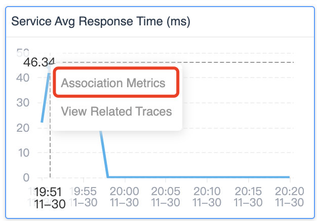

现代分布式应用程序工作的可观测性对于了解它们在各种条件下的行为方式以及在出现问题时进行故障排除和解决至关重要。追踪、指标和日志被视为可观测性堆栈的基本部分。Trace 是分布式系统执行的足迹，而 metric 则是用时间轴上的数字衡量系统性能。本质上，它们从两个维度衡量性能。能够快速可视化追踪和相应指标之间的联系，可以快速诊断哪些流程与潜在的异常相关。[SkyWalking 9.3.0](https://skywalking.apache.org/events/release-apache-skywalking-apm-9.3.0/) 现在提供了这一强大的新功能。

SkyWalking 项目从 tracing 开始，从 2018 年开始专注于 100% 基于采样的指标和拓扑分析。当用户面对时间序列指标的异常趋势时，比如折线图上的峰值，或者直方图显示 p95 和 p95 之间的差距较大，直接的问题是，为什么会出现这种情况？SkyWalking 的最新功能之一，trace 与 metric 关联，使得回答这个问题和解决根本原因更加容易。

## 指标是如何生成的？

SkyWalking 提供了三种计算指标的方式：

1. 根据追踪跨度构建的指标，具体取决于跨度的层、种类和标签。
2. 从日志中提取指标—— 一种基于关键词和标签的指标提取。
3. 从成熟和主流的指标 / 仪表系统报告的指标，例如 OpenTelemetry、Prometheus 和 Zabbix。

Tracing 追踪应用程序服务之间的请求过程。大多数生成流量和性能相关指标的系统也会生成追踪数据，这些数据来自服务器端基于追踪的聚合或通过客户端 SDK。

## 使用 SkyWalking 降低追踪索引的传统成本

Trace 数据和可视化对于开发人员和运维人员来说都是至关重要的故障排除工具，因为它们在定位问题边界方面非常有帮助。但是，由于传统上很难找到指标和痕迹之间的关联，团队已经将越来越多的标签添加到跨度中，并搜索各种组合。这种增加仪器和搜索的趋势需要增加基础设施投资来支持这种搜索。SkyWalking 的指标和追踪关联功能有助于降低索引和搜索该数据的成本。

## 查找关联的 trace

在寻找 metric 和 trace 之间的关联时，我们处理的指标类型决定了它们与 trace 的关系。让我们回顾一下标准请求*率、错误和持续时间（RED）*指标，看看它是如何工作的。

### 成功率指标

成功率由返回码、RPC 响应码或进程异常决定。当成功率下降时，在这个服务或 Pod 的 trace 中寻找错误是第一个寻找线索的地方。

*图 1：SkyWalking 9.3.0 仪表板的成功率图表，带有在特定时间查看相关 trace 的选项。*

从成功率的峰值向下探索，SkyWalking 列出了在这一特定分钟内收集的所有 trace 及其错误状态（图 2）：

*图 2：SkyWalking 显示具有错误状态的相关追踪。*

可以从 trace 中找到对 `/test` 的请求，并且 span 的标记指示 HTTP 请求的 404 响应代码。

*图 3：显示 URI 不存在的 http://frontend/test 请求的详细视图。*

通过查看 trace 数据，很明显成功率的下降是由对不存在的 URI 的请求引起的。

### 平均响应时间

平均响应时间指标提供了服务性能的一般概览。当平均响应时间不稳定时，这通常意味着系统面临严重的性能影响。

*图 4：SkyWalking 用于搜索相关 trace 的查询 UI，显示超过特定持续时间阈值的请求的 trace。*

当您从该指标向下探索时，该查询条件（图 4）将揭示该特定分钟内服务的最慢 trace。请注意，至少 168ms 作为条件自动添加，以避免扫描数据库中的大量行。

### Apdex

Apdex（应用程序性能指数）是根据设定的阈值衡量响应时间的指标。它测量令人满意的响应时间与不令人满意的响应时间的比率（图 5）。响应时间是从资产请求到完成交付回请求者的时间。

*图 5：Apdex 公式*

用户定义响应时间容忍阈值 *T*。在 *T* 或更短时间内处理的所有响应都使用户满意。

例如，如果 *T* 为 1.2 秒，响应在 0.5 秒内完成，则用户会感到满意。所有大于 1.2 秒的响应都会让用户不满意。超过 4.8 秒的响应会让用户感到沮丧。

当 Apdex 分数下降时，我们需要从两个角度寻找相关的 trace：慢速和错误状态的 trace。SkyWalking 的新相关追踪功能提供了一种直接从 Apdex 图表查看两者（图 6）的快速方法。

*图 6：显示 Apdex 图中的慢速 trace 和错误状态 trace*

### 服务响应时间

百分位指标百分位图（图 7）提供 p50、p75、p90、p95 和 p99 延迟排名，以衡量服务性能的长尾问题。

*图 7：服务响应时间百分位图有助于突出服务性能的长尾问题。*

这个百分位数图显示了一个典型的长尾问题。P99 延迟比 P95 慢四倍。当我们使用关联时，我们会看到 P95 - P99 和 P99 - Infinity 之间具有延迟的 trace。

造成这种长尾现象的请求 trace，就是从那里自动列出来的。

*图 8：用于根据延迟搜索 trace 的查询参数。*

## 是否有更多关联可用？

SkyWalking 提供的不仅仅是 trace 和 metric 之间的关联，还可以帮助您找到可能的因果关系，避免大海捞针。

目前，SkyWalking 9.3.0 提供了两种关联：**metric-to-metric** 关联和 **event-to-metric** 关联。

### Metric-to-metric 关联

仪表板上有许多指标 —— 这对于全面了解应用程序行为非常有用。在典型的性能问题中，多个指标的峰值会同时受到影响。但是，尝试关联所有这些图表中的峰值可能很困难……

现在在 SkyWalking 9.3.0 中，当你点击一个图表的峰值时，弹出框可以让你看到相关的指标。

*图 9：SkyWalking 用于查看相关指标的选项。*

当您选择该选项时，所有关联的指标图表将在所有关联的图表中显示轴指针（垂直虚线），如图 10 所示。这使得将不同图表中的峰值相互关联起来变得更加容易。通常，这些相关的峰值具有相同的根本原因。

*图 10：轴指针（垂直虚线）显示多个指标图中峰值之间的关联。*

### Event-to-metric 关联

SkyWalking 提供了事件概念来关联可能受基础设施影响的服务性能，例如来自 Kubernetes 的新部署。或者，已通过警报或集成 AIOps 引擎检测到异常。

事件到指标的关联也是自动的，它可以覆盖指标图上事件的时间范围（蓝色区域）。如果事件区域和峰值匹配，则很可能该事件覆盖了该异常。 

*图 11：SkyWalking 的事件与指标关联视图。*

## SkyWalking 使查找根本原因变得更加容易和快速

SkyWalking 现在可以轻松找到指标、事件和追踪之间的关联，最终可以确定根本原因并快速解决问题。我们在本文中讨论的关联在 SkyWalking 9.3.0 版本中开箱即用。

*图 12：只需单击圆点即可查看相关 trace 和 metric 关联。*

单击任何指标图上的点，如果该指标具有逻辑映射，您将看到一个*查看相关 trace* 弹出窗口。

## 结论

在这篇博客中，我们了解了 metric 和 trace 之间新增的关联功能。有了这个新的可视化，现在可以更容易地找到关键 trace 来识别问题的根本原因。SkyWalking 中的关联可以更深入。从 metric 到 trace 的关联并不是诊断系统瓶颈的终点。在下一篇文章中，我们将介绍 eBPF 支持的追踪增强功能，您将看到与网络分析中的追踪跨度相关的 HTTP 请求和响应详细信息。敬请关注。
