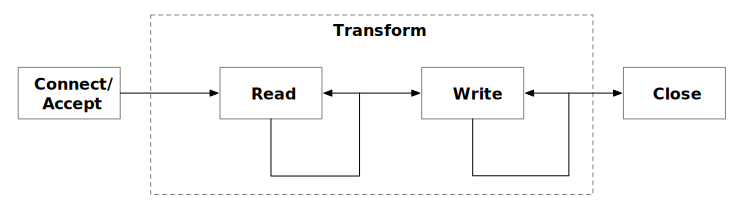

本文将展示如何利用 [Apache SkyWalking](https://github.com/apache/skywalking) 与 [eBPF](https://ebpf.io/what-is-ebpf/)，使服务网格下的网络故障排除更加容易。

Apache SkyWalking 是一个分布式系统的应用性能监控工具。它观察服务网格中的指标、日志、痕迹和事件，并使用这些数据来生成 pod 和服务的依赖图。这个依赖关系图可以帮助你快速系统，尤其是在出现问题的时候。

然而，在排除 SkyWalking 服务拓扑中的网络问题时，确定错误的实际位置有时候并不容易。造成这种困难的原因有两个：

- **通过 Envoy sidecar 的流量并不容易观察**：来自 Envoy 的[访问日志服务（ALS）](https://www.envoyproxy.io/docs/envoy/latest/api-v3/service/accesslog/v3/als.proto)的数据显示了服务之间的流量（sidecar-to-sidecar），但没有关于 Envoy sidecar 和它代理的服务之间的通信指标。如果没有这些信息，就很难理解 sidecar 的影响。
- **缺乏来自传输层（OSI 第 4 层）通信的数据**：由于服务通常使用应用层（OSI 第 7 层）协议，如 HTTP，可观测性数据通常被限制在应用层通信中。然而，根本原因可能实际上是在传输层，而传输层对可观测性工具来说通常是不透明的。

获取 Envoy-to-service 和传输层通信的指标，可以更容易诊断服务问题。为此，SkyWalking 需要收集和分析 Kubernetes pod 内进程之间的传输层指标 —— 这项任务很适合 eBPF。我们调查了为此目的使用 eBPF 的情况，并在下面介绍了我们的结果和演示。

## 用 eBPF 监控 Kubernetes 网络

eBPF 起源于 Extended Berkeley Packet Filter，是一种通用的机制，可以在 Linux 内核中注入和运行自己的代码，是监测 Kubernetes Pod 中网络流量的优秀工具。在接下来的几节中，我们将概述如何使用 eBPF 进行网络监控，作为介绍 [Skywalking Rover](https://github.com/apache/skywalking-rover) 的背景，这是一个由 eBPF 驱动的指标收集器和分析器，用于诊断 CPU 和网络性能。

### 应用程序和网络如何相互作用

应用程序和网络之间的互动一般可分为以下步骤，从较高的抽象层次到较低的抽象层次：


1. **用户代码**：应用程序代码使用应用程序堆栈中的高级网络库，在网络上交换数据，如发送和接收 HTTP 请求。
2. **网络库**：当网络库收到网络请求时，它与语言 API 进行交互以发送网络数据。
3. **语言 API**：每种语言都提供了一个操作网络、系统等的 API。当收到一个请求时，它与系统的 API 进行交互。在 Linux 中，这个 API 被称为系统调用（syscalls）。
4. **Linux API**：当 Linux 内核通过 API 收到请求时，它与套接字进行通信以发送数据，这通常更接近于 OSI 第四层协议，如 TCP、UDP 等。
5. **Socket Ops**：向 / 从网卡发送或接收数据。

我们的假设是，eBPF 可以监控网络。有两种方法可以实现拦截：**用户空间（uprobe）或内核空间（kprobe）**。下表总结了两者的区别。

| 方式   | 优点                                                         | 缺点                                                         |
| ------ | ------------------------------------------------------------ | ------------------------------------------------------------ |
| uprobe | • 获取更多与应用相关的上下文，例如当前请求是 HTTP 还是 HTTPS。</br> • 请求和响应可以通过一个方法来截获。 | • 数据结构可能是不稳定的，所以更难获得所需的数据。</br> • 不同语言/库版本的实现可能不同。</br> • 在没有[符号表](https://en.wikipedia.org/wiki/Symbol_table)的应用程序中不起作用。 |
| kprobe | • 可用于所有语言。</br> • 数据结构和方法很稳定，不需要太多调整。</br> • 更容易与底层数据相关联，如获得 TCP 的目标地址、OSI 第四层协议指标等。 | • 一个单一的请求和响应可能被分割成多个 probe。</br> • 对于有状态的请求，上下文信息不容易得到。例如 HTTP/2 中的头压缩。 |

对于一般的网络性能监控，我们选择使用 kprobe（拦截系统调用），原因如下：

1. 它可用于用任何编程语言编写的应用程序，而且很稳定，所以可以节省大量的开发 / 适应成本。
2. 它可以与系统层面的指标相关联，这使得故障排除更加容易。
3. 由于一个请求和响应被分割成多个 probe，我们可以利用技术将它们关联起来。
4. 对于背景信息，它通常用于 OSI 第七层协议网络分析。因此，如果我们只是监测网络性能，那么它们可以被忽略。

### Kprobes 和网络监控

按照 [Linux 文档中的网络系统调用](http://linasm.sourceforge.net/docs/syscalls/network.php)，我们可以通过两类拦截方法实现网络监控：**套接字操作**和**发送 / 接收**方法。

#### 套接字操作

当接受或与另一个套接字连接时，我们可以得到以下信息：

1. **连接信息**：包括来自连接的远程地址，这有助于我们了解哪个 pod 被连接。
2. **连接统计** ：包括来自套接字的基本指标，如往返时间（[RTT](https://en.wikipedia.org/wiki/Round-trip_delay)）、TCP 的丢包数等。
3. **套接字和文件描述符（[FD](https://en.wikipedia.org/wiki/File_descriptor)）的映射**：包括 Linux 文件描述符和套接字对象之间的关系。在通过 Linux 文件描述符发送和接收数据时，它很有用。

#### 发送 / 接收

与发送或接收数据有关的接口是性能分析的重点。它主要包含以下参数：

1. **Socket 文件描述符**：当前操作对应的套接字的文件描述符。
2. **缓冲区**：发送或接收的数据，以字节数组形式传递。

基于上述参数，我们可以分析以下数据：

1. **字节**：数据包的大小，以字节为单位。
2. **协议**：根据缓冲区的数据进行协议分析，如 HTTP、MySQL 等。
3. **执行时间**：发送 / 接收数据所需的时间。

在这一点上（图 1），我们可以分析出连接的整个生命周期的以下步骤：

1. **连接 / 接受**：当连接被创建时。
2. **转化**：在连接上发送和接收数据。
3. **关闭**：当连接被关闭时。



***图 1***

### 协议和 TLS

上一节描述了如何使用发送或接收缓冲区数据来分析连接。例如，遵循 [HTTP/1.1 消息规范](https://www.rfc-editor.org/rfc/rfc2068.html#section-4.1)来分析连接。然而，这对 TLS 请求 / 响应不起作用。


***图 2***

当使用 TLS 时，Linux 内核在用户空间中传输加密的数据。在上图中，应用程序通常通过第三方库（如 OpenSSL）传输 SSL 数据。对于这种情况，Linux API 只能得到加密的数据，所以它不能识别任何高层协议。为了在 eBPF 内部解密，我们需要遵循以下步骤：

1. **通过 uprobe 读取未加密的数据**：兼容多种语言，使用 uprobe 来捕获发送前或接收后没有加密的数据。通过这种方式，我们可以获得原始数据并将其与套接字联系起来。
2. **与套接字关联**：我们可以将未加密的数据与套接字关联。

#### OpenSSL 用例

例如，发送 / 接收 SSL 数据最常见的方法是使用 OpenSSL 作为共享库，特别是 [SSL_read](https://www.openssl.org/docs/man1.1.1/man3/SSL_read.html) 和 [SSL_write](https://www.openssl.org/docs/man1.1.1/man3/SSL_write.html) 方法，以提交缓冲区数据与套接字。

按照[文档](https://www.openssl.org/docs/man1.1.1/man7/ssl.html)，我们可以截获这两种方法，这与 Linux 中的 API 几乎相同。OpenSSL 中 SSL 结构的源代码显示， [Socket FD](https://github.com/openssl/openssl/blob/9eae491721209f302a9a475bffd271370e8bcb8f/crypto/bio/bio_local.h#L115-L125) 存在于 [SSL 结构的 BIO 对象](https://github.com/openssl/openssl/blob/9eae491721209f302a9a475bffd271370e8bcb8f/ssl/ssl_local.h#L1068-L1083)中，我们可以通过 offset 得到它。

综上所述，通过对 OpenSSL 工作原理的了解，我们可以在一个 eBPF 函数中读取未加密的数据。

## SkyWalking Rover—— 基于 eBPF 的指标收集器和分析器 

[SkyWalking Rover](https://github.com/apache/skywalking-rover) 在 SkyWalking 生态系统中引入了 eBPF 网络分析功能。目前已在 Kubernetes 环境中得到支持，所以必须在 Kubernetes 集群内部署。部署完成后，SkyWalking Rover 可以监控特定 Pod 内所有进程的网络。基于监测数据，SkyWalking 可以生成进程之间的拓扑关系图和指标。

### 拓扑结构图

拓扑图可以帮助我们了解同一 Pod 内的进程之间以及进程与外部环境（其他 Pod 或服务）之间的网络访问情况。此外，它还可以根据线路的流动方向来确定流量的数据方向。

在下面的图 3 中，六边形内的所有节点都是一个 Pod 的内部进程，六边形外的节点是外部关联的服务或 Pod。节点由线连接，表示节点之间的请求或响应方向（客户端或服务器）。线条上标明了协议，它是 HTTP (S)、TCP 或 TCP (TLS)。另外，我们可以在这个图中看到，Envoy 和 Python 应用程序之间的线是双向的，因为 Envoy 拦截了所有的应用程序流量。


***图 3***

### 度量

一旦我们通过拓扑结构认识到进程之间的网络调用关系，我们就可以选择一个特定的线路，查看两个进程之间的 TCP 指标。

下图（图4）显示了两个进程之间网络监控的指标。每行有四个指标。左边的两个是在客户端，右边的两个是在服务器端。如果远程进程不在同一个 Pod 中，则只显示一边的指标。


***图 4***

有以下两种度量类型。

1.  **计数器（Counter）**：记录一定时期内的数据总数。每个计数器包含以下数据。
    1.  **计数**：执行次数。
    2.  **字节**：数据包大小，以字节为单位。
    3.  **执行时间**：执行时间。
2.  **柱状图（Histogram）**：记录数据在桶中的分布。

基于上述数据类型，暴露了以下指标：

| 名称       | 类型           | 单位 | 描述                                         |
| ---------- | -------------- | ---- | -------------------------------------------- |
| Write      | 计数器和柱状图 | 毫秒 | 套接字写计数器。                             |
| Read       | 计数器和柱状图 | 毫秒 | 套接字读计数器。                             |
| Write RTT  | 计数器和柱状图 | 微秒 | 套接字写入往返时间（RTT）计数器。            |
| Connect    | 计数器和柱状图 | 毫秒 | 套接字连接/接受另一个服务器/客户端的计数器。 |
| Close      | 计数器和柱状图 | 毫秒 | 有其他套接字的计数器。                       |
| Retransmit | 计数器         | 毫秒 | 套接字重发包计数器                           |
| Drop       | 计数器         | 毫秒 | 套接字掉包计数器。                           |

## 演示

在本节中，我们将演示如何在服务网格中执行网络分析。要跟上进度，你需要一个正在运行的 Kubernetes 环境。

**注意**：所有的命令和脚本都可以[在这个 GitHub 资源库中](https://github.com/mrproliu/skywalking-network-profiling-demo)找到。

### 安装 Istio

Istio是最广泛部署的服务网格，并附带一个完整的演示应用程序，我们可以用来测试。要安装 Istio 和演示应用程序，请遵循以下步骤：

1.  使用演示配置文件安装 Istio。
2.  标记 default 命名空间，所以当我们要部署应用程序时，Istio 会自动注入 Envoy 的 sidecar 代理。
3.  将 bookinfo 应用程序部署到集群上。
4.  部署流量生成器，为应用程序生成一些流量。

```bash
export ISTIO_VERSION=1.13.1

# 安装 istio
istioctl install -y --set profile=demo
kubectl label namespace default istio-injection=enabled

# 部署 bookinfo 应用程序
kubectl apply -f https://raw.githubusercontent.com/istio/istio/$ISTIO_VERSION/samples/bookinfo/platform/kube/bookinfo.yaml
kubectl apply -f https://raw.githubusercontent.com/istio/istio/$ISTIO_VERSION/samples/bookinfo/networking/bookinfo-gateway.yaml
kubectl apply -f https://raw.githubusercontent.com/istio/istio/$ISTIO_VERSION/samples/bookinfo/networking/destination-rule-all.yaml
kubectl apply -f https://raw.githubusercontent.com/istio/istio/$ISTIO_VERSION/samples/bookinfo/networking/virtual-service-all-v1.yaml

# 产生流量
kubectl apply -f https://raw.githubusercontent.com/mrproliu/skywalking-network-profiling-demo/main/resources/traffic-generator.yaml
```

### 安装 SkyWalking

下面将安装 SkyWalking 所需的存储、后台和用户界面。

```bash
git clone https://github.com/apache/skywalking-kubernetes.git
cd skywalking-kubernetes
cd chart
helm dep up skywalking
helm -n istio-system install skywalking skywalking \
 --set fullnameOverride=skywalking \
 --set elasticsearch.minimumMasterNodes=1 \
 --set elasticsearch.imageTag=7.5.1 \
 --set oap.replicas=1 \
 --set ui.image.repository=apache/skywalking-ui \
 --set ui.image.tag=9.2.0 \
 --set oap.image.tag=9.2.0 \
 --set oap.envoy.als.enabled=true \
 --set oap.image.repository=apache/skywalking-oap-server \
 --set oap.storageType=elasticsearch \
 --set oap.env.SW_METER_ANALYZER_ACTIVE_FILES='network-profiling'
```

### 安装 SkyWalking Rover

SkyWalking Rover 部署在 Kubernetes 的每个节点上，它自动检测 Kubernetes 集群中的服务。网络剖析功能已经在 SkyWalking Rover 的 0.3.0 版本中发布。当网络监控任务被创建时，SkyWalking Rover 会将数据发送到 SkyWalking 后台。

```bash
kubectl apply -f https://raw.githubusercontent.com/mrproliu/skywalking-network-profiling-demo/main/resources/skywalking-rover.yaml
```

### 启动网络分析任务

一旦所有部署完成，我们必须在 SkyWalking UI 中为服务的特定实例创建一个网络分析任务。

要打开 SkyWalking UI，请运行：

```bash
kubectl port-forward svc/skywalking-ui 8080:80 --namespace istio-system
```

目前，我们可以通过点击服务网格面板中的**数据平面**项目和 **Kubernetes** 面板中的服务项目来选择我们想要监控的特定实例。

在下图中，我们选择了一个实例，在网络剖析标签里有一个任务列表。当我们点击启动按钮时，SkyWalking Rover 开始监测这个实例的网络。


***图 5***

### 完成

几秒钟后，你会看到页面的右侧出现进程拓扑结构。


***图 6***

当你点击进程之间的线时，你可以看到两个进程之间的 TCP 指标。


***图 7***

## 总结

在这篇文章中，我们详细介绍了一个使服务网格故障排除困难的问题：网络堆栈中各层之间缺乏上下文。这些情况下，当现有的服务网格 /envoy 不能时，eBPF 开始真正帮助调试 / 生产。然后，我们研究了如何将 eBPF 应用于普通的通信，如 TLS。最后，我们用 SkyWalking Rover 演示了这个过程的实现。

目前，我们已经完成了对 OSI 第四层（主要是 TCP）的性能分析。在未来，我们还将介绍对 OSI 第 7 层协议的分析，如 HTTP。

## 开始使用 Istio

开始使用服务网格，[Tetrate Istio Distro](https://istio.tetratelabs.io/) 是安装、管理和升级 Istio 的最简单方法。它提供了一个经过审查的 Istio 上游发布，由 Tetrate 为特定平台进行测试和优化，加上一个 CLI，方便获取、安装和配置多个 Istio 版本。Tetrate Istio Distro 还为 FedRAMP 环境提供 [FIPS 认证的 Istio 构建](https://www.tetrate.io/blog/tetrate-istio-distro-achieves-fips-certification/)。

对于需要以统一和一致的方式在复杂的异构部署环境中保护和管理服务和传统工作负载的企业，我们提供 [Tetrate Service Bridge](https://www.tetrate.io/tetrate-service-bridge/)，这是我们建立在 Istio 和 Envoy 上的旗舰工作负载应用连接平台。

[联系我们以了解更多](https://www.tetrate.io/contact/)。

## 其他资源

1.  [SkyWalking Github Repo](https://github.com/apache/skywalking)
2.  [SkyWalking Rover Github Repo](https://github.com/apache/skywalking-rover)
3.  [SkyWalking Rover 文件](https://skywalking.apache.org/docs/skywalking-rover/v0.3.0/readme/)
4.  [通过使用 eBPF 博文准确定位服务网格关键性能影响](https://skywalking.apache.org/blog/2022-07-05-pinpoint-service-mesh-critical-performance-impact-by-using-ebpf/)
5.  [Apache SkyWalking 与本地 eBPF 代理的介绍](https://www.youtube.com/watch?v=yUF5qRk4rYY)
6.  [eBPF hook概述](https://ebpf.io/what-is-ebpf#hook-overview)
