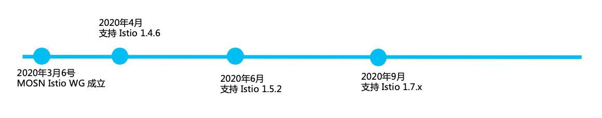

MOSN 是一个开源项目，于 2018 年 7 月由蚂蚁集团开源，使用 Apache 2.0 协议，任何人都可以使用和参与改进。MOSN 社区期待您的加入！

关于 MOSN 社区的详细资料请访问 [Community 仓库](https://github.com/mosn/community)。

## 工作组

目前 MOSN 包含以下工作组：

- [Istio 工作组](https://github.com/mosn/community/blob/master/wg-istio.md)
- [Dubbo 工作组](https://github.com/mosn/community/blob/master/wg-dubbo.md)

选择加入您感兴趣的工作组，开始您的 MOSN 之旅吧！

## 社区会议

MOSN 社区定期召开社区会议。

- [每双周三晚 8 点（北京时间）](https://ebay.zoom.com.cn/j/96285622161)

- [会议纪要](https://docs.google.com/document/d/12lgyCW-GmlErr_ihvAO7tMmRe87i70bv2xqe4h2LUz4/edit?usp=sharing)

## 合作伙伴

合作伙伴参与 MOSN 合作开发，使 MOSN 变得更好。

<table>
  <tbody>
  <tr></tr>
    <tr>
      <td align="center"  valign="middle">
        
      </td>
      <td align="center"  valign="middle">
        
      </td>
      <td align="center" valign="middle">
        
      </td>
      <td align="center" valign="middle">
        
      </td>
      </tr><tr></tr>
      <tr>
      <td align="center" valign="middle">
        
      </td>
    </tr>
    <tr></tr>
  </tbody>
</table>

## 终端用户

以下是 MOSN 的用户。

<table>
  <tbody>
  <tr></tr>
    <tr>
      <td align="center"  valign="middle">
        
      </td>
      <td align="center" valign="middle">
        
      </td>
      <td align="center" valign="middle">
        
      </td>
      <td align="center" valign="middle">
        
      </td>
    </tr>
    <tr></tr>
    <tr>
      <td align="center" valign="middle">
        
      </td>
      <td align="center" valign="middle">
        
      </td>
      <td align="center" valign="middle">
        
      </td>
      <td align="center" valign="middle">
        
      </td>
    </tr>
    <tr>
      <td align="center" valign="middle">
        
      </td>
    </tr>
  </tbody>
</table>

请在[此处](https://github.com/mosn/community/issues/8)登记并提供反馈来帮助 MOSN 做的更好。

## 开源生态

MOSN 社区积极拥抱开源生态，与以下开源社区建立了良好的合作关系。

<table>
  <tbody>
  <tr></tr>
    <tr>
      <td align="center" valign="middle">
        
      </td>
      <td align="center"  valign="middle">
        
      </td>
      <td align="center" valign="middle">
        
      </td>
      <td align="center" valign="middle">
        
      </td>
    </tr>
    <tr></tr>
    <tr>
      <td align="center" valign="middle">
        
      </td>
      </tr>
    </tbody>
  </table>

## Committer 列表

MOSN 社区认证的 Committer 如下：

| 姓名   | GitHub                                          | 公司      |
| ------ | ----------------------------------------------- | --------- |
| 田阳   | [taoyuanyuan](https://github.com/taoyuanyuan)   | 蚂蚁集团  |
| 王发康 | [wangfakang](https://github.com/wangfakang)     | 蚂蚁集团  |
| 白鹏   | [nejisama](https://github.com/nejisama)         | 蚂蚁集团  |
| 曹春晖 | [cch123](https://github.com/cch123)             | 蚂蚁集团  |
| 孙福泽 | [peacocktrain](https://github.com/peacocktrain) | Boss 直聘 |
| 陈鹏   | [champly](https://github.com/champly)           | 多点生活  |
| 姚昌宇 | [trainyao](https://github.com/trainyao)         | 有米科技  |
| 邓茜   | [dengqian](https://github.com/dengqian)         | 阿里云    |

Committer 是具有 MOSN 仓库写权限的个人，标准如下：

- 能够在长时间内做持续贡献 issue、PR 的个人；
- 参与 issue 列表的维护及重要功能的讨论；
- 积极参与 code review 和社区会议；

## Roadmap

MOSN with Istio 路线图如下。

Roadmap 详情见 [Google Sheet](https://docs.google.com/spreadsheets/d/1fALompY9nKZNImOuxQw23xtMD-5rCBrXWziJZkj76bo/edit#gid=0)。

## 教程

MOSN 提供线上教程，见[教程页面](/docs/tutorial/)。

## 加入社区

使用钉钉扫描下面的二维码加入 MOSN 用户群。

