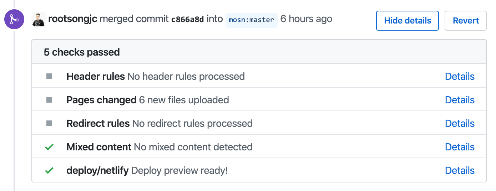

要处理 MOSN 文档，您需要：

- 创建一个 [GitHub 账户](https://github.com/)。

该文档是根据 [Apache 2.0](https://github.com/mosn/mosn.io/blob/master/LICENSE) 协议许可发布的。

## 如何贡献 {#how-to}

您可以通过以下三种方式为 MOSN 文档做出贡献：

- 如果您想要编辑现有页面，可以在浏览器中打开页面，然后点击页面右侧的**编辑本页**选项，这将带您到 GitHub 页面进行编辑操作并提交相应的更改。
- 如果您想使用通用的方式，请遵循我们的[如何添加内容](#add)中的步骤。
- 如果您想对现有的 pull request（PR）进行 review，请参考[如何 review](#review) 中的步骤。

PR 合并后会立即显示在 <https://mosn.io> 上。

## 如何添加内容 {#add}

要添加内容，您必须创建存储库的分支，并从该分支向文档主存储库提交 PR。以下步骤描述了该过程：

1. 访问 GitHub MOSN 官网仓库 <https://github.com/mosn/mosn.io>。
1. 单击屏幕右上角的 **Fork** 按钮，以在您的 GitHub 帐户中创建 MOSN 官网仓库的副本。
1. 克隆您的 fork 到本地，然后进行所需的任何更改。
1. 当您准备将这些更改发送给我们时，请将更改推送到您的 fork 仓库。
1. 进入 fork 仓库的索引页面，然后单击 **New Pull Request** 提交 PR。

## 如何 review {#review}

请直接在 PR 上发表评论。如果您评论的内容很详细，请按照以下步骤操作：

1. 在 PR 中评论具体信息。如果可以的话，请在受影响的文件和文件行上直接评论特定的具体信息。
1. 适当的时候，在评论中向 PR 提交者与参与者提供建议。
1. 发布您的评论，与 PR 参与者分享您的评论和建议。
1. 发布评论后，大家经过讨论一致同意合并 PR。

## 如何预览 {#preview}

您可以根据需要，选择在线预览，或者在本地使用 Hugo 命令行运行本站实时预览。

### 在线预览

在提交 PR 后，GitHub 上对应的 PR 页面会显示一系列检查选项，其中 `deploy/netlify` 选项将会生成 MOSN 官网的预览页面，点击 **Details** 可以跳转到预览界面。对于同一个 PR 每次提交都会触发一次构建预览。

这个是个临时网站，可以确保本次 PR 合并后的页面显示正常。

### 本地预览

除了在页面上预览以外，您还可以使用 [Hugo](https://github.com/gohugoio/hugo)（建议使用 v0.55.5 extended 版本），在代码仓库的根目录下执行 `hugo server`，即可在浏览器中打开 `http://localhost:1313` 预览。

