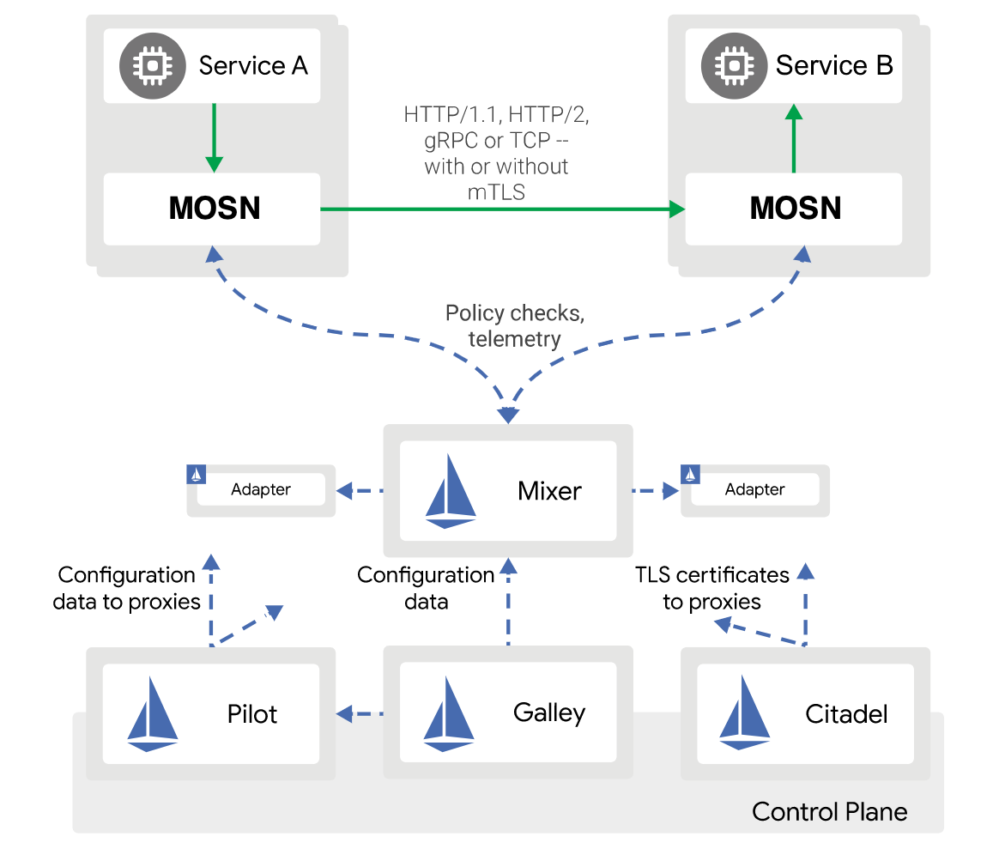
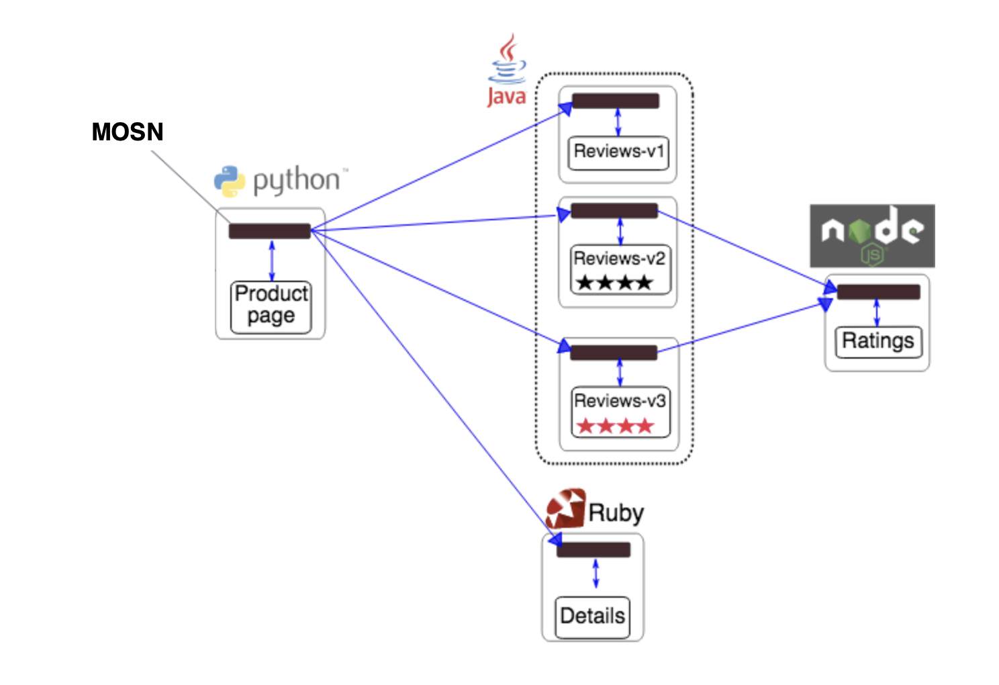

{}    
MOSN 已通过 Istio 1.4.6 的 `BookInfo` 测试，关于最新版 Istio 的支持情况可关注 [MOSN Istio WG](https://github.com/mosn/community/blob/master/wg-istio.md)。
{}  

本文介绍的内容将包括 : 

- MOSN 与 Istio 的关系
- 准备工作
- 源码方式部署 Istio
- Bookinfo 实验

## MOSN 与 Istio 的关系

我们曾在 [MOSN 介绍](../../overview)中介绍过，MOSN 是一款采用 Go 语言开发的 Service Mesh 数据平面代理。

下图是 Istio 整体框架下，MOSN 的工作示意图。

<div align=center></div>

## 准备工作

本文以 macOS 为例，其他环境可以安装对应版本的软件。

#### 安装 hyperkit

先安装 [docker-for-mac](https://store.docker.com/editions/community/docker-ce-desktop-mac)，之后[安装驱动](https://github.com/kubernetes/minikube/blob/master/docs/drivers.md)

#### 安装 docker

下载软件包安装，或者使用如下的命令安装。

```bash
$ brew cask install docker
```

#### 安装驱动

```bash
$ curl -LO https://storage.googleapis.com/minikube/releases/latest/docker-machine-driver-hyperkit \
&& chmod +x docker-machine-driver-hyperkit \
&& sudo mv docker-machine-driver-hyperkit /usr/local/bin/ \
&& sudo chown root:wheel /usr/local/bin/docker-machine-driver-hyperkit \
&& sudo chmod u+s /usr/local/bin/docker-machine-driver-hyperkit
```

#### 安装 Minikube（也可以购买商业 Kubernetes 集群）

推荐使用 Minikube v0.28 以上来体验，请参考 [minikube doc](https://github.com/kubernetes/minikube)。

```bash
$ brew cask install minikube
```

#### 启动 Minikube

注意，pilot 至少需要 2G 内存，所以在启动的时候，可以通过加参数的方法给 minikube 添加分配的资源，如果你机器的资源不够，推荐使用商业版本的 Kubernetes 集群。

```bash
$ minikube start --memory=8192 --cpus=4 --kubernetes-version=v1.15.0 --vm-driver=hyperkit
```

创建 istio 命名空间

```
$ kubectl create namespace istio-system
```

#### 安装 kubectl 命令行工具

kubectl 是用于针对 Kubernetes 集群运行命令的命令行接口，安装参考 [kubectl doc](https://kubernetes.io/docs/tasks/tools/install-kubectl)。

```bash
$ brew install kubernetes-cli
```

#### 安装 Helm

Helm 是一个 Kubernetes 的包管理工具，安装参考 [helm doc](https://docs.helm.sh/using_helm/#installing-helm)：

```bash
$ brew install kubernetes-helm
```

## 源码方式部署 Istio

MOSN 已通过 Istio 1.4.6 的 `BookInfo` 测试，相关支持动态请关注 [MOSN Istio WG](https://github.com/mosn/community/blob/master/wg-istio.md)。

#### 下载适配过 MOSN 的 Istio 源码

```bash
$ git clone -b feature-mosn_adapter https://github.com/mosn/istio.git
```

#### 通过 Helm 安装 Istio


**使用 `helm template` 安装**

首先需要切换到 Istio 源码所在目录，然后使用 helm 安装 Istio CRD 以及各个组件： 

```bash
$ cd istio
$ helm template install/kubernetes/helm/istio-init --set global.hub=docker.io/istio --set global.tag=1.4.6  --name istio-init --namespace istio-system >istio_init.yaml

$ helm template install/kubernetes/helm/istio --set global.sidecar.binaryPath=/usr/local/bin/mosn  --set global.hub=docker.io/istio --set global.tag=1.4.6  --set global.sidecar.image=mosnio/proxyv2:1.4.6-mosn  --name istio --namespace istio-system >istio.yaml

$ kubectl apply -f istio_init.yaml
$ kubectl apply -f istio.yaml

```

#### 验证安装

`istio-system` 命名空间下的 pod 状态都是 Running 时，说明已经部署成功。
如果仅仅是为了运行 `BookInfo`，只需要 pilot、injector、citadel 这三个 pod 运行成功就可以满足最低要求。

```bash
$ kubectl get pods -n istio-system
NAME                                        READY   STATUS      RESTARTS   AGE
istio-citadel-6b7796cbc7-8q72s              1/1     Running     0          9d
istio-galley-5545dff574-6qls6               1/1     Running     0          9d
istio-ingressgateway-79b75c4db-8w646        1/1     Running     0          9d
istio-init-crd-10-1.4-dev-9m7g6             0/1     Completed   0          9d
istio-init-crd-11-1.4-dev-j27vt             0/1     Completed   0          9d
istio-init-crd-14-1.4-dev-4h9ts             0/1     Completed   0          9d
istio-pilot-6654897fc6-vh299                2/2     Running     0          9d
istio-policy-68774796b8-qq5kz               2/2     Running     0          9d
istio-security-post-install-1.4-dev-g98ws   0/1     Completed   0          9d
istio-sidecar-injector-f7b64d984-hw8p4      1/1     Running     0          9d
istio-telemetry-5f5d94c78-zw847             2/2     Running     0          9d
prometheus-6c9c8f9c97-mkcnp                 1/1     Running     0          9d
```

我们可以登录到 `istio-ingressgateway-79b75c4db-8w646` pod 上查看该网关已经成功使用MOSN作为 `ingress-gateway`：

```bash
#kubectl -n istio-system exec -it  istio-ingressgateway-79b75c4db-8w646  bash 

root@istio-ingressgateway-79b75c4db-8w646:/# ps aux | grep mosn
root          1  0.0  0.6 131232  6360 ?        Ssl  Mar10   0:23 /usr/local/bin/pilot-agent proxy router --domain istio-system.svc.cluster.local --log_output_level=default:info --binaryPath /usr/local/bin/mosn --drainDuration 45s --parentShutdownDuration 1m0s --connectTimeout 10s --serviceCluster istio-ingressgateway --zipkinAddress zipkin:9411 --proxyAdminPort 15000 --statusPort 15020 --controlPlaneAuthPolicy NONE --discoveryAddress istio-pilot:15010
root         24  0.0  1.4 128068 15356 ?        Sl   Mar10   4:37 /usr/local/bin/mosn start --config /etc/istio/proxy/envoy-rev0.json --service-cluster istio-ingressgateway --service-node router~192.168.5.18~istio-ingressgateway-79b75c4db-8w646.istio-system~istio-system.svc.cluster.local
root        175  0.0  0.1  11468  1056 pts/1    S+   13:06   0:00 grep --color=auto mosn

```

## BookInfo 实验

`BookInfo` 是一个类似豆瓣的图书应用，它包含四个基础服务：

-  Product Page：主页，由 python 开发，展示所有图书信息，它会调用 Reviews 和 Details 服务
-  Reviews：评论，由 java 开发，展示图书评论，会调用 Ratings 服务
-  Ratings：评分服务，由 nodejs 开发
-  Details：图书详情，由 ruby 开发

<div align=center></div>

#### 部署 `BookInfo` 应用并注入 MOSN

> 详细过程可以参考 [BookInfo doc](https://istio.io/docs/examples/bookinfo/)


注入 MOSN。

```bash
$ kubectl label namespace default istio-injection=enabled
```

部署 `Bookinfo`。

```bash
$ kubectl apply -f samples/bookinfo/platform/kube/bookinfo.yaml
```

验证部署是否成功。

```bash
$ kubectl get services
NAME          TYPE        CLUSTER-IP       EXTERNAL-IP   PORT(S)    AGE
details       ClusterIP   10.103.220.246   <none>        9080/TCP   9d
kubernetes    ClusterIP   10.96.0.1        <none>        443/TCP    9d
productpage   ClusterIP   10.110.90.147    <none>        9080/TCP   9d
ratings       ClusterIP   10.105.187.190   <none>        9080/TCP   9d
reviews       ClusterIP   10.101.193.74    <none>        9080/TCP   9d

```

等待所有的 pod 等成功运行起来。

```bash
$ kubectl get pods
NAME                             READY   STATUS    RESTARTS   AGE
details-v1-794574bdfc-hskqt      2/2     Running   0          9d
productpage-v1-7b8fdcd7f-vcbwg   2/2     Running   0          9d
ratings-v1-57fb894f57-gmff7      2/2     Running   0          9d
reviews-v1-6b6688d988-h4qgv      2/2     Running   0          9d
reviews-v2-58bfbbb44-ktrcs       2/2     Running   0          9d
reviews-v3-86876fd564-z4kdb      2/2     Running   0          9d

```

同样我们可以查看此时 `BookInfo` 应用的每一个 pod 都运行了 2 个容器，一个容器是 `BookInfo` 自身业务容器，另一个容器是Istio注入的 sidecar MOSN 容器。

```bash
#kubectl exec -it productpage-v1-7b8fdcd7f-vcbwg  -c istio-proxy  bash 

istio-proxy@productpage-v1-7b8fdcd7f-vcbwg:/$ ps aux | grep mosn
istio-p+      1  0.0  0.6 131224  6744 ?        Ssl  Mar10   0:23 /usr/local/bin/pilot-agent proxy sidecar --domain default.svc.cluster.local --configPath /etc/istio/proxy --binaryPath /usr/local/bin/mosn --serviceCluster productpage.default --drainDuration 45s --parentShutdownDuration 1m0s --discoveryAddress istio-pilot.istio-system:15010 --zipkinAddress zipkin.istio-system:9411 --dnsRefreshRate 300s --connectTimeout 10s --proxyAdminPort 15000 --concurrency 2 --controlPlaneAuthPolicy NONE --statusPort 15020 --applicationPorts 9080
istio-p+     13  0.0  2.0 128060 21344 ?        Sl   Mar10   5:12 /usr/local/bin/mosn start --config /etc/istio/proxy/envoy-rev0.json --service-cluster productpage.default --service-node sidecar~192.168.5.14~productpage-v1-7b8fdcd7f-vcbwg.default~default.svc.cluster.local
istio-p+     95  0.0  0.0  11460  1036 pts/0    S+   13:15   0:00 grep --color=auto mosn
```

#### 访问 BookInfo 服务

开启 gateway 模式。

```bash
$ kubectl apply -f samples/bookinfo/networking/bookinfo-gateway.yaml
$ kubectl get gateway        // 查看 gateway 是否运行起来
NAME               AGE
bookinfo-gateway   24m
```

设置 `GATEWAY_URL` 参考[文档](https://istio.io/docs/tasks/traffic-management/ingress/ingress-control/#determining-the-ingress-ip-and-ports)

```bash
$ export INGRESS_PORT=$(kubectl -n istio-system get service istio-ingressgateway -o jsonpath='{.spec.ports[?(@.name=="http2")].nodePort}')
$ export SECURE_INGRESS_PORT=$(kubectl -n istio-system get service istio-ingressgateway -o jsonpath='{.spec.ports[?(@.name=="https")].nodePort}')
$ export INGRESS_HOST=$(minikube ip)
$ export GATEWAY_URL=$INGRESS_HOST:$INGRESS_PORT
```

验证 gateway 是否生效。

```bash
$ curl -o /dev/null -s -w "%{http_code}\n"  http://$GATEWAY_URL/productpage   //输出 200 表示成功 
200
```

**观察页面情况**

访问 `http://$GATEWAY_URL/productpage` (注意： `$GATEWAY_URL` 需要替换成你设置的地址)，正常的话通过刷新会看到如下所示 `BookInfo` 的界面，其中 Book Reviews 有三个版本，刷新后依次会看到(可以查看 samples/bookinfo/platform/kube/bookinfo.yaml 中的配置发现为什么是这三个版本)版本一的界面。


版本二的界面。


版本三的界面。


#### 验证 MOSN 按 version 路由能力

首先为 `BookInfo` 的 service 创建一系列的 destination rules。

```bash
$ kubectl apply -f samples/bookinfo/networking/destination-rule-all.yaml
```

指定 reviews 服务只访问 v1 版本。

```bash
$ kubectl apply -f samples/bookinfo/networking/virtual-service-all-v1.yaml
```

访问 `http://$GATEWAY_URL/productpage` 发现 reviews 固定在如下版本一的页面不再变化。


#### 验证 MOSN 按 weight 路由能力

我们通过下面操作将 v1 和 v3 版本各分配 50% 的流量。

```bash
$ kubectl apply -f samples/bookinfo/networking/virtual-service-reviews-50-v3.yaml
```

访问 `http://$GATEWAY_URL/productpage` 这次 v1 和 v3 各有 1/2 几率出现。

#### 验证 MOSN 按照特定 header 路由能力

`BookInfo` 系统右上角有一个登陆的入口，登陆以后请求会带上 end-user 这个自定义，值是 user name，Mosn 支持根据这个 header 的值来做路由。比如，我们尝试将 jason 这个用户路由到 v2 版本，其他的路由到 v1 版本（用户名和密码均是：jason，为什么是这个用户可以查看对应的 yaml 文件）。

```bash
$ kubectl apply -f samples/bookinfo/networking/virtual-service-reviews-test-v2.yaml
```

访问 `http://$GATEWAY_URL/productpage` 时：

以 jason 身份登陆，会看到 v2 版本。


以其他身份登录，始终在 v1 版本。


#### 卸载 BookInfo

可以使用下面的命令来完成应用的删除和清理工作：

删除路由规则，并销毁应用的 Pod。

```bash
$ sh samples/bookinfo/platform/kube/cleanup.sh
```

确认 `BookInfo` 应用已经关停：

```bash
$ kubectl get virtualservices   #-- there should be no virtual services
$ kubectl get destinationrules  #-- there should be no destination rules
$ kubectl get gateway           #-- there should be no gateway
$ kubectl get pods              #-- the Bookinfo pods should be deleted
```

#### 卸载 Istio

执行如下命令，删除 Istio 相关 CRD 以及 pod 等资源：

```bash
$ kubectl delete -f istio_init.yaml
$ kubectl delete -f istio.yaml
$ kubectl delete namespace istio-system
```

确认 Istio 是否成功卸载：

```bash
$ kubectl get namespace istio-system
```
