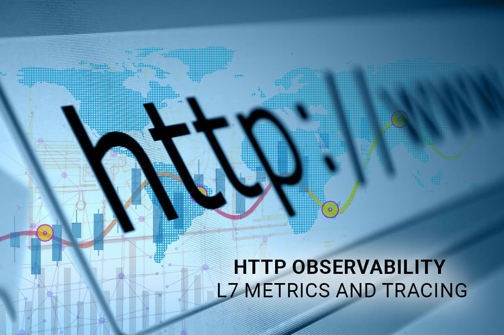

## 背景

Apache SkyWalking 是一个开源应用性能管理系统，帮助用户收集和聚合日志、追踪、指标和事件，并在 UI 上显示。在[上一篇文章](/zh/diagnose-service-mesh-network-performance-with-ebpf/)中，我们介绍了如何使用 Apache SkyWalking Rover 分析服务网格环境中的网络性能问题。但是，在商业场景中，用户通常依靠成熟的第 7 层协议（如 HTTP）来进行系统之间的交互。在本文中，我们将讨论如何使用 eBPF 技术来分析第 7 层协议的性能瓶颈，以及如何使用网络采样来增强追踪系统。

本文将演示如何使用 [Apache SkyWalking](https://github.com/apache/skywalking) 与 [eBPF](https://ebpf.io/what-is-ebpf/) 来增强 HTTP 可观察性中的指标和追踪。

## HTTP 协议分析

HTTP 是最常用的 7 层协议之一，通常用于为外部方提供服务和进行系统间通信。在下面的章节中，我们将展示如何识别和分析 HTTP/1.x 协议。

### 协议识别

在 HTTP/1.x 中，客户端和服务器通过两端的单个文件描述符（File Descriptor）进行通信。图 1 显示了涉及以下步骤的通信过程：

1. Connect/Accept：客户端与 HTTP 服务器建立连接，或者服务器接受客户端的连接。
2. Read/Write（多次）：客户端或服务器读取和写入 HTTPS 请求和响应。单个请求 - 响应对在每边的同一连接内发生。
3. Close：客户端和服务器关闭连接。

为了获取 HTTP 内容，必须从此过程的第二步读取它。根据 [RFC](http://rfc-editor.org/rfc/rfc2068.html) 定义，内容包含在 4 层协议的数据中，可以通过解析数据来获取。请求和响应对可以相关联，因为它们都在两端的同一连接内发生。


*图 1：HTTP 通信时间线。*

### HTTP 多路复用

[HTTP 多路复用（Pipelining）](https://en.wikipedia.org/wiki/HTTP_pipelining&sa=D&source=editors&ust=1672289009768584&usg=AOvVaw0wJkiaMGDCg4gWbj8zCd43)是 HTTP/1.1 的一个特性，允许在等待对应的响应的情况下在单个 TCP 连接上发送多个 HTTP 请求。这个特性很重要，因为它确保了服务器端的响应顺序必须与请求的顺序匹配。

图 2 说明了这是如何工作的，考虑以下情况：HTTP 客户端向服务器发送多个请求，服务器通过按照请求的顺序发送 HTTP 响应来响应。这意味着客户端发送的第一个请求将收到服务器的第一个响应，第二个请求将收到第二个响应，以此类推。

在设计 HTTP 解析时，我们应该遵循这个原则，将请求数据添加到列表中，并在解析响应时删除第一个项目。这可以确保响应按正确的顺序处理。

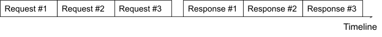

*图 2： HTTP/1.1 管道。*

### 指标

根据前文提到的 HTTP 内容和流程拓扑图的识别，我们可以将这两者结合起来生成进程间的指标数据。

图 3 显示了目前支持两个进程间分析的指标。基于 HTTP 请求和响应数据，可以分析以下数据：

| **指标名称**                   | 类型            | 单位 | 描述                             |
| ------------------------------ | --------------- | ---- | -------------------------------- |
| 请求 CPM（Call Per Minute）    | 计数器          | 计数 | HTTP 请求计数                    |
| 响应状态 CPM (Call Per Minute) | 计数器          | 计数 | 每个 HTTP 响应状态码的计数       |
| 请求包大小                     | 计数器 / 直方图 | 字节 | 请求包大小                       |
| 响应包大小                     | 计数器 / 直方图 | 字节 | 响应包大小                       |
| 客户端持续时间                 | 计数器 / 直方图 | 毫秒 | 客户端单个 HTTP 响应的持续时间   |
| 服务器持续时间                 | 计数器 / 直方图 | 毫秒 | 服务器端单个 HTTP 响应的持续时间 |

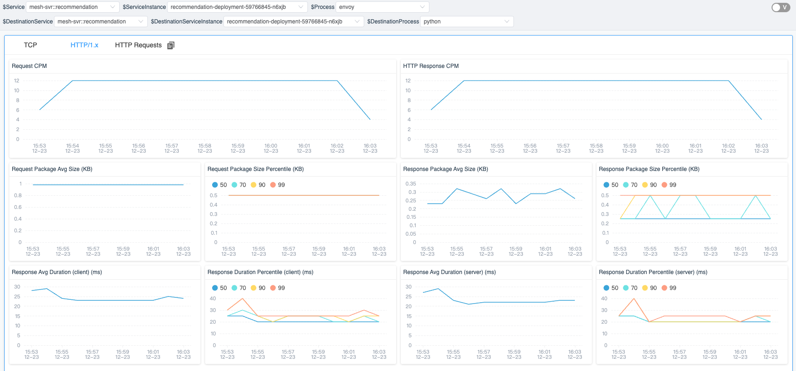

*图 3：进程到进程指标。*

## HTTP 和追踪

在 HTTP 过程中，如果我们能够从原始数据中解包 HTTP 请求和响应，就可以使用这些数据与现有的追踪系统进行关联。

### 追踪上下文标识

为了追踪多个服务之间的请求流，追踪系统通常在请求进入服务时创建追踪上下文，并在请求 - 响应过程中将其传递给其他服务。例如，当 HTTP 请求发送到另一个服务器时，追踪上下文包含在请求头中。

图 4 显示了 Wireshark 拦截的 HTTP 请求的原始内容。由 Zipkin Tracing 系统生成的追踪上下文信息可以通过头中的 “X-B3” 前缀进行标识。通过使用 eBPF 拦截 HTTP 头中的追踪上下文，可以将当前请求与追踪系统连接起来。

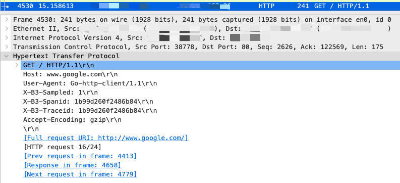

*图 4：Wireshark 中的 HTTP Header 视图。*

### Trace 事件

我们已经将事件这个概念加入了追踪中。事件可以附加到跨度上，并包含起始和结束时间、标签和摘要，允许我们将任何所需的信息附加到追踪中。 

在执行 eBPF 网络分析时，可以根据请求 - 响应数据生成两个事件。图 5 说明了在带分析的情况下执行 HTTP 请求时发生的情况。追踪系统生成追踪上下文信息并将其发送到请求中。当服务在内核中执行时，我们可以通过与内核空间中的请求 - 响应数据和执行时间交互，为相应的追踪跨度生成事件。

以前，我们只能观察用户空间的执行状态。现在，通过结合追踪和 eBPF 技术，我们还可以在内核空间获取更多关于当前追踪的信息，如果我们在追踪 SDK 和代理中执行类似的操作，将对目标服务的性能产生较小的影响。


*图 5：分析 HTTP 请求和响应的逻辑视图。*

### 抽样

该机制仅在满足特定条件时触发抽样。我们还提供了前 N 条追踪的列表，允许用户快速访问特定追踪的相关请求信息。为了帮助用户轻松识别和分析相关事件，我们提供了三种不同的抽样规则：

1. **慢速追踪**：当请求的响应时间超过指定阈值时触发抽样。
2. **响应状态 [400,500)**：当响应状态代码大于或等于 400 且小于 500 时触发抽样。
3. **响应状态 [500,600)**：当响应状态代码大于或等于 500 且小于 600 时触发抽样。

此外，我们认识到分析时可能并不需要所有请求或响应的原始数据。例如，当试图识别性能问题时，用户可能更感兴趣于请求数据，而在解决错误时，他们可能更感兴趣于响应数据。因此，我们还提供了请求或响应事件的配置选项，允许用户指定要抽样的数据类型。

## 服务网格中的分析

SkyWalking Rover 项目已经实现了 HTTP 协议的分析和追踪关联。当在服务网格环境中运行时它们的表现如何？

### 部署

图 6 演示了 SkyWalking 和 SkyWalking Rover 在服务网格环境中的部署方式。SkyWalking Rover 作为一个 DaemonSet 部署在每台服务所在的机器上，并与 SkyWalking 后端集群通信。它会自动识别机器上的服务并向 SkyWalking 后端集群报告元数据信息。当出现新的网络分析任务时，SkyWalking Rover 会感知该任务并对指定的进程进行分析，在最终将数据报告回 SkyWalking 后端服务之前，收集和聚合网络数据。


*图 6：服务网格中的 SkyWalking rover 部署拓扑。*

### 追踪系统

从版本 9.3.0 开始，SkyWalking 后端完全支持 Zipkin 服务器中的所有功能。因此，SkyWalking 后端可以收集来自 SkyWalking 和 Zipkin 协议的追踪。同样，SkyWalking Rover 可以在 SkyWalking 和 Zipkin 追踪系统中识别和分析追踪上下文。在接下来的两节中，网络分析结果将分别在 SkyWalking 和 Zipkin UI 中显示。

#### SkyWalking

当 SkyWalking 执行网络分析时，与[前文中](/zh/diagnose-service-mesh-network-performance-with-ebpf/)的 TCP 指标类似，SkyWalking UI 会首先显示进程间的拓扑图。当打开代表进程间流量指标的线的仪表板时，您可以在 “HTTP/1.x” 选项卡中看到 HTTP 流量的指标，并在 “HTTP Requests” 选项卡中看到带追踪的抽样的 HTTP 请求。

如图 7 所示，选项卡中有三个列表，每个列表对应事件抽样规则中的一个条件。每个列表显示符合预先规定条件的追踪。当您单击追踪列表中的一个项目时，就可以查看完整的追踪。

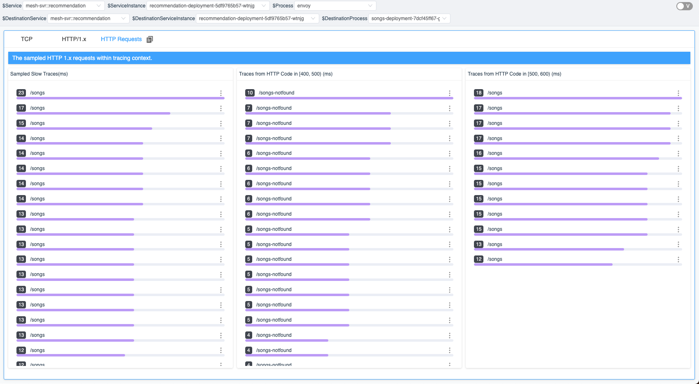

*图 7：Tracing 上下文中的采样 HTTP 请求。*

当您单击追踪列表中的一个项目时，就可以快速查看指定的追踪。在图 8 中，我们可以看到在当前的服务相关的跨度中，有一个带有数字的标签，表示与该追踪跨度相关的 HTTP 事件数。

由于我们在服务网格环境中，每个服务都涉及与 Envoy 交互。因此，当前的跨度包括 Envoy 的请求和响应信息。此外，由于当前的服务有传入和传出的请求，因此相应的跨度中有事件。


*图 8：Tracing 详细信息中的事件。*

当单击跨度时，将显示跨度的详细信息。如果当前跨度中有事件，则相关事件信息将在时间轴上显示。如图 9 所示，当前跨度中一共有 6 个相关事件。每个事件代表一个 HTTP 请求 / 响应的数据样本。其中一个事件跨越多个时间范围，表示较长的系统调用时间。这可能是由于系统调用被阻塞，具体取决于不同语言中的 HTTP 请求的实现细节。这也可以帮助我们查询错误的可能原因。

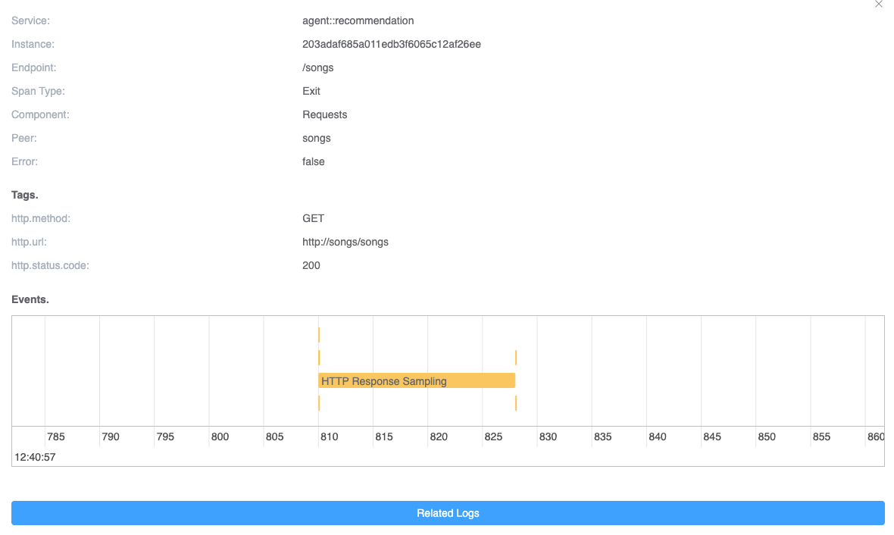

*图 9：一个 Tracing 范围内的事件。*

最后，我们可以单击特定的事件查看它的完整信息。如图 10 所示，它显示了一个请求的抽样信息，包括从 HTTP 原始数据中的请求头中包含的 SkyWalking 追踪上下文协议。原始请求数据允许您快速重新请求以解决任何问题。

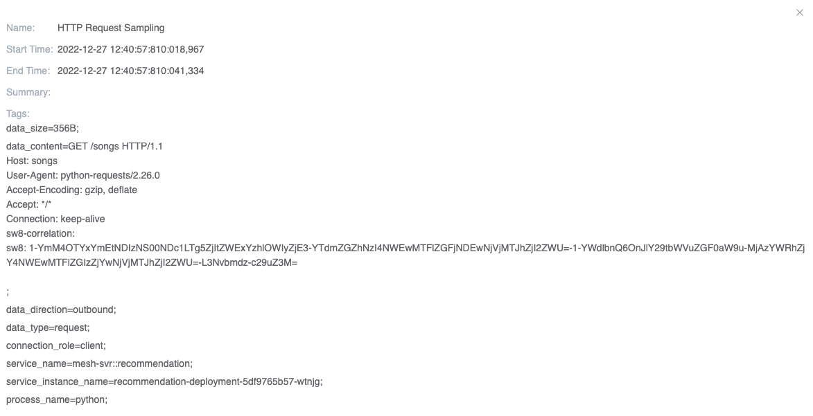

*图 10：事件的详细信息。*

#### Zipkin

Zipkin 是世界上广泛使用的分布式追踪系统。SkyWalking 可以作为[替代服务器](https://zipkin.io/pages/extensions_choices.html)，提供高级功能。在这里，我们使用这种方式将功能无缝集成到 Zipkin 生态系统中。新事件也将被视为 Zipkin 的标签和注释的一种。

为 Zipkin 跨度添加事件，需要执行以下操作：

1. 将每个事件的开始时间和结束时间分别拆分为两个具有规范名称的注释。
2. 将抽样的 HTTP 原始数据从事件添加到 Zipkin 跨度标签中，使用相同的事件名称用于相应的目的。

图 11 和图 12 显示了同一跨度中的注释和标签。在这些图中，我们可以看到跨度包含至少两个具有相同事件名称和序列后缀的事件（例如，图中的 “Start/Finished HTTP Request/Response Sampling-x”）。这两个事件均具有单独的时间戳，用于表示其在跨度内的相对时间。在标签中，对应事件的数据内容分别由事件名称和序列号表示。

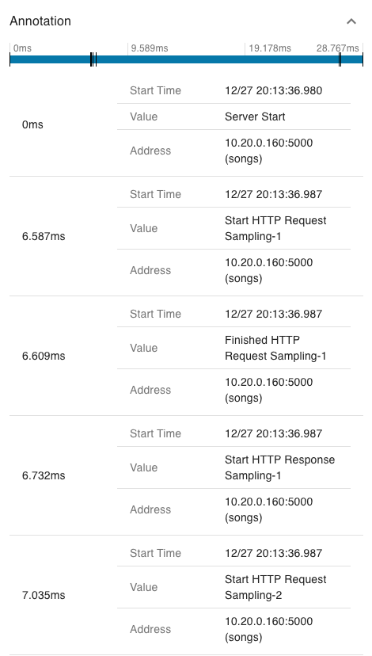

*图 11：Zipkin span 注释中的事件时间戳。*

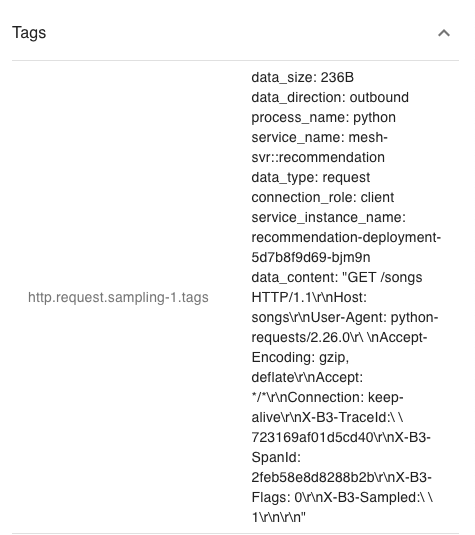

*图 12：Zipkin span 标签中的事件原始数据。*

## 演示

在本节中，我们将演示如何在服务网格中执行网络分析，并完成指标收集和 HTTP 原始数据抽样。要进行操作，您需要一个运行中的 Kubernetes 环境。

### 部署 SkyWalking Showcase

SkyWalking Showcase 包含一套完整的示例服务，可以使用 SkyWalking 进行监控。有关详细信息，请参阅[官方文档](https://skywalking.apache.org/docs/skywalking-showcase/next/readme/)。

在本演示中，我们只部署了服务、最新发布的 SkyWalking OAP 和 UI。

```bash
export SW_OAP_IMAGE=apache/skywalking-oap-server:9.3.0
export SW_UI_IMAGE=apache/skywalking-ui:9.3.0
export SW_ROVER_IMAGE=apache/skywalking-rover:0.4.0

export FEATURE_FLAGS=mesh-with-agent,single-node,elasticsearch,rover
make deploy.kubernetes
```

部署完成后，运行下面的脚本启动 SkyWalking UI：<http://localhost:8080/>。

```bash
kubectl port-forward svc/ui 8080:8080 --namespace default
```

### 启动网络分析任务

目前，我们可以通过单击服务网格面板中的 **Data Plane** 项和 **Kubernetes** 面板中的 **Service** 项来选择要监视的特定实例。

在图 13 中，我们已在网络分析选项卡中选择了一个具有任务列表的实例。

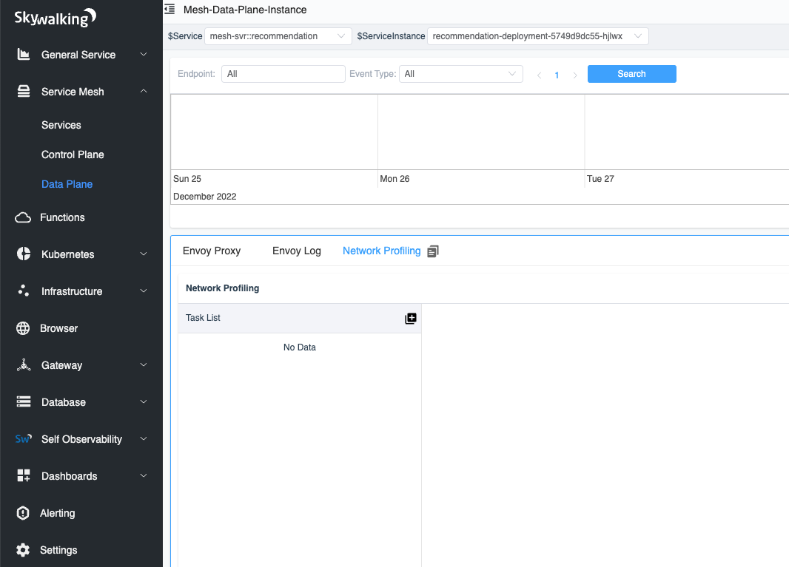

*图 13：数据平面中的网络分析选项卡。*

当我们单击 “开始” 按钮时，如图 14 所示，我们需要为分析任务指定抽样规则。抽样规则由一个或多个规则组成，每个规则都由不同的 URI 正则表达式区分。当 HTTP 请求的 URI 与正则表达式匹配时，将使用该规则。如果 URI 正则表达式为空，则使用默认规则。使用多个规则可以帮助我们为不同的请求配置不同的抽样配置。

每个规则都有三个参数来确定是否需要抽样：

1. **最小请求持续时间（毫秒）**：响应时间超过指定时间的请求将被抽样。
2. **在 400 和 499 之间的抽样响应状态代码**：范围 [400-499) 中的所有状态代码将被抽样。
3. **在 500 和 599 之间的抽样响应状态代码**：范围 [500-599) 中的所有状态码将被抽样。

抽样配置完成后，我们就可以创建任务了。

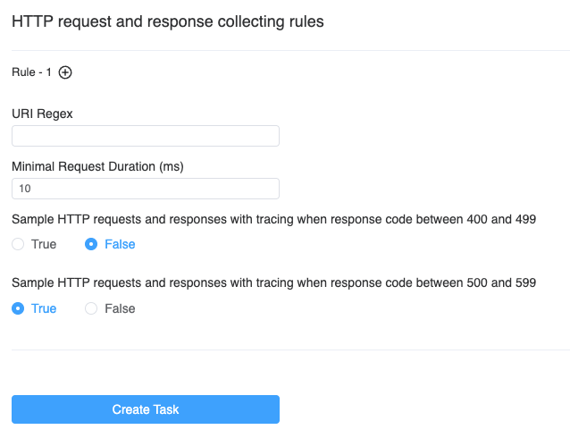

*图 14：创建网络分析任务页面。*

### 完成

几秒钟后，你会看到页面的右侧出现进程拓扑结构。

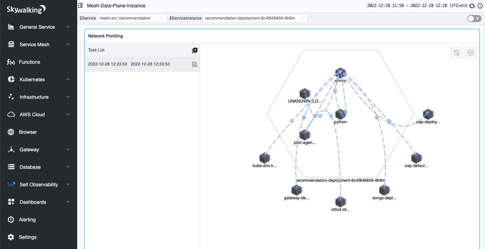

*图 15：网络分析任务中的流程拓扑。*

当您单击进程之间的线时，您可以查看两个过程之间的数据，它被分为三个选项卡：

1. **TCP**：显示与 TCP 相关的指标。
2. **HTTP/1.x**：显示 HTTP 1 协议中的指标。
3. **HTTP 请求**：显示已分析的请求，并根据抽样规则保存到列表中。

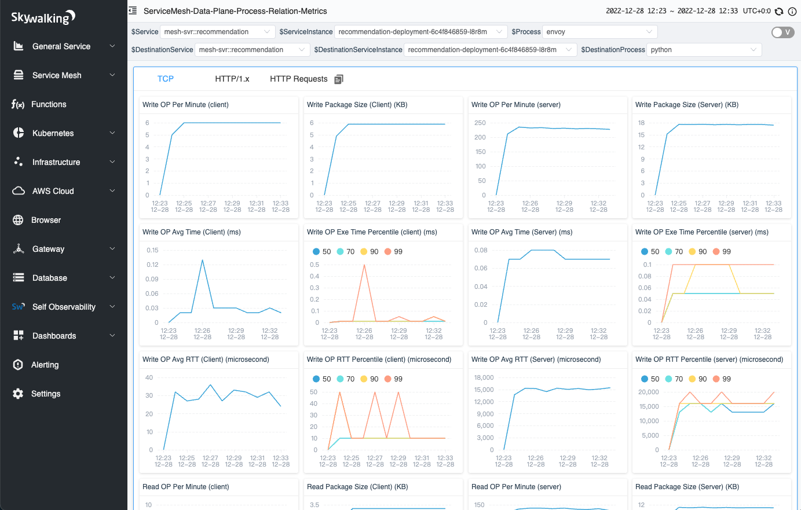

*图 16：网络分析任务中的 TCP 指标。*

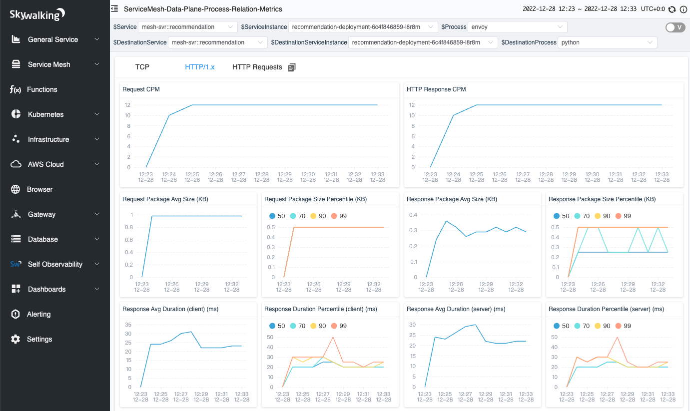

*图 17：网络分析任务中的 HTTP/1.x 指标。*

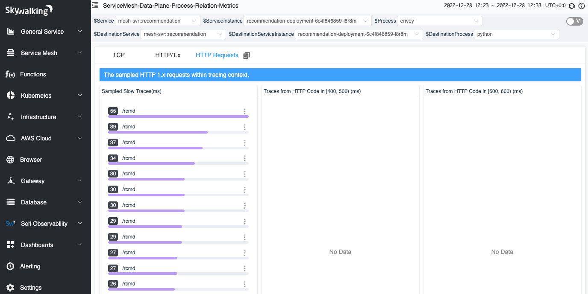

*图 18：网络分析任务中的 HTTP 采样请求。*

## 总结

在本文中，我们详细介绍了如何在网络分析中分析 7 层 HTTP/1.x 协议，以及如何将其与现有追踪系统相关联。这使我们能够将我们能够观察到的数据从用户空间扩展到内核空间数据。

在未来，我们将进一步探究内核数据的分析，例如收集 TCP 包大小、传输频率、网卡等信息，并从另一个角度提升分布式追踪。

## 其他资源

1. [SkyWalking Github Repo ›](https://github.com/apache/skywalking)
2. [SkyWalking Rover Github Repo ›](https://github.com/apache/skywalking-rover)
3. [SkyWalking Rover Documentation ›](https://skywalking.apache.org/docs/skywalking-rover/v0.3.0/readme/)
4. [Diagnose Service Mesh Network Performance with eBPF blog post >](https://skywalking.apache.org/blog/diagnose-service-mesh-network-performance-with-ebpf/)
5. [SkyWalking Profiling Documentation >](https://skywalking.apache.org/docs/main/next/en/concepts-and-designs/profiling/)
6. [SkyWalking Trace Context Propagation >](https://skywalking.apache.org/docs/main/next/en/api/x-process-propagation-headers-v3/)
7. [Zipkin Trace Context Propagation >](https://github.com/openzipkin/b3-propagation)
8. [RFC - Hypertext Transfer Protocol – HTTP/1.1 >](https://www.rfc-editor.org/rfc/rfc2068.html)
