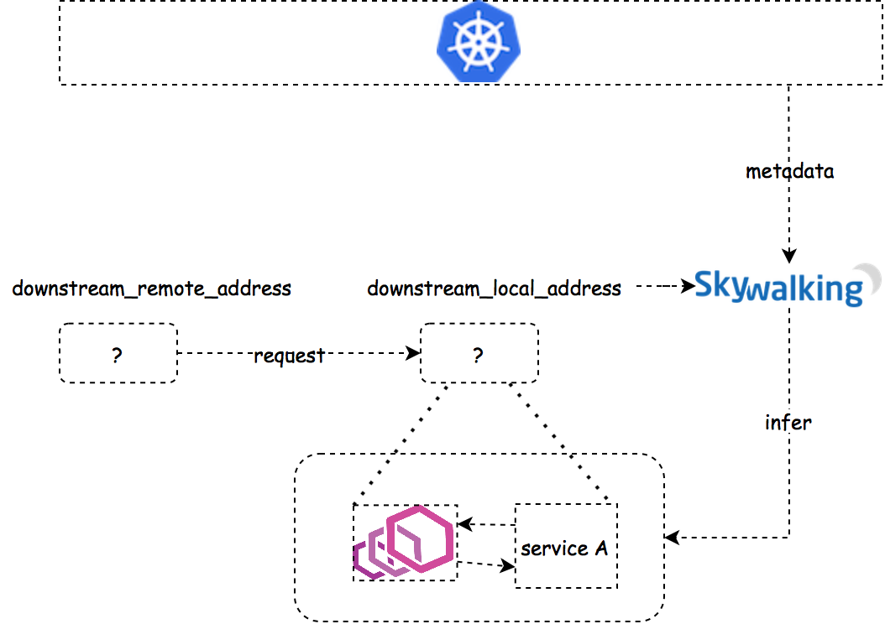
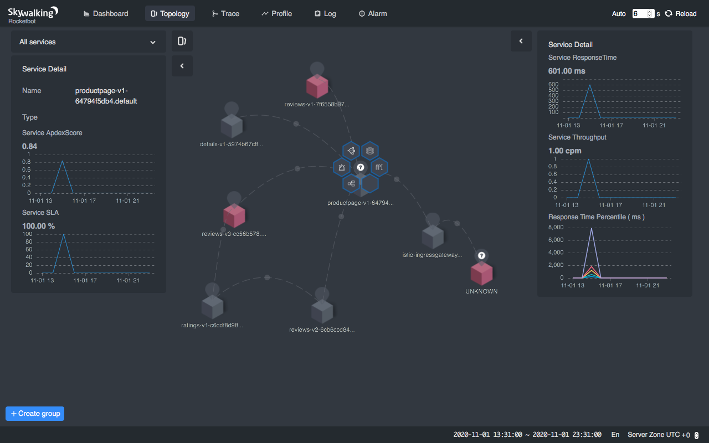
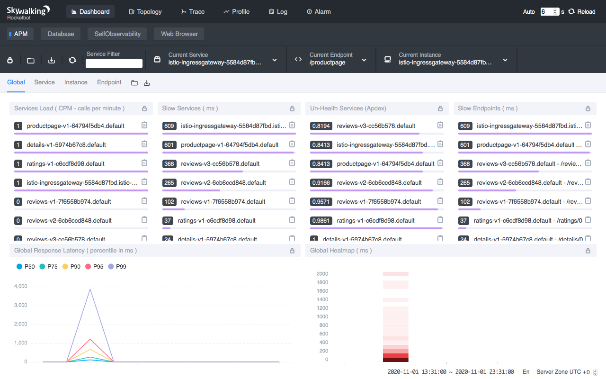

> **如果你正在寻找在 Mixer 方案以外观察服务网格的更优解，本文正符合你的需要。**

**[Apache Skywalking](https://github.com/apache/skywalking)**︰特别为微服务、云原生和容器化（Docker、Kubernetes、Mesos）架构而设计的 APM（应用性能监控）系统。

**[Envoy 访问日志服务](https://www.envoyproxy.io/docs/envoy/latest/api-v2/service/accesslog/v2/als.proto)**︰访问日志服务（ALS）是 Envoy 的扩展组件，会将所有通过 Envoy 的请求的详细访问日志发送出来。

## 背景

Apache SkyWalking 一直通过 Istio Mixer 的适配器，支持服务网格的可观察性。不过自从 v1.5 版本，由于 Mixer 在大型集群中差强人意的表现，Istio 开始弃用 Mixer。Mixer 的功能现已迁至 Envoy 代理，并获 Istio 1.7 版本支持。

在去年的中国 [KubeCon](https://kccncosschn19eng.sched.com/event/NroB/observability-in-service-mesh-powered-by-envoy-and-apache-skywalking-sheng-wu-lizan-zhou-tetrate) 中，[吴晟](https://github.com/wu-sheng)和[周礼赞](https://github.com/lizan)基于 Apache SkyWalking 和 Envoy ALS，发布了新的方案：不再受制于 Mixer  带来的性能影响，也同时保持服务网格中同等的可观察性。这个方案最初是由吴晟、[高洪涛](https://github.com/hanahmily)、周礼赞和 [Dhi Aurrahman](https://github.com/dio) 在 Tetrate.io 实现的。

如果你正在寻找在 Mixer 方案之外，为你的服务网格进行观察的最优解，本文正是你当前所需的。在这个教程中，我们会解释此方案的运作逻辑，并将它实践到 bookinfo 应用上。

### 运作逻辑

从可观察性的角度来说，Envoy 一般有两种部署模式︰Sidecar 和路由模式。 Envoy 代理可以代表多项服务（见下图之 1），或者当它作为 Sidecar 时，一般是代表接收和发送请求的单项服务（下图之 2 和 3）。


在两种模式中，ALS 发放的日志都会带有一个节点标记符。该标记符在路由模式时，以 `router~` （或 `ingress~`）开头，而在 Sidecar 代理模式时，则以 `sidecar~` 开头。

除了节点标记符之外，这个方案［1］所采用的访问日志也有几个值得一提的字段︰

**downstream_direct_remote_address**︰此字段是下游的**直接远程地址**，用作接收来自用户的请求。**注意**︰它永远是对端实体的地址，即使远程地址是从 `x-forwarded-for header`、代理协议等推断出来的。

**downstream_remote_address**︰远程或原始地址，用作接收来自用户的请求。

**downstream_local_address**︰本地或目标地址，用作接收来自用户的请求。

**upstream_remote_address**︰上游的远程或目标地址，用作处理本次交换。

**upstream_local_address**︰上游的本地或原始地址，用作处理本次交换。

**upstream_cluster**︰**upstream_remote_address** 所属的上游集群。

我们会在下面详细讲解各个字段。

### Sidecar

当 Envoy 作为 Sidecar 的时候，会搭配服务一起部署，并代理来往服务的传入或传出请求。

1. **代理传入请求**︰在此情况下，Envoy 会作为服务器端的 Sidecar，以 `inbound|portNumber|portName|Hostname[or]SidecarScopeID` 格式设定 `upstream_cluster`。

    

    SkyWalking 分析器会检查 `downstream_remote_address` 是否能够找到对应的 Kubernetes 服务。

    如果在此 IP（和端口）中有一个服务（例如服务 B）正在运行，那我们就会建立起服务对服务的关系（即服务 B → 服务 A），帮助建立拓扑。再配合访问日志中的 `start_time` 和 `duration` 两个字段，我们就可以获得延迟的指标数据了。
    
    如果没有任何服务可以和 `downstream_remote_address` 相对应，那请求就有可能来自网格以外的服务。由于 SkyWalking 无法识别请求的服务来源，在没有源服务的情况下，它简单地根据[拓扑分析方法](https://wu-sheng.github.io/STAM/)生成数据。拓扑依然可以准确地建立，而从服务器端侦测出来的指标数据也依然是正确的。

2. **代理传出请求**︰在此情况下，Envoy 会作为客户端的 Sidecar，以 `outbound|<port>|<subset>|<serviceFQDN>` 格式设定 `upstream_cluster`。

    

    客户端的侦测相对来说比代理传入请求容易。如果 `upstream_remote_address` 是另一个 Sidecar 或代理的话，我们只需要获得它相应的服务名称，便可生成拓扑和指标数据。否则，我们没有办法理解它，只能把它当作 UNKNOWN 服务。

### 代理角色
当 Envoy 被部署为前端代理时，它是独立的服务，并不会像 Sidecar 一样，代表任何其他的服务。所以，我们可以建立客户端以及服务器端的指标数据。


## 演示范例
在本章，我们会使用典型的 bookinfo 应用，来演示 Apache SkyWalking 8.3.0+ （截至 2020 年 11 月 30 日的最新版本）如何与 Envoy ALS 合作，联手观察服务网格。

### 安装 Kubernetes
在 Kubernetes 和虚拟机器（VM）的环境下，SkyWalking 8.3.0 均支持 Envoy ALS 的方案。在本教程中，我们只会演示在 Kubernetes 的情境，至于 VM 方案，请耐心期待我们下一篇文章。所以在进行下一步之前，我们需要先安装 Kubernetes。

在本教程中，我们会使用 [Minikube](https://minikube.sigs.k8s.io/docs/) 工具来快速设立本地的 Kubernetes（v1.17 版本）集群用作测试。要运行所有必要组件，包括 bookinfo 应用、SkyWalking OAP 和 WebUI，集群需要动用至少 4GB 内存和 2 个 CPU 的核心。

```shell

minikube start --memory=4096 --cpus=2
```

然后，运行 `kubectl get pods --namespace=kube-system --watch`，检查所有 Kubernetes 的组件是否已准备好。如果还没，在进行下一步前，请耐心等待准备就绪。

### 安装 Istio

Istio 为配置 Envoy 代理和实现访问日志服务提供了一个非常方便的方案。内建的配置设定档为我们省去了不少手动的操作。所以，考虑到演示的目的，我们会在本教程全程使用 Istio。

```shell

export ISTIO_VERSION=1.7.1

curl -L https://istio.io/downloadIstio | sh - 

sudo mv $PWD/istio-$ISTIO_VERSION/bin/istioctl /usr/local/bin/

istioctl  install --set profile=demo

kubectl label namespace default istio-injection=enabled
```

然后，运行 `kubectl get pods --namespace=istio-system --watch`，检查 Istio 的所有组件是否已准备好。如果还没，在进行下一步前，请耐心等待准备就绪。

### 启动访问日志服务

演示的设定档没有预设启动 ALS，我们需要重新配置才能够启动 ALS。

```shell

istioctl  manifest install \

        --set meshConfig.enableEnvoyAccessLogService=true \

        --set meshConfig.defaultConfig.envoyAccessLogService.address=skywalking-oap.istio-system:11800
```

范例指令 `--set meshConfig.enableEnvoyAccessLogService=true` 会在网格中启动访问日志服务。正如之前提到，ALS 本质上是一个会发放请求日志的 gRPC 服务。配置 `meshConfig.defaultConfig.envoyAccessLogService.address=skywalking-oap.istio-system:11800` 会告诉这个gRPC 服务往哪里发送日志，这里是往 `skywalking-oap.istio-system:11800` 发送，稍后我们会部署 SkyWalking ALS 接收器到这个地址。

**注意**︰

你也可以在安装 Istio 时启动 ALS，那就不需要在安装后重新启动 Istio︰

```shell

istioctl install --set profile=demo \

               --set meshConfig.enableEnvoyAccessLogService=true \

               --set meshConfig.defaultConfig.envoyAccessLogService.address=skywalking-oap.istio-system:11800

kubectl label namespace default istio-injection=enabled
```

### 部署 Apache SkyWalking

SkyWalking 社区提供了 Helm Chart ，让你更轻易地在 Kubernetes 中部署 SkyWalking 以及其依赖服务。 Helm Chart 可以在 [GitHub 仓库](https://github.com/apache/skywalking-kubernetes)找到。

```shell

# Install Helm

curl -sSLO https://get.helm.sh/helm-v3.0.0-linux-amd64.tar.gz

sudo tar xz -C /usr/local/bin --strip-components=1 linux-amd64/helm -f helm-v3.0.0-linux-amd64.tar.gz

# Clone SkyWalking Helm Chart

git clone https://github.com/apache/skywalking-kubernetes

cd skywalking-kubernetes/chart

git reset --hard dd749f25913830c47a97430618cefc4167612e75

# Update dependencies

helm dep up skywalking

# Deploy SkyWalking

helm -n istio-system install skywalking skywalking \

        --set oap.storageType='h2'\

        --set ui.image.tag=8.3.0 \

        --set oap.image.tag=8.3.0-es7 \

        --set oap.replicas=1 \

        --set oap.env.SW_ENVOY_METRIC_ALS_HTTP_ANALYSIS=k8s-mesh \

        --set oap.env.JAVA_OPTS='-Dmode=' \

        --set oap.envoy.als.enabled=true \

        --set elasticsearch.enabled=false
```

我们在 `istio-system` 的命名空间内部署 SkyWalking，使 SkyWalking OAP 服务可以使用地址 `skywalking-oap.istio-system:11800` 访问，在上一步中，我们曾告诉过 ALS 应往此处发放它们的日志。

我们也在 SkyWalking OAP 中启动 ALS 分析器︰`oap.env.SW_ENVOY_METRIC_ALS_HTTP_ANALYSIS=k8s-mesh`。分析器会对访问日志进行分析，并解析日志中的 IP 地址和 Kubernetes 中的真实服务名称，以建立拓扑。

为了从 Kubernetes 集群处获取元数据（例如 Pod IP 和服务名称），以识别相应的 IP 地址，我们还会设定 `oap.envoy.als.enabled=true`，用来申请一个对元数据有访问权的 `ClusterRole`。

```shell

export POD_NAME=$(kubectl get pods -A -l "app=skywalking,release=skywalking,component=ui" -o name)

echo $POD_NAME

kubectl -n istio-system port-forward $POD_NAME 8080:8080
```

现在到你的浏览器上访问 [http://localhost:8080](http://localhost:8080/)。你应该会看到 SkyWalking 的 Dashboard。 Dashboard 现在应该是空的，但稍后部署应用和生成流量后，它就会被填满。


### 部署 Bookinfo 应用

运行︰

```shell

export ISTIO_VERSION=1.7.1

kubectl apply -f https://raw.githubusercontent.com/istio/istio/$ISTIO_VERSION/samples/bookinfo/platform/kube/bookinfo.yaml

kubectl apply -f https://raw.githubusercontent.com/istio/istio/$ISTIO_VERSION/samples/bookinfo/networking/bookinfo-gateway.yaml

kubectl wait --for=condition=Ready pods --all --timeout=1200s

minikube tunnel
```

现在到你的浏览器上进入 [http://localhost/productpage](http://localhost/productpage)。你应该会看到典型的 bookinfo 应用画面。重新整理该页面几次，以生成足够的访问日志。

### 完成了！

这样做，你就成功完成设置了！再查看 SkyWalking 的 WebUI，你应该会看到 bookinfo 应用的拓扑，以及它每一个单独服务的指标数据。




### 疑难解答

- 检查所有 pod 的状态︰`kubectl get pods -A`。
- SkyWalking OAP 的日志︰`kubectl -n istio-system logs -f $(kubectl get pod -A -l "app=skywalking,release=skywalking,component=oap" -o name)`。
- SkyWalking WebUI 的日志︰`kubectl -n istio-system logs -f $(kubectl get pod -A -l "app=skywalking,release=skywalking,component=ui" -o name)`。
- 确保 WebUI 右下方的时区设定在 `UTC +0`。

## 自定义服务器名称

SkyWalking 社区在 ALS 方案的 8.3.0 版本中，作出了许多改善。你现在可以在映射 IP 地址时，决定如何用 `service` 和 `pod` 变量去自定义服务器的名称。例如，将 `K8S_SERVICE_NAME_RULE` 设置为 `${service.metadata.name}-${pod.metadata.labels.version}`，就可以使服务名称带上版本的标签，类似 `reviews-v1`、`reviews-v2` 和 `reviews- v3`，而不再是单个服务 `review`［2］。

## 在 VM 上使用 ALS

Kubernetes 很受欢迎，可是 VM 呢？正如我们之前所说，为了替 IP 找到对应的服务，SkyWalking 需要对 Kubernetes 集群有访问权，以获得服务的元数据和 Pod 的 IP。可是在 VM 环境中，我们并没有来源去收集这些元数据。

在下一篇文章，我们会介绍另外一个 ALS 分析器，它是建立于 Envoy 的元数据交换机制。有了这个分析器，你就可以在 VM 环境中观察服务网格了。万勿错过！

如果你希望在 ALS 方案或是混合式网格可观察性上获得商业支持，[TSB](https://www.tetrate.io/tetrate-service-bridge/) 会是一个好选项。

额外资源

- KubeCon 2019 的录影[视频](https://www.youtube.com/watch?v=tERm39ju9ew)。
- 在[官方网站](https://skywalking.apache.org/)上获得更多有关 SkyWalking 的最新消息吧。

如有任何问题或反馈，发送邮件至 learn@tetrate.io。

_Apache SkyWalking 创始人吴晟和 SkyWalking 的核心贡献者柯振旭都是 Tetrate 的工程师。 Tetrate 的内容创造者编辑与贡献于本文章。 Tetrate 帮助企业采用开源服务网格工具，包括 Istio、Envoy 和 Apache SkyWalking，让它们轻松管理微服务，在任何架构上运行服务网格，以至现代化他们的应用。_

［1］[https://github.com/envoyproxy/envoy/blob/549164c42cae84b59154ca4c36009e408aa10b52/generated_api_shadow/envoy/data/accesslog/v2/accesslog.proto](https://github.com/envoyproxy/envoy/blob/549164c42cae84b59154ca4c36009e408aa10b52/generated_api_shadow/envoy/data/accesslog/v2/accesslog.proto)

［2］[https://github.com/apache/skywalking/pull/5722](https://github.com/apache/skywalking/pull/5722)
