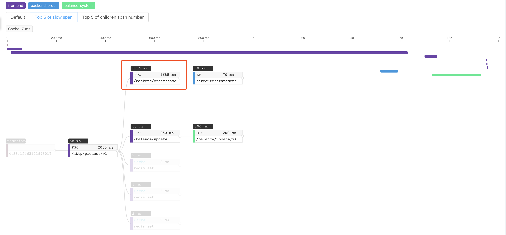
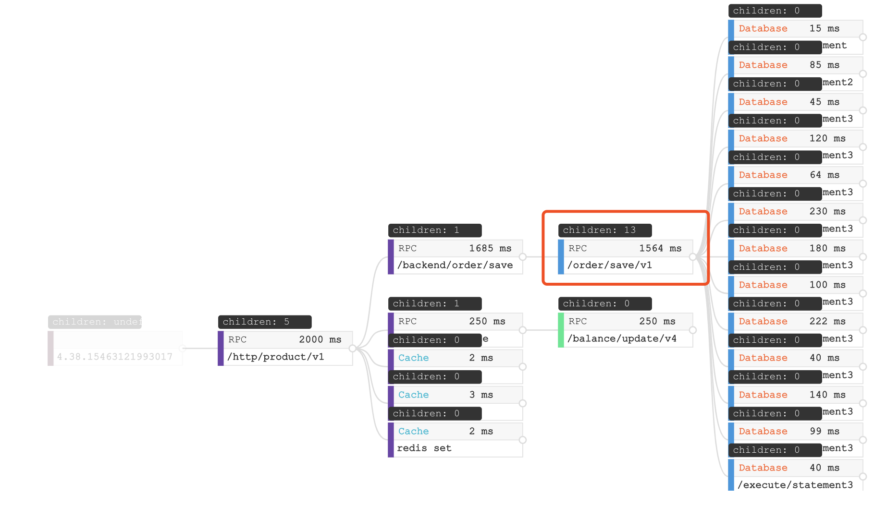
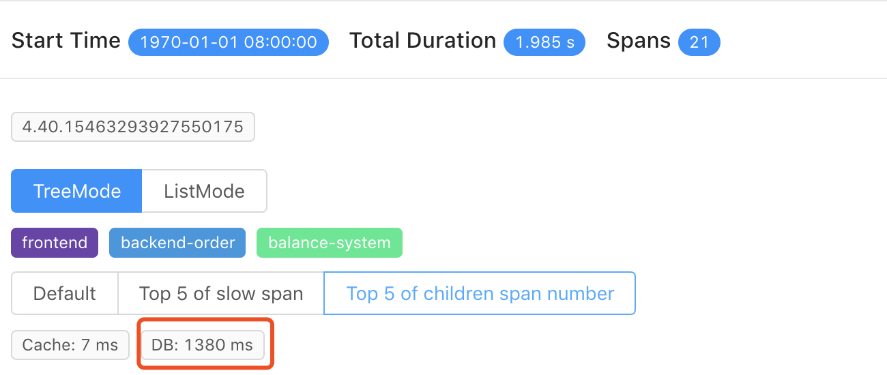

# Understand distributed trace better

- Auther: Wu Sheng, tetrate, SkyWalking original creator
- [GitHub](https://github.com/wu-sheng), [Linkedin](https://www.linkedin.com/in/wusheng1108)

Jan. 1st, 2019

# Background
In modern microservices architecture, distributed tracing is being treated
as a neccesary system. But how to use distributed tracing data, how to understand
the trace data, are not very clear to some end users.
In this blog, I am going to use some typical scenarios, help
the new user to understand the trace,
through the incoming new visualization features in SkyWalking 6.0.0 GA.

# Metric and topology
Through trace data, you could have these two obvious and well knwon features, **metric**
and **topology**.

**Metric** of each service, service instance, endpoint are able to be calculated by
entry spans in trace, which represent each time access performance. So, you could
have average response time, 99% response time, successful rate... indicators
for the service, service instance, endpoint.

**Topology** is the most attractive feature, when people meet distributed tracing system,
besides tracing itself. The reason people think the topology so important is that,
in a distributed enviroment service relationships and dependencies are impossible known,
even for the developer, designer or operate team. Like the following graph, it gives
a clear view of 4 projects, kafka and two outside dependencies.

# Trace
In a distributed tracing system, we spend a lot of resources(CPU, Memory, Disk and Network)
to generate, transport and persistent trace data.

Then what are the typical scenarios
of use trace data to diagnose system performance issue?

Because we dive in, from SkyWalking v6.0.0-GA, it includes two trace views.
1. TreeMode. The first time provided. Help you easier to identify issues.
1. ListMode. Tranditional view in long time, also usually seen in other tracing system, such as Zipkin.

## Error occurred
In the trace view, the easiest part is locating the error, which may be caused by
code exception or network. Go into the span detail, you will easier to find out.
No matter in ListMode or TreeMode.

-ListMode error span-

-TreeMode error span-

## Slow span
In spans, we have known, all of them includes their execution duration, so identify
the slowest spans is the high priority jobs when read the trace.
In old ListMode trace view, parent span always includes the child spans duration in most cases,
because the child span is executed nested inside parent span. Then when a slow span happens,
nearly all of its parent spans become slow span too.
In SkyWalking 6-GA,
we provide `Top 5 of slow span` filter to help you locate the spans directly.

-Top 5 slow span-

In the above demo screenshot, the UI highlights the top 5 slow spans, which already excludes
the child span duration. Also show all span's self execution time. You could find the slowest spans
very easily.

## Too many child spans
In some cases, single one time access is quick enough,
but still cause the trace very slow, like this one.

-Trace with no slow span-

But we still need to know why trace is slow. In this case, you could use `Top 5 of children span number`
filter to find out, whether too many children spans in each span.

-13 database accesses of a span-

In this screenshot, there is a span with 13 children span, which are all Database accesses. Also, when
you see overview of trace, database cost 1380ms of this 2000ms trace.

-1380ms database accesses-

Through these steps, this trace root cause is doing too many database accesses. This kind of root cause
also happens in too many RPCs and cache accesses.

## Trace depth
Trace depth is also
