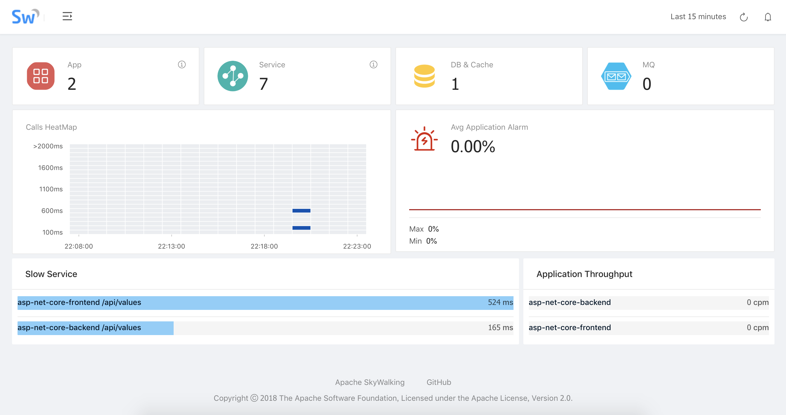
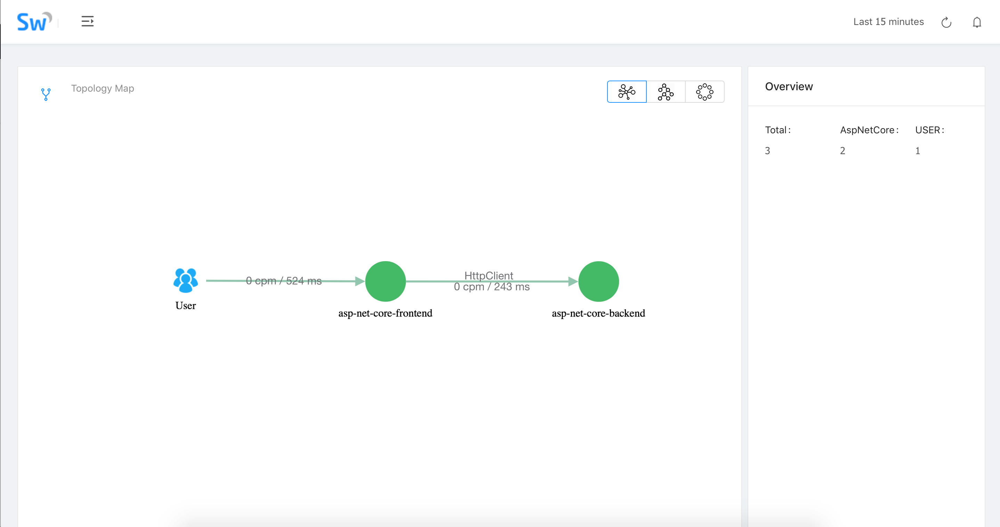
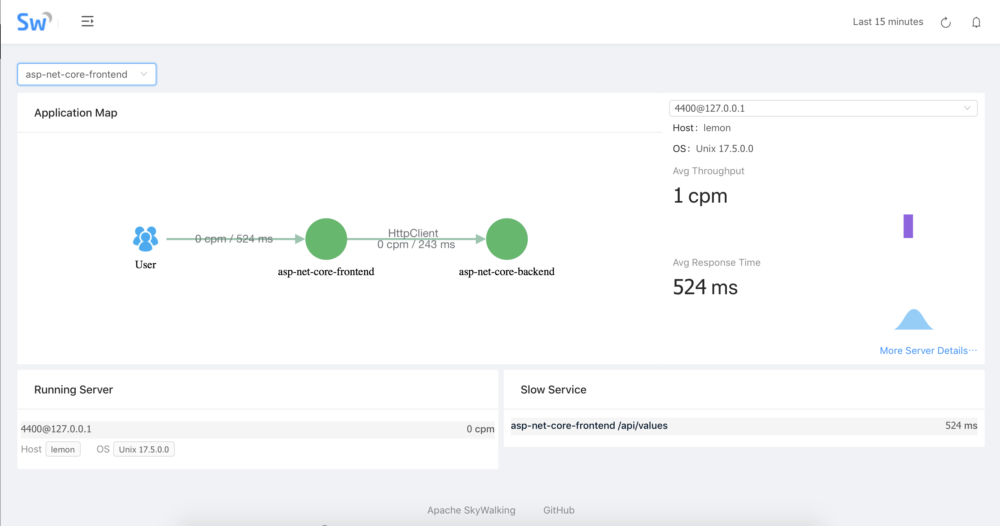
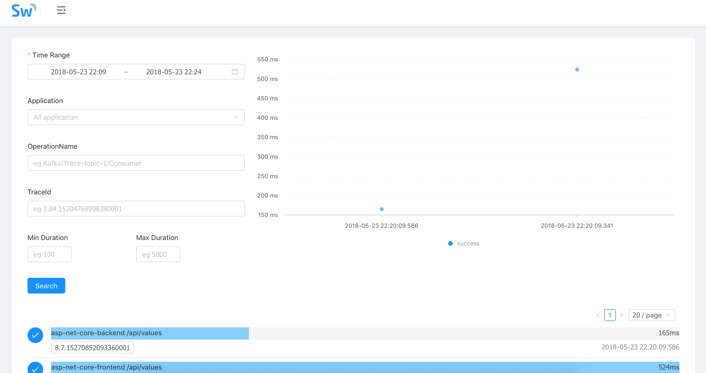
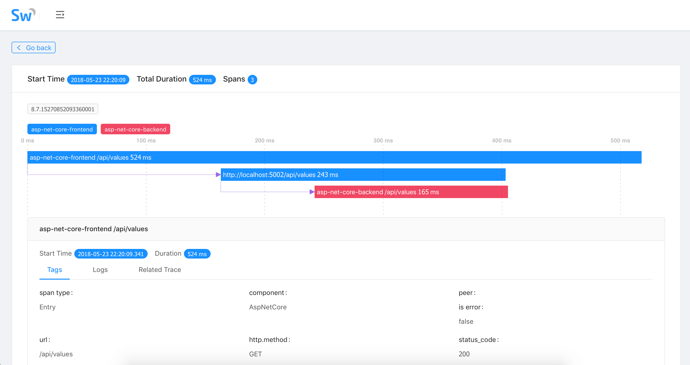

#  Apache SkyWalking 为.NET Core带来开箱即用的分布式追踪和应用性能监控

作者： SkyWalking .NET Core 探针维护者，刘浩扬

在大型网站系统设计中，随着分布式架构，特别是微服务架构的流行，我们将系统解耦成更小的单元，通过不断的添加新的、小的模块或者重用已经有的模块来构建复杂的系统。随着模块的不断增多，一次请求可能会涉及到十几个甚至几十个服务的协同处理，那么如何准确快速的定位到线上故障和性能瓶颈，便成为我们不得不面对的棘手问题。

<!-- more -->  

为解决分布式架构中复杂的服务定位和性能问题，Google在论文[《Dapper, a Large-Scale Distributed Systems Tracing Infrastructure》](http://research.google.com/pubs/pub36356.html)中提出了分布式跟踪系统的设计和构建思路。在这样的背景下，[Apache SkyWalking](https://github.com/apache/incubator-skywalking)创建于2015年，参考Dapper论文实现分布式追踪功能，并逐渐进化为一个完整功能的[Application Performance Management](https://en.wikipedia.org/wiki/Application_performance_management)系统，用于追踪、监控和诊断大型分布式系统，尤其是容器和云原生下的微服务系统。

今年初我在尝试使用.NET Core构建分布式追踪系统[Butterfly](https://github.com/liuhaoyang/butterfly)时接触到SkyWalking团队，开始和SkyWalking团队合作探索SkyWalking对.NET Core的支持，并于4月发布SkyWalking .NET Core探针的[第一个版本](https://www.oschina.net/news/95324/apache-skywalking-apm-support-dot-net-core)，同时我也有幸加入SkyWalking团队共同进行SkyWalking在多语言生态的推动。在.NET Core探针v0.1版本发布之后，得到了一些同学的[尝鲜使用](https://www.jianshu.com/p/3ddd986c7581)，也得到诸多改进的建议。经过几周的迭代，SkyWalking .NET Core探针于今天发布v0.2 release，在v0.1的基础上增加了稳定性和HttpClient及数据库驱动的追踪支持。

在使用SkyWalking对.NET Core应用追踪之前，我们需要先部署SkyWalking Collector收集分析Trace和Elasticsearch作为Trace数据存储。SkyWalking支持5.x的ES，所以我们需要下载安装对应版本的ES，并配置ES的`cluster.name`为`CollectorDBCluster`。然后部署SkyWalking 5.0 beta或更高版本(下载地址:[http://skywalking.apache.org/downloads/](http://skywalking.apache.org/downloads/))。更详细的Collector部署文档，请参考[Deploy-backend-in-standalone-mode](https://github.com/apache/incubator-skywalking/blob/master/docs/en/Deploy-backend-in-standalone-mode.md)和[Deploy-backend-in-cluster-mode](https://github.com/apache/incubator-skywalking/blob/master/docs/en/Deploy-backend-in-cluster-mode.md)。

最后我们使用示例项目来演示在.NET Core应用中使用SkyWalking进行追踪和监控，克隆SkyWalking-NetCore项目到本地 

```
git clone https://github.com/OpenSkywalking/skywalking-netcore.git
```

进入skywalking-netcore目录 

```
cd skywalking-netcore
```

还原nuget package:

```
dotnet restore
```   

启动示例项目:

```
dotnet run -p sample/SkyWalking.Sample.Backend
dotnet run -p sample/SkyWalking.Sample.Frontend
```

访问示例应用 [http://localhost:5001/api/values](http://localhost:5001/apivalues)  
打开SkyWalking WebUI即可看到我们的应用监控面板 [http://localhost:8080](http://localhost:8080)  


Dashboard视图


TopologyMap视图


Application视图


Trace视图


TraceDetails视图



##### Github
1. SkyWalking Github Repo: [https://github.com/apache/incubator-skywalking](https://github.com/apache/incubator-skywalking/)
2. SkyWalking-NetCore Github Repo: [https://github.com/OpenSkywalking/skywalking-netcore](https://github.com/OpenSkywalking/skywalking-netcore)