#  Apache SkyWalking 5.0中文版图文详解使用手册

作者： 公众号【工匠小猪猪的技术世界】原创

> 本文纯粹介绍Apache SkyWalking如何使用，面对的群体包括了解和不了解SkyWalking原理的使用者和打算使用者。

# 版本选择

我们采用的是5.0.0-RC2的版本,SkyWalking的版本信息可以参考 https://github.com/apache/incubator-skywalking/blob/5.x/CHANGES.md

那么为什么我们没有采用5.1.0版本呢，这是因为我们公司内部需要支持es x-pack，但是在官方发布里面，没有支持xpack的版本。

在Apache SkyWalking官方文档https://github.com/CharlesMaster/incubator-skywalking/tree/master/docs/others/cn中有提到，SkyWalking 5.x 仍受社区支持。

对于用户计划从5.x升级到6.x，您应该知道关于有一些概念的定义的变更。最重要的两个改变了的概念是：

1. Application（在5.x中）更改为**Service**（在6.x中），Application Instance也更改为**Service Instance**。
2. Service（在5.x中）更改为Endpoint（在6.x中）。

# 图文详解
Apache SkyWalking的监控界面由Monitor和Trace两者构成，Monitor菜单又包括Dashbord、Topology、Application、Service、Alarm五个子菜单构成。本文就是围绕这些菜单分别逐一进行介绍。

# Monitor
当用户通过SkyWalking登陆界面使用用户名、密码登陆以后，就会默认进入到SkyWalking的Monitor下的Dashboard界面

## Dashboard

下图就是用户登陆之后都会看到的关键Dashboard页面，在这个页面的下方的关键指标，图中都做了详细的解释。
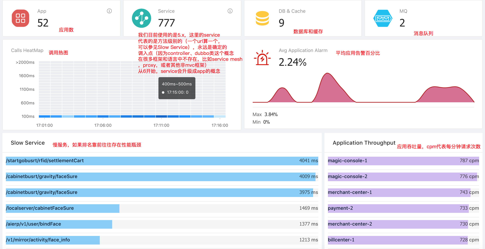

上图中app需要强调的是，52个app并不代表52个应用，比如paycenter有两台paycenter1和paycenter2就算了2个app，当然还有一些应用是3个以上的。在我们公司，paycenter1、paycenter2这些运维都和我们跳板机管理平台上的名称设置的一样，约定大于配置，开发人员可以更加便捷的排查问题。
> 再次修正一下，关于dashboard页面的app数，语言类探针，是探针的app_code来决定的。比如我们公司的线上配置就是agent.application_code=auth-center-1

上图中需要解释两个概念：
* cpm代表每分钟请求次数
* SLA=(TRANSACTION_CALLS- TRANSACTION_ERROR_CALLS ) * 10000 ) / TRANSACTION_CALLS

该页面主要支持四个跳转：    

一、在上图中，App板块上的帮助选项是可以直接跳转到Application监控页面的。

二、 Service板块上的帮助选项是可以直接跳转到Service监控页面的。   
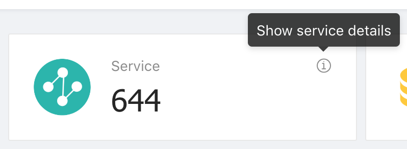

三、 Slow Service列表中的每一个慢服务点击以后都会进入到其专项的Service监控页面。     

四、 Application Throughput列表中的每一个Application点击以后也都是可以进入到其专项的Application监控页面。     

> 关于Application和Service的详细介绍我们后续会展开

在Dashboard的页面上部分，还有一个选择功能模块：

左侧部分可以定期refresh Dashboard的数据，右侧则可以调整整体的查询区间。

## Topology

点击Monitor菜单下的Topology你会看到下面这张拓扑图

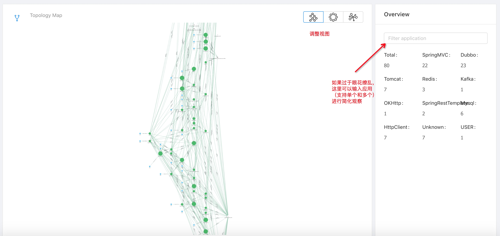

当然这张图太过于夸张了，如果接入SkyWalking的应用并不是很多，会如下图所示：
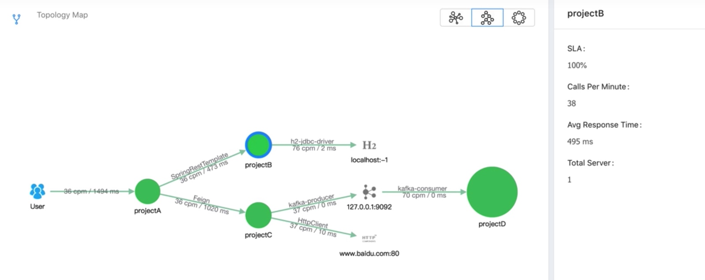

左侧的三个小按钮可以调整你的视图，支持拖拽。右侧可以输入你所关心的应用名。比如我们输入一个支付和订单两个应用，左侧的拓扑图会变得更加清晰：

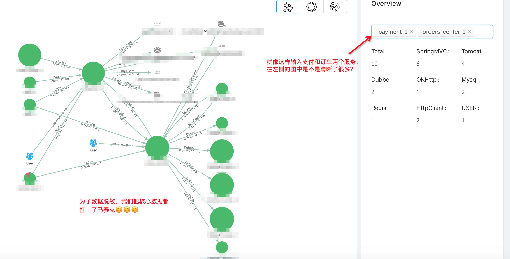

另外，上图中的绿色圆圈都是可以点击的，如果你点击以后，还会出现节点信息：
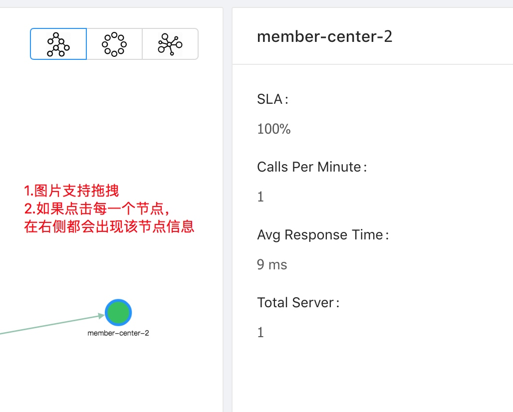

## Application

点击Monitor菜单下的Application你会看到下面这张图，这张图里你可以看到的东西都做了注解。

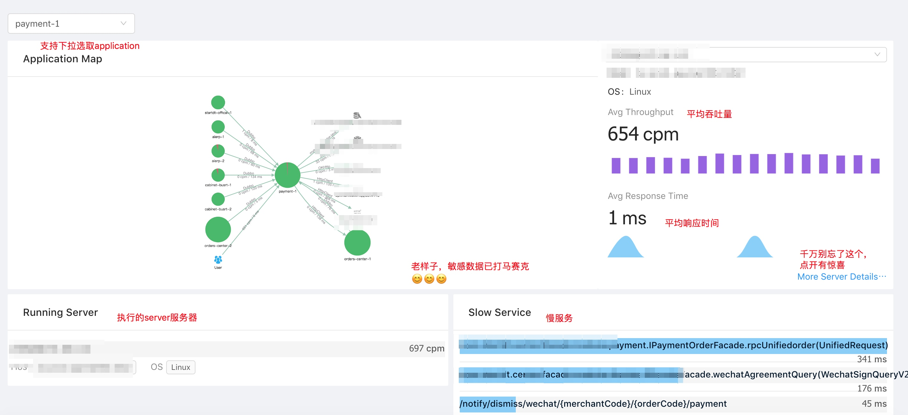

这张图里有一个惊喜，就是如果你点开More Server Details，你可以看到更多的信息

是的，除了Host、IPv4、Pid、OS以外，你还可以看到CPU、Heap、Non-Heap、GC（Young GC、Old GC）等详细监控信息。

## Service
点击Monitor菜单下的Service你会看到下面这张图，这张图里你可以看到的同样都做了注解。
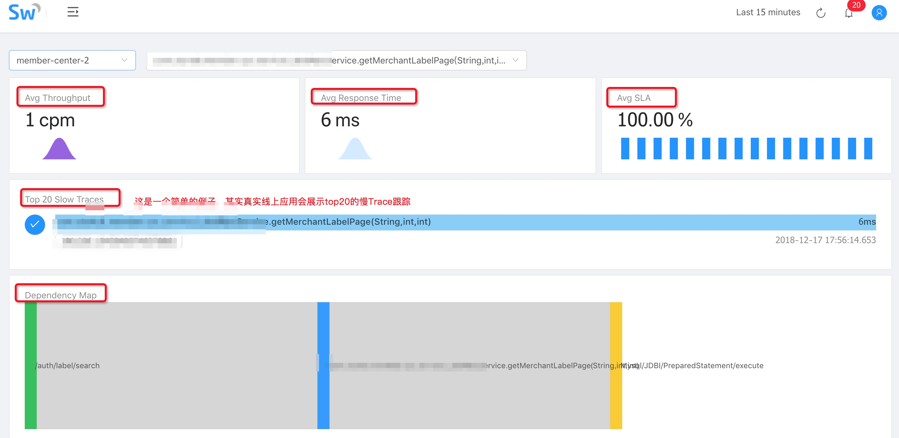

关于Dependency Map这张图我们再补充一下，鼠标悬停可以看到每个阶段的执行时间，这是Service下的功能

我们点开图中该图中Top 20 Slow Traces下面的被我马赛克掉的trace的按钮框，可以看到如下更加详细的信息：
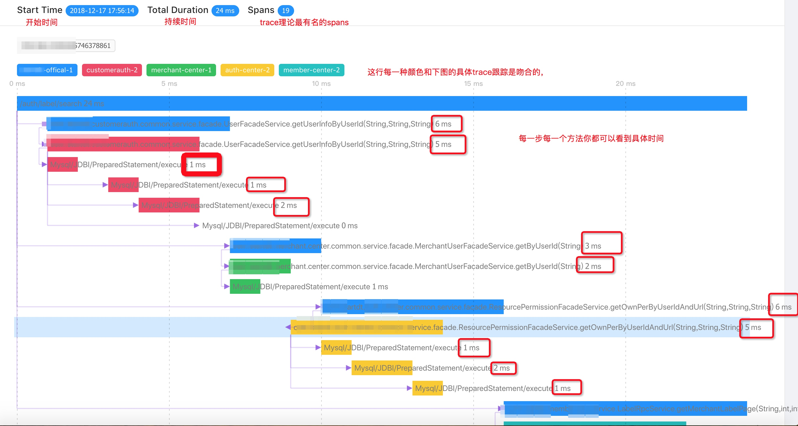

这些信息可以帮助我们知道每一个方法在哪个阶段那个具体实现耗时了多久。
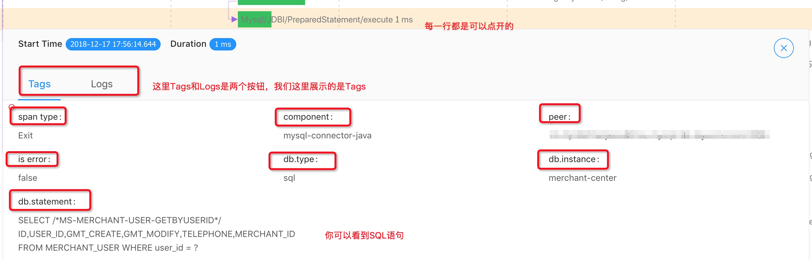

如上图所示，每一行基本都是可以打开的，每一行都包含了Tags、Logs等监控内容

## Alarm
点击Monitor菜单下的Alarm你会看到告警菜单。目前5.X版本的还没有接入邮件、短信等告警方式，后续6支持webhook，用户可以自己去接短信和邮件。

告警内容中你可以看到Applicaion、Server和Service三个层面的告警内容

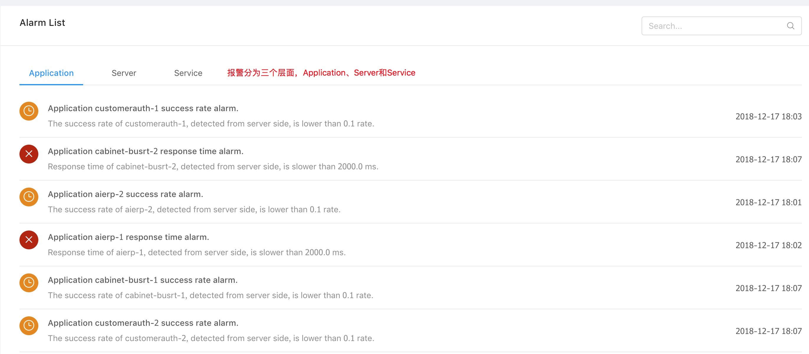

# Trace
Trace是一个非常实用的功能，用户可以根据精确的TraceId去查找

也可以设定时间段去查找

我在写使用手册时候，非常巧的是，看到了上图三起异常，于是我们往下拉列表看到了具体的数据

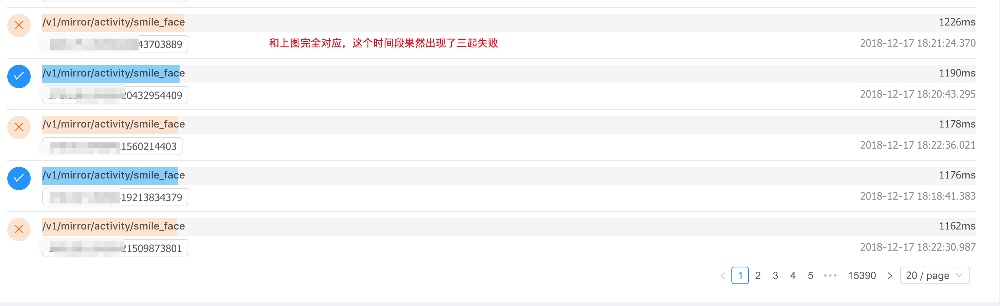

点击进去，我们可以看到具体的失败原因

当然用户也可以直接将Trace State调整为Error级别进行查询

# 再回顾一遍
一、首先我们进入首页：     

二、点击一下首页的Slow Service的projectC，可以看到如下信息：    

三、如果点击首页的Appliation Throughput中的projectD，可以看到如下信息：     
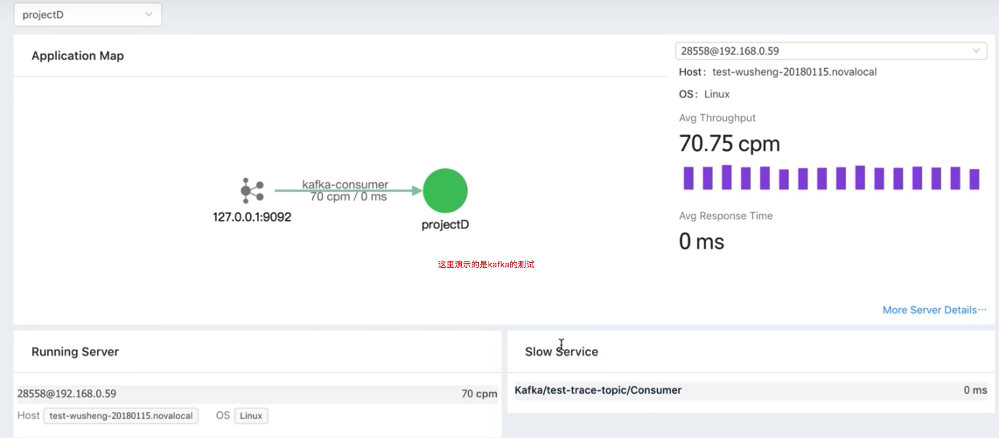

四、继续点进去右下角的这个slow service里的Consumer，我们可以看到下图：         
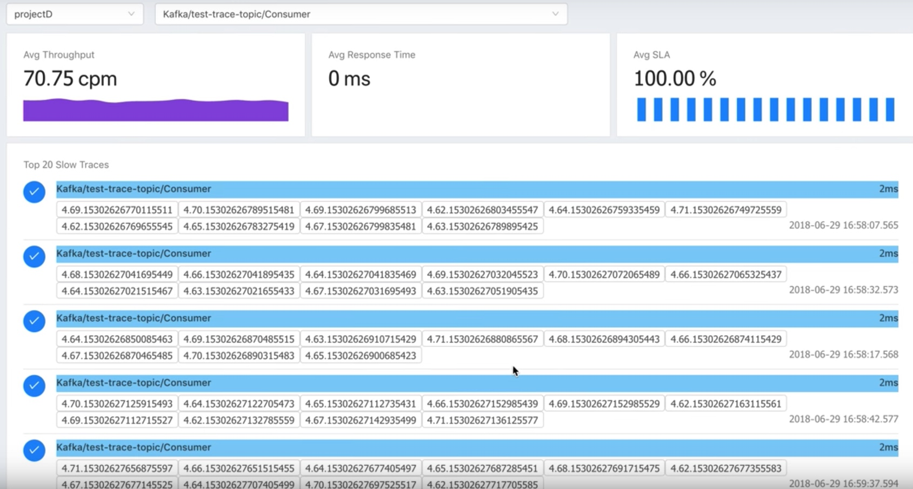

# 参考资料

https://twitter.com/AsfSkyWalking/status/1013616673218179072      
https://twitter.com/AsfSkyWalking/status/1013617100143800320